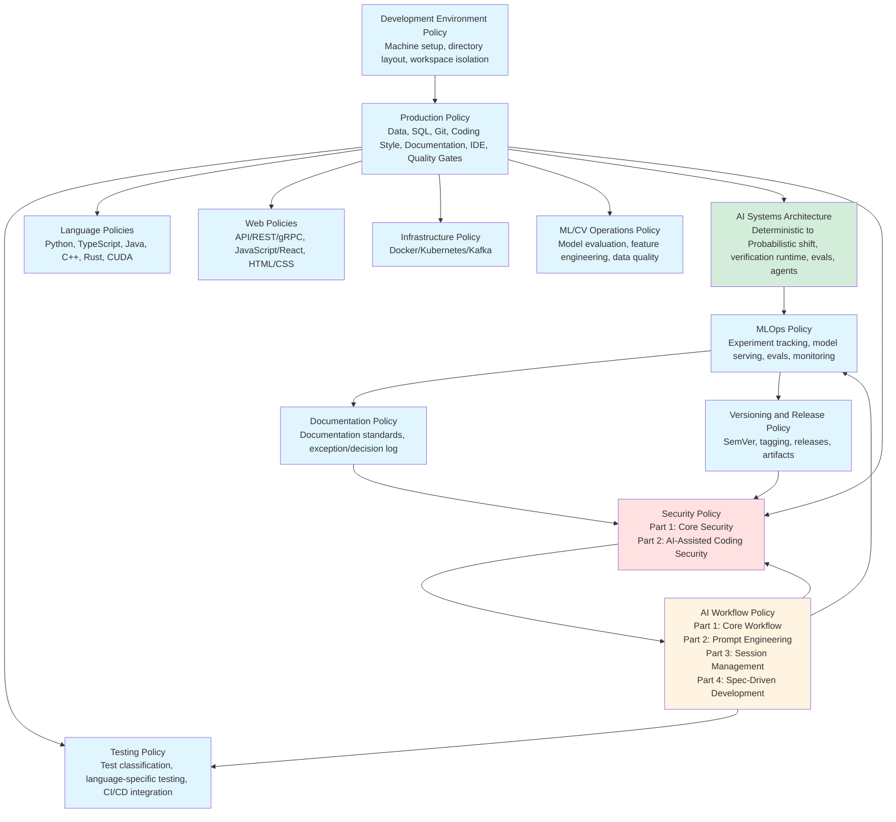

# Personal Engineering Policies (Authoritative)

## Source of Truth

This repository is the single source of truth for all engineering policies.

Canonical local path:
- `~/dev/repos/github.com/alfonsocruzvelasco/engineering-policies/`

Convenience symlinks:
- `~/dev/policies` -> `~/dev/repos/github.com/alfonsocruzvelasco/engineering-policies/`
- `~/learning-repos/policies` -> `~/dev/repos/github.com/alfonsocruzvelasco/engineering-policies/`
- `~/policies` -> `~/dev/repos/github.com/alfonsocruzvelasco/engineering-policies/`

**Status:** Authoritative
**Last updated:** 2026-02-02

This repository is the **single source of truth** for how software is designed, built, reviewed, shipped, secured, and maintained across all of my development work.

It defines **non-negotiable rules**, **explicit boundaries**, and **decision discipline** for professional-grade engineering.

> **Governance Notice**
> This repository is a **learning library**, not a project workspace. It stores book code, course materials, and reference implementations only.
>
> Any work that evolves into a real project (dependencies, environments, ongoing development, portfolio relevance) must be moved to a dedicated repository under `~/dev/repos/` in accordance with the **Learning Library Governance** section of my engineering policies.
>
> See the policies repository for the authoritative rules governing learning vs project boundaries.

---

## Purpose

This policy set exists to:

- Eliminate ambiguity and "works on my machine" behavior
- Prevent silent drift in tools, environments, and practices
- Make decisions explicit, reviewable, and reversible where possible
- Protect long-term maintainability over short-term convenience
- Ensure AI-assisted work remains correct, auditable, and safe
- Enforce prompt engineering discipline to reduce hallucinations and increase reproducibility

These policies are written for **real engineering work**, not experimentation folklore.

---

## Scope

These policies apply to:

- All personal repositories
- All local development environments
- All CI/CD pipelines
- All data, models, and artifacts
- All AI-assisted engineering work

They apply unless an **explicit exception** is recorded.

---

## Authority model

- This repository is **authoritative**
- If a rule is not documented here, it is **not authoritative**
- No undocumented exceptions are allowed
- Behavior must follow policy — **policy is updated before habits form**

All deviations require a recorded exception or decision.

---

## `/rules` structure

The `/rules` folder is organized around **compiled policy bundles** (merged documents) to reduce fragmentation and maintenance overhead, with domain-specific policies split for better navigation.

### Core system policy

- **`rules/development-environment-policy.md`**
  *Where and how work is organized and isolated on the machine*
  (directory layout, repo isolation, naming conventions, workspace discipline)

### Core production engineering policies

- **`rules/production-policy.md`** **[SPLIT 2026-02-02]**
  *Core production engineering policy for CV/ML engineering, data systems, and tooling standards*
  (data/storage rules, SQL discipline, development environment setup, Git and Source Control Policy integrated, coding style, documentation, IDE policies, quality gates, Quick Reference Cards)
  *See also: [Testing Policy](rules/testing-policy.md), [Language Policies](rules/language-policies.md), [Web Policies](rules/web-policies.md), [Infrastructure Policy](rules/infrastructure-policy.md), [ML/CV Operations Policy](rules/ml-cv-operations-policy.md)*

- **`rules/testing-policy.md`** **[EXTRACTED 2026-02-02]**
  *Comprehensive testing standards for CV/ML engineering*
  (test classification: unit/integration/system, cross-cutting policies: determinism/AAA pattern/test data isolation, language-specific testing policies: Python/C++/CUDA/Rust/Go/TypeScript/Java, test execution environments, coverage requirements, test data management, test maintenance, TDD guidance, performance testing, contract testing, monitoring, anti-patterns, enforcement)

- **`rules/language-policies.md`** **[EXTRACTED 2026-02-02]**
  *Language-specific engineering standards*
  (Python: venv & dependency discipline, TypeScript/Node.js: npm & package management, Java: Maven/Gradle/Spring Boot, C/C++: CMake & modern C++, Rust: Cargo & workspace structure, CUDA: OpenCV/OpenGL & GPU programming)

- **`rules/web-policies.md`** **[EXTRACTED 2026-02-02]**
  *Web technology standards*
  (API design: REST/gRPC/MVC patterns, JavaScript/React: ES2020 baseline, React production patterns, WebGL graphics, D3 visualization, HTML/CSS: semantic markup, accessibility, modern CSS architecture)

- **`rules/infrastructure-policy.md`** **[EXTRACTED 2026-02-02]**
  *Infrastructure standards*
  (Docker/Podman: container fundamentals, multi-stage builds, image management, Kubernetes: fundamentals, workload rules, networking, security, Kafka: producers, consumers, operations, reliability)

- **`rules/ml-cv-operations-policy.md`** **[EXTRACTED 2026-02-02]**
  *ML/CV-specific operations*
  (model evaluation frameworks, feature engineering & feature stores, data quality & validation, model debugging & explainability, production inference patterns)

### AI and architecture policies

- **`rules/references/ai-systems-architecture.md`** **[MOVED 2026-02-01]**
  *Architectural patterns for AI-powered systems (deterministic → probabilistic shift)*
  (The six pillars of probabilistic architecture, verification as runtime infrastructure, context management systems, dual-state architecture, evals over unit tests, agent runtime patterns, robotics-specific considerations, production readiness checklist)
  *Previously `ai-systems-architecture-policy.md` — moved to references for clarity*

- **`rules/mlops-policy.md`**
  *Comprehensive MLOps practices for production ML/CV systems*
  (experiment tracking, model versioning & registry, model serving & inference, model monitoring, hyperparameter tuning, distributed training, model optimization, deployment patterns, lifecycle management, reproducibility, cost optimization, latency engineering for real-time systems, **probabilistic systems testing & evals**)

- **`rules/ai-workflow-policy.md`** **[CONSOLIDATED 2026-02-01]**
  *Comprehensive AI workflow policy consolidating core workflow, prompt engineering, session management, and spec-driven development*
  - **Part 1: Core Workflow** — Cursor usage, sandbox enforcement, daily workflow, Cursor modes, guardrails, AI model usage (local vs cloud), Git discipline, MCP (Model Context Protocol), tool use security, verification-first mindset, operational readiness requirements
  - **Part 2: Prompt Engineering** — Operating principles, English-first architecture, prompt templates, COSTAR/CRISPE frameworks, slash commands library, token optimization, context engineering
  - **Part 3: Session Management** — Session types, parallel workflows, session lifecycle, metrics tracking, anti-patterns
  - **Part 4: Spec-Driven Development** — Protocol selection (Spec Kit/OpenSpec/MCP), mandatory checkpoints, integration patterns
  *Previously separate files: `ai-usage-policy.md`, `prompts-policy.md`, `session-management-policy.md`, `spec-driven-development-policy.md`*

### Security and compliance policies

- **`rules/security-policy.md`** **[CONSOLIDATED 2026-02-01]**
  *Unified security policy consolidating core security baseline and AI-assisted coding security*
  - **Part 1: Core Security** — Secrets handling, IAM, OAuth 2.0, SSH & infrastructure access, API security, dependency security, cloud security, ML/CV security, prompt injection defense, mandatory verification gates
  - **Part 2: AI-Assisted Coding Security** — OWASP Top 10 for LLMs coverage, OAuth 2.0 for AI/agents, SSH & infrastructure access, API-calling agents security, tool use security with Guardrails AI, output sanitization, agent resource limits, prompt injection defense, ML/CV-specific security, supply chain security, four-layer verification gates, required security tooling, incident response
  *Previously separate files: `security-policy.md` (core) and `ai-coding-security-policy.md` (AI-specific)*

### Documentation and versioning policies

- **`rules/documentation-policy.md`** **[SPLIT 2026-02-01]**
  *Documentation standards and exception/decision logging*
  (documentation discipline, quality standards, domain-specific ML/CV documentation standards, language standards and framework versions, exception and decision log templates)
  *See also: [ML/CV Documentation Standards](rules/references/ml-cv-documentation-standards.md) for comprehensive docstring and documentation generation guidance*

- **`rules/versioning-and-release-policy.md`** **[SPLIT 2026-02-01]**
  *Versioning schemes and release processes*
  (Semantic Versioning, tagging policy, changelog policy, release process, artifact policy, compatibility policy, hotfix policy)
  *Previously consolidated in `versioning-and-documenting-policy.md`*

### Templates and references

- **`rules/templates/`**
  *Reusable templates for common ML/CV engineering tasks*
  - `readme-template.md` — Standard README template with Technical Baseline section
  - `claude-md-template.md` — CLAUDE.md template for shared team knowledge and patterns
  - `mcp-template.md` — Model Context Protocol template for ML/CV production
  - `ml-cv-skills-template.md` — Skills assessment template for ML/CV engineers
  - `prompt-template.md` — Task card template for daily AI interactions (v3: concise, verification checkpoints, model-specific parameters, Osmani self-improving loop)
  - `domain-template.md` — Domain authority template for defining agent boundaries, legitimate skills, and verification requirements (execution, review, governance, planning, documentation domains)
  - `.cursorrules` — Authoritative Cursor/Codex rules template (scope, AI role, workflow, limits)
  - `terraform-devops-skills-template.md` — Skills assessment template for DevOps/Infrastructure engineers

- **Agent Selection** (integrated in `ai-workflow-policy.md`)
  *Quick decision tree for selecting the right AI agent from 9+ available models*
  (Policy/architecture → Opus 4.6, Procedural → GPT-5.3 Codex, Creative → Gemini 3 Pro, Speed → Haiku 4.5, model characteristics matrix, effort parameter guidance)

- **`rules/references/`**
  *Reference documentation and theoretical foundations*
  - `prompt-engineering-theory.md` — Theoretical foundation for prompt engineering
  - `ml-cv-documentation-standards.md` — Comprehensive ML/CV code documentation standards (Google-style, NumPy-style, Doxygen for C++/CUDA)
  - `mcp-ecosystem-notes.md` — Comprehensive Model Context Protocol (MCP) ecosystem documentation
  - `spec-protocols-guide.md` — Guide on specification protocols (Spec Kit, OpenSpec, MCP)
  - `python-3-14+-no-gil-support.md` — Python 3.14+ free-threaded mode (no-GIL) support and implications for ML/CV engineering
  - `vector-db-engineering-guide.md` — Vector database engineering guide for ML/CV (ANN structures, data plumbing, production patterns)
  - `rag-engineering-notes.md` — RAG (Retrieval-Augmented Generation) engineering notes for production systems (chunking, retrieval, reranking, prompt design, evaluation)
  - `rag-production-notes.md` — Comprehensive RAG production guide for ML/CV engineering (AST-based semantic chunking, hybrid retrieval, privacy-preserving architecture, incremental updates with Merkle trees, multi-modal RAG, implementation patterns, Cursor-style production RAG pipeline)
  - `software-architecture-in-machine-to-machine-systems.md` — Comprehensive guide on software architecture evolution for autonomous systems, robots, IoT devices, and AI agents (safety-critical design, ethical-aware architecture, control surfaces, system survivability)
  - `fairest-agent-comparison.md` — Methodology for objectively comparing AI agents and prompting strategies (Pareto frontier analysis, utility scores, evaluation protocols for COSTAR/CRISPE/RTF/spec-driven approaches)
  - `self-improving-loop-integration.md` — Integration guide for Addy Osmani's self-improving loop pattern (atomic tasks → validation → knowledge capture → context reset), including modifications to CLAUDE.md, prompt, and MCP templates
  - `task-management-guide.md` — Comprehensive guide on breaking features into atomic tasks and executing them in a self-improving loop (task decomposition, tasks.json schema, execution workflow, best practices, troubleshooting, metrics)
  - `prompt-osmani-self-improving-loop.md` — Complete Osmani-style prompt template for atomic task execution (detailed version with full structure, learning capture, iteration protocol, troubleshooting)
  - `strategic-learning-model-usage.md` — Strategic framework for using AI agents during learning and skill-building phases, distinguishing between skills to build manually and tasks to delegate to agents
  - `agent-hq-orchestration-complete-notes.md` — Complete study notes on GitHub Agent HQ and agent orchestration (conceptual foundations, GitHub implementation, Mission Control, @ handlers, AGENTS.md, multi-agent workflows, Control Plane governance, best practices)
  - `ai-systems-architecture.md` — Architectural patterns for AI-powered systems (deterministic → probabilistic shift, six pillars, verification runtime, evals, agent runtime patterns)
  - `gemini-integration-in-new-chrome.md` — Gemini integration documentation
  - PDF references: Vector database survey, ANN search papers, security practices, API hooks usage, OWASP Top 10 for LLMs coverage matrix, secure code practices, security vulnerabilities in AI-generated code, accelerating scientific research with Gemini, context engineering for coding agents

### Learning paths

- **`rules/references/av-perception-learning-path.md`** (if exists) or learning path documentation
  *Unified AV Perception Learning Path: Portfolio-First + Library-Guided Deep Study*
  (32-week curriculum for becoming a top-tier ML/CV engineer focused on autonomous vehicle perception, targeting Mobileye/Waymo Staff-Engineer standards)

### System configuration and infrastructure

- **`rules/system/`**
  *System-level configuration and infrastructure documentation*
  - **`containers/`** — Container and orchestration best practices
    - `docker-and-kubernetes-best-practices.md` — Docker and Kubernetes production patterns
    - `docker-compose-best-practices.md` — Docker Compose workflow patterns
    - `how-to-use-makefile-to-launch-prune-pods.md` — Makefile patterns for pod management
  - **`raid/`** — RAID storage configuration and setup procedures
    - `raid-system-set-up.md` — RAID array setup, monitoring, and maintenance
  - **`workspace/`** — `/workspace` backing store policies and procedures
  - **`scripts/`** — System automation and security validation scripts
    - `ai-security-check.sh` — AI-generated code security validation script implementing four-layer defense-in-depth (secrets scanning, SAST, dependency scanning, critical pattern checks)
    - `setup-sops-age.sh` — SOPS and Age key management setup script

---

## Policy relationships

---

## How to use this repository

Consult these policies when you:

- Start a new project
- Introduce a new tool, dependency, or workflow
- Change environment layout or build strategy
- Add AI into any part of engineering work
- Handle data, models, or production artifacts
- Feel unsure about "what is allowed"

Update these policies when:

- Reality changes in a durable way
- A rule proves insufficient or incorrect
- A new class of risk or failure appears

---

## Change discipline

Policies change deliberately, not casually.

Every meaningful change requires:

- a clear rationale
- an owner
- a date
- an entry in the exception/decision log (inside `documentation-policy.md`)

This repository is **infrastructure**, not documentation noise.

---

## Quick reference

### Starting a new ML/CV project

1. Review `rules/development-environment-policy.md` for directory structure and workspace isolation
2. Review `rules/production-policy.md` for data/storage rules, SQL discipline, and development environment setup
3. Review `rules/language-policies.md` for language-specific standards (Python, TypeScript, Java, C++, Rust, CUDA)
4. Review `rules/testing-policy.md` for testing standards and CI/CD integration
5. Review `rules/references/ai-systems-architecture.md` for LLM/AI system architecture patterns
6. Review `rules/mlops-policy.md` for experiment tracking, model serving, and monitoring setup
7. Review `rules/ml-cv-operations-policy.md` for ML/CV-specific operations (model evaluation, feature engineering, data quality)
8. Review `rules/production-policy.md` §8 (Git and Source Control) for Git workflow and branching model
9. Review `rules/versioning-and-release-policy.md` for versioning schemes and release processes
10. Review `rules/security-policy.md` for secrets handling and ML/CV security
11. Review `rules/ai-workflow-policy.md` Part 1 for Cursor sandbox rules and daily workflow
12. Review `rules/ai-workflow-policy.md` Part 4 for structured spec workflows (Spec Kit/OpenSpec/MCP)
13. Check `rules/system/raid/` for RAID storage setup if working with large datasets
14. Use `rules/templates/` for standard project structures and prompts (see `readme-template.md` for README with Technical Baseline)

### Using AI assistance

1. **Cursor only** for coding (see `ai-workflow-policy.md` Part 1)
2. **Session discipline** — Use parallel sessions for focused work, follow session lifecycle (see `ai-workflow-policy.md` Part 3)
3. **English-first** for all prompts (see `ai-workflow-policy.md` Part 2)
4. **Plan Mode first** — Start with planning for multi-file tasks (see `ai-workflow-policy.md` Part 1)
5. **Spec-driven development** — Use Spec Kit/OpenSpec/MCP for multi-file features (see `ai-workflow-policy.md` Part 4)
6. **Verification required** for all AI-generated code (verification-first paradigm)
7. **Sandbox restriction** to `/home/alfonso/dev/repos/github.com/alfonsocruzvelasco/sandbox-claude-code/`
8. **AI code review protocol** — Follow systematic review process (see `ai-workflow-policy.md` Part 1)
9. **AI security framework** — Follow comprehensive security controls (see `security-policy.md` Part 2)
10. **Use templates** — Start from `rules/templates/` for common tasks (`prompt-template.md`, `mcp-template.md`, `claude-md-template.md`, `domain-template.md`, `.cursorrules`)
11. **Select the right agent** — See [Agent Selection Decision Tree](rules/ai-workflow-policy.md#agent-selection-decision-tree) in `ai-workflow-policy.md` for model selection
12. **Reference theory** — Consult `rules/references/prompt-engineering-theory.md` for theoretical foundations
13. **MCP integration** — See `rules/references/mcp-ecosystem-notes.md` for comprehensive MCP documentation

### Security checklist

1. No secrets in Git (see `security-policy.md`)
2. MFA enabled for all accounts
3. Dependencies scanned for vulnerabilities
4. ML/CV models and data access-controlled
5. AI tools never receive secrets or sensitive data
6. OAuth 2.0 tokens minimal-scope for AI/agents (see `security-policy.md` Part 2, Section 3)
7. SSH/infrastructure access never granted to AI tools (see `security-policy.md` Part 2, Section 4)
8. Tool use security enforced via Guardrails AI (see `security-policy.md` Part 2, Section 5)
9. All AI output passes four-layer verification gates before merge (see `security-policy.md` Part 2, Section 11)
10. Required security tooling deployed (see `security-policy.md` Part 2, Section 14)
11. **Run `ai-security-check.sh`** before committing AI-generated code (see `rules/system/scripts/ai-security-check.sh`)

### System infrastructure

1. **RAID setup** — See `rules/system/raid/raid-system-set-up.md` for storage configuration
2. **Workspace backing** — `/workspace` RAID-backed storage policies in `rules/system/workspace/`
3. **Large datasets** — Always use symlinks from `$HOME` to `/workspace` for data volumes
4. **System scripts** — Automation and security validation tools:
   - **`ai-security-check.sh`** — AI-generated code security validation
     - **Usage**: Run from repository root: `./rules/system/scripts/ai-security-check.sh`
     - **Purpose**: Implements four-layer defense-in-depth (secrets scanning, SAST, dependency scanning, critical pattern checks)
     - **When to use**: Before committing any AI-generated code
     - **Requirements**: Must be run from repo root (where `.git` exists)
     - **Output**: Reports critical errors (blocking) and warnings (review required)
   - **`setup-sops-age.sh`** — SOPS and Age key management setup
     - **Usage**: Run once to set up secret management: `./rules/system/scripts/setup-sops-age.sh`
     - **Purpose**: Installs `age` and `sops`, generates encryption keys, configures environment
     - **When to use**: Initial setup for secret management (idempotent, safe to run multiple times)
     - **Requirements**: Requires `sudo` access for package installation
     - **Output**: Creates `~/.config/sops/age/keys.txt`, configures `SOPS_AGE_KEY_FILE` in `~/.bashrc`, runs encryption test
5. **Container best practices** — See `rules/system/containers/` for Docker, Kubernetes, and Docker Compose patterns

### Learning and professional development

1. **AV Perception Learning Path** — See learning path documentation for comprehensive 32-week curriculum
   - Stage 1: Modern Detection Foundations + Code Hygiene
   - Stage 2: 3D Perception + Sensor Fusion
   - Stage 3: Tracking & Trajectory Prediction
   - Stage 4: Production Engineering & Safety-Critical Systems

---

## Final rule

If behavior and policy diverge, **policy must be updated first** —
never the other way around.
