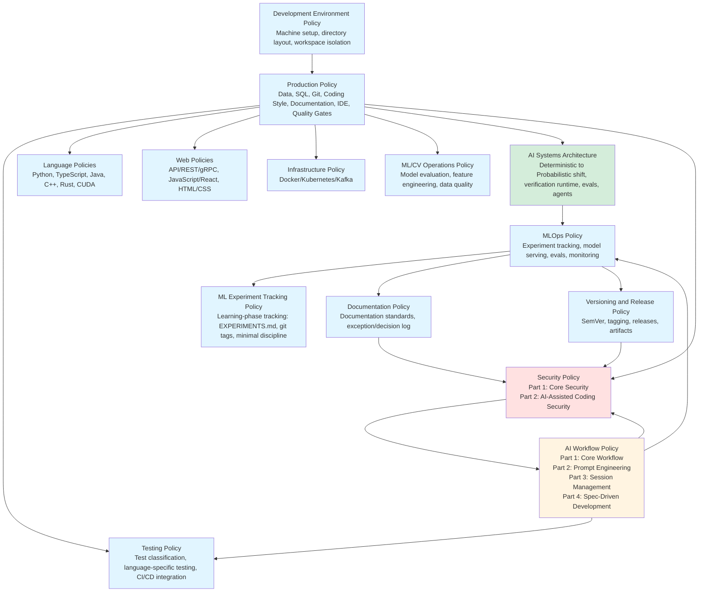

# Personal Engineering Policies (Authoritative)

## Source of Truth

This repository is the single source of truth for all engineering policies.

Canonical local path:
- `~/dev/repos/github.com/alfonsocruzvelasco/engineering-policies/`

Convenience symlinks:
- `~/dev/policies` -> `~/dev/repos/github.com/alfonsocruzvelasco/engineering-policies/`
- `~/learning-repos/policies` -> `~/dev/repos/github.com/alfonsocruzvelasco/engineering-policies/`
- `~/policies` -> `~/dev/repos/github.com/alfonsocruzvelasco/engineering-policies/`

**Status:** Authoritative
**Last updated:** 2026-04-05

This repository is the **single source of truth** for how software is designed, built, reviewed, shipped, secured, and maintained across all of my development work.

It defines **non-negotiable rules**, **explicit boundaries**, and **decision discipline** for professional-grade engineering.

> **Governance note**
> This repository is the **authoritative policies** corpus (compiled rules, templates, and system documentation). It is not a learning exercise, course workspace, or book-code repository.
>
> Rules for *separate* learning repositories (book code, courses, portfolio experiments) are defined in `rules/system/learning-library-governance.md` and `rules/system/learning-ai-usage-boundary.md`. Apply those documents to learning repos under `~/learning-repos/` and elsewhere — they describe how *other* repos are governed, not what this policy repository is.

---

## Purpose

This policy set exists to:

- Eliminate ambiguity and "works on my machine" behavior
- Prevent silent drift in tools, environments, and practices
- Make decisions explicit, reviewable, and reversible where possible
- Protect long-term maintainability over short-term convenience
- Ensure AI-assisted work remains correct, auditable, and safe
- Enforce prompt engineering discipline to reduce hallucinations and increase reproducibility

These policies are written for **real engineering work**, not experimentation folklore.

---

## Reference Implementations

- llama.cpp local setup: https://github.com/alfonsocruzvelasco/physicalai-av-sandbox (see LOCAL_SETUP.md)

---

## Scope

These policies apply to:

- All personal repositories
- All local development environments
- All CI/CD pipelines
- All data, models, and artifacts
- All AI-assisted engineering work

They apply unless an **explicit exception** is recorded.

---

## Authority model

- This repository is **authoritative**
- If a rule is not documented here, it is **not authoritative**
- No undocumented exceptions are allowed
- Behavior must follow policy — **policy is updated before habits form**

All deviations require a recorded exception or decision.

---

## Navigate this corpus

- **Concept lookup:** Start with [`rules/system/concept-index.md`](rules/system/concept-index.md) to map a topic to its **authoritative** policy file.
- **Operational guide:** Reading paths, portability when forking, maintenance habits, and when **not** to load the full corpus are in [`docs/navigation-and-adoption.md`](docs/navigation-and-adoption.md).
- **Learning and scratch repos:** Use [`rules/system/learning-library-governance.md`](rules/system/learning-library-governance.md) and [`rules/system/learning-ai-usage-boundary.md`](rules/system/learning-ai-usage-boundary.md). Full production policy load is not required for every short experiment.

---

## `/rules` structure

The `/rules` folder is organized around **compiled policy bundles** (merged documents) to reduce fragmentation and maintenance overhead, with domain-specific policies split for better navigation.

### Core system policy

- **`rules/development-environment-policy.md`**
  *Where and how work is organized and isolated on the machine*
  (directory layout, repo isolation, naming conventions, workspace discipline)

### Core production engineering policies

- **`rules/production-policy.md`** **[SPLIT 2026-02-02, UPDATED 2026-02-18]**
  *Core production engineering policy for CV/ML engineering, data systems, and tooling standards*
  (data/storage rules, SQL discipline, development environment setup, Git and Source Control Policy integrated, **scalable previews for code review (diffs + behavior + metrics)**, coding style, documentation, IDE policies, quality gates, Quick Reference Cards)
  *See also: [Testing Policy](rules/testing-policy.md), [Language Policies](rules/language-policies.md), [Web Policies](rules/web-policies.md), [Infrastructure Policy](rules/infrastructure-policy.md), [ML/CV Operations Policy](rules/ml-cv-operations-policy.md)*

- **`rules/testing-policy.md`** **[EXTRACTED 2026-02-02]**
  *Comprehensive testing standards for CV/ML engineering*
  (test classification: unit/integration/system, cross-cutting policies: determinism/AAA pattern/test data isolation, language-specific testing policies: Python/C++/CUDA/Rust/Go/TypeScript/Java, test execution environments, coverage requirements, test data management, test maintenance, TDD guidance, performance testing, contract testing, monitoring, anti-patterns, enforcement)

- **`rules/language-policies.md`** **[EXTRACTED 2026-02-02]**
  *Language-specific engineering standards*
  (Python: venv & dependency discipline, TypeScript/Node.js: npm & package management, Java: Maven/Gradle/Spring Boot, C/C++: CMake & modern C++, Rust: Cargo & workspace structure, CUDA: OpenCV/OpenGL & GPU programming)

- **`rules/web-policies.md`** **[EXTRACTED 2026-02-02]**
  *Web technology standards*
  (API design: REST/gRPC/MVC patterns, JavaScript/React: ES2020 baseline, React production patterns, WebGL graphics, D3 visualization, HTML/CSS: semantic markup, accessibility, modern CSS architecture)

- **`rules/infrastructure-policy.md`** **[EXTRACTED 2026-02-02]**
  *Infrastructure standards*
  (Docker/Podman: container fundamentals, multi-stage builds, image management, Kubernetes: fundamentals, workload rules, networking, security, Kafka: producers, consumers, operations, reliability)

- **`rules/ml-cv-operations-policy.md`** **[EXTRACTED 2026-02-02]**
  *ML/CV-specific operations*
  (model evaluation frameworks, feature engineering & feature stores, data quality & validation, model debugging & explainability, production inference patterns)

### AI retrieval and architecture policies

- **`rules/ai-retrieval-policy.md`** **[NEW 2026-03-07]**
  *Retrieval architecture standards, knowledge base governance, and context injection safety*
  (RAG formulation selection: RAG-Sequence vs RAG-Token, knowledge base ingestion rules, retrieval result sandboxing, MCP vs RAG decision, index hot-swapping, evaluation and monitoring metrics)

- **`rules/llm-usage-policy-hallucinations.md`** **[NEW 2026-04-03]**
  *LLM usage posture: likelihood not truth; forbidden uses (including CoT as audit trail); RAG as mitigation not proof; one-line rule — if it matters, verify it*
  (cross-links `ai-workflow-policy.md` verification gates and `ai-retrieval-policy.md` for grounding limits)

### AI and architecture policies

- **`rules/references/ai-systems-architecture.md`** **[MOVED 2026-02-01]**
  *Architectural patterns for AI-powered systems (deterministic → probabilistic shift)*
  (The six pillars of probabilistic architecture, verification as runtime infrastructure, context management systems, dual-state architecture, evals over unit tests, agent runtime patterns, robotics-specific considerations, production readiness checklist)
  *Previously `ai-systems-architecture-policy.md` — moved to references for clarity*

- **`rules/mlops-policy.md`** **[UPDATED 2026-02-18]**
  *Comprehensive MLOps practices for production ML/CV systems*
  (experiment tracking, model versioning & registry, model serving & inference, model monitoring, hyperparameter tuning, distributed training, model optimization, deployment patterns, lifecycle management, reproducibility, **engineering harness requirement for AI/ML projects (reproduction, validation, evaluation, performance, deployment, traceability harnesses)**, cost optimization, latency engineering for real-time systems, **probabilistic systems testing & evals**)

- **`rules/ml-experiment-tracking-policy.md`** **[NEW 2026-02-07]**
  *ML/CV experiment tracking for learning phase*
  (minimal tracking discipline: EXPERIMENTS.md log, git tags, dependency locking, project structure, data documentation, progressive tooling levels, anti-patterns, Cursor integration, success criteria, upgrade triggers)
  *Focus: Track enough to learn, not so much it slows you down. Start simple (Level 1: EXPERIMENTS.md + git tags), upgrade only when needed (Level 2: MLflow/W&B after 10+ experiments, Level 3: full MLOps when production-ready)*

- **`rules/ai-workflow-policy.md`** **[CONSOLIDATED 2026-02-01]**
  *Comprehensive AI workflow policy consolidating core workflow, prompt engineering, session management, and spec-driven development*
  - **Part 1: Core Workflow** — Cursor usage, sandbox enforcement, daily workflow, AI model usage, Git discipline, MCP, tool use security, verification-first mindset, agent cost budgeting, **Spec–Plan–Patch–Verify default workflow**, **Claude Code Web vs local Claude Code** (see `claude-code-web-usage-policy.md`)
  - **Part 2: Prompt Engineering** — Operating principles, **p-stabilization techniques**, system design principles (workflow-over-model, executable output, event-driven, **stochastic scheduling**), English-first architecture, verification checklist, PI defense, CV/ML execution mode
  - **Part 3: Session Management** — Session types, parallel workflows, session lifecycle, **reliability surface (pass@k, cost stability, thrash score, fragility)**, anti-patterns
  - **Part 4: Spec-Driven Development** — **PRD gate (mandatory for >2h work)**, vertical-slice issue decomposition, protocol selection (**OpenSpec preferred for ML/CV**)
  - **Reference companions:** `references/ai-workflow-prompt-patterns-reference.md` (production patterns, COSTAR/CRISPE, slash commands, token optimization, context engineering), `references/ai-workflow-agent-skills-reference.md` (skills management, learning protocol, agent delegation, scientific research workflows)
  *Previously separate files: `ai-usage-policy.md`, `prompts-policy.md`, `session-management-policy.md`, `spec-driven-development-policy.md`*

### Security and compliance policies

- **`rules/security-policy.md`** **[CONSOLIDATED 2026-02-01, UPDATED 2026-02-07]**
  *Unified security policy consolidating core security baseline and AI-assisted coding security*
  - **Part 1: Core Security** — Secrets handling, IAM, OAuth 2.0, SSH & infrastructure access, API security, dependency security (OWASP Cheat Sheet alignment for npm and PyPI in §9.3), cloud security, ML/CV security, prompt injection defense, mandatory verification gates
  - **Part 2: AI-Assisted Coding Security** — OWASP Top 10 for LLMs coverage, OAuth 2.0 for AI/agents, SSH & infrastructure access, API-calling agents security, tool use security with Guardrails AI, output sanitization, agent resource limits, prompt injection defense, ML/CV-specific security, supply chain security, four-layer verification gates, required security tooling, incident response
  - **Section 14.6: Prohibited External AI Tool Classes** — Prohibited tool categories, required tool characteristics, approved tool examples, enforcement and violation handling, developer resources
  - **Reference companion:** `references/security-enterprise-controls-reference.md` (runtime trust layer, isolate sandbox details, OIDC hardening, logging/audit expectations)
  *Previously separate files: `security-policy.md` (core) and `ai-coding-security-policy.md` (AI-specific)*

- **`rules/dependency-install-policy.md`**
  *Short mandatory checklist: installing dependencies = executing code; no blind/fresh installs; pins + lockfiles; isolate risky installs; agent planning vs execution; one-line permission question. Detail in `security-policy.md` §9 and §§9.3–9.4; npm/Python in `language-policies.md`.*

- **`rules/claude-code-web-usage-policy.md`**
  *Claude Code Web (browser / cloud async agent): not primary tooling; allowed only for low-risk/async/delegation; forbidden for ML/CV core, secrets, credentials, datasets, infra configs; remote execution = loss of control; review-before-integrate. Cross-linked from `security-policy.md` §14, `ai-workflow-policy.md`, `approved-ai-tools.md`.*

- **`rules/approved-ai-tools.md`** **[NEW 2026-02-07]**
  *Authoritative registry of approved AI coding tools*
  (approval criteria checklist, detailed tool profiles: Anthropic Claude API, OpenAI API, GitHub Copilot Enterprise, Cursor IDE, Claude Code, Ollama, recertification schedule, tool evaluation process, exception handling)

- **`rules/ai-tool-policy-quick-reference.md`** **[NEW 2026-02-07]**
  *Developer-facing quick reference guide for AI tool policy*
  (decision tree, common scenarios, security best practices, violation consequences, support channels, self-check checklist)

- **`rules/security-exceptions.md`**
  *Security exception log — tracks documented exceptions to security policies with justification, scope, and expiration*

### Documentation and versioning policies

- **`rules/documentation-policy.md`** **[SPLIT 2026-02-01]**
  *Documentation standards and exception/decision logging*
  (documentation discipline, quality standards, domain-specific ML/CV documentation standards, language standards and framework versions, exception and decision log templates)
  *See also: [ML/CV Documentation Standards](rules/references/ml-cv-documentation-standards.md) for comprehensive docstring and documentation generation guidance*

- **`rules/versioning-and-release-policy.md`** **[SPLIT 2026-02-01]**
  *Versioning schemes and release processes*
  (Semantic Versioning, tagging policy, changelog policy, release process, artifact policy, compatibility policy, hotfix policy)
  *Previously consolidated in `versioning-and-documenting-policy.md`*

### Templates and references

- **`rules/templates/`**
  *Reusable templates for common ML/CV engineering tasks*
  - `readme-template.md` — Standard README template with Technical Baseline section
  - `claude-md-template.md` — CLAUDE.md template for shared team knowledge and patterns
  - `agents-md-template.md` — AGENTS.md template for repo-level agent context (tooling, constraints, security landmines, agent selection, verification gates; keep under 150 lines; source: policies)
  - `mcp-template.md` — **[UPDATED 2026-04-03]** Model Context Protocol template for ML/CV production (staleness review block in-file; cross-check `rules/references/mcp-ecosystem-notes.md`)
  - `ml-cv-skills-template.md` — Skills assessment template for ML/CV engineers
  - `prompt-template.md` — **Canonical base (v3):** Task card, Spec–Plan–Patch–Verify, verification checkpoints, model-specific parameters, Osmani self-improving loop; shared execution contract — do not duplicate in platform overrides
  - `prompt-template-chatgpt-en.md` — **Platform override:** ChatGPT Hard Constraint Mode (generic placeholders + LaTeX example); inherits `prompt-template.md` (v3) for GSD phases and golden rule; KEY and GOLDEN RULE in-file
  - `prompt-template-claude-en.md` — **Platform override:** Claude Hard Constraint Mode for ML/CV (Socratic cadence, YOLO/TensorRT example); inherits `prompt-template.md` (v3) for GSD phases and golden rule
  - `prompt-template-gemini-en.md` — **Platform override:** Gemini Socratic Examiner (British English, questions-only, no direct code); inherits `prompt-template.md` (v3) for GSD phases and golden rule
  - `prd-template.md` — Minimal PRD (Product Requirements Document) template with issue decomposition rules, vertical-slice guidance, and decision rule (mandatory for any work >2 hours; see ai-workflow-policy.md Part 4 PRD Gate)
  - `domain-template.md` — Domain authority template for defining agent boundaries, legitimate skills, and verification requirements (execution, review, governance, planning, documentation domains)
  - `.cursorrules` — Authoritative Cursor/Codex rules template (scope, AI role, workflow, limits)
  - `terraform-devops-skills-template.md` — Skills assessment template for DevOps/Infrastructure engineers

- **Agent Selection** (integrated in `ai-workflow-policy.md`)
  *Quick decision tree for selecting the right AI agent from 9+ available models*
  (Policy/architecture → Opus 4.6, Procedural → GPT-5.3 Codex, Creative → Gemini 3 Pro, Speed → Haiku 4.5, model characteristics matrix, effort parameter guidance)

- **`rules/references/`**
  *Reference PDFs, notes, and extracted companions — **not** enumerated per file in this README; use the indexes below.*
  - [`rules/references/index-architecture.md`](rules/references/index-architecture.md) — **Architecture & systems:** AI systems architecture, agents, MCP, RAG, retrieval, tools, performance, PDFs.
  - [`rules/references/index-prompting.md`](rules/references/index-prompting.md) — **Prompting & communication:** Prompt theory, Osmani loop, multilingual and tone, agent PRs and context files.
  - [`rules/references/index-security.md`](rules/references/index-security.md) — **Security & eval:** OWASP alignment, sandboxing, PreToolUse guardrails, mutation and agent benchmarks.

### Governance

- **`rules/system/concept-index.md`**
  *Concept Index (Authority Lookup): fast lookup from a concept to the authoritative policy and supporting references*

- **`rules/system/learning-library-governance.md`**
  *Rules for **external** learning repositories (book code, courses) vs project workspaces — graduation, focus, and structural discipline; prevents scope drift in those repos (not a classification of **this** policies repository)*

- **`rules/system/learning-ai-usage-boundary.md`**
  *AI usage boundaries for **external** learning repositories*
  (learning-only classification, BYOAI-safe design, permitted vs restricted AI usage, ai-assisted-engineering folder boundaries, Cursor plugin workspace usage in learning repos, policy compliance statement, documentation requirements)

### Todo (deferred specs)

- **`rules/todo/`** — Deferred implementation designs (trigger-based); not normative policy until promoted into an authoritative doc.
  - [`todo-model-benchmark-and-capping.md`](rules/todo/todo-model-benchmark-and-capping.md) — ML model benchmark suite and cloud spend cap (deferred until first real CV workload to benchmark).

### System configuration and infrastructure

- **`rules/system/`**
  *System-level configuration and infrastructure documentation*
  - **`containers/`** — Container and orchestration best practices
    - `docker-and-kubernetes-best-practices.md` — Docker and Kubernetes production patterns
    - `docker-compose-best-practices.md` — Docker Compose workflow patterns
    - `how-to-use-makefile-to-launch-prune-pods.md` — Makefile patterns for pod management
  - **`raid/`** — RAID storage configuration and setup procedures
    - `raid-system-set-up.md` — RAID array setup, monitoring, and maintenance
  - **`workspace/`** — `/workspace` backing store policies and procedures
  - **`scripts/`** — System automation and security validation scripts
    - `ai-security-check.sh` — AI-generated code security validation script implementing four-layer defense-in-depth (secrets scanning, SAST, dependency scanning, critical pattern checks)
    - `ai-prohibited-tools-check.sh` — Automated detection of prohibited AI tool usage (scans source files, Git history, network configs, environment variables, package manifests, generates violation reports)
    - `setup-sops-age.sh` — SOPS and Age key management setup script

---

## Policy relationships



---

## How to use this repository

Consult these policies when you:

- Start a new project
- Introduce a new tool, dependency, or workflow
- Change environment layout or build strategy
- Add AI into any part of engineering work
- Handle data, models, or production artifacts
- Feel unsure about "what is allowed"

Update these policies when:

- Reality changes in a durable way
- A rule proves insufficient or incorrect
- A new class of risk or failure appears

---

## Change discipline

Policies change deliberately, not casually.

Every meaningful change requires:

- a clear rationale
- an owner
- a date
- an entry in the exception/decision log (inside `documentation-policy.md`)

This repository is **infrastructure**, not documentation noise.

---

## Quick reference

### Starting a new ML/CV project

1. Review `rules/development-environment-policy.md` for directory structure and workspace isolation
2. Review `rules/production-policy.md` for data/storage rules, SQL discipline, and development environment setup
3. Review `rules/language-policies.md` for language-specific standards (Python, TypeScript, Java, C++, Rust, CUDA)
4. Review `rules/testing-policy.md` for testing standards and CI/CD integration
5. Review `rules/references/ai-systems-architecture.md` for LLM/AI system architecture patterns
6. Review `rules/mlops-policy.md` for experiment tracking, model serving, and monitoring setup
7. Review `rules/ml-experiment-tracking-policy.md` for learning-phase experiment tracking (EXPERIMENTS.md, git tags, minimal tracking discipline)
8. Review `rules/ml-cv-operations-policy.md` for ML/CV-specific operations (model evaluation, feature engineering, data quality)
9. Review `rules/production-policy.md` §5 (Git and Source Control) for Git workflow and branching model
10. Review `rules/versioning-and-release-policy.md` for versioning schemes and release processes
11. Review `rules/security-policy.md` for secrets handling and ML/CV security
12. Review `rules/ai-workflow-policy.md` Part 1 for Cursor sandbox rules and daily workflow
13. Review `rules/ai-workflow-policy.md` Part 4 for structured spec workflows (**OpenSpec preferred for ML/CV**, see `rules/references/openspec-ml-cv-reference.md`)
14. Check `rules/system/raid/` for RAID storage setup if working with large datasets
15. Use `rules/templates/` for standard project structures and prompts (see `readme-template.md` for README with Technical Baseline)

### Using AI assistance

1. **Cursor only** for coding (see `ai-workflow-policy.md` Part 1)
2. **Session discipline** — Use parallel sessions for focused work, follow session lifecycle (see `ai-workflow-policy.md` Part 3)
3. **English-first** for all prompts (see `ai-workflow-policy.md` Part 2)
4. **Plan Mode first** — Start with planning for multi-file tasks (see `ai-workflow-policy.md` Part 1)
5. **Spec-driven development** — Use **OpenSpec (preferred for ML/CV)** or Spec Kit/MCP for multi-file features (see `ai-workflow-policy.md` Part 4 and `rules/references/openspec-ml-cv-reference.md`)
6. **Verification required** for all AI-generated code (verification-first paradigm)
7. **Sandbox restriction** to `/home/alfonso/dev/repos/github.com/alfonsocruzvelasco/sandbox-claude-code/`
8. **AI code review protocol** — Follow systematic review process (see `ai-workflow-policy.md` Part 1)
9. **AI security framework** — Follow comprehensive security controls (see `security-policy.md` Part 2)
10. **Use templates** — Start from `rules/templates/` for common tasks (`prompt-template.md`, `mcp-template.md`, `claude-md-template.md`, `agents-md-template.md`, `domain-template.md`, `.cursorrules`)
11. **Select the right agent** — See [Agent Selection Decision Tree](rules/ai-workflow-policy.md#agent-selection-decision-tree) in `ai-workflow-policy.md` for model selection
12. **Reference theory** — Consult `rules/references/prompt-engineering-theory.md` for theoretical foundations
13. **MCP integration** — See `rules/references/mcp-ecosystem-notes.md` for comprehensive MCP documentation

### Security checklist

1. No secrets in Git (see `security-policy.md`)
2. MFA enabled for all accounts
3. Dependencies scanned for vulnerabilities
4. ML/CV models and data access-controlled
5. AI tools never receive secrets or sensitive data
6. OAuth 2.0 tokens minimal-scope for AI/agents (see `security-policy.md` Part 2, Section 3)
7. SSH/infrastructure access never granted to AI tools (see `security-policy.md` Part 2, Section 4)
8. Tool use security enforced via Guardrails AI (see `security-policy.md` Part 2, Section 5)
9. All AI output passes four-layer verification gates before merge (see `security-policy.md` Part 2, Section 11)
10. Required security tooling deployed (see `security-policy.md` Part 2, Section 14)
11. **Run `ai-security-check.sh`** before committing AI-generated code (see `rules/system/scripts/ai-security-check.sh`)
12. **Use only approved AI tools** — Check `approved-ai-tools.md` before using any AI coding tool (see `security-policy.md` Section 14.6)
13. **Pre-commit hooks active** — Prohibited AI tool detection runs automatically via `.pre-commit-config.yaml` (see `rules/system/scripts/ai-prohibited-tools-check.sh`)

### System infrastructure

1. **RAID setup** — See `rules/system/raid/raid-system-set-up.md` for storage configuration
2. **Workspace backing** — `/workspace` RAID-backed storage policies in `rules/system/workspace/`
3. **Large datasets** — Always use symlinks from `$HOME` to `/workspace` for data volumes
4. **System scripts** — Automation and security validation tools:
   - **`ai-security-check.sh`** — AI-generated code security validation
     - **Usage**: Run from repository root: `./rules/system/scripts/ai-security-check.sh`
     - **Purpose**: Implements four-layer defense-in-depth (secrets scanning, SAST, dependency scanning, critical pattern checks)
     - **When to use**: Before committing any AI-generated code
     - **Requirements**: Must be run from repo root (where `.git` exists)
     - **Output**: Reports critical errors (blocking) and warnings (review required)
   - **`ai-prohibited-tools-check.sh`** — Prohibited AI tool detection
     - **Usage**: `./rules/system/scripts/ai-prohibited-tools-check.sh [--strict] [--repo-path PATH]`
     - **Purpose**: Scans for prohibited AI tool usage (source files, Git history, network configs, environment variables, package manifests)
     - **When to use**: Automatically via pre-commit hook, or manually for audits
     - **Requirements**: Bash, grep, git (for history scanning)
     - **Output**: Detailed violation report with file locations and patterns
   - **`setup-sops-age.sh`** — SOPS and Age key management setup
     - **Usage**: Run once to set up secret management: `./rules/system/scripts/setup-sops-age.sh`
     - **Purpose**: Installs `age` and `sops`, generates encryption keys, configures environment
     - **When to use**: Initial setup for secret management (idempotent, safe to run multiple times)
     - **Requirements**: Requires `sudo` access for package installation
     - **Output**: Creates `~/.config/sops/age/keys.txt`, configures `SOPS_AGE_KEY_FILE` in `~/.bashrc`, runs encryption test
5. **Container best practices** — See `rules/system/containers/` for Docker, Kubernetes, and Docker Compose patterns

---

## Final rule

If behavior and policy diverge, **policy must be updated first** —
never the other way around.

---

## Quickstart

```bash
# From repo root
pre-commit install
pre-commit run --all-files
```

## Environment

- Repository type: policy/documentation governance repository
- Primary tooling: `pre-commit`, Markdown, shell scripts in `rules/system/scripts/`
- Local canonical path: `~/dev/repos/github.com/alfonsocruzvelasco/engineering-policies/`

## Tests and Verification

- Primary quality gate:
  - `pre-commit run --all-files`
- Targeted policy enforcement:
  - `rules/system/scripts/ai-prohibited-tools-check.sh --strict`

## Technical Baseline

| Component | Version | Notes |
|-----------|---------|-------|
| Python    | 3.11+   | Required for local automation and script compatibility |
| pre-commit | 3.x+   | Enforced via `.pre-commit-config.yaml` hooks |
| Bash      | 5.x+    | Required for policy scripts in `rules/system/scripts/` |

## Key Links

- [Contributing](CONTRIBUTING.md)
- [Changelog](CHANGELOG.md)
- [Agent Context](AGENTS.md)
- [Docs index](docs/README.md)
