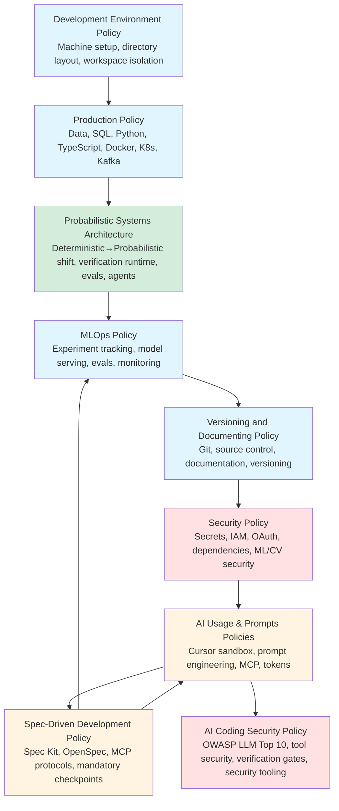

# Personal Engineering Policies (Authoritative)

## Source of Truth

This repository is the single source of truth for all engineering policies.

Canonical local path:
- `~/dev/repos/github.com/alfonsocruzvelasco/engineering-policies/`

Convenience symlinks:
- `~/dev/policies` -> `~/dev/repos/github.com/alfonsocruzvelasco/engineering-policies/`
- `~/learning-repos/policies` -> `~/dev/repos/github.com/alfonsocruzvelasco/engineering-policies/`
- `~/policies` -> `~/dev/repos/github.com/alfonsocruzvelasco/engineering-policies/`

**Status:** Authoritative
**Last updated:** 2026-01-24

This repository is the **single source of truth** for how software is designed, built, reviewed, shipped, secured, and maintained across all of my development work.

It defines **non-negotiable rules**, **explicit boundaries**, and **decision discipline** for professional-grade engineering.

> **Governance Notice**
> This repository is a **learning library**, not a project workspace. It stores book code, course materials, and reference implementations only.
>
> Any work that evolves into a real project (dependencies, environments, ongoing development, portfolio relevance) must be moved to a dedicated repository under `~/dev/repos/` in accordance with the **Learning Library Governance** section of my engineering policies.
>
> See the policies repository for the authoritative rules governing learning vs project boundaries.

---

## Purpose

This policy set exists to:

- Eliminate ambiguity and "works on my machine" behavior
- Prevent silent drift in tools, environments, and practices
- Make decisions explicit, reviewable, and reversible where possible
- Protect long-term maintainability over short-term convenience
- Ensure AI-assisted work remains correct, auditable, and safe
- Enforce prompt engineering discipline to reduce hallucinations and increase reproducibility

These policies are written for **real engineering work**, not experimentation folklore.

---

## Scope

These policies apply to:

- All personal repositories
- All local development environments
- All CI/CD pipelines
- All data, models, and artifacts
- All AI-assisted engineering work

They apply unless an **explicit exception** is recorded.

---

## Authority model

- This repository is **authoritative**
- If a rule is not documented here, it is **not authoritative**
- No undocumented exceptions are allowed
- Behavior must follow policy — **policy is updated before habits form**

All deviations require a recorded exception or decision.

---

## `/policies` structure

The `/policies` folder is organized around **compiled policy bundles** (merged documents) to reduce fragmentation and maintenance overhead.

### Core system policy

- **`policies/development-environment-policy.md`**
  *Where and how work is organized and isolated on the machine*
  (directory layout, repo isolation, naming conventions, workspace discipline)

### Compiled engineering policy bundles

- **`policies/production-policy.md`**
  *Daily reference for CV/ML engineering, data systems, and production tooling standards*
  (data/storage rules, SQL discipline, Python/TypeScript/React/Node.js, Docker/Kubernetes/Kafka, testing + verification, model evaluation, feature engineering, data quality, Quick Reference Cards)

- **`policies/probabilistic-systems-architecture-policy.md`** **[NEW 2026-01-30]**
  *Architectural patterns for the deterministic → probabilistic systems shift*
  (The six pillars of probabilistic architecture, verification as runtime infrastructure, context management systems, dual-state architecture, evals over unit tests, agent runtime patterns, robotics-specific considerations, production readiness checklist)

- **`policies/mlops-policy.md`**
  *Comprehensive MLOps practices for production ML/CV systems*
  (experiment tracking, model versioning & registry, model serving & inference, model monitoring, hyperparameter tuning, distributed training, model optimization, deployment patterns, lifecycle management, reproducibility, cost optimization, latency engineering for real-time systems, **probabilistic systems testing & evals**)

- **`policies/versioning-and-documenting-policy.md`**
  *Governance bundle*
  (documentation discipline, exception/decision log process, Git/source control rules, versioning/release rules)

- **`policies/security-policy.md`**
  *Security and compliance baseline*
  (secrets handling, identity/access control, OAuth 2.0 for AI/agents, SSH & infrastructure access, API-calling agents security, dependency security, cloud security, ML/CV security best practices, prompt injection defense, mandatory verification gates, incident response)

### AI usage & prompt engineering policies (authoritative)

- **`policies/ai-usage-policy.md`**
  *Approved agents + the single authorized AI coding environment + sandbox enforcement + AI code review protocol + AI security*
  (Cursor is the only coding IDE; Claude/ChatGPT/Gemini are non-coding; sandbox rules, core security position, tool use security, Guardrails AI integration, prompt-injection defense, verification-first workflows, AI code review best practices, learning protocol)

- **`policies/ai-coding-security-policy.md`**
  *Comprehensive AI-Assisted Coding Security framework*
  (OWASP Top 10 for LLMs coverage, OAuth 2.0 for AI/agents, SSH & infrastructure access, API-calling agents security, tool use security with Guardrails AI, output sanitization, agent resource limits, prompt injection defense, ML/CV-specific security, supply chain security, four-layer verification gates, required security tooling, incident response)

- **`policies/prompts-policy.md`**
  *Operational prompt playbook ("what to do" / "how to ask")*
  (prompt templates, verification routines, prompt-injection defense, token optimization, English-first architecture)

- **`policies/spec-driven-development-policy.md`**
  *Spec-driven development for AI-augmented engineering*
  (Spec Kit, OpenSpec, MCP protocol selection, mandatory checkpoints, integration with prompts/MLOps policies)

- **`policies/session-management-policy.md`** **[NEW 2026-02-01]**
  *Session lifecycle management for Claude Code workflows*
  (Session types, parallel workflows, session coordination, lifecycle templates, metrics tracking, anti-patterns, integration with other policies)

### Templates and references

- **`policies/templates/`**
  *Reusable templates for common ML/CV engineering tasks*
  - `readme-template.md` — Standard README template with Technical Baseline section
  - `claude-md-template.md` — CLAUDE.md template for shared team knowledge and patterns
  - `mcp-template.md` — Model Context Protocol template for ML/CV production
  - `ml-cv-skills-template.md` — Skills assessment template for ML/CV engineers
  - `prompt-template.md` — Standard prompt template for AI interactions

- **`policies/references/`**
  *Reference documentation and theoretical foundations*
  - `prompt-engineering-theory.md` — Theoretical foundation for prompt engineering

### Learning paths

- **`policies/av-perception-learning-path.md`**
  *Unified AV Perception Learning Path: Portfolio-First + Library-Guided Deep Study*
  (32-week curriculum for becoming a top-tier ML/CV engineer focused on autonomous vehicle perception, targeting Mobileye/Waymo Staff-Engineer standards)

### System configuration and infrastructure

- **`policies/system/`**
  *System-level configuration and infrastructure documentation*
  - **`raid/`** — RAID storage configuration and setup procedures
    - `raid-system-set-up.md` — RAID array setup, monitoring, and maintenance
  - **`workspace/`** — `/workspace` backing store policies and procedures
  - **`scripts/`** — System automation and security validation scripts
    - `ai-security-check.sh` — AI-generated code security validation script implementing four-layer defense-in-depth (secrets scanning, SAST, dependency scanning, critical pattern checks)
    - `setup-sops-age.sh` — SOPS and Age key management setup script

---

## Policy relationships

---

## How to use this repository

Consult these policies when you:

- Start a new project
- Introduce a new tool, dependency, or workflow
- Change environment layout or build strategy
- Add AI into any part of engineering work
- Handle data, models, or production artifacts
- Feel unsure about "what is allowed"

Update these policies when:

- Reality changes in a durable way
- A rule proves insufficient or incorrect
- A new class of risk or failure appears

---

## Change discipline

Policies change deliberately, not casually.

Every meaningful change requires:

- a clear rationale
- an owner
- a date
- an entry in the exception/decision log (inside `versioning-and-documenting-policy.md`)

This repository is **infrastructure**, not documentation noise.

---

## Quick reference

### Starting a new ML/CV project
1. Review `development-environment-policy.md` for directory structure
2. Review `production-policy.md` for language/tooling standards and ML/CV operations
3. Review `probabilistic-systems-architecture-policy.md` for LLM/AI system architecture patterns
4. Review `mlops-policy.md` for experiment tracking, model serving, and monitoring setup
5. Review `versioning-and-documenting-policy.md` for Git workflow
6. Review `security-policy.md` for secrets and ML/CV security
7. Review `ai-usage-policy.md` for Cursor sandbox rules
8. Review `spec-driven-development-policy.md` for structured spec workflows (Spec Kit/OpenSpec)
9. Check `system/raid/` for RAID storage setup if working with large datasets
10. Use `templates/` for standard project structures and prompts (see `readme-template.md` for README with Technical Baseline)

### Using AI assistance
1. **Cursor only** for coding (see `ai-usage-policy.md`)
2. **Session discipline** — Use parallel sessions for focused work, follow session lifecycle (see `session-management-policy.md`)
3. **English-first** for all prompts (see `prompts-policy.md`)
4. **Plan Mode first** — Start with planning for multi-file tasks (see `ai-usage-policy.md`)
5. **Spec-driven development** — Use Spec Kit/OpenSpec for multi-file features (see `spec-driven-development-policy.md`)
6. **Verification required** for all AI-generated code (verification-first paradigm)
7. **Sandbox restriction** to `/home/alfonso/dev/repos/github.com/alfonsocruzvelasco/sandbox-claude-code/`
8. **AI code review protocol** — Follow systematic review process (see `ai-usage-policy.md`)
9. **AI security framework** — Follow comprehensive security controls (see `ai-coding-security-policy.md`)
10. **Use templates** — Start from `policies/templates/` for common tasks (prompt-template.md, mcp-template.md, claude-md-template.md)
11. **Reference theory** — Consult `policies/references/prompt-engineering-theory.md` for theoretical foundations

### Security checklist
1. No secrets in Git (see `security-policy.md`)
2. MFA enabled for all accounts
3. Dependencies scanned for vulnerabilities
4. ML/CV models and data access-controlled
5. AI tools never receive secrets or sensitive data
6. OAuth 2.0 tokens minimal-scope for AI/agents (see `ai-coding-security-policy.md` Section 3)
7. SSH/infrastructure access never granted to AI tools (see `ai-coding-security-policy.md` Section 4)
8. Tool use security enforced via Guardrails AI (see `ai-coding-security-policy.md` Section 5)
9. All AI output passes four-layer verification gates before merge (see `ai-coding-security-policy.md` Section 10)
10. Required security tooling deployed (see `ai-coding-security-policy.md` Section 13)
11. **Run `ai-security-check.sh`** before committing AI-generated code (see `policies/system/scripts/ai-security-check.sh`)

### System infrastructure
1. **RAID setup** — See `policies/system/raid/raid-system-set-up.md` for storage configuration
2. **Workspace backing** — `/workspace` RAID-backed storage policies in `policies/system/workspace/`
3. **Large datasets** — Always use symlinks from `$HOME` to `/workspace` for data volumes
4. **System scripts** — Automation and security validation tools:
   - **`ai-security-check.sh`** — AI-generated code security validation
     - **Usage**: Run from repository root: `./rules/system/scripts/ai-security-check.sh`
     - **Purpose**: Implements four-layer defense-in-depth (secrets scanning, SAST, dependency scanning, critical pattern checks)
     - **When to use**: Before committing any AI-generated code
     - **Requirements**: Must be run from repo root (where `.git` exists)
     - **Output**: Reports critical errors (blocking) and warnings (review required)
   - **`setup-sops-age.sh`** — SOPS and Age key management setup
     - **Usage**: Run once to set up secret management: `./rules/system/scripts/setup-sops-age.sh`
     - **Purpose**: Installs `age` and `sops`, generates encryption keys, configures environment
     - **When to use**: Initial setup for secret management (idempotent, safe to run multiple times)
     - **Requirements**: Requires `sudo` access for package installation
     - **Output**: Creates `~/.config/sops/age/keys.txt`, configures `SOPS_AGE_KEY_FILE` in `~/.bashrc`, runs encryption test

### Learning and professional development
1. **AV Perception Learning Path** — See `policies/av-perception-learning-path.md` for comprehensive 32-week curriculum
   - Stage 1: Modern Detection Foundations + Code Hygiene
   - Stage 2: 3D Perception + Sensor Fusion
   - Stage 3: Tracking & Trajectory Prediction
   - Stage 4: Production Engineering & Safety-Critical Systems

---

## Final rule

If behavior and policy diverge, **policy must be updated first** —
never the other way around.
