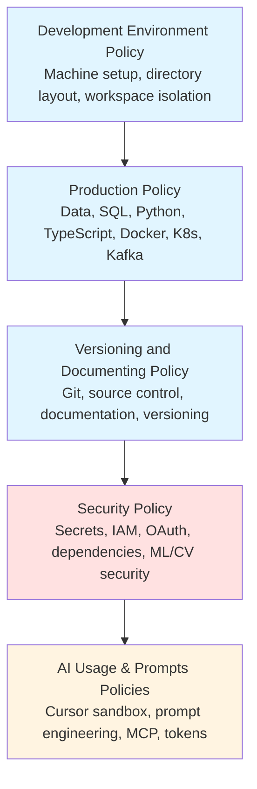

# Personal Engineering Policies (Authoritative)

## Source of Truth

This repository is the single source of truth for all engineering policies.

Canonical local path:
- `~/dev/repos/github.com/alfonsocruzvelasco/engineering-policies/`

Convenience symlinks:
- `~/dev/policies` -> `~/dev/repos/github.com/alfonsocruzvelasco/engineering-policies/`
- `~/learning/policies` -> `~/dev/repos/github.com/alfonsocruzvelasco/engineering-policies/`
- `~/policies` -> `~/dev/repos/github.com/alfonsocruzvelasco/engineering-policies/`

**Status:** Authoritative
**Last updated:** 2026-01-24

This repository is the **single source of truth** for how software is designed, built, reviewed, shipped, secured, and maintained across all of my development work.

It defines **non-negotiable rules**, **explicit boundaries**, and **decision discipline** for professional-grade engineering.

---

## Purpose

This policy set exists to:

- Eliminate ambiguity and "works on my machine" behavior
- Prevent silent drift in tools, environments, and practices
- Make decisions explicit, reviewable, and reversible where possible
- Protect long-term maintainability over short-term convenience
- Ensure AI-assisted work remains correct, auditable, and safe
- Enforce prompt engineering discipline to reduce hallucinations and increase reproducibility

These policies are written for **real engineering work**, not experimentation folklore.

---

## Scope

These policies apply to:

- All personal repositories
- All local development environments
- All CI/CD pipelines
- All data, models, and artifacts
- All AI-assisted engineering work

They apply unless an **explicit exception** is recorded.

---

## Authority model

- This repository is **authoritative**
- If a rule is not documented here, it is **not authoritative**
- No undocumented exceptions are allowed
- Behavior must follow policy — **policy is updated before habits form**

All deviations require a recorded exception or decision.

---

## `/policies` structure

The `/policies` folder is organized around **compiled policy bundles** (merged documents) to reduce fragmentation and maintenance overhead.

### Core system policy

- **`policies/development-environment-policy.md`**
  *Where and how work is organized and isolated on the machine*
  (directory layout, repo isolation, naming conventions, workspace discipline)

### Compiled engineering policy bundles

- **`policies/production-policy.md`**
  *Daily reference for CV/ML engineering, data systems, and production tooling standards*
  (data/storage rules, SQL discipline, Python/TypeScript/React/Node.js, Docker/Kubernetes/Kafka, testing + verification, model evaluation, feature engineering, data quality, Quick Reference Cards)

- **`policies/mlops-policy.md`**
  *Comprehensive MLOps practices for production ML/CV systems*
  (experiment tracking, model versioning & registry, model serving & inference, model monitoring, hyperparameter tuning, distributed training, model optimization, deployment patterns, lifecycle management, reproducibility, cost optimization, latency engineering for real-time systems)

- **`policies/versioning-and-documenting-policy.md`**
  *Governance bundle*
  (documentation discipline, exception/decision log process, Git/source control rules, versioning/release rules)

- **`policies/security-policy.md`**
  *Security and compliance baseline*
  (secrets handling, identity/access control, dependency security, cloud security, ML/CV security best practices, incident response)

### AI usage & prompt engineering policies (authoritative)

- **`policies/ai-usage-policy.md`**
  *Approved agents + the single authorized AI coding environment + sandbox enforcement + AI code review protocol*
  (Cursor is the only coding IDE; Claude/ChatGPT/Gemini are non-coding; sandbox rules, prompt-injection defense, verification-first workflows, AI code review best practices, learning protocol)

- **`policies/prompts-policy.md`**
  *Operational prompt playbook ("what to do" / "how to ask")*
  (prompt templates, verification routines, prompt-injection defense, token optimization, English-first architecture)

### Templates and references

- **`policies/templates/`**
  *Reusable templates for common ML/CV engineering tasks*
  - `mcp-template.md` — Model Context Protocol template for ML/CV production
  - `ml-cv-skills-template.md` — Skills assessment template for ML/CV engineers
  - `prompt-template.md` — Standard prompt template for AI interactions

- **`policies/references/`**
  *Reference documentation and theoretical foundations*
  - `prompt-engineering-theory.md` — Theoretical foundation for prompt engineering

### System configuration and infrastructure

- **`policies/system/`**
  *System-level configuration and infrastructure documentation*
  - **`raid/`** — RAID storage configuration and setup procedures
    - `raid-system-set-up.md` — RAID array setup, monitoring, and maintenance
  - **`workspace/`** — `/workspace` backing store policies and procedures

---

## Policy relationships

---

## How to use this repository

Consult these policies when you:

- Start a new project
- Introduce a new tool, dependency, or workflow
- Change environment layout or build strategy
- Add AI into any part of engineering work
- Handle data, models, or production artifacts
- Feel unsure about "what is allowed"

Update these policies when:

- Reality changes in a durable way
- A rule proves insufficient or incorrect
- A new class of risk or failure appears

---

## Change discipline

Policies change deliberately, not casually.

Every meaningful change requires:

- a clear rationale
- an owner
- a date
- an entry in the exception/decision log (inside `versioning-and-documenting-policy.md`)

This repository is **infrastructure**, not documentation noise.

---

## Quick reference

### Starting a new ML/CV project
1. Review `development-environment-policy.md` for directory structure
2. Review `production-policy.md` for language/tooling standards and ML/CV operations
3. Review `mlops-policy.md` for experiment tracking, model serving, and monitoring setup
4. Review `versioning-and-documenting-policy.md` for Git workflow
5. Review `security-policy.md` for secrets and ML/CV security
6. Review `ai-usage-policy.md` for Cursor sandbox rules
7. Check `system/raid/` for RAID storage setup if working with large datasets
8. Use `templates/` for standard project structures and prompts

### Using AI assistance
1. **Cursor only** for coding (see `ai-usage-policy.md`)
2. **English-first** for all prompts (see `prompts-policy.md`)
3. **Verification required** for all AI-generated code (verification-first paradigm)
4. **Sandbox restriction** to `/home/alfonso/dev/repos/github.com/alfonsocruzvelasco/sandbox-claude-code/`
5. **AI code review protocol** — Follow systematic review process (see `ai-usage-policy.md`)
6. **Use templates** — Start from `policies/templates/` for common tasks (prompt-template.md, mcp-template.md)
7. **Reference theory** — Consult `policies/references/prompt-engineering-theory.md` for theoretical foundations

### Security checklist
1. No secrets in Git (see `security-policy.md`)
2. MFA enabled for all accounts
3. Dependencies scanned for vulnerabilities
4. ML/CV models and data access-controlled
5. AI tools never receive secrets or sensitive data

### System infrastructure
1. **RAID setup** — See `policies/system/raid/raid-system-set-up.md` for storage configuration
2. **Workspace backing** — `/workspace` RAID-backed storage policies in `policies/system/workspace/`
3. **Large datasets** — Always use symlinks from `$HOME` to `/workspace` for data volumes

---

## Final rule

If behavior and policy diverge, **policy must be updated first** —
never the other way around.
