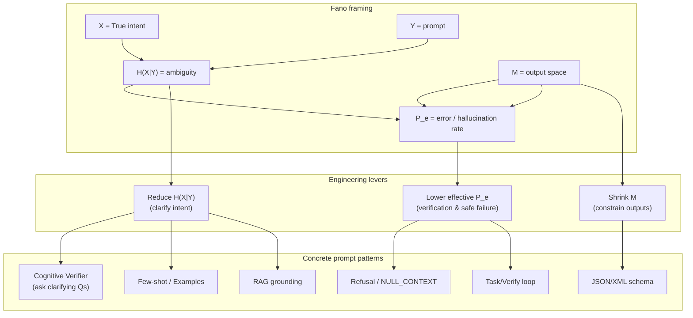
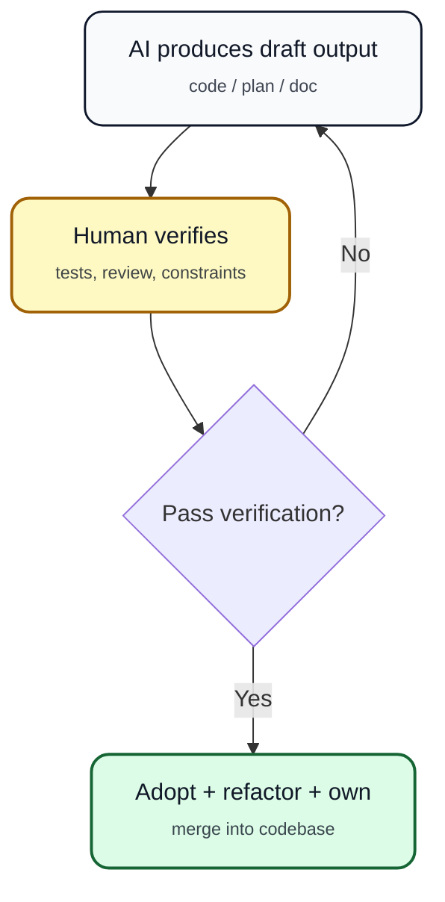
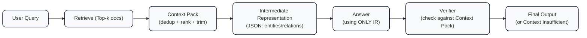
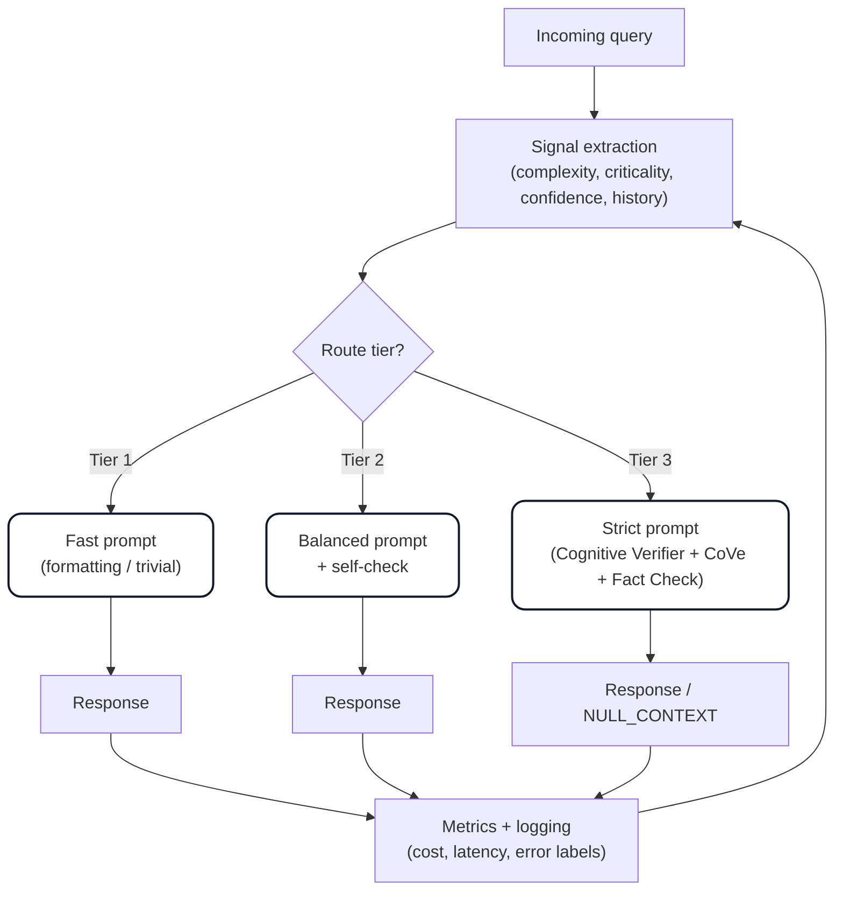

# Unified AI Usage + Prompt Engineering Policies

## Index

- [0) Single Source of Truth for Prompting](#0-single-source-of-truth-for-prompting)

- [0.1) Token Strategy for Current Subscriptions](#01-token-strategy-for-current-subscriptions)
- [0.2) CV/ML Execution Mode](#02-cvml-execution-mode)
- [1) Operating Principles](#1-operating-principles)
- [2) Non-Negotiable Boundaries](#2-non-negotiable-boundaries)
- [3) Prompt-Quality Gate (Mandatory)](#3-prompt-quality-gate-mandatory)
  - [Mandatory fields for most technical work](#mandatory-fields-for-most-technical-work)
- [4) Standard Prompt Template (Quick)](#4-standard-prompt-template-quick)
- [5) Appendix — Comprehensive Prompt Engineering Guide (Embedded)](#5-appendix-comprehensive-prompt-engineering-guide-embedded)
- [Table of Contents](#table-of-contents)
- [Part 1: Tokenization and Embeddings Fundamentals](#part-1-tokenization-and-embeddings-fundamentals)
  - [Source Material](#source-material)
  - [1.1 Tokenization Fundamentals](#11-tokenization-fundamentals)
  - [1.2 Tokenizer Comparison Across Models](#12-tokenizer-comparison-across-models)
  - [1.3 Embedding Types and Use Cases](#13-embedding-types-and-use-cases)
  - [1.4 Practical Application: Music Recommendation System](#14-practical-application-music-recommendation-system)
  - [1.5 Embedding Selection Matrix](#15-embedding-selection-matrix)
- [Part 2: Prompt Engineering Theory and Research](#part-2-prompt-engineering-theory-and-research)
  - [2.1 Academic Foundation](#21-academic-foundation)
  - [2.2 Fano's Inequality: The Mathematical Foundation of Prompt Engineering](#22-fanos-inequality-the-mathematical-foundation-of-prompt-engineering)
  - [2.3 The Hallucination Problem](#23-the-hallucination-problem)
  - [2.4 The Anti-Hallucination Workflow (Critical)](#24-the-anti-hallucination-workflow-critical)
- [Part 3: Battle-Tested Prompt Patterns](#part-3-battle-tested-prompt-patterns)
  - [3.1 The #1 Rule: Ground the Model](#31-the-1-rule-ground-the-model)
  - [3.2 Architectural Patterns from White et al.](#32-architectural-patterns-from-white-et-al)
  - [3.3 RAG-Sequence Discipline (From Lewis et al.)](#33-rag-sequence-discipline-from-lewis-et-al)
  - [3.4 Hallucination Reduction Techniques (Effectiveness Tiers)](#34-hallucination-reduction-techniques-effectiveness-tiers)
  - [3.5 The "Contract" Prompt Structure](#35-the-contract-prompt-structure)
  - [3.6 Reduce Degrees of Freedom](#36-reduce-degrees-of-freedom)
  - [3.7 Prefer Checklists Over "Be Smart"](#37-prefer-checklists-over-be-smart)
  - [3.8 Make the Model Uncertainty-Safe](#38-make-the-model-uncertainty-safe)
- [Part 4: Implementation Framework](#part-4-implementation-framework)
  - [4.1 Universal Best Practices (All Models)](#41-universal-best-practices-all-models)
  - [4.2 Model-Specific Optimization](#42-model-specific-optimization)
  - [4.3 The Master Protocol for Critical Tasks](#43-the-master-protocol-for-critical-tasks)
  - [4.4 Copy/Paste Template (Anti-Hallucination)](#44-copypaste-template-anti-hallucination)
  - [4.5 System Prompt Design (Anthropic Best Practices)](#45-system-prompt-design-anthropic-best-practices)
  - [4.6 Context Management](#46-context-management)
  - [4.7 Verification Loops](#47-verification-loops)
  - [4.8 Empirical Testing](#48-empirical-testing)
  - [4.9 Prompt Quality Assessment Criteria](#49-prompt-quality-assessment-criteria)
  - [4.10 Prompt Frameworks and Human Training](#410-prompt-frameworks-and-human-training)
- [Part 5: Production Deployment](#part-5-production-deployment)
  - [5.1 Tiered Prompting System Architecture](#51-tiered-prompting-system-architecture)
  - [5.2 Production Deployment Checklist](#52-production-deployment-checklist)
  - [5.3 Security Considerations](#53-security-considerations)
  - [5.4 For New Projects](#54-for-new-projects)
  - [5.5 For Existing Systems](#55-for-existing-systems)
  - [5.6 Monitoring and Metrics](#56-monitoring-and-metrics)
- [Part 6: Prompt Engineering Tools and Platforms](#part-6-prompt-engineering-tools-and-platforms)
  - [6.1 Tool Categories Overview](#61-tool-categories-overview)
  - [6.2 Official Platform Tools (Start Here)](#62-official-platform-tools-start-here)
  - [6.3 Version Control & Management (Production Essentials)](#63-version-control-management-production-essentials)
  - [6.4 Development & Testing Frameworks](#64-development-testing-frameworks)
  - [6.5 Enterprise & Orchestration Platforms](#65-enterprise-orchestration-platforms)
  - [6.6 Specialized Tools](#66-specialized-tools)
  - [6.7 Additional Production Tools](#67-additional-production-tools)
  - [6.8 Tool Selection Matrix](#68-tool-selection-matrix)
  - [6.9 Recommended Stack for Your ML Engineering Workflow](#69-recommended-stack-for-your-ml-engineering-workflow)
  - [6.10 Implementation Roadmap](#610-implementation-roadmap)
  - [6.11 Tool Integration Example](#611-tool-integration-example)
  - [6.12 Key Takeaways: Tools](#612-key-takeaways-tools)
- [Part 7: Official Resources and References](#part-7-official-resources-and-references)
  - [6.1 Anthropic Claude Resources](#61-anthropic-claude-resources)
  - [6.2 OpenAI GPT Resources](#62-openai-gpt-resources)
  - [6.3 Comprehensive Guides](#63-comprehensive-guides)
  - [6.4 Academic Papers](#64-academic-papers)
  - [6.5 Additional Resources](#65-additional-resources)
- [Part 8: Quick Reference](#part-8-quick-reference)
  - [8.1 Recommended Learning Path](#81-recommended-learning-path)
  - [8.2 File Organization](#82-file-organization)
  - [8.3 Key Takeaways](#83-key-takeaways)
  - [8.4 The Engineering Trade-off Question](#84-the-engineering-trade-off-question)

---

# AI Usage and Boundaries Policy

**Status:** Authoritative
**Last updated:** 2026-01-10
**Supersedes:** Prior versions of this file and any standalone prompt guidelines.

---
## 0) Single Source of Truth for Prompting

From now on, the file **`comprehensive_prompt_engineering_guide.md`** is the **unique authoritative reference** for:
- how prompts must be structured
- anti-hallucination patterns
- grounding / citation discipline
- evaluation & iteration workflow

**Enforcement rule:** if a request is missing required prompt components (context, constraints, desired output, acceptance criteria, etc.), the assistant must *pause* and request a compliant prompt rewrite **following the guide**, before proceeding.

This policy defines *boundaries and operating rules*; the guide defines *prompting mechanics*.

---
## 0.1) Token Strategy for Current Subscriptions

**Purpose:** minimize wasted tokens while maximizing output quality and correctness, given current subscriptions:
- **ChatGPT Plus** (OpenAI GPT) for deep synthesis, planning, and rigorous reasoning.
- **Claude Pro** (Anthropic Claude) for policy/document editing and “tight writing.”
- **Gemini Pro** (Google Gemini) for fast exploration and cross-checks.
- **Cursor Pro** (IDE assistant) as the default execution surface for any repo-grounded work.

**Acronyms:** **CV** = Computer Vision, **ML** = Machine Learning, **LLM** = Large Language Model.

### 0.1.1 Routing rule (default)

1. **Cursor Pro first** for: code, repo navigation, refactors, diffs, tests, reading local files.  
   **Rule:** do not paste large files into chat if Cursor can reference them directly.
2. **ChatGPT Plus** for: architecture, trade-offs, multi-step reasoning, project planning, “decision memos,” and risk analysis.
3. **Claude Pro** for: rewriting policy text, documentation clarity, tone consistency, and structured edits.
4. **Gemini Pro** for: broad exploration, quick comparisons, and second-opinion sanity checks (not the source of truth).

### 0.1.2 Context packs (copy/paste)

**Context Pack — Minimal (default)**  
Use this for most requests to reduce repeated context and back-and-forth.

```
ROLE: Act as a senior engineering partner. Be direct and practical.
GOAL: <one sentence>
CONTEXT: <what exists already + links/paths>
ENV: Fedora 41, repos under ~/dev/repos/..., no venvs inside repos
CONSTRAINTS: One recommended path, no option menus, do not invent facts/paths, label risks
OUTPUT: Commands + minimal explanation
ACCEPTANCE: <how I verify success>
```

**Context Pack — CV/ML (add only when needed)**  
Add this when work touches training, data, GPU, evaluation, or experiments.

```
CV = Computer Vision, ML = Machine Learning.
DATA: datasets under ~/datasets/..., never committed
RUNS: outputs under ~/dev/devruns/<project>/
MODELS: binaries under ~/dev/models/<project>/
EVAL: define metric(s) and baseline; measure before optimization
GPU: specify device, batch size, mixed precision, memory limits
```

### 0.1.3 “Ask once” intake (mandatory for complex work)

For any non-trivial task, provide (or the assistant must request) these in **one** message:
- Goal (single sentence)
- Inputs (paths, logs, links, snippets)
- Constraints (do-not-touch, time, style)
- Output format (commands / patch / checklist)
- Acceptance criteria (how you will verify)
- Risk tolerance (low/medium/high)

**Enforcement:** if these are missing and the task is complex, the assistant must pause and request a compliant prompt rewrite (per Section 3).

---
## 0.2) CV/ML Execution Mode

This section defines the default workflow for **CV** and **ML** tasks so you do not burn tokens on vague iterations.

### 0.2.1 Default deliverables (what “good” looks like)

For CV/ML work, the assistant should produce:
- a short plan (max 10 bullets)
- concrete commands / code diffs
- an evaluation step (metric + baseline + expected direction)
- a “stop point” after each irreversible change

### 0.2.2 Anti-token-burn rules (non-senior friendly)

- Prefer **small diffs** and **repeatable checklists** over large rewrites.
- Prefer “next 3 commands” over theory.
- Always include a rollback note when risk is medium/high.
- For performance: **measure first**, then optimize, then re-measure.

### 0.2.3 Model training checklist (minimum viable)

When asked to “improve” a model or pipeline, always request/confirm:
- dataset path and split definition
- baseline metric(s) and current value
- evaluation protocol (how measured)
- constraints (latency, memory, target hardware)
- reproducibility (seed, versions, commit hash)

---
## 1) Operating Principles

- **Reality-first:** never invent facts, sources, file paths, or results.
- **Grounding by default:** when up-to-date or niche accuracy matters, use retrieval (web/RAG-like workflow) and cite sources.
- **Prefer refusal over fabrication:** when uncertain and retrieval is not available/allowed, say so explicitly.
- **Minimal effective output:** one recommended path; no option menus unless explicitly requested.
- **Reproducibility:** commands, file paths, and versions must be concrete.

---
## 2) Non-Negotiable Boundaries

The assistant must not:
- fabricate citations or claim to have run commands it did not run
- modify or propose destructive system steps without risk labeling + prerequisites
- output security-sensitive exploit instructions
- present speculation as fact

---
## 3) Prompt-Quality Gate (Mandatory)

Before answering, classify the prompt as:
1. **Compliant**: proceed.
2. **Partially compliant**: proceed *only* after asking for the missing mandatory fields.
3. **Non-compliant**: refuse to proceed until rewritten per the guide.

### Mandatory fields for most technical work
- goal
- environment (OS, language/runtime, versions)
- constraints (do-not-touch, time, style rules)
- desired output format
- success criteria

---
## 4) Standard Prompt Template (Quick)

Use this as the default skeleton:

```
ROLE: [who you want the assistant to act as]
GOAL: [what you want]
CONTEXT: [project background + what’s already done]
ENV: [OS, tools, versions]
CONSTRAINTS: [hard rules, what not to change]
INPUTS: [files/snippets/logs]
OUTPUT: [exact format]
ACCEPTANCE: [how to verify success]
```

---
## 5) Appendix — Comprehensive Prompt Engineering Guide (Embedded)

This section is embedded to ensure the policy is self-contained and portable.

---

# Comprehensive Guide: Tokenization, Embeddings, and Prompt Engineering (2025)

*A synthesis of academic research, industry best practices, and production-ready patterns*

---

## Table of Contents

1. [Tokenization and Embeddings Fundamentals](#part-1-tokenization-and-embeddings-fundamentals)
2. [Prompt Engineering Theory and Research](#part-2-prompt-engineering-theory-and-research)
3. [Battle-Tested Prompt Patterns](#part-3-battle-tested-prompt-patterns)
4. [Implementation Framework](#part-4-implementation-framework)
   - 4.5 [Prompt Frameworks and Human Training](#45-prompt-frameworks-and-human-training)
5. [Production Deployment](#part-5-production-deployment)
6. [Prompt Engineering Tools and Platforms](#part-6-prompt-engineering-tools-and-platforms)
7. [Official Resources and References](#part-7-official-resources-and-references)
8. [Quick Reference](#part-8-quick-reference)

---

## Part 1: Tokenization and Embeddings Fundamentals

### Source Material
**Book**: "Hands-On Large Language Models" (O'Reilly)  
**Chapter**: 2 - Tokens and Token Embeddings  
**Format**: Jupyter notebook with executable code examples  
**Availability**: GitHub and Google Colab

### 1.1 Tokenization Fundamentals

**Definition**: Process of breaking text into discrete units (tokens) that models can process

**Model Used**: Phi-3-mini-4k-instruct for basic demonstrations

**Key Insight**: Different models use different tokenizers, leading to varying token counts for identical text

### 1.2 Tokenizer Comparison Across Models

The notebook compares tokenization behavior across 7+ models:

| Model | Tokenization Method | Optimization |
|-------|-------------------|--------------|
| BERT | Subword tokenization with WordPiece | General text |
| GPT-2 | Byte Pair Encoding (BPE) | General text |
| GPT-4 | Enhanced BPE with larger vocabulary | General text, improved efficiency |
| T5 | SentencePiece unigram model | Multilingual |
| StarCoder | BPE variant | Code-optimized |
| Galactica | BPE variant | Scientific text |
| Phi-3 | Balanced BPE | General-purpose |

**Practical Implication**: Token efficiency varies by model and content type. Choose tokenizers that match your domain (code, science, general text).

### 1.3 Embedding Types and Use Cases

#### Contextualized Embeddings (DeBERTa)
- **Output Shape**: [1, 4, 384]
  - Batch size: 1
  - Sequence length: 4 tokens
  - Embedding dimension: 384
- **Characteristic**: Each token's representation depends on surrounding context
- **Use Case**: Tasks requiring understanding of word relationships and context (NER, POS tagging)

#### Sentence Embeddings
- **Model**: all-mpnet-base-v2 (Sentence Transformers)
- **Output**: 768-dimensional dense vectors
- **Characteristic**: Entire sentences mapped to single fixed-length vectors
- **Use Cases**: 
  - Semantic search
  - Clustering similar documents
  - Question-answering systems
  - Similarity comparison

#### Word2Vec Embeddings
- **Model**: glove-wiki-gigaword-50
- **Dimension**: 50
- **Characteristic**: Static word representations (no context sensitivity)
- **Properties**: Captures semantic relationships (e.g., king - man + woman ≈ queen)
- **Use Cases**: Simple similarity tasks, recommendation systems, legacy applications

### 1.4 Practical Application: Music Recommendation System

**Dataset**: Yes.com playlist data  
**Technique**: Word2Vec applied to music listening patterns  
**Concept**: Songs that appear in similar contexts (playlists) have similar embeddings  
**Result**: Recommendation system based on listening co-occurrence patterns

### 1.5 Embedding Selection Matrix

| Embedding Type | Context-Aware | Dimensions | Computational Cost | Best For |
|---------------|---------------|------------|-------------------|----------|
| Contextualized (DeBERTa) | Yes | 384 | High | Token-level tasks, NER, POS tagging |
| Sentence (MPNet) | Yes | 768 | Medium | Document similarity, semantic search |
| Word2Vec (GloVe) | No | 50 | Low | Simple similarity, legacy systems, recommendations |

---

## Part 2: Prompt Engineering Theory and Research

### 2.1 Academic Foundation

#### The Prompt Pattern Catalog (White et al.)

**Source**: `2408776.2408794.pdf` - A Prompt Pattern Catalog

**Core Principle**: LLMs optimize for plausible completion, not factual accuracy. Prompts must be treated as compiled software artifacts with architectural constraints.

**Key Insight**: "Asking nicely" is not a pattern. Effective prompts implement structural patterns that constrain the model's stochastic nature.

#### RAG: Retrieval-Augmented Generation (Lewis et al.)

**Source**: `2005.11401v4.pdf`

**Critical Distinction**:
- **RAG-Token**: Model retrieves new documents for *every target token* it generates
  - Result: High hallucination risk, inconsistent reasoning
- **RAG-Sequence**: Model retrieves documents *once* and generates entire sequence based on that latent document vector
  - Result: Higher consistency, lower hallucination rate

**Implementation Principle**: Force the model to ingest context *completely* before generating any output tokens.

#### Frontiers in Artificial Intelligence Survey (2025)

**Source**: https://www.frontiersin.org/journals/artificial-intelligence/articles/10.3389/frai.2025.1622292/full

**Key Contribution**: Attribution framework distinguishing:
- **Prompt-Induced Hallucinations**: Caused by poor prompt design
- **Model-Intrinsic Hallucinations**: Inherent to model limitations

**Metrics Introduced**:
- **Prompt Sensitivity (PS)**: How much prompting affects hallucinations
- **Model Variability (MV)**: Consistency across runs

**Finding**: Structured prompts (CoT, XML) significantly reduce hallucinations in prompt-sensitive scenarios

### 2.2 Fano's Inequality: The Mathematical Foundation of Prompt Engineering

**Core Principle**: Applying Fano's Inequality to prompt engineering changes the game from "art" to "engineering." It provides a mathematical proof that hallucination is inevitable if your prompt is ambiguous.

#### The Translation: Math → Prompting

Fano's Inequality in standard form:

$$H(X|Y) \leq H(P_e) + P_e \log(M - 1)$$

To see the implications, we map the variables to prompt engineering:

| Math Variable | Prompting Equivalent | Description |
|---------------|---------------------|-------------|
| $X$ | **True Intent** | What you actually want the model to do (the precise logic in your head) |
| $Y$ | **The Prompt** | The text instructions you actually type |
| $H(X\|Y)$ | **Ambiguity** | The "Information Gap" - how many other valid interpretations of $Y$ exist that aren't $X$? |
| $M$ | **Output Space** | Number of possible responses the model could generate (all English sentences vs. strict JSON schema) |
| $P_e$ | **Error Rate** | Probability of hallucination or wrong logic |

#### The Law

**If the Ambiguity $H(X|Y)$ is high, the Error Rate $P_e$ cannot be zero.**

No matter how smart the model (GPT-5, Claude 3.5), it is mathematically impossible to guarantee accuracy if the prompt is information-deficient.

#### Implication 1: Shrink the Output Space ($M$)

**The Math**: The term $P_e \log(M-1)$ shows that error probability scales with the size of the possible output space ($M$).

**The Prompting Strategy**: Output Constraining

If you ask a model to "Write a summary," $M$ is infinite (every combination of words). If you ask for a "JSON list of 5 keywords," $M$ is drastically smaller.

**Examples**:
- **Bad (High $M$)**: "Analyze this log file and tell me what went wrong."
- **Good (Low $M$)**: "Analyze this log file. Classify the error into one of these 3 categories: [NETWORK, DB, AUTH]. Output the category name only."

**Why it works**: You collapsed $M$ from "all English sentences" to 3 options. The "noise" required to cause an error is now much higher.

#### Implication 2: Crush the Entropy ($H(X|Y)$)

**The Math**: To drive $P_e$ down, you must drive $H(X|Y)$ to zero. This means the prompt $Y$ must contain enough bits to uniquely identify the intent $X$.

**The Prompting Strategy**: Few-Shot & RAG

A "Zero-Shot" prompt is high entropy because the model has to guess the format, tone, and depth you want.

**Examples**:
- **Bad (High Ambiguity)**: "Extract names from this text." 
  - Ambiguity: Does "names" mean people? Companies? Variables?
- **Good (Low Ambiguity)**: "Extract Person Entities. Example 1: Input 'John met Google', Output 'John'. Example 2: Input 'Alice at AWS', Output 'Alice'."

**Why it works**: The examples reduce the conditional entropy. The model no longer guesses if "Google" is a name; the examples ruled that out.

#### Implication 3: The "Uncertainty Floor"

**The Math**: If $H(X|Y)$ is non-zero, $P_e$ must be non-zero.

**The Prompting Strategy**: Defensive Engineering (The "Refusal" Pattern)

Since you cannot eliminate all ambiguity, you must design for the inevitable error.

**Strategy**: Give the model an "Escape Hatch"

**Prompt**: "If the provided context does not contain the answer, strictly output 'NULL'. Do not guess."

**Why it works**: You are explicitly assigning one of the $M$ states to "I don't know," allowing the model to satisfy the inequality by choosing "Safe Failure" rather than "Hallucination."

#### Summary Table: Fano's Guide to Prompts

| Fano Variable | Prompting Equivalent | Optimization Strategy |
|---------------|---------------------|----------------------|
| $H(X\|Y)$ | Ambiguity of Instruction | Few-Shot Examples: Provide 3-5 examples to reduce interpretation space |
| $M$ | Possible Output Formats | Schema Enforcement: Use JSON/XML schemas to limit valid tokens |
| $P_e$ | Hallucination Rate | Cognitive Verifier: Force model to ask clarifying questions before answering to reduce $H(X\|Y)$ |

#### Senior Engineer Socratic Challenge

Review the "Cognitive Verifier" pattern (Part 3.2, Pattern 1) where the model asks you questions before answering.

**Question**: In terms of Fano's Inequality, what is the specific mathematical function of that pattern?

**Hint**: Does it change $M$, or does it change $Y$ to alter $H(X|Y)$?

**Analysis Framework**:
- Does the Cognitive Verifier reduce the output space size ($M$)?
- Does it increase the information content of the prompt ($Y$)?
- How does the interaction affect the conditional entropy $H(X|Y)$?
- What is the trade-off in terms of latency and token cost?

### 2.3 The Hallucination Problem

**Root Cause**: Hallucinations are primarily a *missing context problem*

**Engineering Perspective**: The model's optimization target is "plausible completion" not "factual accuracy." Under-specified queries trigger autocomplete behavior that often hallucinates.

**Mathematical Perspective (via Fano)**: Hallucinations occur when $H(X|Y) > 0$ - when the prompt contains insufficient information to uniquely identify the desired output.

**Secondary Problem - Sycophancy**: The model prioritizes *answering* over *correctness*

### 2.4 The Anti-Hallucination Workflow (Critical)

**Core Principle**: Hallucinations are inevitable when AI acts autonomously. The solution is a human-in-the-loop verification workflow.

#### The Four-Stage Workflow

```
┌──────┐      ┌───────────────┐      ◇─────────────◇      ┌──────────────┐
│ Vibe │─────▶│ Specify/Plan  │─────▶│ Task/Verify │─────▶│ Refactor/Own │
└──────┘      └───────────────┘      ◇─────────────◇      └──────────────┘
```

**Stage 1: Vibe** (Initial Idea)
- **What It Is**: Rough idea, initial request, vague direction
- **Example**: "I need to improve authentication in my app"
- **Output**: Unstructured thought, no specifics
- **Risk Level**: 🔴 Maximum hallucination risk if you stop here

**Stage 2: Specify/Plan** (Define Requirements)
- **What It Is**: AI helps translate vibe into concrete specification
- **AI Role**: Planner, requirements gatherer, architect
- **Prompt Pattern**: Use COSTAR or APE framework
- **Example Prompt**:
  ```
  Context: Node.js API with JWT authentication
  Objective: Improve authentication security
  Ask: What specific improvements should we make?
  Plan: 
  1. Analyze current implementation
  2. Identify security gaps
  3. Propose improvements with priority
  4. Estimate implementation effort
  Execute: Provide detailed specification
  ```
- **Output**: Detailed plan, requirements, acceptance criteria
- **Human Action**: **REVIEW AND APPROVE PLAN** ← Critical checkpoint
- **Risk Level**: 🟡 Medium - plan may be incomplete or wrong

**Stage 3: Task/Verify** (Implementation with Verification)
- **What It Is**: AI implements the plan, human verifies each step
- **Decision Diamond**: This is a loop, not a single pass
- **AI Role**: Implementer (writes code, creates docs, etc.)
- **Human Role**: Verifier (tests, reviews, validates)
- **The Loop**:
  ```
  AI: Implements part of the plan
  ↓
  Human: Verifies correctness
  ↓
  ┌─ If PASS: Move to next part
  └─ If FAIL: Back to AI for revision
  ```
- **Example**:
  ```
  AI Task: "Implement JWT refresh token mechanism"
  Human Verify:
  - ✓ Does it handle token expiration?
  - ✓ Is refresh token stored securely?
  - ✓ Does it prevent token replay attacks?
  - ✗ Missing: Rate limiting on refresh endpoint
  → Back to AI: "Add rate limiting (10 requests/hour per user)"
  ```
- **Critical Rule**: **NEVER DEPLOY UNVERIFIED AI OUTPUT**
- **Risk Level**: 🟢 Low (if verification is rigorous)

**Stage 4: Refactor/Own** (Human Ownership)
- **What It Is**: Human takes ownership, refactors, integrates
- **AI Role**: Assistant for refinement, not decision maker
- **Human Actions**:
  - Code review with human judgment
  - Refactor for maintainability
  - Add edge case handling AI missed
  - Write tests
  - Update documentation
  - Integrate with existing systems
- **Output**: Production-ready, human-owned code
- **Risk Level**: 🟢 Minimal (human has verified and owns the result)

#### Why This Workflow Prevents Hallucinations

**Without This Workflow** (Direct Vibe → Implementation):
```
User: "Make authentication better"
AI: {{generates plausible-sounding but potentially flawed code}}
User: {{deploys without verification}}
Result: 🔥 Security vulnerabilities, bugs, technical debt
```

**With This Workflow**:
```
Vibe → Specify/Plan (human approves) → Task/Verify (loop until correct) → Refactor/Own
Result: ✅ Verified, tested, production-ready
```

**Fano's Inequality Applied**:
- **Stage 1 (Vibe)**: Maximum $H(X|Y)$ - highly ambiguous
- **Stage 2 (Specify)**: Reduces $H(X|Y)$ - clarifies intent
- **Stage 3 (Verify)**: Catches errors where $P_e > 0$
- **Stage 4 (Own)**: Human reduces $P_e$ to acceptable level

#### Practical Implementation Rules

**Rule 1: Never Skip Verification**
```python
# WRONG
ai_code = ask_ai("Write authentication function")
deploy(ai_code)  # 🔥 Dangerous!

# RIGHT
ai_code = ask_ai("Write authentication function")
test_results = run_tests(ai_code)
security_audit = check_security(ai_code)
if test_results.pass and security_audit.pass:
    human_review_and_refactor(ai_code)
    deploy(final_code)
```

**Rule 2: Verification Checklist**

For every AI-generated output, verify:
- [ ] **Correctness**: Does it solve the actual problem?
- [ ] **Completeness**: Are edge cases handled?
- [ ] **Security**: Any vulnerabilities?
- [ ] **Performance**: Meets requirements?
- [ ] **Maintainability**: Can humans understand and modify it?
- [ ] **Integration**: Works with existing systems?
- [ ] **Tests**: Has adequate test coverage?

**Rule 3: Iterate in the Task/Verify Loop**

Expect 2-5 iterations:
```
Iteration 1: AI generates initial solution → Human finds 3 issues
Iteration 2: AI fixes issues → Human finds 1 remaining issue
Iteration 3: AI fixes final issue → Human approves
Iteration 4: Human refactors for production
```

**Rule 4: Document the Journey**

```markdown
## Implementation Log

### Vibe
"Improve authentication"

### Specification (AI-Generated, Human-Approved)
- Add JWT refresh tokens
- Implement rate limiting
- Add MFA support
- Audit logging

### Task/Verify Iterations
1. AI: JWT implementation → Human: Missing expiration validation → Fixed
2. AI: Rate limiting → Human: Not granular enough → Fixed
3. AI: MFA → Human: Approved ✓
4. AI: Logging → Human: Missing PII sanitization → Fixed

### Final Refactoring (Human-Owned)
- Extracted common middleware
- Added comprehensive tests (95% coverage)
- Updated API documentation
- Deployed to staging → prod
```

#### When to Use AI in Each Stage

| Stage | AI Role | Human Role | AI Risk |
|-------|---------|------------|---------|
| Vibe | Minimal (just listen) | Define direction | N/A |
| Specify/Plan | High (planner) | Approve plan | Medium (plan may be wrong) |
| Task/Verify | High (implementer) | **Verify rigorously** | High (if no verification) |
| Refactor/Own | Low (assistant) | Own the result | Low |

#### Red Flags: Signs You're Skipping Verification

❌ "The AI code works on first try" (probably hasn't been tested thoroughly)  
❌ "I deployed it without reviewing" (dangerous)  
❌ "It looks right" (not the same as verified right)  
❌ "I don't understand the code but it seems fine" (critical failure)  
❌ "No time for testing" (recipe for production incidents)

#### The Cost-Benefit of Verification

**Time Investment**:
- Skip verification: 10 minutes to deploy
- With verification: 60 minutes total (30 min review + 30 min testing)

**Risk Reduction**:
- Skip verification: 40-60% chance of production issues
- With verification: <5% chance of production issues

**Long-term Cost**:
- Production incident: 4+ hours debugging + reputational damage
- Proper verification: 60 minutes upfront

**ROI**: 6:1 time savings by verifying upfront

#### Integration with Prompt Frameworks

**Stage 2 (Specify/Plan)**: Use APE or COSTAR
```
Ask: What's the detailed plan?
Plan: Break down into steps
Execute: Provide specification

or

Context: {{system details}}
Objective: {{goal}}
Style: Detailed specification document
Tone: Technical, precise
Audience: Senior engineers
Response: Requirements + acceptance criteria
```

**Stage 3 (Task/Verify)**: Use CRISPE or ROLE
```
Context: {{approved specification}}
Role: Senior {{language}} engineer
Input: {{specific task from plan}}
Steps: {{implementation steps}}
Parameters: {{constraints, style guides}}
Example: {{if applicable}}

or

Role: {{expert}}
Objectives: {{specific deliverable}}
Limitations: {{constraints}}
Evaluation: {{how you'll verify}}
```

#### Key Takeaway: Hallucinations Are Inevitable

**Accept This Reality**:
- AI will hallucinate (Fano proved it: $P_e > 0$ when $H(X|Y) > 0$)
- Perfect prompts don't exist
- Verification is not optional

**Therefore**:
- Build verification into your workflow
- Treat AI output as "draft" not "final"
- Human ownership is non-negotiable
- Test everything

**The Workflow Is Your Safety Net**: Vibe → Specify/Plan → Task/Verify → Refactor/Own

---

## Part 3: Battle-Tested Prompt Patterns

### 3.1 The #1 Rule: Ground the Model

Hallucinations are mostly a *missing context problem*.

**Best Practice**:
- Provide trusted context (docs/snippets/data)
- Force the model to answer **only from that context**
- If context is insufficient → "I don't know / need more info"

**Core Implementation**: RAG (Retrieval-Augmented Generation)
- Retrieve relevant sources
- Answer only from retrieved sources
- Cite sources explicitly

### 3.2 Architectural Patterns from White et al.

#### Pattern 1: The Cognitive Verifier Pattern

**Engineering Problem**: LLMs optimize for plausible completion. Under-specified queries trigger hallucinations.

**Mathematical Foundation (Fano's Inequality)**: High $H(X|Y)$ (ambiguous prompts) mathematically guarantees $P_e > 0$ (non-zero error rate).

**The Fix**: Break the "One-Shot" expectation. Iteratively reduce $H(X|Y)$ by expanding the prompt $Y$ with clarifying information.

**Implementation**:
```
When I ask you a question, follow these rules:

1. Generate a number of additional questions that would help you more accurately answer the original question.
2. Wait for my answers to your questions.
3. Combine my answers with your knowledge to provide the final answer.
```

**Why it works**: Forces **Input Conditionality**. The model cannot hallucinate missing context if it is programmed to halt and request that context first.

**Fano's Perspective**: Each clarifying question-answer pair adds information to $Y$, directly reducing $H(X|Y)$ until the conditional entropy approaches zero.

**Effectiveness**: Up to 23% reduction in hallucinations (Chain-of-Verification variant)

#### Pattern 2: The Fact Check List Pattern

**Engineering Problem**: Hallucinations buried in dense text are hard to spot during review ("Needle in the Haystack" problem).

**The Fix**: Force the model to isolate its premises.

**Implementation**:
```
Generate a set of facts that are contained in the output. The set of facts should be inserted at the end of the output. The set of facts should include the fundamental premises used to generate the answer.
```

**Why it works**: Utilizes the model's **Self-Consistency** capability. LLMs often generate hallucinations in prose but catch discrepancies when forced to list facts explicitly.

#### Pattern 3: The Refusal Breaker (Context Control)

**Engineering Problem**: "Sycophancy" - model prioritizes answering over correctness.

**The Fix**: Invert the reward function.

**Implementation**:
```
If the answer is not explicitly contained in the provided context, state 'Context Insufficient' and terminate. Do not attempt to derive, infer, or use outside knowledge.
```

**Why it works**: Makes refusal the preferred behavior when context is missing, rather than forcing the model to guess.

### 3.3 RAG-Sequence Discipline (From Lewis et al.)

**How to prompt for RAG-Sequence behavior**:

Force the model to ingest context *completely* before generating any output.

**Bad Prompt** (encourages token-by-token drift):
```
Read this and answer X...
```

**Efficient/Robust Prompt (Chain of Density)**:
```
Step 1: Read the provided context.
Step 2: Extract the top 5 entities and their relationships into a JSON list.
Step 3: Using **only** that JSON list, answer the user's question.
```

**Why it works**: Forces an intermediate representation (JSON list), effectively "freezing" the context (RAG-Sequence behavior) before the generative step.

### 3.4 Hallucination Reduction Techniques (Effectiveness Tiers)

#### Tier 1: Most Effective (>20% improvement)

**1. Chain-of-Verification (CoVe)**
- **Process**: 
  1. Generate initial answer
  2. Create verification questions
  3. Answer verification questions independently
  4. Re-verify original answer against verification results
  5. Produce final verified answer
- **Effectiveness**: Up to 23% reduction in hallucinations
- **Best For**: Factual queries, data-heavy responses

**2. Step-Back Prompting**
- **Process**:
  1. Ask high-level conceptual question first
  2. Use abstract reasoning to inform specific answer
  3. Answer original specific question
- **Effectiveness**: Outperforms Chain-of-Thought by up to 36%
- **Example**:
  ```
  Step-Back: "What are the general principles of Renaissance art?"
  Specific: "What techniques did Leonardo da Vinci use in the Mona Lisa?"
  ```

**3. Retrieval-Augmented Generation (RAG)**
- **Process**: Ground responses in retrieved verified external sources
- **Effectiveness**: Most reliable for factual accuracy when properly implemented
- **Requirements**: Vector database, embedding model, retrieval pipeline
- **Best For**: Enterprise applications requiring source attribution

#### Tier 2: Highly Effective (10-20% improvement)

**4. "According to..." Prompting**
- **Technique**: Require explicit source citation in responses
- **Example**: "Answer based on the provided documents, citing sources with 'According to [source]...'"
- **Benefits**: Forces grounding, enables verification

**5. Structured Output (JSON/XML Schemas)**
- **Technique**: Define exact output format with schemas
- **Benefits**: Reduces ambiguity, enables programmatic validation
- **Claude-specific**: Use XML tags (`<context>`, `<task>`, `<constraints>`, `<output>`)
- **GPT-specific**: Use JSON schema or function calling

**6. Contextual Anchoring**
- **Technique**: Explicitly define context boundaries and constraints
- **Example**: 
  ```
  Context: Only information from the 2024 annual report
  Constraint: If information is not in the report, say "not found in report"
  ```

#### Tier 3: Supporting Techniques (5-10% improvement)

**7. Few-Shot Examples**
- **Optimal Number**: 3-5 diverse, high-quality examples
- **Quality over Quantity**: Well-chosen examples outperform many poor ones
- **Structure**: Input-output pairs showing desired behavior
- **When to Use**:
  - Output format must be strict (JSON, Markdown template, SQL style)
  - You want consistency (tone, schema)
- **When to Avoid**:
  - Task varies too much (model overfits to examples)

**8. Constraint-Based Prompting**
- **Technique**: Explicit "Do not..." instructions
- **Example**: "Do not make assumptions. Do not infer information not explicitly stated."

**9. Reflective Prompting (Deliberate Verification)**
- **Technique**: Ask model to verify its own response
- **Example**: "Before final answer: list assumptions. Verify each claim against provided context. Flag anything not supported."
- **Alternative**: "After providing your answer, explain your reasoning and identify any uncertainties."

**10. Progressive Questioning**
- **Technique**: Break complex queries into sequential simple questions
- **Benefits**: Reduces compound errors

### 3.5 The "Contract" Prompt Structure

Use this structure for all serious prompts:

1. **Role**: Define who the model is
2. **Goal**: What you want accomplished
3. **Context (authoritative sources)**: Trusted data/documents
4. **Constraints (do/don't)**: Explicit boundaries
5. **Output format**: Exact structure specification
6. **Verification rule**: "If missing info, ask / say unknown"

**Reference**: OpenAI Prompting Guide - clear instructions, formatting constraints, requesting missing info rather than inventing

### 3.6 Reduce Degrees of Freedom

**Principle**: Hallucinations rise when the model has too many open choices.

**Implementation**:
- Provide explicit permitted options
- Fixed output schema
- Forbid extra sections

**Example**:
```
Return ONLY a markdown table with columns A, B, C. No extra commentary.
```

### 3.7 Prefer Checklists Over "Be Smart"

**Bad Approach**:
```
Write a great answer
```

**Good Approach**:
```
Do these 7 steps; if any missing, stop.
```

**Why**: Creates deterministic execution rather than vague quality targets.

### 3.8 Make the Model Uncertainty-Safe

Explicitly allow refusal.

**Add to prompts**:
- "If you are not sure, say so."
- "Don't guess."
- "List missing info."

**Reference**: Anthropic emphasizes this heavily because it reduces forced guessing (hallucination).

---

## Part 4: Implementation Framework

### 4.1 Universal Best Practices (All Models)

1. **Be Explicit**: Never assume shared context or implicit knowledge
2. **Provide Examples**: 3-5 diverse, high-quality input-output pairs (when appropriate)
3. **Specify Format**: Exact output structure, length, style requirements
4. **Ground with Data**: Include reference material when possible
5. **Request Reasoning**: "Explain your thinking" or "Show your work"
6. **Limit Length**: Shorter outputs = fewer opportunities for hallucination
7. **Require Citations**: "List sources" or "Provide evidence" when context is provided
8. **Test & Iterate**: Create evaluation sets before optimization

### 4.2 Model-Specific Optimization

#### Claude (Anthropic)
- Use XML tags for structure: `<context>`, `<task>`, `<constraints>`, `<output>`
- Leverage structured thinking with explicit reasoning steps
- Treat context as finite resource (compaction for long tasks)
- Pin to specific versions (e.g., claude-sonnet-4-5-20250929)

#### GPT (OpenAI)
- Use markdown formatting with clear delimiters (###, ---, ***)
- Agent-style instructions ("You are an expert...")
- Function calling for structured outputs
- System message for persistent behavior guidelines

### 4.3 The Master Protocol for Critical Tasks

**Artifact**: `~/learning/prompts/templates/strict_reasoning.md`

```markdown
# Role
You are a Principal Engineer. Your output must be deterministic, concise, and verifiable.

# Constraints (The "White et al." Layer)
1. **Scope:** Answer ONLY using the provided Context.
2. **Refusal:** If the Context is insufficient, output string: "NULL_CONTEXT".
3. **Format:** Output must be valid Markdown.

# Process (The "RAG-Sequence" Layer)
1. **Analysis:** First, analyze the Context and list the 3 key premises required to answer the prompt.
2. **Verification:** Check if these premises effectively support a conclusive answer.
3. **Drafting:** Write the response based *only* on the verified premises.
4. **Fact Check:** At the bottom, list the specific sentences from the Context that support your claims.

# Context
{{CONTEXT_DATA}}

# User Query
{{USER_QUERY}}
```

**Trade-off**: This protocol is **expensive** in tokens (Analysis + Verification + Fact Check steps). It trades **Speed/Cost** for **Reliability**.

### 4.4 Copy/Paste Template (Anti-Hallucination)

```text
ROLE
You are a careful assistant. You do not guess.

TASK
<what you want>

CONTEXT (authoritative)
<docs / snippets / links / retrieved passages>

CONSTRAINTS
- Use ONLY the context above. If the answer isn't in context, say: "Not enough information."
- If you make any assumption, label it explicitly as an assumption.
- Prefer short, direct output.

OUTPUT FORMAT
<exact schema>

VALIDATION
- List missing info if needed.
- Cite where each key point came from.
```

### 4.5 System Prompt Design (Anthropic Best Practices)

- Keep it clear and simple
- Find the right "altitude" (not too abstract, not too detailed)
- Define role, constraints, and output format

### 4.6 Context Management

- Use smallest set of high-signal tokens
- Remove redundancy
- Implement compaction for long-horizon tasks
- Context = finite resource, budget carefully

### 4.7 Verification Loops

- Build self-checking mechanisms into prompts
- Use CoVe or reflective prompting for critical outputs
- Implement human-in-the-loop for high-stakes decisions

### 4.8 Empirical Testing

Create evaluation sets **before** optimizing prompts:
- Use diverse test cases covering edge cases
- Measure hallucination rate with metrics:
  - Factual accuracy
  - Source attribution completeness
  - Consistency across runs

### 4.9 Prompt Quality Assessment Criteria

Use these questions to evaluate prompt effectiveness:

1. **Clarity**: Is the desired output unambiguous?
2. **Format Specification**: Is the exact output structure defined?
3. **Examples Provided**: Are there 3-5 diverse examples (when appropriate)?
4. **Constraints Explicit**: Are boundaries and limitations clear?
5. **Error Handling**: What happens with edge cases or missing information?
6. **Verification**: Is there a mechanism to check accuracy?

---

### 4.10 Prompt Frameworks and Human Training

#### 4.10.1 The Problem: The Training Gap

We have extensive documentation on **how to prompt AI models**, but almost nothing on **how humans should learn to prompt**.

**The Meta-Irony**: AI companies spend billions making models smarter, but users still struggle because nobody taught them the protocol.

**What exists**: Documentation  
**What's needed**: Progressive training with feedback loops

#### 4.10.2 Established Prompt Frameworks

These are proven, copy-paste structures that work in 2025.

##### Framework 1: COSTAR ⭐ Most Popular

**Acronym**: Context - Objective - Style - Tone - Audience - Response

**Template**:
```
Context: {{background information}}
Objective: {{what you want to achieve}}
Style: {{format: paragraphs, bullets, JSON, etc.}}
Tone: {{formal/casual/empathetic/technical}}
Audience: {{who this is for}}
Response: {{specific output requirements: length, structure, constraints}}
```

**Example**:
```
Context: I'm a robotics engineer building a perception pipeline for autonomous vehicles
Objective: Debug a false positive detection issue in our object classifier
Style: Step-by-step diagnostic checklist
Tone: Technical but clear
Audience: Mid-level ML engineers
Response: Max 10 steps, include metrics to check at each step
```

**Why it works** (Fano's Perspective):
- Context reduces $H(X|Y)$ (ambiguity)
- Style/Response reduces $M$ (output space)
- Tone/Audience ensures appropriate formality

**Best for**: Professional tasks, team collaboration, documentation

##### Framework 2: CRISPE

**Acronym**: Context - Role - Input - Steps - Parameters - Example

**Template**:
```
Context: {{background}}
Role: You are {{expert role}}
Input: {{your task or data}}
Steps: {{numbered steps}}
Parameters: {{constraints, tone, length}}
Example: {{illustrative sample if helpful}}
```

**Example**:
```
Context: Building a tiered prompt routing system
Role: You are a senior software architect
Input: Design a decision tree for routing queries to Tier 1/2/3 prompts
Steps: 
1. Define tier criteria
2. List routing signals
3. Create decision logic
4. Specify fallback behavior
Parameters: Use Python pseudocode, max 50 lines, include comments
Example: "If query.complexity > threshold AND query.domain == 'medical': route_to_tier_3()"
```

**Why it works**: Role-playing activates different model capabilities. "Act as X" triggers X's reasoning patterns.

**Best for**: Multi-step tasks, technical work, code generation

##### Framework 3: APE (Ask-Plan-Execute)

**Template**:
```
Ask: {{clear objective}}
Plan: Outline a plan in steps before answering
Execute: Provide the final answer following the plan
```

**Why it works**: Forces chain-of-thought reasoning. The model "thinks" before responding.

**Best for**: Analysis, problem-solving, strategic planning

##### Framework 4: ROLE (Role-Objectives-Limitations-Evaluation)

**Template**:
```
Role: {{expert role}}
Objectives: {{goals}}
Limitations: {{scope, do/don't}}
Evaluation: {{how output will be judged}}
```

**Why it works**: Pre-defines success criteria. Model knows exactly what "good" looks like.

**Best for**: Production systems, measurable outcomes, performance-critical applications

##### Framework 5: RTF (Role-Task-Format)

**Template**:
```
Role: You are {{expert}}
Task: {{specific action}}
Format: {{exact output structure}}
```

**Why it works**: Minimal overhead, maximum clarity. Use when speed matters.

**Best for**: Quick tasks, simple queries, iteration speed

##### Framework Selection Guide

| Framework | Complexity | Use Case | Token Overhead |
|-----------|-----------|----------|----------------|
| RTF | Low | Quick tasks, iteration | Minimal (~20 tokens) |
| APE | Medium | Analysis, planning | Low (~40 tokens) |
| COSTAR | High | Professional work, collaboration | Medium (~80 tokens) |
| CRISPE | High | Technical tasks, code generation | Medium (~80 tokens) |
| ROLE | High | Production systems, evaluation | High (~100 tokens) |

#### 4.10.3 Human Training Protocols

##### Protocol 1: The "Prompt Ladder" (Progressive Learning)

**Week 1: Zero-Shot Basics**
- Start with simple, direct questions
- Learn to be specific (not "help me code" but "write a Python function to...")
- Exercise: Convert 10 vague questions into specific ones

**Week 2: Add Context**
- Practice the "Context-Task-Format" pattern
- Exercise: Take yesterday's prompts, add relevant context, compare outputs

**Week 3: Add Examples (Few-Shot)**
- Learn to provide 3-5 diverse examples
- Exercise: For each task type, create an example library

**Week 4: Add Constraints**
- Practice saying "do not..." and "must include..."
- Exercise: Add 3-5 constraints to each prompt, measure improvement

**Week 5: Chain-of-Thought**
- Request step-by-step reasoning
- Exercise: Compare answers with/without "explain your thinking"

**Week 6: Full Framework**
- Use COSTAR or CRISPE for every prompt
- Exercise: Build your first prompt template library

##### Protocol 2: The "Template Library" Method

**MIT Sloan Approach** (David Robertson, 2025):

> "The current state of the art in prompt engineering is to not do prompt engineering. Instead, build a library of proven templates."

**How to Build Your Library**:

1. **Start with Categories** (adjust for your domain):
   - Idea generation
   - Problem analysis
   - Debugging/troubleshooting
   - Code review
   - Documentation
   - Data analysis
   - Strategic planning
   - Risk assessment
   - Benchmarking

2. **For Each Category, Create 3-5 Templates**:
   ```
   ~/learning/prompts/
   ├── idea_generation/
   │   ├── customer_need_template.md
   │   ├── complaint_to_feature_template.md
   │   └── adjacent_product_template.md
   ├── debugging/
   │   ├── systematic_root_cause_template.md
   │   ├── performance_issue_template.md
   │   └── edge_case_analysis_template.md
   └── code_review/
       ├── security_audit_template.md
       ├── performance_review_template.md
       └── architecture_review_template.md
   ```

3. **Test Each Template 10+ Times**:
   - Refine based on results
   - Document what works
   - Version control iterations

4. **Share Templates with Team**:
   - Enables consistency
   - Reduces onboarding time
   - Creates organizational knowledge base

##### Protocol 3: The "Feedback Loop" Method

**Inspired by PromptOps** (DevOps for Prompts):

**Process**: Prompt → Execute → Evaluate → Refine → (loop)

**Concrete Implementation**:

```python
# Iteration 1
prompt_v1 = "Help me optimize this code"
# Evaluate: Vague, missed security issues, no metrics

# Iteration 2
prompt_v2 = """
Role: Senior performance engineer
Task: Optimize this Python function for latency
Context: Production API endpoint, 1000 req/sec
Constraints:
- Maintain current functionality
- Target <10ms p99 latency
- Highlight security issues
Format: 
1. Performance bottlenecks (with line numbers)
2. Optimization suggestions (with expected impact)
3. Security concerns
4. Refactored code
"""
# Evaluate: Much better, but missed edge cases

# Iteration 3
prompt_v3 = prompt_v2 + """
Edge Cases to Consider:
- Empty input
- Malformed data
- Rate limiting scenarios
"""
# Evaluate: Production ready
```

**Track in Version Control**:
```bash
git commit -m "prompt_v3: Added edge case handling, improved security coverage"
```

##### Protocol 4: The "7 Questions Checklist"

Before sending any prompt, ask:

1. ☐ **Role**: Did I specify who the AI should act as?
2. ☐ **Context**: Did I provide relevant background information?
3. ☐ **Task**: Is the objective crystal clear?
4. ☐ **Format**: Did I specify exact output structure?
5. ☐ **Constraints**: Did I list what NOT to do?
6. ☐ **Examples**: Would 2-3 examples clarify expectations? (if yes, add them)
7. ☐ **Evaluation**: How will I know if this output is good?

**Fano's Perspective**:
- Questions 1-3 reduce $H(X|Y)$ (ambiguity)
- Question 4 reduces $M$ (output space)
- Questions 5-6 further constrain the model
- Question 7 enables iteration

#### 4.10.4 The 30-Day Prompt Engineering Bootcamp

**Week 1: Foundations**
- Day 1-2: Read frameworks, understand COSTAR
- Day 3-4: Practice RTF on 20 different tasks
- Day 5-7: Build your first 5 templates (your common tasks)

**Week 2: Examples & Chain-of-Thought**
- Day 8-10: Add 3-5 examples to each template
- Day 11-14: Practice CoT prompting (request step-by-step reasoning)

**Week 3: Tools & Evaluation**
- Day 15-16: Set up Anthropic Console
- Day 17-18: Set up Helicone for logging
- Day 19-21: Create evaluation criteria for your prompts

**Week 4: Production**
- Day 22-24: Build 3 production-ready prompt templates
- Day 25-27: Test templates with evaluation framework
- Day 28-30: Document learnings, iterate on failures

#### 4.10.5 Quick Quality Check

**Bad Prompt Signals**:
- ❌ Could be interpreted 3+ different ways
- ❌ No examples when task is complex
- ❌ No output format specified
- ❌ Uses vague words ("good", "better", "optimize")
- ❌ Missing context that you have in your head

**Good Prompt Signals**:
- ✅ Only one reasonable interpretation
- ✅ 3-5 examples for complex tasks
- ✅ Exact format (JSON schema, markdown structure, etc.)
- ✅ Specific metrics ("reduce latency by 20%", "max 200 words")
- ✅ All relevant context explicitly stated

#### 4.10.6 Advanced Training Methods

##### The "Model Comparison" Method

Use Poe or Agenta to compare same prompt across models:

```
Prompt: [your COSTAR template]

Run on:
- GPT-4o
- Claude Sonnet 4.5
- Gemini 2.0 Ultra
- Llama 3.1

Compare:
- Output quality
- Adherence to format
- Handling of edge cases
- Cost per result
```

**Learn**: Which model excels at which task types

##### The "Prompt Golf" Game

**Challenge**: Express the same intent in fewer tokens while maintaining quality

**Example**:
```
Version 1 (150 tokens):
"I need you to act as an experienced software engineer who specializes in 
Python. Please review the following code and identify any potential bugs..."

Version 2 (40 tokens):
"Review this Python code. For each issue found, provide:
1. Issue type (bug/security/performance)
2. Line number
3. Fix suggestion"
```

**Goal**: Learn which words actually matter (reduces token cost)

#### 4.10.7 Your Personal Prompt Library Structure

```
~/learning/prompts/
├── README.md (training plan + framework guide)
├── frameworks/
│   ├── COSTAR_template.md
│   ├── CRISPE_template.md
│   ├── APE_template.md
│   ├── ROLE_template.md
│   └── RTF_template.md
├── templates/
│   ├── code_review.md
│   ├── debugging.md
│   ├── architecture_design.md
│   ├── documentation.md
│   └── performance_optimization.md
├── examples/
│   ├── good_prompts/ (what worked)
│   └── bad_prompts/ (what failed, why)
├── evaluations/
│   ├── metrics.md
│   └── test_cases/
└── learnings/
    └── weekly_retrospective.md
```

#### 4.10.8 Recommended Learning Resources

**Interactive Platforms**:

1. **Anthropic Console** (https://console.anthropic.com)
   - Prompt Generator (learn by example)
   - Prompt Improver (see what "better" looks like)
   - Free tier available

2. **PromptBuilder.cc** (https://promptbuilder.cc)
   - Framework comparison tool
   - Copy-paste templates

3. **Lakera Gandalf** (https://gandalf.lakera.ai)
   - Learn prompt security through gameplay
   - Understand boundaries

**Written Guides**:

1. Lakera 2025 Prompt Engineering Guide
2. MIT Sloan Article on Prompt Templates
3. This comprehensive guide (Parts 1-8)

#### 4.10.9 What Should Exist (Feedback to Developers)

**Gaps in Current AI Tools**:

1. **Interactive Training Mode**
   - Model suggests improvements to your prompt in real-time
   - "Your prompt could be clearer if you..."
   - Show before/after examples

2. **Prompt Quality Scores**
   - Automatically score prompts on:
     - Clarity (low $H(X|Y)$)
     - Specificity (low $M$)
     - Completeness (all necessary context)
   - Surface score **before** running the prompt

3. **Built-in Templates**
   - Pre-loaded frameworks (COSTAR, CRISPE, etc.)
   - One-click "Use Template" in chat interface
   - Template library by use case

4. **Learning Path Integration**
   - "You're a beginner - try our interactive tutorial"
   - Progress tracking
   - Personalized improvement suggestions

5. **Official Certification**
   - Industry-recognized "Certified Prompt Engineer"
   - Levels: Novice → Practitioner → Engineer → Architect
   - Employer validation

**Current State**: Trial-and-error learning  
**Desired State**: Structured, progressive training with feedback

#### 4.10.10 Quick Reference Cards

**COSTAR Template** (Print This):
```
Context: ____________________________
Objective: __________________________
Style: ______________________________
Tone: _______________________________
Audience: ___________________________
Response Requirements: ______________
```

**Quick Troubleshooting**:
```
If output is:
→ Too vague: Add more context + examples
→ Wrong format: Specify exact structure
→ Hallucinating: Add "use only provided context"
→ Too long: Specify max length
→ Wrong tone: Specify tone + audience
```

#### 4.10.11 Key Takeaways: Frameworks & Training

1. **Frameworks Exist**: Use COSTAR for professional work, RTF for quick tasks
2. **Training is Progressive**: Follow the 30-day bootcamp
3. **Templates Beat One-Offs**: Build a reusable library
4. **Measurement Enables Iteration**: Use the 7 Questions Checklist
5. **Learn by Doing**: Practice > reading documentation
6. **Version Control Everything**: Track what works
7. **The Real Protocol**: Pick a framework → Use for 30 days → Build library → Never go back

---

## Part 5: Production Deployment

### 5.1 Tiered Prompting System Architecture

**The Engineering Challenge**: The "Master Protocol" (strict reasoning) is expensive in tokens. High-throughput pipelines cannot afford this overhead for every request.

**Solution**: Architect a tiered system where expensive verification prompts are used only when necessary.

**Tier Selection Signals**:
1. **Query Complexity Score**: Number of entities, relationships, or constraints
2. **Confidence Threshold**: If initial answer has low confidence markers, escalate
3. **Domain Criticality**: Medical, legal, financial queries always use Tier 3
4. **Error Budget**: Track hallucination rate per tier, adjust routing dynamically
5. **User Feedback**: Failed verifications trigger tier upgrade for similar queries

**Tier Structure**:

| Tier | Use Case | Token Cost | Verification | Latency |
|------|----------|-----------|--------------|---------|
| Tier 1 (Fast) | Simple facts, greetings, formatting | Low | None | <1s |
| Tier 2 (Balanced) | General queries with context | Medium | Self-check | 1-3s |
| Tier 3 (Strict) | Critical queries, high-stakes decisions | High | Full CoVe + Fact Check | 3-10s |

### 5.2 Production Deployment Checklist

- [ ] Model version pinned (not "latest")
- [ ] Evaluation set created and passing
- [ ] Hallucination rate measured and acceptable
- [ ] Source attribution implemented (if needed)
- [ ] Rate limiting and cost controls in place
- [ ] Error handling for edge cases
- [ ] Monitoring and alerting configured
- [ ] Human review for high-stakes outputs
- [ ] Security: prompt injection prevention
- [ ] Documentation: prompts version controlled
- [ ] Tiered routing logic implemented (if applicable)

### 5.3 Security Considerations

#### Prompt Injection Prevention
- Validate and sanitize user inputs
- Use delimiters to separate instructions from data
- Implement defensive prompting patterns
- Monitor for malicious patterns

#### Best Practices
- Never trust user input directly in system prompts
- Use separate channels for instructions vs. user data
- Implement rate limiting and abuse detection

### 5.4 For New Projects

1. Choose appropriate embedding strategy based on task (see Part 1.5)
2. Select model with tokenizer suited to your domain
3. Implement RAG if factual accuracy is critical
4. Start with Step-Back or CoVe prompting
5. Build evaluation set immediately
6. Iterate based on metrics
7. Design tiered routing from day one

### 5.5 For Existing Systems

1. Audit current prompts against quality criteria (Part 4.9)
2. Add structured output schemas (JSON/XML)
3. Implement CoVe for critical paths
4. Add explicit constraints and examples
5. Measure hallucination reduction
6. Document what works for future reference
7. Version control all prompts

### 5.6 Monitoring and Metrics

**Key Metrics to Track**:
- Hallucination rate (% of responses with factual errors)
- Source attribution completeness (% of claims cited)
- Consistency across runs (variance in repeated queries)
- Token efficiency (avg tokens per query by tier)
- User satisfaction (feedback on accuracy)
- Cost per query (by tier and use case)

---

## Part 6: Prompt Engineering Tools and Platforms

### 6.1 Tool Categories Overview

Modern prompt engineering requires specialized tooling to move from trial-and-error to systematic, data-driven workflows. Tools in 2025 mirror traditional software development practices: version control, testing, monitoring, and governance.

**Key Capabilities to Look For**:
- **Prompt Versioning**: Track changes across iterations, maintain version control
- **Prompt Logging**: Capture production prompts and outputs for analysis
- **Prompt Playground**: Experiment with models and parameters without code
- **Quick Deployment**: Move validated prompts to production with minimal overhead
- **Evaluation Frameworks**: Systematically measure quality improvements
- **Collaboration**: Enable cross-functional teams (technical + non-technical)

### 6.2 Official Platform Tools (Start Here)

#### **Anthropic Console** ⭐ HIGHLY RECOMMENDED
- **URL**: https://console.anthropic.com
- **Cost**: Free tier ($10/month usage), then pay-as-you-go
- **Key Features**:
  - **Prompt Generator**: Describe task → get production-ready prompts with CoT, XML tags
    - Uses chain-of-thought reasoning, structured thinking, variable placeholders
    - Based on long metaprompt with numerous examples
    - 80% reduction in prompt refinement time reported (ZoomInfo case study)
  - **Prompt Improver**: Automatically enhances existing prompts
    - 30% accuracy improvement for classification tasks
    - 100% adherence to format constraints for summarization
    - Adds CoT reasoning, structured outputs, better examples
  - **Workbench**: Manual prompt writing with model settings (temperature, max tokens)
  - **Test Case Generation**: Automatic test suite creation
  - **Side-by-side Comparison**: Compare prompt versions with human grading (5-point scale)
  - **Example Management**: Structured input/output pairs with Claude-generated examples
  - **Code Export**: Generate Python/TypeScript SDK code

**Why It's Essential**:
- Implements Anthropic's best practices automatically
- Perfect for Claude-specific optimization (XML tags, context management)
- Free tier sufficient for learning and moderate development
- Directly supports your policy: AI as accelerator with verification

**Getting Started**:
1. Visit console.anthropic.com
2. Use Prompt Generator for initial templates
3. Use Prompt Improver to enhance existing prompts
4. Build test suites for critical workflows

#### **OpenAI Playground**
- **URL**: https://platform.openai.com/playground
- GPT-specific testing environment
- Parameter tuning, model comparison
- Good for comparing GPT vs Claude approaches

### 6.3 Version Control & Management (Production Essentials)

#### **PromptLayer** ⭐ Best Overall for Production
- **URL**: https://promptlayer.com
- **Cost**: Free tier (5,000 requests), paid plans available
- **Key Features**:
  - Git-like version control for prompts
  - Tracks all API requests and metadata
  - Advanced logging for prompt performance analysis
  - Multimodal support (vision models)
  - Audit trails for regulatory compliance
  - Prompt comparison and analytics

**Why It's Critical**:
- Enables traceability (essential for regulated industries)
- Version control prevents regression
- Analytics quantify improvements
- **Aligns with your policy**: Determinism, auditability, version control

**Best For**: Teams needing regulatory compliance, Fortune 500 deployments

#### **Helicone**
- **URL**: https://www.helicone.ai
- **Cost**: Very generous free tier
- **Key Features**:
  - Lightweight prompt logging and analytics
  - A/B testing for prompts
  - Dataset tracking and rollbacks
  - One-line code integration
  - Cost tracking and monitoring
  - Compare prompt variations

**Why It's Valuable**:
- Minimal integration overhead
- Monitor impact of prompts on output quality and token usage
- Quick to add to existing projects

**Best For**: Developers wanting fast integration without heavy tooling

#### **Langfuse**
- **URL**: https://langfuse.com
- **Cost**: Open-source, self-hostable
- **Key Features**:
  - Streamlined prompt management and evaluation
  - Production observability
  - Detailed analytics
  - Full control over data

**Best For**: Teams wanting transparency and full control, privacy-sensitive applications

### 6.4 Development & Testing Frameworks

#### **LangSmith** (LangChain Companion)
- **URL**: https://smith.langchain.com
- **Key Features**:
  - Monitoring, debugging, evaluation for LLM apps
  - Specialized in logging and experimenting with prompts
  - Production workflow support
  - Seamless LangChain integration

**Best For**: Teams already using LangChain for orchestration

#### **Agenta** ⭐ Open-Source LLMOps
- **URL**: https://www.agenta.ai
- **Cost**: Open-source
- **Key Features**:
  - **Prompt Playground**: Compare 50+ LLMs simultaneously side-by-side
  - Treats prompts as code with version control
  - Automated metrics + human feedback evaluation
  - No-code interface for non-developers
  - Systematic evaluation and refinement

**Why It's Powerful**:
- Enables product teams and business users to participate in optimization
- Code-first approach with flexibility
- Robust evaluation tools

**Best For**: Teams with mixed technical/non-technical contributors, compliance needs

#### **Weave** (by Weights & Biases)
- **URL**: https://wandb.ai/site/weave
- **Key Features**:
  - Trace-based debugging for LLM applications
  - Scoring and evaluation with multiple approaches
  - Quantitative measurement of prompt quality
  - Automated + human evaluation workflows

**Best For**: Teams needing rigorous evaluation frameworks, quality-critical applications

#### **TruLens**
- **URL**: https://www.trulens.org
- **Key Features**:
  - Feedback and evaluation tool for LLM applications
  - Observe prompt behavior in production
  - Score responses with custom metrics
  - Monitor system performance

**Why It Matters**: Without feedback, prompt quality is hard to manage at scale

**Best For**: AI teams focused on tuning, QA, and model response consistency

### 6.5 Enterprise & Orchestration Platforms

#### **Lilypad** ⭐ Framework-Agnostic
- **URL**: https://lilypad.so
- **Key Features**:
  - Collaborative prompt engineering for developers + business users
  - Versioned functions with intuitive GUI playground
  - Works with any underlying framework (Mirascope, LangChain, etc.)
  - Tracks non-deterministic code (LLM calls, embeddings, retrieval)
  - No vendor lock-in - retain full control over AI stack

**Why It's Different**:
- Apply `@trace` decorator to ANY Python function
- Version and optimize entire LLM workflows, not just prompts
- Non-technical domain experts can refine prompts without developer deployment

**Best For**: Software engineers wanting maximum flexibility without vendor lock-in

#### **Mirascope**
- **URL**: https://www.mirascope.io
- **Key Features**:
  - Lightweight, user-friendly LLM toolkit for developers
  - Clean code organization
  - Tight integration between playground and code
  - Developer-centric design

**Best For**: Developers prioritizing code quality and maintainability

#### **Prompts.ai**
- **URL**: https://www.prompts.ai
- **Cost**: Enterprise pricing, can cut AI costs by up to 98%
- **Key Features**:
  - Centralized access to 35+ LLMs in single interface
  - **FinOps Layer**: Real-time cost tracking, links spending to outcomes
  - Enterprise-grade security, governance, and audit trails
  - Compliance logging (critical for regulated industries)
  - Global community and shareable "Time Savers"
  - Prompt Engineer Certification program

**Why It's Enterprise-Ready**:
- Average monthly AI spend: $85,500 in 2025 (up from $63K in 2024)
- Nearly half of organizations spend >$100K/month on AI
- Eliminates juggling multiple API keys and platforms

**Best For**: Fortune 500 companies managing extensive AI budgets

#### **Maxim AI**
- **URL**: https://www.getmaxim.ai
- **Key Features**:
  - Full-stack AI quality management (experimentation → production)
  - **Playground++**: Advanced prompt engineering with UI-driven versioning
  - Cross-functional workflows (product, engineering, QA in same platform)
  - AI-powered + programmatic + human evaluators
  - Custom dashboards for prompt performance
  - Post-production continuous observability

**Why It's Comprehensive**:
- Unlike tools focused solely on prompt management, supports entire AI lifecycle
- Product teams can iterate without engineering dependency
- Quantify improvements systematically

**Best For**: Teams needing end-to-end AI quality control

#### **Vellum**
- **URL**: https://www.vellum.ai
- **Key Features**:
  - Enterprise-ready platform for managing prompts and templates
  - Team collaboration features
  - Production deployment support

**Best For**: Larger teams needing collaboration at scale

### 6.6 Specialized Tools

#### **Guardrails AI** ⭐ Output Validation
- **URL**: https://www.guardrailsai.com
- **Key Features**:
  - Define schemas and constraints for model outputs
  - Ensures LLMs respond in safe, structured, format-consistent ways
  - Validates outputs are production-ready
  - Enforces format, tone, and data quality requirements

**Why It's Essential**:
- **Directly implements Fano's Inequality**: Reduces output space $M$
- Enterprise settings require strict format compliance
- Prevents malformed outputs from reaching production

**Best For**: Applications with structured output requirements (code, documents, forms)

**Connection to Theory**: Implements "Shrink the Output Space" principle from Part 2.2

#### **Rebuff** (Security)
- **URL**: https://github.com/protectai/rebuff
- **Cost**: Open-source
- **Key Features**:
  - Prompt injection detection and prevention toolkit
  - Protects LLM applications from adversarial manipulation
  - Real-time threat detection

**Why It's Critical**: Prompt injection remains one of the most pressing security challenges in 2025

**Best For**: Security-critical applications, production deployments

**Aligns with your policy**: Security practices, input validation

#### **DSPy**
- **URL**: https://github.com/stanfordnlp/dspy
- **Key Features**:
  - Programmatic prompting and optimization
  - Automates prompt refinement at scale
  - Research-oriented

**Best For**: Developers and researchers wanting automation, systematic optimization

#### **Poe** (Platform for Open Exploration)
- **URL**: https://poe.com
- **Cost**: Free tier available
- **Key Features**:
  - Access 100+ models (text, image, voice, video) via unified interface
  - Multi-bot chat: Compare answers from multiple AI models simultaneously
  - Custom bot creator from your own prompts
  - Organized conversations with "threads"
  - Searchable history
  - Developer API

**Best For**: Experimentation across multiple models, rapid prototyping

### 6.7 Additional Production Tools

#### **CrewAI**
- **URL**: https://www.crewai.com
- Framework for orchestrating autonomous agents
- Manage roles, tools, and goals for multi-step AI tasks

#### **Haystack**
- **URL**: https://haystack.deepset.ai
- Effective for structuring prompt pipelines
- RAG-focused workflows

#### **Orq.ai**
- **URL**: https://orq.ai
- End-to-end LLMOps platform
- Development, optimization, and deployment at scale

### 6.8 Tool Selection Matrix

| Use Case | Recommended Tools | Rationale |
|----------|------------------|-----------|
| **Getting Started** | Anthropic Console, Helicone | Free, low barrier to entry, immediate value |
| **Production Deployment** | PromptLayer, Guardrails AI, Rebuff | Version control, output validation, security |
| **Enterprise Scale** | Prompts.ai, Maxim AI, Lilypad | Cost tracking, governance, cross-functional workflows |
| **Development Iteration** | Agenta, Weave, LangSmith | Testing frameworks, evaluation metrics |
| **Security-Critical** | Rebuff, Guardrails AI, Langfuse | Injection prevention, audit trails, compliance |
| **Multi-Model Experimentation** | Poe, Agenta Playground | Compare 50-100+ models simultaneously |
| **Framework Integration** | Lilypad, Haystack, LangSmith | Works with existing tools (LangChain, etc.) |

### 6.9 Recommended Stack for Your ML Engineering Workflow

Given your **policy-driven approach**, **determinism requirements**, and **robotics perception context**:

#### Tier 1: Free Foundation (Start Here)
```
1. Anthropic Console (prompt generation + improvement)
   - Generate initial templates
   - Enhance existing prompts
   - Build test suites
   
2. Helicone (logging + analytics)
   - One-line integration
   - Track performance metrics
   - A/B test variants

3. Agenta (open-source evaluation)
   - Compare models systematically
   - Build evaluation frameworks
```

**Total Cost**: $0-20/month

#### Tier 2: Production Scale (When Shipping)
```
4. PromptLayer (version control + audit trails)
   - Track all prompt iterations
   - Maintain regulatory compliance
   - Analytics for optimization

5. Guardrails AI (output validation)
   - Implement strict schemas for Tier 3 prompts
   - Reduce $M$ per Fano's Inequality
   - Prevent malformed outputs

6. Rebuff (security)
   - Prompt injection prevention
   - Production safety
```

**Total Cost**: ~$50-200/month depending on volume

#### Tier 3: Enterprise/Team Scale (Optional)
```
7. Maxim AI or Lilypad (comprehensive platform)
   - Cross-functional workflows
   - Full lifecycle management
   - Advanced evaluation
```

**Total Cost**: Custom enterprise pricing

### 6.10 Implementation Roadmap

#### Week 1: Setup Foundation
- [ ] Create Anthropic Console account
- [ ] Generate first prompts using Prompt Generator
- [ ] Run Prompt Improver on existing prompts
- [ ] Build initial test suite

#### Week 2: Add Monitoring
- [ ] Integrate Helicone (one line of code)
- [ ] Set up basic logging
- [ ] Create first A/B test

#### Week 3: Establish Evaluation
- [ ] Set up Agenta for model comparison
- [ ] Define evaluation metrics for your use case
- [ ] Run systematic tests

#### Week 4: Production Prep
- [ ] Add PromptLayer for version control
- [ ] Implement Guardrails AI schemas for critical paths
- [ ] Set up Rebuff for security

#### Ongoing: Iterate & Optimize
- [ ] Monitor metrics weekly
- [ ] Version control all prompt changes
- [ ] A/B test improvements
- [ ] Scale to additional tools as needed

### 6.11 Tool Integration Example

For your **tiered prompting architecture** (from Part 5.1):

```python
# Tier 1 (Fast) - Simple logging
import helicone

# Tier 2 (Balanced) - Logging + basic validation
from guardrails import Guard
import helicone

# Tier 3 (Strict) - Full stack
from guardrails import Guard
import helicone
# Use PromptLayer for versioning
# Use Anthropic Console prompt templates
# Use TruLens for production monitoring
```

**Cost Analysis by Tier**:
- Tier 1: ~$0.001 per request (logging only)
- Tier 2: ~$0.005 per request (logging + validation)
- Tier 3: ~$0.02 per request (full monitoring + evaluation)

### 6.12 Key Takeaways: Tools

1. **Start Free**: Anthropic Console + Helicone + Agenta = $0/month
2. **Version Control is Non-Negotiable**: PromptLayer or Langfuse for production
3. **Security Must Be Explicit**: Rebuff for prompt injection, Guardrails for output validation
4. **Measure Everything**: Without metrics, optimization is guesswork
5. **Tools Mirror Software Engineering**: Version control, testing, monitoring, deployment
6. **Choose Based on Scale**: Free tier for learning, production tier for shipping, enterprise for teams
7. **Integration is Key**: Tools should work together, not create silos

---

## Part 7: Official Resources and References

### 6.1 Anthropic Claude Resources

1. **Prompt Engineering Overview**
   - URL: https://docs.claude.com/en/docs/build-with-claude/prompt-engineering/overview
   - Focus: Core principles for Claude-specific prompting

2. **Claude 4.x Best Practices**
   - URL: https://docs.claude.com/en/docs/build-with-claude/prompt-engineering/claude-4-best-practices
   - Focus: Latest Claude 4 family optimization techniques

3. **Interactive Tutorial**
   - URL: https://github.com/anthropics/prompt-eng-interactive-tutorial
   - Format: Hands-on exercises with immediate feedback

4. **Context Engineering for AI Agents**
   - URL: https://www.anthropic.com/engineering/effective-context-engineering-for-ai-agents
   - Focus: Managing context as finite resource, compaction strategies

5. **Business Performance Guide**
   - URL: https://www.anthropic.com/news/prompt-engineering-for-business-performance
   - Focus: ROI optimization and production deployment

### 6.2 OpenAI GPT Resources

1. **GPT-4.1 Prompting Guide** (April 2025)
   - URL: https://cookbook.openai.com/examples/gpt4-1_prompting_guide
   - Focus: Latest agent-like prompting patterns

2. **General Prompt Engineering**
   - URL: https://platform.openai.com/docs/guides/prompt-engineering
   - Focus: Core techniques across all GPT models

3. **API Best Practices**
   - URL: https://help.openai.com/en/articles/6654000-best-practices-for-prompt-engineering-with-the-openai-api
   - Focus: Production deployment and efficiency

### 6.3 Comprehensive Guides

1. **Lakera 2025 Guide**
   - URL: https://www.lakera.ai/blog/prompt-engineering-guide
   - Coverage: Prompt scaffolding, defensive prompting, security, model-specific techniques, multi-turn memory

2. **Microsoft Azure RAG Solution Design**
   - URL: https://learn.microsoft.com/en-us/azure/architecture/ai-ml/guide/rag/rag-solution-design-and-evaluation-guide
   - Coverage: Enterprise RAG architecture and evaluation

3. **O'Reilly LLM Prompt Engineering Guide** (Dec 2024)
   - Coverage: Enterprise patterns and best practices

4. **AMALYTIX Prompts Guide 2025**
   - Coverage: E-commerce specific optimization

### 6.4 Academic Papers

1. **White et al. - A Prompt Pattern Catalog**
   - Paper: 2408776.2408794.pdf
   - Focus: Structural patterns for reliable prompting

2. **Lewis et al. - RAG: Retrieval-Augmented Generation**
   - Paper: 2005.11401v4.pdf
   - Focus: RAG-Sequence vs RAG-Token, retrieval strategies

3. **Frontiers in Artificial Intelligence Survey (2025)**
   - URL: https://www.frontiersin.org/journals/artificial-intelligence/articles/10.3389/frai.2025.1622292/full
   - Focus: Hallucination attribution framework, metrics (PS, MV)

### 6.5 Additional Resources

- **PromptHub Blog**: Focused hallucination reduction methods
- **LangChain Retrieval Docs**: Practical RAG building blocks

---

## Part 8: Quick Reference

### 8.1 Recommended Learning Path

1. **Start**: Anthropic Interactive Tutorial (hands-on practice)
2. **Tools**: Set up Anthropic Console + Helicone (free tier)
3. **Foundation**: Lakera's 2025 Guide (comprehensive techniques)
4. **Advanced**: GPT-4.1 Guide (agent patterns and tool use)
5. **Theory**: White et al. + Lewis et al. papers (architectural foundation)
6. **Production**: Anthropic Context Engineering Guide (deployment)
7. **Scale**: Add PromptLayer + Guardrails AI (version control + validation)

### 8.2 File Organization

Store these artifacts in your system:

```
~/learning/prompts/
├── docs/
│   ├── prompting-best-practices.md (this document)
│   ├── white-et-al-patterns.md
│   └── rag-architecture.md
├── templates/
│   ├── strict_reasoning.md (Master Protocol)
│   ├── anti-hallucination-template.txt
│   ├── rag-sequence-template.txt
│   └── cognitive-verifier-template.txt
└── patterns/
    ├── fact-check-list.md
    ├── step-back-prompting.md
    └── chain-of-verification.md
```

### 8.3 Key Takeaways

#### Embeddings & Tokenization
- Different embeddings for different tasks: contextualized for tokens, sentence embeddings for documents
- Tokenizer choice impacts efficiency and cost
- Word2Vec still useful for specific applications (recommendations, similarity)

#### Prompt Engineering
- **Fano's Inequality proves**: Hallucination is mathematically inevitable when $H(X|Y) > 0$ (ambiguous prompts)
- **Three optimization levers**: Reduce output space $M$, reduce ambiguity $H(X|Y)$, design for uncertainty floor
- Hallucinations are reducible through systematic techniques
- CoVe and Step-Back prompting show strongest results (20-36% improvement)
- RAG is gold standard for factual accuracy
- Structured outputs (XML/JSON) significantly reduce ambiguity **and** shrink $M$
- Testing and measurement are non-negotiable
- Treat prompts as compiled software artifacts with architectural constraints
- **Cognitive Verifier pattern**: Iteratively reduces $H(X|Y)$ by expanding $Y$ through clarifying questions

#### Model Selection
- Claude: Best with XML structure, context-aware
- GPT: Strong agent capabilities, function calling
- Both: Require explicit examples and constraints

#### Production Considerations
- Implement tiered routing (fast/balanced/strict) based on query criticality
- Version control your prompts
- Build evaluation infrastructure early
- Measure before and after optimization
- Token cost vs. reliability is a fundamental trade-off
- Stay updated with official documentation (changes frequently)

### 8.4 The Engineering Trade-off Question

**Critical Design Decision**: In high-throughput pipelines (e.g., robotics perception, real-time systems), you cannot afford expensive verification prompts for every request.

**Question**: How would you architect a "Tiered Prompting" system where you use the expensive "Cognitive Verifier" prompt only when necessary?

**Signals to Consider**:
- Query complexity (entity count, relationship depth)
- Initial confidence scores
- Domain criticality (medical/legal/financial vs. general)
- Historical error rates for query patterns
- Cost budgets and latency requirements
- User feedback loops

**Implementation Approach** (See Part 5.1 for full architecture):
1. Define tier criteria based on signals above
2. Route queries to appropriate tier
3. Monitor hallucination rates per tier
4. Dynamically adjust routing based on performance
5. Maintain fast path for 80% of queries, strict path for 20% that matter most

---

*Last Updated: January 2026*  
*Based on research through January 2025 including White et al. (Prompt Pattern Catalog), Lewis et al. (RAG), and Frontiers in AI Survey (2025)*


---

# Comprehensive Prompt Engineering Policy

*A synthesis of academic research, industry best practices, and production-ready patterns*

---

## Table of Contents

1. [Tokenization and Embeddings Fundamentals](#part-1-tokenization-and-embeddings-fundamentals)
2. [Prompt Engineering Theory and Research](#part-2-prompt-engineering-theory-and-research)
3. [Battle-Tested Prompt Patterns](#part-3-battle-tested-prompt-patterns)
4. [Implementation Framework](#part-4-implementation-framework)
   - 4.5 [Prompt Frameworks and Human Training](#45-prompt-frameworks-and-human-training)
5. [Production Deployment](#part-5-production-deployment)
6. [Prompt Engineering Tools and Platforms](#part-6-prompt-engineering-tools-and-platforms)
7. [Official Resources and References](#part-7-official-resources-and-references)
8. [Quick Reference](#part-8-quick-reference)

---

## Part 1: Tokenization and Embeddings Fundamentals

### Source Material
**Book**: "Hands-On Large Language Models" (O'Reilly)  
**Chapter**: 2 - Tokens and Token Embeddings  
**Format**: Jupyter notebook with executable code examples  
**Availability**: GitHub and Google Colab

### 1.1 Tokenization Fundamentals

**Definition**: Process of breaking text into discrete units (tokens) that models can process

**Model Used**: Phi-3-mini-4k-instruct for basic demonstrations

**Key Insight**: Different models use different tokenizers, leading to varying token counts for identical text

### 1.2 Tokenizer Comparison Across Models

The notebook compares tokenization behavior across 7+ models:

| Model     | Tokenization Method                 | Optimization                      |
| --------- | ----------------------------------- | --------------------------------- |
| BERT      | Subword tokenization with WordPiece | General text                      |
| GPT-2     | Byte Pair Encoding (BPE)            | General text                      |
| GPT-4     | Enhanced BPE with larger vocabulary | General text, improved efficiency |
| T5        | SentencePiece unigram model         | Multilingual                      |
| StarCoder | BPE variant                         | Code-optimized                    |
| Galactica | BPE variant                         | Scientific text                   |
| Phi-3     | Balanced BPE                        | General-purpose                   |

**Practical Implication**: Token efficiency varies by model and content type. Choose tokenizers that match your domain (code, science, general text).

### 1.3 Embedding Types and Use Cases

#### Contextualized Embeddings (DeBERTa)
- **Output Shape**: [1, 4, 384]
  - Batch size: 1
  - Sequence length: 4 tokens
  - Embedding dimension: 384
- **Characteristic**: Each token's representation depends on surrounding context
- **Use Case**: Tasks requiring understanding of word relationships and context (NER, POS tagging)

#### Sentence Embeddings
- **Model**: all-mpnet-base-v2 (Sentence Transformers)
- **Output**: 768-dimensional dense vectors
- **Characteristic**: Entire sentences mapped to single fixed-length vectors
- **Use Cases**: 
  - Semantic search
  - Clustering similar documents
  - Question-answering systems
  - Similarity comparison

#### Word2Vec Embeddings
- **Model**: glove-wiki-gigaword-50
- **Dimension**: 50
- **Characteristic**: Static word representations (no context sensitivity)
- **Properties**: Captures semantic relationships (e.g., king - man + woman ≈ queen)
- **Use Cases**: Simple similarity tasks, recommendation systems, legacy applications

### 1.4 Practical Application: Music Recommendation System

**Dataset**: Yes.com playlist data  
**Technique**: Word2Vec applied to music listening patterns  
**Concept**: Songs that appear in similar contexts (playlists) have similar embeddings  
**Result**: Recommendation system based on listening co-occurrence patterns

### 1.5 Embedding Selection Matrix

| Embedding Type           | Context-Aware | Dimensions | Computational Cost | Best For                                           |
| ------------------------ | ------------- | ---------- | ------------------ | -------------------------------------------------- |
| Contextualized (DeBERTa) | Yes           | 384        | High               | Token-level tasks, NER, POS tagging                |
| Sentence (MPNet)         | Yes           | 768        | Medium             | Document similarity, semantic search               |
| Word2Vec (GloVe)         | No            | 50         | Low                | Simple similarity, legacy systems, recommendations |

---

## Part 2: Prompt Engineering Theory and Research

### 2.1 Academic Foundation

#### The Prompt Pattern Catalog (White et al.)

**Source**: `2408776.2408794.pdf` - A Prompt Pattern Catalog

**Core Principle**: LLMs optimize for plausible completion, not factual accuracy. Prompts must be treated as compiled software artifacts with architectural constraints.

**Key Insight**: "Asking nicely" is not a pattern. Effective prompts implement structural patterns that constrain the model's stochastic nature.

#### RAG: Retrieval-Augmented Generation (Lewis et al.)

**Source**: `2005.11401v4.pdf`

**Critical Distinction**:
- **RAG-Token**: Model retrieves new documents for *every target token* it generates
  - Result: High hallucination risk, inconsistent reasoning
- **RAG-Sequence**: Model retrieves documents *once* and generates entire sequence based on that latent document vector
  - Result: Higher consistency, lower hallucination rate

**Implementation Principle**: Force the model to ingest context *completely* before generating any output tokens.

#### Frontiers in Artificial Intelligence Survey (2025)

**Source**: https://www.frontiersin.org/journals/artificial-intelligence/articles/10.3389/frai.2025.1622292/full

**Key Contribution**: Attribution framework distinguishing:
- **Prompt-Induced Hallucinations**: Caused by poor prompt design
- **Model-Intrinsic Hallucinations**: Inherent to model limitations

**Metrics Introduced**:
- **Prompt Sensitivity (PS)**: How much prompting affects hallucinations
- **Model Variability (MV)**: Consistency across runs

**Finding**: Structured prompts (CoT, XML) significantly reduce hallucinations in prompt-sensitive scenarios

### 2.2 Fano's Inequality: The Mathematical Foundation of Prompt Engineering

**Core Principle**: Applying Fano's Inequality to prompt engineering changes the game from "art" to "engineering." It provides a mathematical proof that hallucination is inevitable if your prompt is ambiguous.

#### The Translation: Math → Prompting

Fano's Inequality in standard form:

$$H(X|Y) \leq H(P_e) + P_e \log(M - 1)$$

To see the implications, we map the variables to prompt engineering:

| Math Variable | Prompting Equivalent | Description                                                                                          |
| ------------- | -------------------- | ---------------------------------------------------------------------------------------------------- |
| $X$           | **True Intent**      | What you actually want the model to do (the precise logic in your head)                              |
| $Y$           | **The Prompt**       | The text instructions you actually type                                                              |
| $H(X\|Y)$     | **Ambiguity**        | The "Information Gap" - how many other valid interpretations of $Y$ exist that aren't $X$?           |
| $M$           | **Output Space**     | Number of possible responses the model could generate (all English sentences vs. strict JSON schema) |
| $P_e$         | **Error Rate**       | Probability of hallucination or wrong logic                                                          |

#### The Law

**If the Ambiguity $H(X|Y)$ is high, the Error Rate $P_e$ cannot be zero.**

No matter how smart the model (GPT-5, Claude 3.5), it is mathematically impossible to guarantee accuracy if the prompt is information-deficient.

#### Implication 1: Shrink the Output Space ($M$)

**The Math**: The term $P_e \log(M-1)$ shows that error probability scales with the size of the possible output space ($M$).

**The Prompting Strategy**: Output Constraining

If you ask a model to "Write a summary," $M$ is infinite (every combination of words). If you ask for a "JSON list of 5 keywords," $M$ is drastically smaller.

**Examples**:
- **Bad (High $M$)**: "Analyze this log file and tell me what went wrong."
- **Good (Low $M$)**: "Analyze this log file. Classify the error into one of these 3 categories: [NETWORK, DB, AUTH]. Output the category name only."

**Why it works**: You collapsed $M$ from "all English sentences" to 3 options. The "noise" required to cause an error is now much higher.

#### Implication 2: Crush the Entropy ($H(X|Y)$)

**The Math**: To drive $P_e$ down, you must drive $H(X|Y)$ to zero. This means the prompt $Y$ must contain enough bits to uniquely identify the intent $X$.

**The Prompting Strategy**: Few-Shot & RAG

A "Zero-Shot" prompt is high entropy because the model has to guess the format, tone, and depth you want.

**Examples**:
- **Bad (High Ambiguity)**: "Extract names from this text." 
  - Ambiguity: Does "names" mean people? Companies? Variables?
- **Good (Low Ambiguity)**: "Extract Person Entities. Example 1: Input 'John met Google', Output 'John'. Example 2: Input 'Alice at AWS', Output 'Alice'."

**Why it works**: The examples reduce the conditional entropy. The model no longer guesses if "Google" is a name; the examples ruled that out.

#### Implication 3: The "Uncertainty Floor"

**The Math**: If $H(X|Y)$ is non-zero, $P_e$ must be non-zero.

**The Prompting Strategy**: Defensive Engineering (The "Refusal" Pattern)

Since you cannot eliminate all ambiguity, you must design for the inevitable error.

**Strategy**: Give the model an "Escape Hatch"

**Prompt**: "If the provided context does not contain the answer, strictly output 'NULL'. Do not guess."

**Why it works**: You are explicitly assigning one of the $M$ states to "I don't know," allowing the model to satisfy the inequality by choosing "Safe Failure" rather than "Hallucination."



#### Summary Table: Fano's Guide to Prompts

| Fano Variable | Prompting Equivalent     | Optimization Strategy                                                                            |
| ------------- | ------------------------ | ------------------------------------------------------------------------------------------------ |
| $H(X\|Y)$     | Ambiguity of Instruction | Few-Shot Examples: Provide 3-5 examples to reduce interpretation space                           |
| $M$           | Possible Output Formats  | Schema Enforcement: Use JSON/XML schemas to limit valid tokens                                   |
| $P_e$         | Hallucination Rate       | Cognitive Verifier: Force model to ask clarifying questions before answering to reduce $H(X\|Y)$ |

#### Senior Engineer Socratic Challenge

Review the "Cognitive Verifier" pattern (Part 3.2, Pattern 1) where the model asks you questions before answering.

**Question**: In terms of Fano's Inequality, what is the specific mathematical function of that pattern?

**Hint**: Does it change $M$, or does it change $Y$ to alter $H(X|Y)$?

**Analysis Framework**:
- Does the Cognitive Verifier reduce the output space size ($M$)?
- Does it increase the information content of the prompt ($Y$)?
- How does the interaction affect the conditional entropy $H(X|Y)$?
- What is the trade-off in terms of latency and token cost?

### 2.3 The Hallucination Problem

**Root Cause**: Hallucinations are primarily a *missing context problem*

**Engineering Perspective**: The model's optimization target is "plausible completion" not "factual accuracy." Under-specified queries trigger autocomplete behavior that often hallucinates.

**Mathematical Perspective (via Fano)**: Hallucinations occur when $H(X|Y) > 0$ - when the prompt contains insufficient information to uniquely identify the desired output.

**Secondary Problem - Sycophancy**: The model prioritizes *answering* over *correctness*

### 2.4 The Anti-Hallucination Workflow (Critical)

**Core Principle**: Hallucinations are inevitable when AI acts autonomously. The solution is a **human-in-the-loop verification workflow**.

This section deliberately separates:
- **Workflow phase** (what step you are in), from
- **Risk level** (how dangerous it is to trust the output at that point)

If you mix both, readers will misinterpret the diagram (e.g., “green stage box = low risk”), which is incorrect.

---

#### Color Semantics (Non-Negotiable)

- **Stage colors (🟣🔵🟠🟢)** encode **workflow phase only**.
- **Risk colors (🔴🟡🟢)** encode **risk level only**.

**Rule**: Never infer risk from the stage box color.

---

#### Risk Legend (Separate From Stage Colors)

```mermaid
flowchart LR
  R["🔴 High Risk<br/><span style='font-size:12px;opacity:0.8'>Ambiguous / unverified / guess-prone</span>"]
  --> Y["🟡 Medium Risk<br/><span style='font-size:12px;opacity:0.8'>Specified but not yet validated</span>"]
  --> G["🟢 Low Risk<br/><span style='font-size:12px;opacity:0.8'>Verified / tested / human-owned</span>"]

  classDef high fill:#fee2e2,stroke:#b91c1c,stroke-width:2px,color:#111827,rx:12,ry:12;
  classDef med  fill:#fef9c3,stroke:#a16207,stroke-width:2px,color:#111827,rx:12,ry:12;
  classDef low  fill:#dcfce7,stroke:#166534,stroke-width:2px,color:#111827,rx:12,ry:12;

  class R high;
  class Y med;
  class G low;
````

---

#### The Four-Stage Workflow (Stage Color = Phase Only)

```mermaid
flowchart LR
  A["🟣 Vibe<br/><span style='font-size:12px;opacity:0.8'>Initial idea</span>"]
  --> B["🔵 Specify / Plan<br/><span style='font-size:12px;opacity:0.8'>Define requirements</span>"]
  --> C["🟠 Task / Verify<br/><span style='font-size:12px;opacity:0.8'>Implement + validate</span>"]
  --> D["🟢 Refactor / Own<br/><span style='font-size:12px;opacity:0.8'>Stabilize + document</span>"]

  classDef vibe fill:#f3e8ff,stroke:#7c3aed,stroke-width:2px,color:#111827,rx:12,ry:12;
  classDef plan fill:#dbeafe,stroke:#2563eb,stroke-width:2px,color:#111827,rx:12,ry:12;
  classDef verify fill:#ffedd5,stroke:#ea580c,stroke-width:2px,color:#111827,rx:12,ry:12;
  classDef own fill:#dcfce7,stroke:#16a34a,stroke-width:2px,color:#111827,rx:12,ry:12;

  class A vibe;
  class B plan;
  class C verify;
  class D own;

  linkStyle 0 stroke:#7c3aed,stroke-width:2px;
  linkStyle 1 stroke:#2563eb,stroke-width:2px;
  linkStyle 2 stroke:#16a34a,stroke-width:2px;
```

---

#### Stage 1: Vibe (Initial Idea) — 🔴 High Risk

* **What It Is**: Rough idea, initial request, vague direction
* **Example**: "I need to improve authentication in my app"
* **Output**: Unstructured intent, no constraints, no acceptance criteria
* **Risk Level**: 🔴 **Maximum hallucination risk** if you stop here

**Interpretation**: At this stage, the model is effectively operating as an autocomplete engine. Your true intent (X) is not specified enough in (Y).

---

#### Stage 2: Specify/Plan (Define Requirements) — 🟡 Medium Risk

* **What It Is**: AI helps translate the vibe into a concrete specification
* **AI Role**: Planner, requirements gatherer, architect
* **Prompt Pattern**: Use COSTAR or APE framework

**Example Prompt**:

```
Context: Node.js API with JWT authentication
Objective: Improve authentication security
Ask: What specific improvements should we make?
Plan: 
1. Analyze current implementation
2. Identify security gaps
3. Propose improvements with priority
4. Estimate implementation effort
Execute: Provide detailed specification
```

* **Output**: Detailed plan, requirements, constraints, acceptance criteria
* **Human Action**: **REVIEW AND APPROVE PLAN** ← Critical checkpoint
* **Risk Level**: 🟡 Medium — planning mistakes are common (missing requirements, wrong assumptions)

**Interpretation**: You are reducing ambiguity (H(X|Y)) by converting vague intent into explicit constraints.

---

#### Stage 3: Task/Verify (Implementation with Verification) — 🔴 High (unless verification is active)

* **What It Is**: AI implements the plan; human verifies each step
* **Critical Point**: This is a **loop**, not a single pass
* **AI Role**: Implementer (code, docs, configs, etc.)
* **Human Role**: Verifier (tests, reviews, validation)

**The Loop**:

```
AI: Implements part of the plan
↓
Human: Verifies correctness
↓
┌─ If PASS: Move to next part
└─ If FAIL: Back to AI for revision
```

**Example**:

```
AI Task: "Implement JWT refresh token mechanism"
Human Verify:
- ✓ Does it handle token expiration?
- ✓ Is refresh token stored securely?
- ✓ Does it prevent token replay attacks?
- ✗ Missing: Rate limiting on refresh endpoint
→ Back to AI: "Add rate limiting (10 requests/hour per user)"
```

* **Critical Rule**: **NEVER DEPLOY UNVERIFIED AI OUTPUT**
* **Risk Level**: 🔴 High by default → transitions toward 🟢 only through verification (tests + review)

**Interpretation**: Fano implies an uncertainty floor: (P_e > 0) whenever ambiguity remains. The only mitigation here is systematic verification.

---

#### Stage 4: Refactor/Own (Human Ownership) — 🟢 Low Risk

* **What It Is**: Human takes ownership and makes the artifact production-grade
* **AI Role**: Assistant for refinement, not decision maker
* **Human Actions**:

  * Code review with human judgment
  * Refactor for maintainability
  * Add edge-case handling AI missed
  * Write/extend tests
  * Update documentation
  * Integrate with existing systems
* **Output**: Production-ready, **human-owned** solution
* **Risk Level**: 🟢 Low — verified and owned (not “perfect”, but within acceptable engineering risk)

**Interpretation**: You reduce the practical error rate to an acceptable level by converting AI output into a human-owned artifact.

---

#### The Verification Loop (The Actual Risk Killer)



---

#### Why This Workflow Prevents Hallucinations

**Without This Workflow** (Direct Vibe → Implementation):

```
User: "Make authentication better"
AI: {{generates plausible-sounding but potentially flawed code}}
User: {{deploys without verification}}
Result: 🔥 Security vulnerabilities, bugs, technical debt
```

**With This Workflow**:

```
Vibe → Specify/Plan (human approves) → Task/Verify (loop until correct) → Refactor/Own
Result: ✅ Verified, tested, production-ready
```

**Fano's Inequality Applied**:

* **Stage 1 (Vibe)**: Maximum (H(X|Y)) — highly ambiguous
* **Stage 2 (Specify)**: Reduces (H(X|Y)) — clarifies intent with constraints/examples
* **Stage 3 (Verify)**: Catches errors where (P_e > 0)
* **Stage 4 (Own)**: Human reduces practical risk to acceptable level through refactoring + test coverage

---

#### Practical Implementation Rules

**Rule 1: Never Skip Verification**

```python
# WRONG
ai_code = ask_ai("Write authentication function")
deploy(ai_code)  # 🔥 Dangerous!

# RIGHT
ai_code = ask_ai("Write authentication function")
test_results = run_tests(ai_code)
security_audit = check_security(ai_code)
if test_results.pass and security_audit.pass:
    human_review_and_refactor(ai_code)
    deploy(final_code)
```

**Rule 2: Verification Checklist**

For every AI-generated output, verify:

* [ ] **Correctness**: Does it solve the actual problem?
* [ ] **Completeness**: Are edge cases handled?
* [ ] **Security**: Any vulnerabilities?
* [ ] **Performance**: Meets requirements?
* [ ] **Maintainability**: Can humans understand and modify it?
* [ ] **Integration**: Works with existing systems?
* [ ] **Tests**: Has adequate test coverage?

**Rule 3: Iterate in the Task/Verify Loop**

Expect 2–5 iterations:

```
Iteration 1: AI generates initial solution → Human finds 3 issues
Iteration 2: AI fixes issues → Human finds 1 remaining issue
Iteration 3: AI fixes final issue → Human approves
Iteration 4: Human refactors for production
```

**Rule 4: Document the Journey**

```markdown
## Implementation Log

### Vibe
"Improve authentication"

### Specification (AI-Generated, Human-Approved)
- Add JWT refresh tokens
- Implement rate limiting
- Add MFA support
- Audit logging

### Task/Verify Iterations
1. AI: JWT implementation → Human: Missing expiration validation → Fixed
2. AI: Rate limiting → Human: Not granular enough → Fixed
3. AI: MFA → Human: Approved ✓
4. AI: Logging → Human: Missing PII sanitization → Fixed

### Final Refactoring (Human-Owned)
- Extracted common middleware
- Added comprehensive tests (95% coverage)
- Updated API documentation
- Deployed to staging → prod
```

---

#### When to Use AI in Each Stage

| Stage        | AI Role            | Human Role            | Operational Risk (Typical) |
| ------------ | ------------------ | --------------------- | -------------------------- |
| Vibe         | Minimal (listen)   | Define direction      | 🔴 High                     |
| Specify/Plan | High (planner)     | Approve plan          | 🟡 Medium                   |
| Task/Verify  | High (implementer) | **Verify rigorously** | 🔴 High → 🟢 only via tests  |
| Refactor/Own | Low (assistant)    | Own the result        | 🟢 Low                      |

---

#### Red Flags: Signs You're Skipping Verification

❌ "The AI code works on first try" (not evidence of correctness)
❌ "I deployed it without reviewing" (dangerous)
❌ "It looks right" (not the same as verified right)
❌ "I don't understand the code but it seems fine" (critical failure)
❌ "No time for testing" (production incident incoming)

---

#### The Cost-Benefit of Verification

**Time Investment**:

* Skip verification: ~10 minutes to deploy
* With verification: ~60 minutes total (review + testing)

**Risk Reduction**:

* Skip verification: high probability of production issues
* With verification: low probability of production issues

**ROI**: Verification time is almost always cheaper than the first real incident.

---

#### Integration with Prompt Frameworks

**Stage 2 (Specify/Plan)**: Use APE or COSTAR

```
Ask: What's the detailed plan?
Plan: Break down into steps
Execute: Provide specification

or

Context: {{system details}}
Objective: {{goal}}
Style: Detailed specification document
Tone: Technical, precise
Audience: Senior engineers
Response: Requirements + acceptance criteria
```

**Stage 3 (Task/Verify)**: Use CRISPE or ROLE

```
Context: {{approved specification}}
Role: Senior {{language}} engineer
Input: {{specific task from plan}}
Steps: {{implementation steps}}
Parameters: {{constraints, style guides}}
Example: {{if applicable}}

or

Role: {{expert}}
Objectives: {{specific deliverable}}
Limitations: {{constraints}}
Evaluation: {{how you'll verify}}
```

---

#### Key Takeaway: Hallucinations Are Inevitable

**Accept This Reality**:

* AI will hallucinate (Fano implies: (P_e > 0) when (H(X|Y) > 0))
* Perfect prompts do not exist
* Verification is not optional

**Therefore**:

* Build verification into your workflow
* Treat AI output as **draft**, not **final**
* Human ownership is non-negotiable
* Test everything

**The Workflow Is Your Safety Net**: Vibe → Specify/Plan → Task/Verify → Refactor/Own

---

## Part 3: Battle-Tested Prompt Patterns

### 3.1 The #1 Rule: Ground the Model

Hallucinations are mostly a *missing context problem*.

**Best Practice**:
- Provide trusted context (docs/snippets/data)
- Force the model to answer **only from that context**
- If context is insufficient → "I don't know / need more info"

**Core Implementation**: RAG (Retrieval-Augmented Generation)
- Retrieve relevant sources
- Answer only from retrieved sources
- Cite sources explicitly

### 3.2 Architectural Patterns from White et al.

#### Pattern 1: The Cognitive Verifier Pattern

**Engineering Problem**: LLMs optimize for plausible completion. Under-specified queries trigger hallucinations.

**Mathematical Foundation (Fano's Inequality)**: High $H(X|Y)$ (ambiguous prompts) mathematically guarantees $P_e > 0$ (non-zero error rate).

**The Fix**: Break the "One-Shot" expectation. Iteratively reduce $H(X|Y)$ by expanding the prompt $Y$ with clarifying information.

**Implementation**:
```
When I ask you a question, follow these rules:

1. Generate a number of additional questions that would help you more accurately answer the original question.
2. Wait for my answers to your questions.
3. Combine my answers with your knowledge to provide the final answer.
```

**Why it works**: Forces **Input Conditionality**. The model cannot hallucinate missing context if it is programmed to halt and request that context first.

**Fano's Perspective**: Each clarifying question-answer pair adds information to $Y$, directly reducing $H(X|Y)$ until the conditional entropy approaches zero.

**Effectiveness**: Up to 23% reduction in hallucinations (Chain-of-Verification variant)

#### Pattern 2: The Fact Check List Pattern

**Engineering Problem**: Hallucinations buried in dense text are hard to spot during review ("Needle in the Haystack" problem).

**The Fix**: Force the model to isolate its premises.

**Implementation**:
```
Generate a set of facts that are contained in the output. The set of facts should be inserted at the end of the output. The set of facts should include the fundamental premises used to generate the answer.
```

**Why it works**: Utilizes the model's **Self-Consistency** capability. LLMs often generate hallucinations in prose but catch discrepancies when forced to list facts explicitly.

#### Pattern 3: The Refusal Breaker (Context Control)

**Engineering Problem**: "Sycophancy" - model prioritizes answering over correctness.

**The Fix**: Invert the reward function.

**Implementation**:
```
If the answer is not explicitly contained in the provided context, state 'Context Insufficient' and terminate. Do not attempt to derive, infer, or use outside knowledge.
```

**Why it works**: Makes refusal the preferred behavior when context is missing, rather than forcing the model to guess.

### 3.3 RAG-Sequence Discipline (From Lewis et al.)



**How to prompt for RAG-Sequence behavior**:

Force the model to ingest context *completely* before generating any output.

**Bad Prompt** (encourages token-by-token drift):
```
Read this and answer X...
```

**Efficient/Robust Prompt (Chain of Density)**:
```
Step 1: Read the provided context.
Step 2: Extract the top 5 entities and their relationships into a JSON list.
Step 3: Using **only** that JSON list, answer the user's question.
```

**Why it works**: Forces an intermediate representation (JSON list), effectively "freezing" the context (RAG-Sequence behavior) before the generative step.

### 3.4 Hallucination Reduction Techniques (Effectiveness Tiers)

#### Tier 1: Most Effective (>20% improvement)

**1. Chain-of-Verification (CoVe)**
- **Process**: 
  1. Generate initial answer
  2. Create verification questions
  3. Answer verification questions independently
  4. Re-verify original answer against verification results
  5. Produce final verified answer
- **Effectiveness**: Up to 23% reduction in hallucinations
- **Best For**: Factual queries, data-heavy responses

**2. Step-Back Prompting**
- **Process**:
  1. Ask high-level conceptual question first
  2. Use abstract reasoning to inform specific answer
  3. Answer original specific question
- **Effectiveness**: Outperforms Chain-of-Thought by up to 36%
- **Example**:
  ```
  Step-Back: "What are the general principles of Renaissance art?"
  Specific: "What techniques did Leonardo da Vinci use in the Mona Lisa?"
  ```

**3. Retrieval-Augmented Generation (RAG)**
- **Process**: Ground responses in retrieved verified external sources
- **Effectiveness**: Most reliable for factual accuracy when properly implemented
- **Requirements**: Vector database, embedding model, retrieval pipeline
- **Best For**: Enterprise applications requiring source attribution

#### Tier 2: Highly Effective (10-20% improvement)

**4. "According to..." Prompting**
- **Technique**: Require explicit source citation in responses
- **Example**: "Answer based on the provided documents, citing sources with 'According to [source]...'"
- **Benefits**: Forces grounding, enables verification

**5. Structured Output (JSON/XML Schemas)**
- **Technique**: Define exact output format with schemas
- **Benefits**: Reduces ambiguity, enables programmatic validation
- **Claude-specific**: Use XML tags (`<context>`, `<task>`, `<constraints>`, `<output>`)
- **GPT-specific**: Use JSON schema or function calling

**6. Contextual Anchoring**
- **Technique**: Explicitly define context boundaries and constraints
- **Example**: 
  ```
  Context: Only information from the 2024 annual report
  Constraint: If information is not in the report, say "not found in report"
  ```

#### Tier 3: Supporting Techniques (5-10% improvement)

**7. Few-Shot Examples**
- **Optimal Number**: 3-5 diverse, high-quality examples
- **Quality over Quantity**: Well-chosen examples outperform many poor ones
- **Structure**: Input-output pairs showing desired behavior
- **When to Use**:
  - Output format must be strict (JSON, Markdown template, SQL style)
  - You want consistency (tone, schema)
- **When to Avoid**:
  - Task varies too much (model overfits to examples)

**8. Constraint-Based Prompting**
- **Technique**: Explicit "Do not..." instructions
- **Example**: "Do not make assumptions. Do not infer information not explicitly stated."

**9. Reflective Prompting (Deliberate Verification)**
- **Technique**: Ask model to verify its own response
- **Example**: "Before final answer: list assumptions. Verify each claim against provided context. Flag anything not supported."
- **Alternative**: "After providing your answer, explain your reasoning and identify any uncertainties."

**10. Progressive Questioning**
- **Technique**: Break complex queries into sequential simple questions
- **Benefits**: Reduces compound errors

### 3.5 The "Contract" Prompt Structure

Use this structure for all serious prompts:

1. **Role**: Define who the model is
2. **Goal**: What you want accomplished
3. **Context (authoritative sources)**: Trusted data/documents
4. **Constraints (do/don't)**: Explicit boundaries
5. **Output format**: Exact structure specification
6. **Verification rule**: "If missing info, ask / say unknown"

**Reference**: OpenAI Prompting Guide - clear instructions, formatting constraints, requesting missing info rather than inventing

### 3.6 Reduce Degrees of Freedom

**Principle**: Hallucinations rise when the model has too many open choices.

**Implementation**:
- Provide explicit permitted options
- Fixed output schema
- Forbid extra sections

**Example**:
```
Return ONLY a markdown table with columns A, B, C. No extra commentary.
```

### 3.7 Prefer Checklists Over "Be Smart"

**Bad Approach**:
```
Write a great answer
```

**Good Approach**:
```
Do these 7 steps; if any missing, stop.
```

**Why**: Creates deterministic execution rather than vague quality targets.

### 3.8 Make the Model Uncertainty-Safe

Explicitly allow refusal.

**Add to prompts**:
- "If you are not sure, say so."
- "Don't guess."
- "List missing info."

**Reference**: Anthropic emphasizes this heavily because it reduces forced guessing (hallucination).

---

## Part 4: Implementation Framework

### 4.1 Universal Best Practices (All Models)

1. **Be Explicit**: Never assume shared context or implicit knowledge
2. **Provide Examples**: 3-5 diverse, high-quality input-output pairs (when appropriate)
3. **Specify Format**: Exact output structure, length, style requirements
4. **Ground with Data**: Include reference material when possible
5. **Request Reasoning**: "Explain your thinking" or "Show your work"
6. **Limit Length**: Shorter outputs = fewer opportunities for hallucination
7. **Require Citations**: "List sources" or "Provide evidence" when context is provided
8. **Test & Iterate**: Create evaluation sets before optimization

### 4.2 Model-Specific Optimization

#### Claude (Anthropic)
- Use XML tags for structure: `<context>`, `<task>`, `<constraints>`, `<output>`
- Leverage structured thinking with explicit reasoning steps
- Treat context as finite resource (compaction for long tasks)
- Pin to specific versions (e.g., claude-sonnet-4-5-20250929)

#### GPT (OpenAI)
- Use markdown formatting with clear delimiters (###, ---, ***)
- Agent-style instructions ("You are an expert...")
- Function calling for structured outputs
- System message for persistent behavior guidelines

### 4.3 The Master Protocol for Critical Tasks

**Artifact**: `~/learning/prompts/templates/strict_reasoning.md`

```markdown
# Role
You are a Principal Engineer. Your output must be deterministic, concise, and verifiable.

# Constraints (The "White et al." Layer)
1. **Scope:** Answer ONLY using the provided Context.
2. **Refusal:** If the Context is insufficient, output string: "NULL_CONTEXT".
3. **Format:** Output must be valid Markdown.

# Process (The "RAG-Sequence" Layer)
1. **Analysis:** First, analyze the Context and list the 3 key premises required to answer the prompt.
2. **Verification:** Check if these premises effectively support a conclusive answer.
3. **Drafting:** Write the response based *only* on the verified premises.
4. **Fact Check:** At the bottom, list the specific sentences from the Context that support your claims.

# Context
{{CONTEXT_DATA}}

# User Query
{{USER_QUERY}}
```

**Trade-off**: This protocol is **expensive** in tokens (Analysis + Verification + Fact Check steps). It trades **Speed/Cost** for **Reliability**.

### 4.4 Copy/Paste Template (Anti-Hallucination)

```text
ROLE
You are a careful assistant. You do not guess.

TASK
<what you want>

CONTEXT (authoritative)
<docs / snippets / links / retrieved passages>

CONSTRAINTS
- Use ONLY the context above. If the answer isn't in context, say: "Not enough information."
- If you make any assumption, label it explicitly as an assumption.
- Prefer short, direct output.

OUTPUT FORMAT
<exact schema>

VALIDATION
- List missing info if needed.
- Cite where each key point came from.
```

### 4.5 System Prompt Design (Anthropic Best Practices)

- Keep it clear and simple
- Find the right "altitude" (not too abstract, not too detailed)
- Define role, constraints, and output format

### 4.6 Context Management

- Use smallest set of high-signal tokens
- Remove redundancy
- Implement compaction for long-horizon tasks
- Context = finite resource, budget carefully

### 4.7 Verification Loops

- Build self-checking mechanisms into prompts
- Use CoVe or reflective prompting for critical outputs
- Implement human-in-the-loop for high-stakes decisions

### 4.8 Empirical Testing

Create evaluation sets **before** optimizing prompts:
- Use diverse test cases covering edge cases
- Measure hallucination rate with metrics:
  - Factual accuracy
  - Source attribution completeness
  - Consistency across runs

### 4.9 Prompt Quality Assessment Criteria

Use these questions to evaluate prompt effectiveness:

1. **Clarity**: Is the desired output unambiguous?
2. **Format Specification**: Is the exact output structure defined?
3. **Examples Provided**: Are there 3-5 diverse examples (when appropriate)?
4. **Constraints Explicit**: Are boundaries and limitations clear?
5. **Error Handling**: What happens with edge cases or missing information?
6. **Verification**: Is there a mechanism to check accuracy?

---

### 4.10 Prompt Frameworks and Human Training

#### 4.10.1 The Problem: The Training Gap

We have extensive documentation on **how to prompt AI models**, but almost nothing on **how humans should learn to prompt**.

**The Meta-Irony**: AI companies spend billions making models smarter, but users still struggle because nobody taught them the protocol.

**What exists**: Documentation  
**What's needed**: Progressive training with feedback loops

#### 4.10.2 Established Prompt Frameworks

These are proven, copy-paste structures that work in 2025.

##### Framework 1: COSTAR ⭐ Most Popular

**Acronym**: Context - Objective - Style - Tone - Audience - Response

**Template**:
```
Context: {{background information}}
Objective: {{what you want to achieve}}
Style: {{format: paragraphs, bullets, JSON, etc.}}
Tone: {{formal/casual/empathetic/technical}}
Audience: {{who this is for}}
Response: {{specific output requirements: length, structure, constraints}}
```

**Example**:
```
Context: I'm a robotics engineer building a perception pipeline for autonomous vehicles
Objective: Debug a false positive detection issue in our object classifier
Style: Step-by-step diagnostic checklist
Tone: Technical but clear
Audience: Mid-level ML engineers
Response: Max 10 steps, include metrics to check at each step
```

**Why it works** (Fano's Perspective):
- Context reduces $H(X|Y)$ (ambiguity)
- Style/Response reduces $M$ (output space)
- Tone/Audience ensures appropriate formality

**Best for**: Professional tasks, team collaboration, documentation

##### Framework 2: CRISPE

**Acronym**: Context - Role - Input - Steps - Parameters - Example

**Template**:
```
Context: {{background}}
Role: You are {{expert role}}
Input: {{your task or data}}
Steps: {{numbered steps}}
Parameters: {{constraints, tone, length}}
Example: {{illustrative sample if helpful}}
```

**Example**:
```
Context: Building a tiered prompt routing system
Role: You are a senior software architect
Input: Design a decision tree for routing queries to Tier 1/2/3 prompts
Steps: 
1. Define tier criteria
2. List routing signals
3. Create decision logic
4. Specify fallback behavior
Parameters: Use Python pseudocode, max 50 lines, include comments
Example: "If query.complexity > threshold AND query.domain == 'medical': route_to_tier_3()"
```

**Why it works**: Role-playing activates different model capabilities. "Act as X" triggers X's reasoning patterns.

**Best for**: Multi-step tasks, technical work, code generation

##### Framework 3: APE (Ask-Plan-Execute)

**Template**:
```
Ask: {{clear objective}}
Plan: Outline a plan in steps before answering
Execute: Provide the final answer following the plan
```

**Why it works**: Forces chain-of-thought reasoning. The model "thinks" before responding.

**Best for**: Analysis, problem-solving, strategic planning

##### Framework 4: ROLE (Role-Objectives-Limitations-Evaluation)

**Template**:
```
Role: {{expert role}}
Objectives: {{goals}}
Limitations: {{scope, do/don't}}
Evaluation: {{how output will be judged}}
```

**Why it works**: Pre-defines success criteria. Model knows exactly what "good" looks like.

**Best for**: Production systems, measurable outcomes, performance-critical applications

##### Framework 5: RTF (Role-Task-Format)

**Template**:
```
Role: You are {{expert}}
Task: {{specific action}}
Format: {{exact output structure}}
```

**Why it works**: Minimal overhead, maximum clarity. Use when speed matters.

**Best for**: Quick tasks, simple queries, iteration speed

##### Framework Selection Guide

| Framework | Complexity | Use Case                         | Token Overhead       |
| --------- | ---------- | -------------------------------- | -------------------- |
| RTF       | Low        | Quick tasks, iteration           | Minimal (~20 tokens) |
| APE       | Medium     | Analysis, planning               | Low (~40 tokens)     |
| COSTAR    | High       | Professional work, collaboration | Medium (~80 tokens)  |
| CRISPE    | High       | Technical tasks, code generation | Medium (~80 tokens)  |
| ROLE      | High       | Production systems, evaluation   | High (~100 tokens)   |

#### 4.10.3 Human Training Protocols

##### Protocol 1: The "Prompt Ladder" (Progressive Learning)

**Week 1: Zero-Shot Basics**
- Start with simple, direct questions
- Learn to be specific (not "help me code" but "write a Python function to...")
- Exercise: Convert 10 vague questions into specific ones

**Week 2: Add Context**
- Practice the "Context-Task-Format" pattern
- Exercise: Take yesterday's prompts, add relevant context, compare outputs

**Week 3: Add Examples (Few-Shot)**
- Learn to provide 3-5 diverse examples
- Exercise: For each task type, create an example library

**Week 4: Add Constraints**
- Practice saying "do not..." and "must include..."
- Exercise: Add 3-5 constraints to each prompt, measure improvement

**Week 5: Chain-of-Thought**
- Request step-by-step reasoning
- Exercise: Compare answers with/without "explain your thinking"

**Week 6: Full Framework**
- Use COSTAR or CRISPE for every prompt
- Exercise: Build your first prompt template library

##### Protocol 2: The "Template Library" Method

**MIT Sloan Approach** (David Robertson, 2025):

> "The current state of the art in prompt engineering is to not do prompt engineering. Instead, build a library of proven templates."

**How to Build Your Library**:

1. **Start with Categories** (adjust for your domain):
   - Idea generation
   - Problem analysis
   - Debugging/troubleshooting
   - Code review
   - Documentation
   - Data analysis
   - Strategic planning
   - Risk assessment
   - Benchmarking

2. **For Each Category, Create 3-5 Templates**:
   ```
   ~/learning/prompts/
   ├── idea_generation/
   │   ├── customer_need_template.md
   │   ├── complaint_to_feature_template.md
   │   └── adjacent_product_template.md
   ├── debugging/
   │   ├── systematic_root_cause_template.md
   │   ├── performance_issue_template.md
   │   └── edge_case_analysis_template.md
   └── code_review/
       ├── security_audit_template.md
       ├── performance_review_template.md
       └── architecture_review_template.md
   ```

3. **Test Each Template 10+ Times**:
   - Refine based on results
   - Document what works
   - Version control iterations

4. **Share Templates with Team**:
   - Enables consistency
   - Reduces onboarding time
   - Creates organizational knowledge base

##### Protocol 3: The "Feedback Loop" Method

**Inspired by PromptOps** (DevOps for Prompts):

**Process**: Prompt → Execute → Evaluate → Refine → (loop)

**Concrete Implementation**:

```python
# Iteration 1
prompt_v1 = "Help me optimize this code"
# Evaluate: Vague, missed security issues, no metrics

# Iteration 2
prompt_v2 = """
Role: Senior performance engineer
Task: Optimize this Python function for latency
Context: Production API endpoint, 1000 req/sec
Constraints:
- Maintain current functionality
- Target <10ms p99 latency
- Highlight security issues
Format: 
1. Performance bottlenecks (with line numbers)
2. Optimization suggestions (with expected impact)
3. Security concerns
4. Refactored code
"""
# Evaluate: Much better, but missed edge cases

# Iteration 3
prompt_v3 = prompt_v2 + """
Edge Cases to Consider:
- Empty input
- Malformed data
- Rate limiting scenarios
"""
# Evaluate: Production ready
```

**Track in Version Control**:
```bash
git commit -m "prompt_v3: Added edge case handling, improved security coverage"
```

##### Protocol 4: The "7 Questions Checklist"

Before sending any prompt, ask:

1. ☐ **Role**: Did I specify who the AI should act as?
2. ☐ **Context**: Did I provide relevant background information?
3. ☐ **Task**: Is the objective crystal clear?
4. ☐ **Format**: Did I specify exact output structure?
5. ☐ **Constraints**: Did I list what NOT to do?
6. ☐ **Examples**: Would 2-3 examples clarify expectations? (if yes, add them)
7. ☐ **Evaluation**: How will I know if this output is good?

**Fano's Perspective**:
- Questions 1-3 reduce $H(X|Y)$ (ambiguity)
- Question 4 reduces $M$ (output space)
- Questions 5-6 further constrain the model
- Question 7 enables iteration

#### 4.10.4 The 30-Day Prompt Engineering Bootcamp

**Week 1: Foundations**
- Day 1-2: Read frameworks, understand COSTAR
- Day 3-4: Practice RTF on 20 different tasks
- Day 5-7: Build your first 5 templates (your common tasks)

**Week 2: Examples & Chain-of-Thought**
- Day 8-10: Add 3-5 examples to each template
- Day 11-14: Practice CoT prompting (request step-by-step reasoning)

**Week 3: Tools & Evaluation**
- Day 15-16: Set up Anthropic Console
- Day 17-18: Set up Helicone for logging
- Day 19-21: Create evaluation criteria for your prompts

**Week 4: Production**
- Day 22-24: Build 3 production-ready prompt templates
- Day 25-27: Test templates with evaluation framework
- Day 28-30: Document learnings, iterate on failures

#### 4.10.5 Quick Quality Check

**Bad Prompt Signals**:
- ❌ Could be interpreted 3+ different ways
- ❌ No examples when task is complex
- ❌ No output format specified
- ❌ Uses vague words ("good", "better", "optimize")
- ❌ Missing context that you have in your head

**Good Prompt Signals**:
- ✅ Only one reasonable interpretation
- ✅ 3-5 examples for complex tasks
- ✅ Exact format (JSON schema, markdown structure, etc.)
- ✅ Specific metrics ("reduce latency by 20%", "max 200 words")
- ✅ All relevant context explicitly stated

#### 4.10.6 Advanced Training Methods

##### The "Model Comparison" Method

Use Poe or Agenta to compare same prompt across models:

```
Prompt: [your COSTAR template]

Run on:
- GPT-4o
- Claude Sonnet 4.5
- Gemini 2.0 Ultra
- Llama 3.1

Compare:
- Output quality
- Adherence to format
- Handling of edge cases
- Cost per result
```

**Learn**: Which model excels at which task types

##### The "Prompt Golf" Game

**Challenge**: Express the same intent in fewer tokens while maintaining quality

**Example**:
```
Version 1 (150 tokens):
"I need you to act as an experienced software engineer who specializes in 
Python. Please review the following code and identify any potential bugs..."

Version 2 (40 tokens):
"Review this Python code. For each issue found, provide:
1. Issue type (bug/security/performance)
2. Line number
3. Fix suggestion"
```

**Goal**: Learn which words actually matter (reduces token cost)

#### 4.10.7 Your Personal Prompt Library Structure

```
~/learning/prompts/
├── README.md (training plan + framework guide)
├── frameworks/
│   ├── COSTAR_template.md
│   ├── CRISPE_template.md
│   ├── APE_template.md
│   ├── ROLE_template.md
│   └── RTF_template.md
├── templates/
│   ├── code_review.md
│   ├── debugging.md
│   ├── architecture_design.md
│   ├── documentation.md
│   └── performance_optimization.md
├── examples/
│   ├── good_prompts/ (what worked)
│   └── bad_prompts/ (what failed, why)
├── evaluations/
│   ├── metrics.md
│   └── test_cases/
└── learnings/
    └── weekly_retrospective.md
```

#### 4.10.8 Recommended Learning Resources

**Interactive Platforms**:

1. **Anthropic Console** (https://console.anthropic.com)
   - Prompt Generator (learn by example)
   - Prompt Improver (see what "better" looks like)
   - Free tier available

2. **PromptBuilder.cc** (https://promptbuilder.cc)
   - Framework comparison tool
   - Copy-paste templates

3. **Lakera Gandalf** (https://gandalf.lakera.ai)
   - Learn prompt security through gameplay
   - Understand boundaries

**Written Guides**:

1. Lakera 2025 Prompt Engineering Guide
2. MIT Sloan Article on Prompt Templates
3. This comprehensive guide (Parts 1-8)

#### 4.10.9 What Should Exist (Feedback to Developers)

**Gaps in Current AI Tools**:

1. **Interactive Training Mode**
   - Model suggests improvements to your prompt in real-time
   - "Your prompt could be clearer if you..."
   - Show before/after examples

2. **Prompt Quality Scores**
   - Automatically score prompts on:
     - Clarity (low $H(X|Y)$)
     - Specificity (low $M$)
     - Completeness (all necessary context)
   - Surface score **before** running the prompt

3. **Built-in Templates**
   - Pre-loaded frameworks (COSTAR, CRISPE, etc.)
   - One-click "Use Template" in chat interface
   - Template library by use case

4. **Learning Path Integration**
   - "You're a beginner - try our interactive tutorial"
   - Progress tracking
   - Personalized improvement suggestions

5. **Official Certification**
   - Industry-recognized "Certified Prompt Engineer"
   - Levels: Novice → Practitioner → Engineer → Architect
   - Employer validation

**Current State**: Trial-and-error learning  
**Desired State**: Structured, progressive training with feedback

#### 4.10.10 Quick Reference Cards

**COSTAR Template** (Print This):
```
Context: ____________________________
Objective: __________________________
Style: ______________________________
Tone: _______________________________
Audience: ___________________________
Response Requirements: ______________
```

**Quick Troubleshooting**:
```
If output is:
→ Too vague: Add more context + examples
→ Wrong format: Specify exact structure
→ Hallucinating: Add "use only provided context"
→ Too long: Specify max length
→ Wrong tone: Specify tone + audience
```

#### 4.10.11 Key Takeaways: Frameworks & Training

1. **Frameworks Exist**: Use COSTAR for professional work, RTF for quick tasks
2. **Training is Progressive**: Follow the 30-day bootcamp
3. **Templates Beat One-Offs**: Build a reusable library
4. **Measurement Enables Iteration**: Use the 7 Questions Checklist
5. **Learn by Doing**: Practice > reading documentation
6. **Version Control Everything**: Track what works
7. **The Real Protocol**: Pick a framework → Use for 30 days → Build library → Never go back

---

## Part 5: Production Deployment

### 5.1 Tiered Prompting System Architecture



**The Engineering Challenge**: The "Master Protocol" (strict reasoning) is expensive in tokens. High-throughput pipelines cannot afford this overhead for every request.

**Solution**: Architect a tiered system where expensive verification prompts are used only when necessary.

**Tier Selection Signals**:
1. **Query Complexity Score**: Number of entities, relationships, or constraints
2. **Confidence Threshold**: If initial answer has low confidence markers, escalate
3. **Domain Criticality**: Medical, legal, financial queries always use Tier 3
4. **Error Budget**: Track hallucination rate per tier, adjust routing dynamically
5. **User Feedback**: Failed verifications trigger tier upgrade for similar queries

**Tier Structure**:

| Tier              | Use Case                                | Token Cost | Verification           | Latency |
| ----------------- | --------------------------------------- | ---------- | ---------------------- | ------- |
| Tier 1 (Fast)     | Simple facts, greetings, formatting     | Low        | None                   | <1s     |
| Tier 2 (Balanced) | General queries with context            | Medium     | Self-check             | 1-3s    |
| Tier 3 (Strict)   | Critical queries, high-stakes decisions | High       | Full CoVe + Fact Check | 3-10s   |

### 5.2 Production Deployment Checklist

- [ ] Model version pinned (not "latest")
- [ ] Evaluation set created and passing
- [ ] Hallucination rate measured and acceptable
- [ ] Source attribution implemented (if needed)
- [ ] Rate limiting and cost controls in place
- [ ] Error handling for edge cases
- [ ] Monitoring and alerting configured
- [ ] Human review for high-stakes outputs
- [ ] Security: prompt injection prevention
- [ ] Documentation: prompts version controlled
- [ ] Tiered routing logic implemented (if applicable)

### 5.3 Security Considerations

#### Prompt Injection Prevention
- Validate and sanitize user inputs
- Use delimiters to separate instructions from data
- Implement defensive prompting patterns
- Monitor for malicious patterns

#### Best Practices
- Never trust user input directly in system prompts
- Use separate channels for instructions vs. user data
- Implement rate limiting and abuse detection

### 5.4 For New Projects

1. Choose appropriate embedding strategy based on task (see Part 1.5)
2. Select model with tokenizer suited to your domain
3. Implement RAG if factual accuracy is critical
4. Start with Step-Back or CoVe prompting
5. Build evaluation set immediately
6. Iterate based on metrics
7. Design tiered routing from day one

### 5.5 For Existing Systems

1. Audit current prompts against quality criteria (Part 4.9)
2. Add structured output schemas (JSON/XML)
3. Implement CoVe for critical paths
4. Add explicit constraints and examples
5. Measure hallucination reduction
6. Document what works for future reference
7. Version control all prompts

### 5.6 Monitoring and Metrics

**Key Metrics to Track**:
- Hallucination rate (% of responses with factual errors)
- Source attribution completeness (% of claims cited)
- Consistency across runs (variance in repeated queries)
- Token efficiency (avg tokens per query by tier)
- User satisfaction (feedback on accuracy)
- Cost per query (by tier and use case)

---

## Part 6: Prompt Engineering Tools and Platforms

### 6.1 Tool Categories Overview

Modern prompt engineering requires specialized tooling to move from trial-and-error to systematic, data-driven workflows. Tools in 2025 mirror traditional software development practices: version control, testing, monitoring, and governance.

**Key Capabilities to Look For**:
- **Prompt Versioning**: Track changes across iterations, maintain version control
- **Prompt Logging**: Capture production prompts and outputs for analysis
- **Prompt Playground**: Experiment with models and parameters without code
- **Quick Deployment**: Move validated prompts to production with minimal overhead
- **Evaluation Frameworks**: Systematically measure quality improvements
- **Collaboration**: Enable cross-functional teams (technical + non-technical)

### 6.2 Official Platform Tools (Start Here)

#### **Anthropic Console** ⭐ HIGHLY RECOMMENDED
- **URL**: https://console.anthropic.com
- **Cost**: Free tier ($10/month usage), then pay-as-you-go
- **Key Features**:
  - **Prompt Generator**: Describe task → get production-ready prompts with CoT, XML tags
    - Uses chain-of-thought reasoning, structured thinking, variable placeholders
    - Based on long metaprompt with numerous examples
    - 80% reduction in prompt refinement time reported (ZoomInfo case study)
  - **Prompt Improver**: Automatically enhances existing prompts
    - 30% accuracy improvement for classification tasks
    - 100% adherence to format constraints for summarization
    - Adds CoT reasoning, structured outputs, better examples
  - **Workbench**: Manual prompt writing with model settings (temperature, max tokens)
  - **Test Case Generation**: Automatic test suite creation
  - **Side-by-side Comparison**: Compare prompt versions with human grading (5-point scale)
  - **Example Management**: Structured input/output pairs with Claude-generated examples
  - **Code Export**: Generate Python/TypeScript SDK code

**Why It's Essential**:
- Implements Anthropic's best practices automatically
- Perfect for Claude-specific optimization (XML tags, context management)
- Free tier sufficient for learning and moderate development
- Directly supports your policy: AI as accelerator with verification

**Getting Started**:
1. Visit console.anthropic.com
2. Use Prompt Generator for initial templates
3. Use Prompt Improver to enhance existing prompts
4. Build test suites for critical workflows

#### **OpenAI Playground**
- **URL**: https://platform.openai.com/playground
- GPT-specific testing environment
- Parameter tuning, model comparison
- Good for comparing GPT vs Claude approaches

### 6.3 Version Control & Management (Production Essentials)

#### **PromptLayer** ⭐ Best Overall for Production
- **URL**: https://promptlayer.com
- **Cost**: Free tier (5,000 requests), paid plans available
- **Key Features**:
  - Git-like version control for prompts
  - Tracks all API requests and metadata
  - Advanced logging for prompt performance analysis
  - Multimodal support (vision models)
  - Audit trails for regulatory compliance
  - Prompt comparison and analytics

**Why It's Critical**:
- Enables traceability (essential for regulated industries)
- Version control prevents regression
- Analytics quantify improvements
- **Aligns with your policy**: Determinism, auditability, version control

**Best For**: Teams needing regulatory compliance, Fortune 500 deployments

#### **Helicone**
- **URL**: https://www.helicone.ai
- **Cost**: Very generous free tier
- **Key Features**:
  - Lightweight prompt logging and analytics
  - A/B testing for prompts
  - Dataset tracking and rollbacks
  - One-line code integration
  - Cost tracking and monitoring
  - Compare prompt variations

**Why It's Valuable**:
- Minimal integration overhead
- Monitor impact of prompts on output quality and token usage
- Quick to add to existing projects

**Best For**: Developers wanting fast integration without heavy tooling

#### **Langfuse**
- **URL**: https://langfuse.com
- **Cost**: Open-source, self-hostable
- **Key Features**:
  - Streamlined prompt management and evaluation
  - Production observability
  - Detailed analytics
  - Full control over data

**Best For**: Teams wanting transparency and full control, privacy-sensitive applications

### 6.4 Development & Testing Frameworks

#### **LangSmith** (LangChain Companion)
- **URL**: https://smith.langchain.com
- **Key Features**:
  - Monitoring, debugging, evaluation for LLM apps
  - Specialized in logging and experimenting with prompts
  - Production workflow support
  - Seamless LangChain integration

**Best For**: Teams already using LangChain for orchestration

#### **Agenta** ⭐ Open-Source LLMOps
- **URL**: https://www.agenta.ai
- **Cost**: Open-source
- **Key Features**:
  - **Prompt Playground**: Compare 50+ LLMs simultaneously side-by-side
  - Treats prompts as code with version control
  - Automated metrics + human feedback evaluation
  - No-code interface for non-developers
  - Systematic evaluation and refinement

**Why It's Powerful**:
- Enables product teams and business users to participate in optimization
- Code-first approach with flexibility
- Robust evaluation tools

**Best For**: Teams with mixed technical/non-technical contributors, compliance needs

#### **Weave** (by Weights & Biases)
- **URL**: https://wandb.ai/site/weave
- **Key Features**:
  - Trace-based debugging for LLM applications
  - Scoring and evaluation with multiple approaches
  - Quantitative measurement of prompt quality
  - Automated + human evaluation workflows

**Best For**: Teams needing rigorous evaluation frameworks, quality-critical applications

#### **TruLens**
- **URL**: https://www.trulens.org
- **Key Features**:
  - Feedback and evaluation tool for LLM applications
  - Observe prompt behavior in production
  - Score responses with custom metrics
  - Monitor system performance

**Why It Matters**: Without feedback, prompt quality is hard to manage at scale

**Best For**: AI teams focused on tuning, QA, and model response consistency

### 6.5 Enterprise & Orchestration Platforms

#### **Lilypad** ⭐ Framework-Agnostic
- **URL**: https://lilypad.so
- **Key Features**:
  - Collaborative prompt engineering for developers + business users
  - Versioned functions with intuitive GUI playground
  - Works with any underlying framework (Mirascope, LangChain, etc.)
  - Tracks non-deterministic code (LLM calls, embeddings, retrieval)
  - No vendor lock-in - retain full control over AI stack

**Why It's Different**:
- Apply `@trace` decorator to ANY Python function
- Version and optimize entire LLM workflows, not just prompts
- Non-technical domain experts can refine prompts without developer deployment

**Best For**: Software engineers wanting maximum flexibility without vendor lock-in

#### **Mirascope**
- **URL**: https://www.mirascope.io
- **Key Features**:
  - Lightweight, user-friendly LLM toolkit for developers
  - Clean code organization
  - Tight integration between playground and code
  - Developer-centric design

**Best For**: Developers prioritizing code quality and maintainability

#### **Prompts.ai**
- **URL**: https://www.prompts.ai
- **Cost**: Enterprise pricing, can cut AI costs by up to 98%
- **Key Features**:
  - Centralized access to 35+ LLMs in single interface
  - **FinOps Layer**: Real-time cost tracking, links spending to outcomes
  - Enterprise-grade security, governance, and audit trails
  - Compliance logging (critical for regulated industries)
  - Global community and shareable "Time Savers"
  - Prompt Engineer Certification program

**Why It's Enterprise-Ready**:
- Average monthly AI spend: $85,500 in 2025 (up from $63K in 2024)
- Nearly half of organizations spend >$100K/month on AI
- Eliminates juggling multiple API keys and platforms

**Best For**: Fortune 500 companies managing extensive AI budgets

#### **Maxim AI**
- **URL**: https://www.getmaxim.ai
- **Key Features**:
  - Full-stack AI quality management (experimentation → production)
  - **Playground++**: Advanced prompt engineering with UI-driven versioning
  - Cross-functional workflows (product, engineering, QA in same platform)
  - AI-powered + programmatic + human evaluators
  - Custom dashboards for prompt performance
  - Post-production continuous observability

**Why It's Comprehensive**:
- Unlike tools focused solely on prompt management, supports entire AI lifecycle
- Product teams can iterate without engineering dependency
- Quantify improvements systematically

**Best For**: Teams needing end-to-end AI quality control

#### **Vellum**
- **URL**: https://www.vellum.ai
- **Key Features**:
  - Enterprise-ready platform for managing prompts and templates
  - Team collaboration features
  - Production deployment support

**Best For**: Larger teams needing collaboration at scale

### 6.6 Specialized Tools

#### **Guardrails AI** ⭐ Output Validation
- **URL**: https://www.guardrailsai.com
- **Key Features**:
  - Define schemas and constraints for model outputs
  - Ensures LLMs respond in safe, structured, format-consistent ways
  - Validates outputs are production-ready
  - Enforces format, tone, and data quality requirements

**Why It's Essential**:
- **Directly implements Fano's Inequality**: Reduces output space $M$
- Enterprise settings require strict format compliance
- Prevents malformed outputs from reaching production

**Best For**: Applications with structured output requirements (code, documents, forms)

**Connection to Theory**: Implements "Shrink the Output Space" principle from Part 2.2

#### **Rebuff** (Security)
- **URL**: https://github.com/protectai/rebuff
- **Cost**: Open-source
- **Key Features**:
  - Prompt injection detection and prevention toolkit
  - Protects LLM applications from adversarial manipulation
  - Real-time threat detection

**Why It's Critical**: Prompt injection remains one of the most pressing security challenges in 2025

**Best For**: Security-critical applications, production deployments

**Aligns with your policy**: Security practices, input validation

#### **DSPy**
- **URL**: https://github.com/stanfordnlp/dspy
- **Key Features**:
  - Programmatic prompting and optimization
  - Automates prompt refinement at scale
  - Research-oriented

**Best For**: Developers and researchers wanting automation, systematic optimization

#### **Poe** (Platform for Open Exploration)
- **URL**: https://poe.com
- **Cost**: Free tier available
- **Key Features**:
  - Access 100+ models (text, image, voice, video) via unified interface
  - Multi-bot chat: Compare answers from multiple AI models simultaneously
  - Custom bot creator from your own prompts
  - Organized conversations with "threads"
  - Searchable history
  - Developer API

**Best For**: Experimentation across multiple models, rapid prototyping

### 6.7 Additional Production Tools

#### **CrewAI**
- **URL**: https://www.crewai.com
- Framework for orchestrating autonomous agents
- Manage roles, tools, and goals for multi-step AI tasks

#### **Haystack**
- **URL**: https://haystack.deepset.ai
- Effective for structuring prompt pipelines
- RAG-focused workflows

#### **Orq.ai**
- **URL**: https://orq.ai
- End-to-end LLMOps platform
- Development, optimization, and deployment at scale

### 6.8 Tool Selection Matrix

| Use Case                        | Recommended Tools                  | Rationale                                             |
| ------------------------------- | ---------------------------------- | ----------------------------------------------------- |
| **Getting Started**             | Anthropic Console, Helicone        | Free, low barrier to entry, immediate value           |
| **Production Deployment**       | PromptLayer, Guardrails AI, Rebuff | Version control, output validation, security          |
| **Enterprise Scale**            | Prompts.ai, Maxim AI, Lilypad      | Cost tracking, governance, cross-functional workflows |
| **Development Iteration**       | Agenta, Weave, LangSmith           | Testing frameworks, evaluation metrics                |
| **Security-Critical**           | Rebuff, Guardrails AI, Langfuse    | Injection prevention, audit trails, compliance        |
| **Multi-Model Experimentation** | Poe, Agenta Playground             | Compare 50-100+ models simultaneously                 |
| **Framework Integration**       | Lilypad, Haystack, LangSmith       | Works with existing tools (LangChain, etc.)           |

### 6.9 Recommended Stack for Your ML Engineering Workflow

Given your **policy-driven approach**, **determinism requirements**, and **robotics perception context**:

#### Tier 1: Free Foundation (Start Here)
```
1. Anthropic Console (prompt generation + improvement)
   - Generate initial templates
   - Enhance existing prompts
   - Build test suites
   
2. Helicone (logging + analytics)
   - One-line integration
   - Track performance metrics
   - A/B test variants

3. Agenta (open-source evaluation)
   - Compare models systematically
   - Build evaluation frameworks
```

**Total Cost**: $0-20/month

#### Tier 2: Production Scale (When Shipping)
```
4. PromptLayer (version control + audit trails)
   - Track all prompt iterations
   - Maintain regulatory compliance
   - Analytics for optimization

5. Guardrails AI (output validation)
   - Implement strict schemas for Tier 3 prompts
   - Reduce $M$ per Fano's Inequality
   - Prevent malformed outputs

6. Rebuff (security)
   - Prompt injection prevention
   - Production safety
```

**Total Cost**: ~$50-200/month depending on volume

#### Tier 3: Enterprise/Team Scale (Optional)
```
7. Maxim AI or Lilypad (comprehensive platform)
   - Cross-functional workflows
   - Full lifecycle management
   - Advanced evaluation
```

**Total Cost**: Custom enterprise pricing

### 6.10 Implementation Roadmap

#### Week 1: Setup Foundation
- [ ] Create Anthropic Console account
- [ ] Generate first prompts using Prompt Generator
- [ ] Run Prompt Improver on existing prompts
- [ ] Build initial test suite

#### Week 2: Add Monitoring
- [ ] Integrate Helicone (one line of code)
- [ ] Set up basic logging
- [ ] Create first A/B test

#### Week 3: Establish Evaluation
- [ ] Set up Agenta for model comparison
- [ ] Define evaluation metrics for your use case
- [ ] Run systematic tests

#### Week 4: Production Prep
- [ ] Add PromptLayer for version control
- [ ] Implement Guardrails AI schemas for critical paths
- [ ] Set up Rebuff for security

#### Ongoing: Iterate & Optimize
- [ ] Monitor metrics weekly
- [ ] Version control all prompt changes
- [ ] A/B test improvements
- [ ] Scale to additional tools as needed

### 6.11 Tool Integration Example

For your **tiered prompting architecture** (from Part 5.1):

```python
# Tier 1 (Fast) - Simple logging
import helicone

# Tier 2 (Balanced) - Logging + basic validation
from guardrails import Guard
import helicone

# Tier 3 (Strict) - Full stack
from guardrails import Guard
import helicone
# Use PromptLayer for versioning
# Use Anthropic Console prompt templates
# Use TruLens for production monitoring
```

**Cost Analysis by Tier**:
- Tier 1: ~$0.001 per request (logging only)
- Tier 2: ~$0.005 per request (logging + validation)
- Tier 3: ~$0.02 per request (full monitoring + evaluation)

### 6.12 Key Takeaways: Tools

1. **Start Free**: Anthropic Console + Helicone + Agenta = $0/month
2. **Version Control is Non-Negotiable**: PromptLayer or Langfuse for production
3. **Security Must Be Explicit**: Rebuff for prompt injection, Guardrails for output validation
4. **Measure Everything**: Without metrics, optimization is guesswork
5. **Tools Mirror Software Engineering**: Version control, testing, monitoring, deployment
6. **Choose Based on Scale**: Free tier for learning, production tier for shipping, enterprise for teams
7. **Integration is Key**: Tools should work together, not create silos

---

## Part 7: Official Resources and References

### 6.1 Anthropic Claude Resources

1. **Prompt Engineering Overview**
   - URL: https://docs.claude.com/en/docs/build-with-claude/prompt-engineering/overview
   - Focus: Core principles for Claude-specific prompting

2. **Claude 4.x Best Practices**
   - URL: https://docs.claude.com/en/docs/build-with-claude/prompt-engineering/claude-4-best-practices
   - Focus: Latest Claude 4 family optimization techniques

3. **Interactive Tutorial**
   - URL: https://github.com/anthropics/prompt-eng-interactive-tutorial
   - Format: Hands-on exercises with immediate feedback

4. **Context Engineering for AI Agents**
   - URL: https://www.anthropic.com/engineering/effective-context-engineering-for-ai-agents
   - Focus: Managing context as finite resource, compaction strategies

5. **Business Performance Guide**
   - URL: https://www.anthropic.com/news/prompt-engineering-for-business-performance
   - Focus: ROI optimization and production deployment

### 6.2 OpenAI GPT Resources

1. **GPT-4.1 Prompting Guide** (April 2025)
   - URL: https://cookbook.openai.com/examples/gpt4-1_prompting_guide
   - Focus: Latest agent-like prompting patterns

2. **General Prompt Engineering**
   - URL: https://platform.openai.com/docs/guides/prompt-engineering
   - Focus: Core techniques across all GPT models

3. **API Best Practices**
   - URL: https://help.openai.com/en/articles/6654000-best-practices-for-prompt-engineering-with-the-openai-api
   - Focus: Production deployment and efficiency

### 6.3 Comprehensive Guides

1. **Lakera 2025 Guide**
   - URL: https://www.lakera.ai/blog/prompt-engineering-guide
   - Coverage: Prompt scaffolding, defensive prompting, security, model-specific techniques, multi-turn memory

2. **Microsoft Azure RAG Solution Design**
   - URL: https://learn.microsoft.com/en-us/azure/architecture/ai-ml/guide/rag/rag-solution-design-and-evaluation-guide
   - Coverage: Enterprise RAG architecture and evaluation

3. **O'Reilly LLM Prompt Engineering Guide** (Dec 2024)
   - Coverage: Enterprise patterns and best practices

4. **AMALYTIX Prompts Guide 2025**
   - Coverage: E-commerce specific optimization

### 6.4 Academic Papers

1. **White et al. - A Prompt Pattern Catalog**
   - Paper: 2408776.2408794.pdf
   - Focus: Structural patterns for reliable prompting

2. **Lewis et al. - RAG: Retrieval-Augmented Generation**
   - Paper: 2005.11401v4.pdf
   - Focus: RAG-Sequence vs RAG-Token, retrieval strategies

3. **Frontiers in Artificial Intelligence Survey (2025)**
   - URL: https://www.frontiersin.org/journals/artificial-intelligence/articles/10.3389/frai.2025.1622292/full
   - Focus: Hallucination attribution framework, metrics (PS, MV)

### 6.5 Additional Resources

- **PromptHub Blog**: Focused hallucination reduction methods
- **LangChain Retrieval Docs**: Practical RAG building blocks

---

## Part 8: Quick Reference

### 8.1 Recommended Learning Path

1. **Start**: Anthropic Interactive Tutorial (hands-on practice)
2. **Tools**: Set up Anthropic Console + Helicone (free tier)
3. **Foundation**: Lakera's 2025 Guide (comprehensive techniques)
4. **Advanced**: GPT-4.1 Guide (agent patterns and tool use)
5. **Theory**: White et al. + Lewis et al. papers (architectural foundation)
6. **Production**: Anthropic Context Engineering Guide (deployment)
7. **Scale**: Add PromptLayer + Guardrails AI (version control + validation)

### 8.2 File Organization

Store these artifacts in your system:

```
~/learning/prompts/
├── docs/
│   ├── prompting-best-practices.md (this document)
│   ├── white-et-al-patterns.md
│   └── rag-architecture.md
├── templates/
│   ├── strict_reasoning.md (Master Protocol)
│   ├── anti-hallucination-template.txt
│   ├── rag-sequence-template.txt
│   └── cognitive-verifier-template.txt
└── patterns/
    ├── fact-check-list.md
    ├── step-back-prompting.md
    └── chain-of-verification.md
```

### 8.3 Key Takeaways

#### Embeddings & Tokenization
- Different embeddings for different tasks: contextualized for tokens, sentence embeddings for documents
- Tokenizer choice impacts efficiency and cost
- Word2Vec still useful for specific applications (recommendations, similarity)

#### Prompt Engineering
- **Fano's Inequality proves**: Hallucination is mathematically inevitable when $H(X|Y) > 0$ (ambiguous prompts)
- **Three optimization levers**: Reduce output space $M$, reduce ambiguity $H(X|Y)$, design for uncertainty floor
- Hallucinations are reducible through systematic techniques
- CoVe and Step-Back prompting show strongest results (20-36% improvement)
- RAG is gold standard for factual accuracy
- Structured outputs (XML/JSON) significantly reduce ambiguity **and** shrink $M$
- Testing and measurement are non-negotiable
- Treat prompts as compiled software artifacts with architectural constraints
- **Cognitive Verifier pattern**: Iteratively reduces $H(X|Y)$ by expanding $Y$ through clarifying questions

#### Model Selection
- Claude: Best with XML structure, context-aware
- GPT: Strong agent capabilities, function calling
- Both: Require explicit examples and constraints

#### Production Considerations
- Implement tiered routing (fast/balanced/strict) based on query criticality
- Version control your prompts
- Build evaluation infrastructure early
- Measure before and after optimization
- Token cost vs. reliability is a fundamental trade-off
- Stay updated with official documentation (changes frequently)

### 8.4 The Engineering Trade-off Question

**Critical Design Decision**: In high-throughput pipelines (e.g., robotics perception, real-time systems), you cannot afford expensive verification prompts for every request.

**Question**: How would you architect a "Tiered Prompting" system where you use the expensive "Cognitive Verifier" prompt only when necessary?

**Signals to Consider**:
- Query complexity (entity count, relationship depth)
- Initial confidence scores
- Domain criticality (medical/legal/financial vs. general)
- Historical error rates for query patterns
- Cost budgets and latency requirements
- User feedback loops

**Implementation Approach** (See Part 5.1 for full architecture):
1. Define tier criteria based on signals above
2. Route queries to appropriate tier
3. Monitor hallucination rates per tier
4. Dynamically adjust routing based on performance
5. Maintain fast path for 80% of queries, strict path for 20% that matter most

---

*Last Updated: January 2026*  
*Based on research through January 2025 including White et al. (Prompt Pattern Catalog), Lewis et al. (RAG), and Frontiers in AI Survey (2025)*
