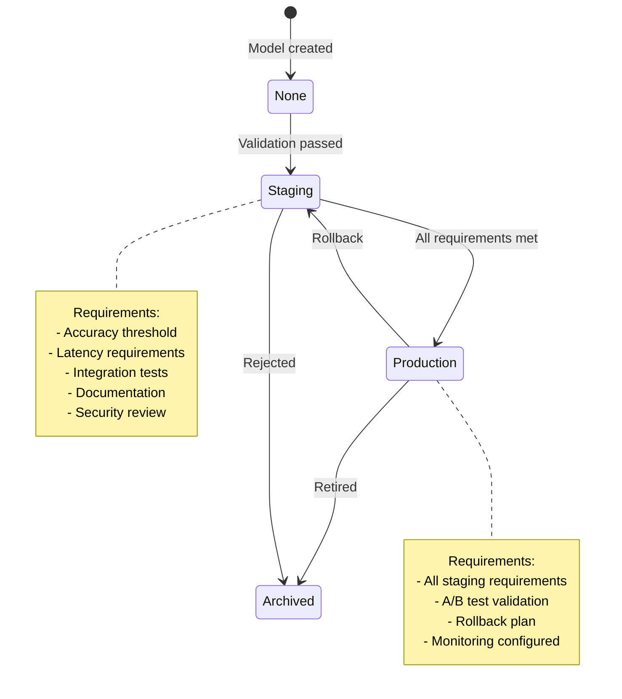
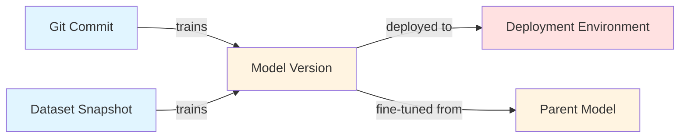
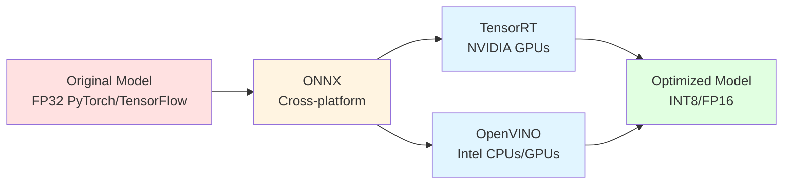
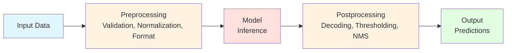
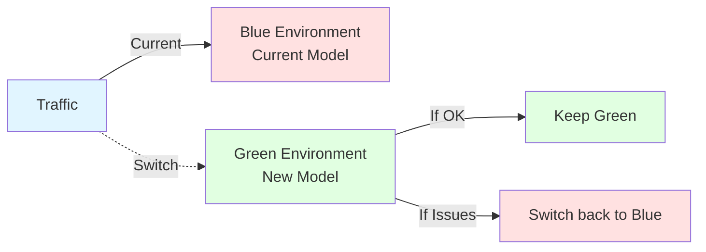
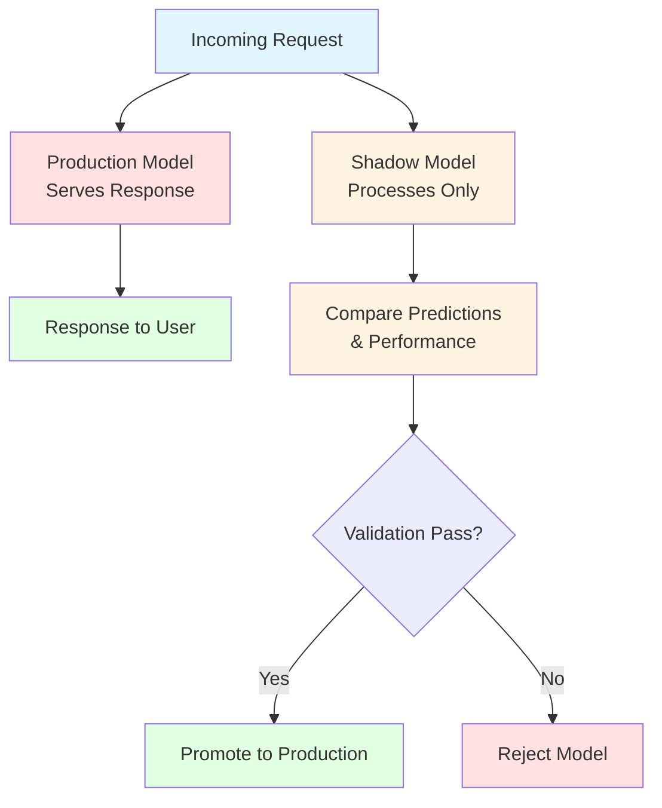
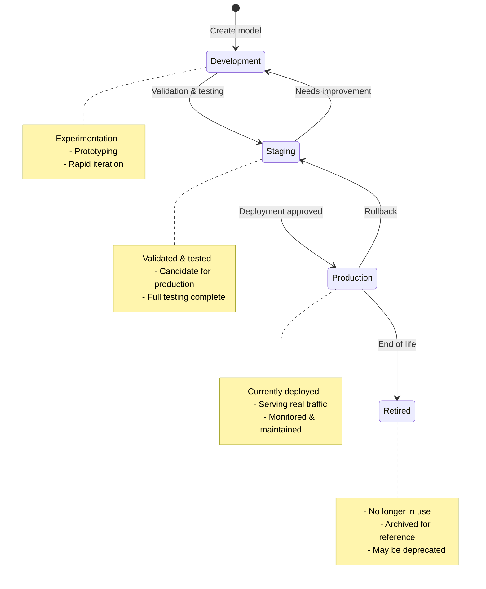

# MLOps Policy

**Status:** Authoritative
**Last updated:** 2026-01-18
**Purpose:** Comprehensive MLOps practices for experiment tracking, model lifecycle, serving, monitoring, and optimization

---

## Table of Contents

- [Acronyms](#acronyms)
- [Core Principles](#1-core-principles)
- [Experiment Tracking & MLOps Tools](#2-experiment-tracking--mlops-tools)
- [Model Versioning & Registry](#3-model-versioning--registry)
- [Model Serving & Inference](#4-model-serving--inference)
- [Model Monitoring & Observability](#5-model-monitoring--observability)
- [Hyperparameter Tuning](#6-hyperparameter-tuning)
- [Distributed Training](#7-distributed-training)
- [Model Optimization & Compression](#8-model-optimization--compression)
- [Model Deployment Patterns](#9-model-deployment-patterns)
- [Model Lifecycle Management](#10-model-lifecycle-management)
- [ML Reproducibility](#11-ml-reproducibility)
- [Cost Optimization & Resource Management](#12-cost-optimization--resource-management)
- [Quick Reference Cards](#quick-reference-cards)

---

## Acronyms

* **MLOps** — Machine Learning Operations
* **MLflow** — Open-source ML lifecycle platform
* **W&B** — Weights & Biases (experiment tracking)
* **DDP** — Distributed Data Parallel
* **ONNX** — Open Neural Network Exchange
* **TensorRT** — NVIDIA's inference optimization library
* **Triton** — NVIDIA Triton Inference Server
* **SHAP** — SHapley Additive exPlanations
* **LIME** — Local Interpretable Model-agnostic Explanations
* **Grad-CAM** — Gradient-weighted Class Activation Mapping
* **DVC** — Data Version Control
* **FP16** — 16-bit floating point
* **BF16** — BFloat16
* **INT8** — 8-bit integer quantization
* **CI/CD** — Continuous Integration/Continuous Deployment

---

## 1) Core Principles

1. **Reproducibility is non-negotiable.** Every experiment must be reproducible from code, data, and environment.
2. **Model lineage is mandatory.** Track code → data → model → deployment relationships.
3. **Monitoring before deployment.** No model goes to production without monitoring infrastructure.
4. **Systematic experimentation.** Use tools, not ad-hoc scripts, for experiment management.
5. **Cost awareness.** Track and optimize compute costs (training and inference).
6. **Safety first.** All model deployments must support rollback and have monitoring.

---

## 2) Experiment Tracking & MLOps Tools

### 2.1 Tool Selection Framework

**Decision matrix:**

| Tool | Best For | When to Use |
|------|----------|-------------|
| **MLflow** | Open-source, self-hosted, full lifecycle | When you need model registry + tracking + serving in one tool |
| **Weights & Biases** | Cloud-hosted, collaboration, visualization | When you need best-in-class visualization and team collaboration |
| **TensorBoard** | TensorFlow/PyTorch native, lightweight | When you only need training visualization, minimal setup |
| **Custom SQL** | Full control, existing infrastructure | When you have existing SQL infrastructure and need tight integration |

**Default choice:** **MLflow** for production (open-source, full lifecycle, model registry).

**Alternative:** **Weights & Biases** if cloud-hosted collaboration is priority.

### 2.2 Experiment Structure & Naming

**Naming convention:**
```
<project>-<task>-<model-type>-<experiment-id>
```

Examples:
- `object-detection-yolo-v8-exp-001`
- `classification-resnet50-hyperopt-042`
- `segmentation-deeplabv3-ablation-015`

**Experiment metadata (mandatory):**
- Experiment name (descriptive)
- Tags (task, model, dataset, author)
- Description (what you're testing)
- Git commit hash
- Dataset version/snapshot
- Environment (CUDA, Python, framework versions)

### 2.3 Logging Standards

**Metrics (log every epoch/step):**
- Training loss
- Validation loss
- Primary metric (accuracy, mAP, IoU, etc.)
- Secondary metrics (precision, recall, F1, etc.)
- Learning rate
- Epoch/step number

**Parameters (log once per experiment):**
- Hyperparameters (learning rate, batch size, optimizer, etc.)
- Model architecture (config dict or reference)
- Training configuration (epochs, early stopping, etc.)
- Data configuration (augmentation, preprocessing, etc.)

**Artifacts (log at experiment end):**
- Model checkpoint (best validation)
- Model config file
- Training curves (plots)
- Evaluation results (confusion matrix, PR curves, etc.)
- Sample predictions (visualizations for CV)

**Code (log automatically):**
- Git commit hash
- Git branch
- Uncommitted changes flag
- Code diff (if uncommitted)

### 2.4 Experiment Comparison & Selection

**Comparison workflow:**
1. Filter experiments by tags/metrics
2. Compare metrics side-by-side
3. Analyze tradeoffs (accuracy vs latency vs cost)
4. Select best candidate based on criteria
5. Document selection rationale

**Selection criteria (in order):**
1. **Primary metric** (accuracy, mAP, etc.) — must meet minimum threshold
2. **Inference latency** — must meet SLA requirements
3. **Model size** — must fit deployment constraints
4. **Training cost** — consider for frequent retraining
5. **Robustness** — performance on edge cases

### 2.5 CI/CD Integration

**Automated experiment runs:**
- Trigger experiments from CI on data updates
- Run experiments on schedule (nightly, weekly)
- Run experiments on model architecture changes
- Fail CI if experiments don't meet baseline metrics

**Example CI workflow:**
```yaml
# .github/workflows/ml-experiment.yml
name: ML Experiment
on:
  push:
    paths:
      - 'models/**'
      - 'data/**'
jobs:
  experiment:
    runs-on: [self-hosted, gpu]
    steps:
      - uses: actions/checkout@v3
      - name: Run experiment
        run: |
          python scripts/train.py --experiment-name "auto-$(git rev-parse --short HEAD)"
      - name: Check metrics
        run: |
          python scripts/check_metrics.py --baseline 0.85
```

### 2.6 Cost Tracking

**Track per experiment:**
- GPU hours (training time × GPU count)
- Compute cost (if using cloud)
- Storage cost (checkpoints, artifacts)
- Data transfer cost

**Cost optimization:**
- Use spot instances for hyperparameter tuning
- Early stopping to reduce training time
- Model compression to reduce inference cost
- Batch inference to amortize costs

---

## 3) Model Versioning & Registry

### 3.1 Model Versioning Scheme

**Semantic versioning for models:**
```
<major>.<minor>.<patch>
```

- **Major:** Breaking changes (architecture change, input/output format change)
- **Minor:** New features (improved accuracy, new capabilities)
- **Patch:** Bug fixes, minor improvements

**Examples:**
- `1.0.0` — Initial production model
- `1.1.0` — Improved accuracy (same architecture)
- `2.0.0` — Architecture change (ResNet50 → EfficientNet)

### 3.2 Model Registry Structure

**Registry stages:**
1. **None** — Experiment/model not registered
2. **Staging** — Candidate for production (validated, tested)
3. **Production** — Currently deployed
4. **Archived** — Retired, kept for reference

**Model metadata (mandatory):**
- Model version
- Model architecture (name, config)
- Training dataset (ID, version, snapshot)
- Training code (git commit, branch)
- Training hyperparameters
- Evaluation metrics (validation, test)
- Inference requirements (GPU, memory, latency)
- Model artifacts (checkpoint URI, ONNX URI, etc.)
- Author and date
- Notes (what changed, why)

### 3.3 Model Promotion Workflow

**Promotion path:** None → Staging → Production



**Staging requirements:**
- [ ] Meets minimum accuracy threshold
- [ ] Meets latency requirements
- [ ] Passes integration tests
- [ ] Documentation complete
- [ ] Security review passed (if applicable)

**Production requirements:**
- [ ] All staging requirements met
- [ ] A/B test or shadow mode validation (if replacing existing model)
- [ ] Rollback plan documented
- [ ] Monitoring configured
- [ ] Deployment automation tested

### 3.4 Model Lineage Tracking

**Track relationships:**
- **Code → Model:** Git commit → model version
- **Data → Model:** Dataset snapshot → model version
- **Model → Deployment:** Model version → deployment environment
- **Model → Model:** Parent model → fine-tuned model



**Lineage query examples:**
- "Which models were trained on dataset X?"
- "What code version produced model Y?"
- "Which deployments use model Z?"
- "What was the parent model of model W?"

### 3.5 Model Retirement & Deprecation

**Retirement criteria:**
- Model replaced by better version
- Model no longer meets accuracy requirements
- Model architecture deprecated
- Security vulnerability discovered

**Deprecation process:**
1. Mark model as deprecated in registry
2. Set deprecation date (30-90 days notice)
3. Notify all consumers
4. Provide migration guide to new model
5. Archive after deprecation period

---

## 4) Model Serving & Inference

### 4.1 Model Serving Architecture

**Architecture patterns:**

**Pattern 1: REST API (default for public APIs)**
- Simple HTTP/JSON interface
- Stateless, scalable
- Use for: Web apps, mobile apps, third-party integrations

**Pattern 2: gRPC (default for service-to-service)**
- Strong typing, high throughput
- Streaming support
- Use for: Internal services, high-throughput scenarios

**Pattern 3: Streaming (real-time)**
- WebSocket or gRPC streaming
- Low latency, continuous data
- Use for: Real-time video, live predictions

### 4.2 Model Server Selection

**Decision matrix:**

| Server | Best For | When to Use |
|--------|----------|-------------|
| **Triton** | Multi-framework, multi-model, high performance | Production inference, multiple models, GPU optimization |
| **TorchServe** | PyTorch models, simple deployment | PyTorch-only, quick deployment |
| **TensorFlow Serving** | TensorFlow models, production-grade | TensorFlow-only, Google ecosystem |
| **Custom FastAPI/Flask** | Full control, simple models | Small models, custom preprocessing, rapid prototyping |
| **ONNX Runtime** | Cross-platform, optimized | ONNX models, edge deployment |

**Default choice:** **Triton** for production (multi-framework, high performance, GPU optimization).

### 4.3 Model Optimization Formats

**Optimization pipeline:**



**ONNX (mandatory intermediate):**
- Export PyTorch/TensorFlow to ONNX
- Validate ONNX model
- Test ONNX inference matches original
- Use ONNX Runtime for CPU inference

**TensorRT (NVIDIA GPUs):**
- Convert ONNX to TensorRT
- Calibrate for INT8 quantization (if using)
- Benchmark latency/throughput
- Validate accuracy (should match ONNX)

**OpenVINO (Intel CPUs/GPUs):**
- Convert ONNX to OpenVINO IR
- Optimize for target hardware
- Benchmark and validate

### 4.4 Batch vs Real-Time Inference

**Batch inference (use when):**
- Latency requirements > 1 second
- Throughput is priority
- Cost optimization needed
- Processing large datasets

**Real-time inference (use when):**
- Latency requirements < 100ms
- User-facing applications
- Interactive systems
- Streaming data

**Hybrid approach:**
- Real-time for user requests
- Batch for background processing
- Queue system for load balancing

### 4.5 Inference Pipeline Patterns

**Standard pipeline:**



**Preprocessing:**
- Input validation (shape, type, range)
- Normalization/scaling
- Format conversion (RGB, BGR, etc.)
- Batching (for batch inference)

**Postprocessing:**
- Output decoding (class IDs, bounding boxes, etc.)
- Confidence thresholding
- Non-maximum suppression (for detection)
- Format conversion (JSON, protobuf, etc.)

**Error handling:**
- Invalid input → return error (don't crash)
- Model failure → fallback to previous model or default
- Timeout → return error or cached result

### 4.6 Edge Deployment Patterns

**Edge deployment options:**

**ONNX Runtime (cross-platform):**
- CPU inference on edge devices
- Mobile deployment (iOS, Android)
- Embedded systems

**TensorRT (NVIDIA edge devices):**
- Jetson devices
- Edge GPUs
- Optimized for NVIDIA hardware

**CoreML (Apple devices):**
- iOS/macOS deployment
- Neural Engine optimization
- Privacy (on-device inference)

**TensorFlow Lite (mobile/embedded):**
- Android deployment
- Microcontrollers
- Quantized models

### 4.7 Model Warmup & Cold Start

**Warmup strategy:**
- Load model on server startup
- Run dummy inference to initialize
- Pre-allocate GPU memory
- Keep model in memory (don't unload)

**Cold start mitigation:**
- Use model caching (keep in memory)
- Pre-warm instances (don't scale to zero)
- Use serverless with provisioned concurrency
- Batch requests during cold start

---

## 5) Model Monitoring & Observability

### 5.1 Data Drift Detection

**Statistical tests:**
- **KS test** (Kolmogorov-Smirnov) — distribution shifts
- **PSI** (Population Stability Index) — feature distribution changes
- **Chi-square test** — categorical feature changes
- **Mann-Whitney U test** — median shifts

**Monitoring frequency:**
- Real-time: Check every N requests (configurable)
- Batch: Daily/weekly analysis of inference data

**Alerting thresholds:**
- PSI > 0.25 → Warning
- PSI > 0.5 → Critical alert
- Distribution shift p-value < 0.05 → Alert

**Tools:**
- **Evidently AI** — open-source, Python-based
- **Fiddler** — enterprise, comprehensive
- **Arize** — cloud-hosted, ML-specific
- **Custom** — statistical tests in monitoring pipeline

### 5.2 Concept Drift Detection

**Detection methods:**
- **Performance degradation** — accuracy drops over time
- **Prediction distribution shifts** — output distribution changes
- **Error rate increases** — more failures over time

**Monitoring:**
- Track accuracy on labeled production data (if available)
- Monitor prediction confidence distributions
- Track error rates and failure modes
- Compare prediction distributions over time windows

**Alerting:**
- Accuracy drop > 5% → Warning
- Accuracy drop > 10% → Critical
- Error rate increase > 2x → Alert

### 5.3 Model Performance Monitoring

**Metrics to track:**
- **Latency:** p50, p95, p99 (milliseconds)
- **Throughput:** requests per second
- **Error rate:** percentage of failed requests
- **GPU utilization:** percentage (if GPU inference)
- **Memory usage:** peak and average
- **Accuracy:** if labeled data available

**Monitoring dashboards:**
- Real-time metrics (last hour)
- Historical trends (last 7 days, 30 days)
- Alerts and incidents
- Model version comparison

### 5.4 Prediction Monitoring

**Output distribution:**
- Track prediction confidence distributions
- Monitor for unexpected patterns (all high confidence, all low confidence)
- Detect anomalies in prediction values

**Anomaly detection:**
- Statistical outliers (Z-score > 3)
- Unusual prediction patterns
- Sudden changes in prediction distribution

### 5.5 Alerting & Escalation

**Alert levels:**
- **Info:** Normal operations, status updates
- **Warning:** Degradation detected, investigate
- **Critical:** Model failure, immediate action required

**Alert channels:**
- Slack/Teams for warnings
- PagerDuty/OnCall for critical alerts
- Email for daily summaries

**Escalation:**
- Warning → Investigate within 4 hours
- Critical → Immediate response, rollback if needed

### 5.6 A/B Testing Framework for Models

**A/B test setup:**
- Split traffic between model A and model B
- Track metrics for both models
- Statistical significance testing
- Gradual rollout (10% → 50% → 100%)

**Metrics to compare:**
- Primary metric (accuracy, mAP, etc.)
- Latency
- Error rate
- Business metrics (if applicable)

**Decision criteria:**
- New model must be better on primary metric (statistically significant)
- New model must not degrade latency significantly
- New model must not increase error rate

### 5.7 Shadow Mode Deployment

**Shadow mode pattern:**
- Deploy new model alongside production model
- New model processes requests but doesn't serve responses
- Compare predictions and performance
- Validate new model before promotion

**Use cases:**
- Validating new model architecture
- Testing model on real production data
- Comparing model performance without risk

---

## 6) Hyperparameter Tuning

### 6.1 Search Strategies

**Grid Search:**
- Exhaustive search over parameter grid
- Use for: Small search spaces (< 10 parameters)
- Pros: Guaranteed to find best in grid
- Cons: Expensive, doesn't scale

**Random Search:**
- Random sampling of parameter space
- Use for: Medium search spaces (10-50 parameters)
- Pros: Better than grid for high-dimensional spaces
- Cons: No learning from previous trials

**Bayesian Optimization:**
- Uses prior knowledge to guide search
- Use for: Expensive evaluations, limited budget
- Tools: Optuna, Scikit-optimize, Weights & Biases Sweeps
- Pros: Efficient, learns from trials
- Cons: More complex setup

**Evolutionary Algorithms:**
- Genetic algorithms, evolutionary strategies
- Use for: Very large search spaces, multi-objective
- Tools: DEAP, PyGAD
- Pros: Good for complex spaces
- Cons: Slow convergence

**Default choice:** **Bayesian Optimization (Optuna)** for most cases.

### 6.2 Tools & Frameworks

**Optuna (recommended):**
- Python-based, easy integration
- Supports pruning, multi-objective
- Good visualization
- Integrates with MLflow, W&B

**Ray Tune:**
- Distributed hyperparameter tuning
- Good for large-scale experiments
- Integrates with Ray ecosystem

**Weights & Biases Sweeps:**
- Cloud-hosted, great visualization
- Easy collaboration
- Good for teams

**Example Optuna integration:**
```python
import optuna

def objective(trial):
    lr = trial.suggest_float('lr', 1e-5, 1e-2, log=True)
    batch_size = trial.suggest_int('batch_size', 16, 128)
    # ... train model ...
    return validation_accuracy

study = optuna.create_study(direction='maximize')
study.optimize(objective, n_trials=100)
```

### 6.3 Early Stopping Policies

**Early stopping criteria:**
- No improvement for N epochs (patience)
- Validation metric plateau
- Overfitting detected (train/val gap increases)

**Implementation:**
- Use framework callbacks (PyTorch EarlyStopping, Keras callbacks)
- Log to experiment tracker
- Save best model checkpoint

### 6.4 Resource Allocation

**Budget allocation:**
- Total GPU hours available
- Trials per experiment
- Parallel trials (if multiple GPUs)
- Time limit per trial

**Optimization:**
- Use pruning to stop bad trials early
- Prioritize promising parameter regions
- Use distributed tuning for large budgets

### 6.5 Multi-Objective Optimization

**Objectives (common tradeoffs):**
- Accuracy vs Latency
- Accuracy vs Model Size
- Accuracy vs Training Cost

**Pareto frontier:**
- Find all non-dominated solutions
- Visualize tradeoffs
- Select based on deployment constraints

**Tools:**
- Optuna (multi-objective support)
- NSGA-II (evolutionary algorithm)
- Custom Pareto analysis

### 6.6 Hyperparameter Importance Analysis

**Analyze which hyperparameters matter:**
- Use Optuna's importance analysis
- Plot hyperparameter vs metric relationships
- Identify critical vs non-critical parameters

**Use for:**
- Focusing search on important parameters
- Reducing search space
- Understanding model sensitivity

---

## 7) Distributed Training

### 7.1 Multi-GPU Training

**DataParallel (single node, multiple GPUs):**
- Simple, built into PyTorch
- Use for: Single machine, 2-8 GPUs
- Limitations: GIL bottleneck, not optimal

**DistributedDataParallel (DDP) (recommended):**
- True parallelism, no GIL bottleneck
- Use for: Single or multi-node, 2+ GPUs
- Better performance than DataParallel

**PyTorch DDP example:**
```python
import torch.distributed as dist
from torch.nn.parallel import DistributedDataParallel as DDP

# Initialize process group
dist.init_process_group(backend='nccl')

# Wrap model
model = DDP(model, device_ids=[local_rank])

# Training loop (same as single GPU)
# DDP handles gradient synchronization automatically
```

### 7.2 Multi-Node Training

**Setup:**
- Multiple machines, each with GPUs
- Network communication (InfiniBand preferred)
- Process group initialization across nodes

**Frameworks:**
- **PyTorch DDP** — built-in, good for most cases
- **Horovod** — Uber's framework, good for TensorFlow/PyTorch
- **DeepSpeed** — Microsoft's framework, good for very large models

### 7.3 Gradient Synchronization

**All-reduce operation:**
- Each GPU computes gradients
- Gradients are averaged across all GPUs
- Averaged gradients applied to all models

**Communication backends:**
- **NCCL** — NVIDIA, best for GPUs
- **GLOO** — CPU, fallback option
- **MPI** — HPC environments

### 7.4 Fault Tolerance & Checkpointing

**Checkpointing strategy:**
- Save checkpoint every N steps/epochs
- Save on all ranks (or rank 0 only)
- Include optimizer state, random seeds, epoch number

**Fault recovery:**
- Resume from last checkpoint
- Restore process group
- Continue training from checkpoint

**Example:**
```python
# Save checkpoint
checkpoint = {
    'model': model.state_dict(),
    'optimizer': optimizer.state_dict(),
    'epoch': epoch,
    'rng_state': torch.get_rng_state(),
}
torch.save(checkpoint, f'checkpoint_epoch_{epoch}.pt')

# Load checkpoint
checkpoint = torch.load('checkpoint_epoch_10.pt')
model.load_state_dict(checkpoint['model'])
optimizer.load_state_dict(checkpoint['optimizer'])
epoch = checkpoint['epoch']
torch.set_rng_state(checkpoint['rng_state'])
```

### 7.5 Resource Allocation & Scheduling

**SLURM (HPC clusters):**
- Job scheduling for training jobs
- GPU allocation and queuing
- Multi-node job management

**Kubernetes (cloud):**
- Job scheduling for distributed training
- GPU node selection
- Auto-scaling (if needed)

**Resource requirements:**
- Number of GPUs
- GPU memory requirements
- Network bandwidth (for multi-node)
- Storage (for checkpoints)

### 7.6 Mixed Precision Training

**FP16 (half precision):**
- 2x memory savings
- 2x speedup (on modern GPUs)
- Use with automatic mixed precision (AMP)

**BF16 (bfloat16):**
- Better numerical stability than FP16
- Use for: Large models, training stability critical

**PyTorch AMP example:**
```python
from torch.cuda.amp import autocast, GradScaler

scaler = GradScaler()

for batch in dataloader:
    with autocast():
        output = model(batch)
        loss = criterion(output, target)

    scaler.scale(loss).backward()
    scaler.step(optimizer)
    scaler.update()
```

---

## 8) Model Optimization & Compression

### 8.1 Quantization Strategies

**INT8 Quantization:**
- 4x model size reduction
- 2-4x inference speedup
- Accuracy loss: typically < 1%

**Quantization types:**
- **Static quantization:** Calibrate on representative dataset, then quantize
- **Dynamic quantization:** Quantize on-the-fly (less accurate)
- **QAT (Quantization-Aware Training):** Train with quantization simulation

**Workflow:**
1. Train FP32 model
2. Calibrate on validation set (for static)
3. Quantize to INT8
4. Validate accuracy
5. Deploy if accuracy acceptable

**Tools:**
- PyTorch quantization (built-in)
- TensorRT (NVIDIA GPUs)
- ONNX Runtime quantization

### 8.2 Pruning Techniques

**Structured Pruning:**
- Remove entire channels/filters
- Hardware-friendly
- Use for: Significant size reduction

**Unstructured Pruning:**
- Remove individual weights
- Better compression ratio
- Use for: Maximum compression (requires sparse hardware)

**Magnitude-based Pruning:**
- Remove smallest weights
- Simple, effective
- Use for: General-purpose pruning

**Pruning workflow:**
1. Train model
2. Prune (remove N% of weights)
3. Fine-tune pruned model
4. Repeat until target sparsity

### 8.3 Knowledge Distillation

**Teacher-student pattern:**
- Large teacher model → Small student model
- Student learns from teacher's predictions
- Use for: Model compression with minimal accuracy loss

**Workflow:**
1. Train large teacher model
2. Train small student model with teacher's soft labels
3. Validate student matches teacher performance
4. Deploy student model

### 8.4 Model Compression Tools

**TensorRT (NVIDIA GPUs):**
- INT8 quantization
- Layer fusion
- Kernel auto-tuning
- Best for: NVIDIA GPU deployment

**ONNX Runtime:**
- Cross-platform optimization
- Quantization support
- Graph optimizations
- Best for: CPU inference, cross-platform

**OpenVINO (Intel):**
- Intel hardware optimization
- Quantization
- Best for: Intel CPUs/GPUs

### 8.5 Accuracy vs Speed Tradeoff

**Optimization workflow:**
1. Establish baseline (FP32 model, accuracy, latency)
2. Apply optimization (quantization, pruning, etc.)
3. Measure accuracy and latency
4. If accuracy loss acceptable → deploy
5. If not → try different optimization or accept tradeoff

**Decision criteria:**
- Accuracy loss < 1% → Accept
- Accuracy loss 1-3% → Evaluate use case
- Accuracy loss > 3% → Reject or retrain

---

## 9) Model Deployment Patterns

### 9.1 Canary Deployment

**Pattern:**
- Deploy new model to small percentage of traffic (5-10%)
- Monitor metrics
- Gradually increase if metrics good
- Rollback if metrics degrade

**Use for:**
- Low-risk model updates
- Validating new models on real traffic

### 9.2 Blue-Green Deployment

**Pattern:**



- Two identical production environments
- Deploy new model to "green" environment
- Switch traffic from "blue" to "green"
- Keep "blue" as rollback option

**Use for:**
- Zero-downtime deployments
- Fast rollback capability

### 9.3 Shadow Mode Deployment

**Pattern:**



- Deploy new model alongside production
- New model processes requests but doesn't serve
- Compare predictions and performance
- Promote if validation passes

**Use for:**
- High-risk model changes
- Validating on real production data

### 9.4 Gradual Rollout

**Pattern:**
- Deploy to 10% → 25% → 50% → 100%
- Monitor at each stage
- Pause or rollback if issues detected

**Use for:**
- Conservative deployments
- Large model changes

### 9.5 Rollback Procedures

**Rollback triggers:**
- Accuracy degradation > 5%
- Latency increase > 50%
- Error rate increase > 2x
- Critical bugs discovered

**Rollback process:**
1. Immediately switch to previous model version
2. Investigate root cause
3. Fix issues
4. Re-deploy after validation

**Automation:**
- Automatic rollback on critical alerts
- Manual rollback for warnings
- Rollback testing in staging

### 9.6 Model Deployment Automation (CI/CD)

**CI/CD pipeline:**
1. **Build:** Package model artifacts
2. **Test:** Run integration tests
3. **Validate:** Check metrics meet thresholds
4. **Deploy:** Deploy to staging
5. **Validate staging:** Run smoke tests
6. **Deploy production:** Gradual rollout
7. **Monitor:** Track metrics, alert on issues

**Example GitHub Actions:**
```yaml
name: Deploy Model
on:
  push:
    tags:
      - 'model-v*'
jobs:
  deploy:
    runs-on: ubuntu-latest
    steps:
      - uses: actions/checkout@v3
      - name: Validate model
        run: python scripts/validate_model.py
      - name: Deploy to staging
        run: python scripts/deploy.py --env staging
      - name: Run smoke tests
        run: python scripts/smoke_tests.py
      - name: Deploy to production
        run: python scripts/deploy.py --env production --rollout 10
```

### 9.7 Multi-Region Deployment

**Pattern:**
- Deploy model to multiple regions
- Route traffic based on latency/availability
- Sync model versions across regions
- Handle regional data differences

**Use for:**
- Global applications
- Latency requirements
- High availability

---

## 10) Model Lifecycle Management

### 10.1 Lifecycle Stages



**Development:**
- Experimentation and prototyping
- Not production-ready
- Rapid iteration

**Staging:**
- Validated and tested
- Candidate for production
- Full testing and validation

**Production:**
- Currently deployed
- Serving real traffic
- Monitored and maintained

**Retired:**
- No longer in use
- Archived for reference
- May be deprecated

### 10.2 Model Retirement Criteria

**Retire when:**
- Replaced by better model
- No longer meets accuracy requirements
- Architecture deprecated
- Security vulnerability discovered
- Business requirements changed

### 10.3 Model Refresh Policies

**When to retrain:**
- **Scheduled:** Monthly, quarterly (based on data refresh)
- **Triggered:** Data drift detected, performance degradation
- **On-demand:** New data available, architecture improvements

**Retraining workflow:**
1. Collect new data
2. Validate data quality
3. Retrain model
4. Compare with current production model
5. Deploy if better, keep current if not

### 10.4 Model Deprecation & Migration

**Deprecation process:**
1. Mark model as deprecated in registry
2. Set deprecation date (30-90 days)
3. Notify all consumers
4. Provide migration guide
5. Support during migration period
6. Archive after deprecation

**Migration support:**
- API compatibility layer (if possible)
- Migration scripts and tools
- Documentation and examples
- Support during transition

### 10.5 Model Documentation Standards

**Required documentation:**
- Model architecture and design
- Training procedure and hyperparameters
- Evaluation results and metrics
- Deployment requirements (GPU, memory, etc.)
- API documentation (inputs, outputs)
- Known limitations and edge cases
- Performance characteristics (latency, throughput)

---

## 11) ML Reproducibility

### 11.1 Reproducibility Checklist

**Code:**
- [ ] Git commit hash logged
- [ ] All code in version control
- [ ] No uncommitted changes in production runs

**Data:**
- [ ] Dataset version/snapshot ID logged
- [ ] Data preprocessing steps documented
- [ ] Data splits (train/val/test) fixed and logged

**Environment:**
- [ ] Python version pinned
- [ ] CUDA/cuDNN versions pinned
- [ ] All dependencies pinned (lockfile)
- [ ] System libraries documented (if relevant)

**Randomness:**
- [ ] Random seeds set and logged
- [ ] NumPy, PyTorch, Python random seeds
- [ ] CUDA deterministic mode (if needed)

**Hardware:**
- [ ] GPU model and driver version logged
- [ ] CPU model logged (if relevant)
- [ ] Memory configuration logged

### 11.2 Deterministic Training

**PyTorch deterministic mode:**
```python
import torch
torch.manual_seed(42)
torch.cuda.manual_seed_all(42)
torch.backends.cudnn.deterministic = True
torch.backends.cudnn.benchmark = False
```

**NumPy/Python random:**
```python
import numpy as np
import random

np.random.seed(42)
random.seed(42)
```

**Note:** Deterministic mode may reduce performance. Use only when reproducibility is critical.

### 11.3 Environment Pinning

**Python:**
- Pin Python version in `pyproject.toml` or `.python-version`
- Use pyenv or conda for version management

**CUDA/cuDNN:**
- Document CUDA version in README
- Pin cuDNN version
- Use Docker for consistent environments

**Dependencies:**
- Use lockfiles (poetry.lock, requirements.lock)
- Pin all dependencies (no floating versions)
- Document system dependencies

### 11.4 Reproducibility Validation

**Test reproducibility:**
- Run same experiment twice
- Compare results (should be identical or very close)
- Validate checkpoints match
- Validate metrics match

**Reproducibility tools:**
- **DVC** — Data version control, experiment tracking
- **MLflow** — Experiment tracking, reproducibility
- **Weights & Biases** — Experiment tracking, reproducibility

### 11.5 Reproducibility Workflow

**Before training:**
1. Set all random seeds
2. Log environment (Python, CUDA, dependencies)
3. Log data version
4. Log code commit

**During training:**
1. Log hyperparameters
2. Log training progress
3. Save checkpoints at fixed intervals

**After training:**
1. Log final metrics
2. Save model artifacts
3. Document any deviations from standard process

---

## 12) Cost Optimization & Resource Management

### 12.1 GPU Resource Allocation

**Training:**
- Use spot instances for long-running jobs
- Right-size GPU instances (don't over-provision)
- Use multi-GPU efficiently (avoid idle GPUs)
- Schedule training during off-peak hours (if possible)

**Inference:**
- Use smaller GPU instances for inference
- Batch requests to maximize GPU utilization
- Use CPU inference for small models
- Consider edge deployment for low-latency requirements

### 12.2 Inference Cost Optimization

**Batch size optimization:**
- Larger batches = better GPU utilization
- Balance latency vs throughput
- Dynamic batching (wait for N requests or timeout)

**Model optimization:**
- Quantization reduces compute cost
- Pruning reduces memory and compute
- Smaller models = lower serving costs

**Caching:**
- Cache predictions for repeated inputs
- Use CDN for static model artifacts
- Cache preprocessing results

### 12.3 Training Cost Tracking

**Track per experiment:**
- GPU hours (training time × GPU count)
- Compute cost (if cloud)
- Storage cost (checkpoints, datasets)
- Data transfer cost

**Optimization:**
- Early stopping to reduce training time
- Efficient hyperparameter search (pruning)
- Use spot instances for hyperparameter tuning
- Right-size training instances

### 12.4 Cloud Cost Management

**Spot instances:**
- Use for training jobs (can tolerate interruptions)
- 50-90% cost savings
- Implement checkpointing for fault tolerance

**Reserved capacity:**
- Use for production inference (predictable load)
- 30-70% cost savings
- Commit to 1-3 year terms

**Auto-scaling:**
- Scale down during low traffic
- Scale up during peak traffic
- Use predictive scaling if possible

### 12.5 Cost vs Performance Tradeoff

**Decision framework:**
- **Accuracy:** Must meet minimum threshold
- **Latency:** Must meet SLA requirements
- **Cost:** Optimize within constraints
- **Model size:** Must fit deployment constraints

**Optimization order:**
1. Meet accuracy requirements
2. Meet latency requirements
3. Optimize cost (model optimization, resource allocation)
4. Optimize model size (if needed)

---

## Quick Reference Cards

### QRC-ML-1: MLflow Experiment Tracking

```python
import mlflow
import mlflow.pytorch

# Start experiment
mlflow.set_experiment("object-detection-yolo")

with mlflow.start_run():
    # Log parameters
    mlflow.log_param("learning_rate", 0.001)
    mlflow.log_param("batch_size", 32)

    # Log metrics
    mlflow.log_metric("train_loss", 0.5)
    mlflow.log_metric("val_mAP", 0.85)

    # Log model
    mlflow.pytorch.log_model(model, "model")

    # Log artifacts
    mlflow.log_artifact("confusion_matrix.png")
```

### QRC-ML-2: Model Serving with Triton

```python
# config.pbtxt
name: "yolo_model"
platform: "onnxruntime_onnx"
max_batch_size: 8
input [
  {
    name: "input"
    data_type: TYPE_FP32
    dims: [ 3, 640, 640 ]
  }
]
output [
  {
    name: "output"
    data_type: TYPE_FP32
    dims: [ 8400, 85 ]
  }
]
```

### QRC-ML-3: Hyperparameter Tuning with Optuna

```python
import optuna

def objective(trial):
    lr = trial.suggest_float('lr', 1e-5, 1e-2, log=True)
    batch_size = trial.suggest_int('batch_size', 16, 128)
    epochs = trial.suggest_int('epochs', 10, 50)

    # Train model
    model = train_model(lr, batch_size, epochs)

    # Evaluate
    accuracy = evaluate(model)

    return accuracy

study = optuna.create_study(direction='maximize')
study.optimize(objective, n_trials=100)
print(f"Best params: {study.best_params}")
```

### QRC-ML-4: Distributed Training (PyTorch DDP)

```python
import torch
import torch.distributed as dist
from torch.nn.parallel import DistributedDataParallel as DDP

def main():
    # Initialize process group
    dist.init_process_group(backend='nccl')
    rank = dist.get_rank()
    local_rank = rank % torch.cuda.device_count()

    # Setup
    torch.cuda.set_device(local_rank)
    model = Model().to(local_rank)
    model = DDP(model, device_ids=[local_rank])

    # Training loop
    for epoch in range(epochs):
        train_one_epoch(model, dataloader, optimizer)
        if rank == 0:  # Only rank 0 saves
            save_checkpoint(model, epoch)

    dist.destroy_process_group()
```

### QRC-ML-5: Model Quantization (PyTorch)

```python
import torch
from torch.quantization import quantize_dynamic

# Dynamic quantization (easiest)
model_quantized = quantize_dynamic(
    model,
    {torch.nn.Linear},
    dtype=torch.qint8
)

# Static quantization (more accurate)
from torch.quantization import QuantStub, DeQuantStub

# Add quantization stubs to model
# Calibrate on representative dataset
# Quantize
model_quantized = torch.quantization.quantize(
    model,
    calibration_data,
    torch.quantization.get_default_qconfig('fbgemm')
)
```

---

## References

* [Production Policy](policies/production-policy.md) — Data storage, SQL, Python, Docker, K8s
* [Security Policy](policies/security-policy.md) — ML/CV security best practices
* [Versioning and Documenting Policy](policies/versioning-and-documenting-policy.md) — Git, versioning, documentation

---

## Implementation Checklist

### Before first ML project
- [ ] Choose experiment tracking tool (MLflow recommended)
- [ ] Set up model registry
- [ ] Configure model serving infrastructure
- [ ] Set up monitoring (data drift, performance)
- [ ] Document reproducibility checklist

### Before production deployment
- [ ] Model versioned and registered
- [ ] Model optimized (quantization, pruning if needed)
- [ ] Monitoring configured (data drift, performance, alerts)
- [ ] Deployment automation tested
- [ ] Rollback procedure documented and tested
- [ ] Documentation complete

### Ongoing
- [ ] Monitor model performance daily
- [ ] Review experiment results weekly
- [ ] Retrain models on schedule or triggers
- [ ] Optimize costs monthly
- [ ] Update documentation with learnings
