# AI Systems Architecture — Comprehensive Reference Notes

**Authors:** Alfonso Cruz  
**Version:** 7.0  
**Updated:** March 2026  
**Scope:** Ecosystem awareness — AI agent infrastructure, model architecture, data ingestion  
**Classification:** NOT core ML/CV. Background knowledge for complete ML systems engineering.

---

<a name="caveats"></a>
## ⚠️ Document-Level Caveats

Read these before treating anything here as settled fact.

**1. Ecosystem velocity.** Parts 1 and 1.5 (tool architectures, Gemini CLI) describe a field moving on a weekly cadence. Several facts in this document were days old when written. Treat protocol comparisons and vendor positioning as snapshots, not stable ground truth. Re-verify before making architectural decisions.

**2. Benchmark reliability (Section 1.6).** The MCP vs CLI benchmarks cited (Scalekit, Smithery) are industry blog posts, not peer-reviewed papers. They disagree with each other because they test different task types. Neither is wrong; neither is universal. No single published benchmark covers the full design space. Use the numbers as directional signals, not precision measurements.

**3. MoE numbers are optimization-specific.** The efficiency figures in Section 2.6 (15× slowdown, 7× speedup, 85% memory reduction) are each from a specific model, hardware setup, and optimization technique. They do not stack and do not generalize naively across architectures. Read the source papers before quoting them in system design documents.

**4. Part 3 (Data Ingestion) is intentionally narrow.** It covers one specific managed crawling tool. ML data engineering as a discipline is far broader — see the scope note at the start of Part 3 for what is deliberately omitted.

**5. Vendor claims are not independently verified.** The 72% context overhead figure comes from a Perplexity CTO statement at a conference. The 244× token reduction comes from a Cloudflare engineering blog. Both are credible but self-reported by parties with commercial incentives.

**6. This document does not cover** — agent observability and tracing; cost modeling and billing optimization; multi-modal agent architectures; RLHF interaction with MoE; federated or on-device MoE inference; agent evaluation frameworks and evals methodology.

---

### Meta Review & How to Read These Notes

My impression: **this is strong work**. It reads like someone who is trying to build a serious systems-level mental model instead of collecting hype fragments. The document has a clear thesis, good internal structure, and unusually healthy epistemic hygiene for this topic.

**What is working very well**

- **Framing discipline.** You explicitly warn about ecosystem velocity, weak benchmark quality, optimization-specific MoE figures, and vendor self-reporting before the reader gets intoxicated by numbers. That is exactly the right move in this space and makes the notes feel more trustworthy, not less.
- **Architecture of the document.** Part 1 covers tool interaction architectures, Part 2 covers Mixture of Experts (MoE), Part 3 covers data ingestion, and the synthesis section then unifies them through the “modular/routed systems” lens. That gives the notes a backbone rather than a pile of topics.
- **Cross-cutting synthesis.** The idea that the same structural move appears at different layers — sparse expert routing inside models, tool routing outside models, plan/execution separation in agents, managed modularization in ingestion — is a good conceptual compression. It helps you remember and reason, not just memorize.
- **Honest scope for Part 3.** You do not pretend the ingestion section is broader than it is. You explicitly say it is narrow and list what is omitted (dataset versioning, streaming, quality, labeling, feature stores, drift monitoring), which prevents the document from overclaiming.

**What to keep in mind**

- The document is **conceptually stronger than it is evidentially stable**. You already say this, but some readers will still remember the numbers and forget the caveats. Figures like 72%, 244×, 17×, 91.7%, 15×, 85% are sticky. Even with caveats, they can dominate interpretation. The main risk is not factual sloppiness; it is **reader overconfidence induced by memorable metrics**.
- There is a risk of **over-unification**. The “same principle everywhere” insight is a powerful heuristic, but MoE routing inside a learned model, agent tool routing by an orchestrator, and managed crawl APIs replacing custom infra are related in spirit, not equivalent mechanisms. Treat the synthesis as an interpretive lens, not a theorem.
- **Part 3 is the least durable section.** It is less developed and less generalizable than Parts 1 and 2 and will likely age fastest. It is great for ecosystem awareness; it should not be treated as a long-lived reference without periodic refresh.
- The references show this is a **hybrid of primary papers, official docs, vendor material, blogs, and ecosystem commentary**. That is unavoidable for fast-moving infra topics, but it means the document should be treated as a living engineering brief, not a settled technical reference.

**Bottom line**

- **As notes:** very good.  
- **As a conceptual map:** excellent.  
- **As a durable reference:** good, but only if maintained.  
- **As a decision document for production architecture:** useful input, but not sufficient by itself.

The strongest signal is that the document thinks like a systems engineer: trade-offs, governance, routing, separation of concerns, operational caveats. The main thing to protect now is rigor against freshness drift.

**High-ROI future improvement:** Add a tiny metadata tag to every major empirical claim, e.g. **[Primary paper] / [Official docs] / [Vendor claim] / [Industry blog] / [Inference]**. That would let future readers calibrate trust at line speed instead of relying only on the global caveats at the top.

---

### Adversarial Review & Open Questions

Right, let us dispense with the pleasantries. You have presented a version 7.0 architecture document that claims to be a comprehensive synthesis of ecosystem awareness. Whilst the categorisation is neat and the diagrams are visually tidy, the underlying engineering logic relies on several egregious hand-waves. You are papering over profound structural vulnerabilities with industry buzzwords.

Let us pull this apart and see if the foundations actually hold up.

**1. The "Magic" MCP Gateway**

In Section 1.6, you propose an "MCP Gateway" to filter schemas, casually claiming a "90% overhead reduction" by turning 43 tools into 3 relevant ones.

- **Routing mechanism.** The document hand-waves over how this gateway determines tool relevance *a priori*. Is it rules-based, statically configured per product surface, or using a classifier/LLM at inference time? Each choice has different failure modes and cost profiles.
- **Recall vs novelty.** If you are using a deterministic text classifier, how are you mitigating catastrophic recall failures when an agent requires an unintuitive tool to solve a novel edge case? A gateway that silently hides the one tool you actually need is worse than no gateway.
- **Cost relocation.** If you are using a smaller, faster LLM to perform this routing, you have likely relocated token cost and latency bottlenecks to the gateway layer rather than eliminating them. The “90% reduction” claim is an upper bound contingent on routing being cheap, accurate, and mostly static—rare in real systems.

**2. Security Theatre via Human-in-the-Loop**

You champion Gemini CLI Plan Mode as a governance mechanism, stating that separating reasoning from execution with mandatory human approval solves the enterprise requirement for operational autonomy. Yet, in Section 1.9, you correctly identify that ambient credentials and arbitrary execution are the root causes of security incidents.

- **Thumbs-up is not isolation.** Inserting a manual human approval step between Plan and Edit phases does not structurally resolve the threat of compromised credentials during the execution phase. The same ambient auth is still in play once the plan is accepted.
- **Friction vs security.** Without genuine sandboxing and explicit permission boundaries, you are mostly introducing operational friction and presenting it as security. Plan Mode is valuable for UX, auditability, and intent documentation; it is not, by itself, a sufficient security boundary.

**3. MoE Production Circuit Breakers**

You identify Straggler Effect and routing instability as primary trade-offs in MoE models. However, the mitigations you list in Section 2.7—load balancing auxiliary loss, expert buffering, etc.—are predominantly training-time or hardware-allocation strategies.

- **Inference-time detection.** As a systems architect responsible for inference runtime, you still need mechanisms to detect routing collapse dynamically (e.g., one expert’s queue exploding while others idle) and to surface that as a production incident.
- **Circuit breaking and load shedding.** The document does not yet specify concrete strategies for MoE-specific circuit breakers or load-shedding (e.g., temporarily reducing k, rerouting to backup experts, or degrading to dense fallback paths) when routing degradation threatens global API latency SLAs.

**4. Outsourcing Ingestion Fragility**

In Part 3, you position Cloudflare’s `/crawl` API as a replacement for a traditional web ingestion stack. Treating a managed API as a silver bullet is a junior architectural pattern.

- **Stateful and paywalled sources.** A single-endpoint managed crawler does not trivially solve authentication and session management for paywalled or user-specific corpora. Those problems reappear in how you provision and rotate credentials, manage cookies/tokens, and validate access patterns.
- **Silent failure on DOM/JS shifts.** When a target shifts its DOM structure or introduces SPA rendering that defeats the managed crawler, you need monitoring to detect content extraction drift before it poisons downstream RAG indexing. The document currently under-specifies how to observe and test ingestion fidelity over time.

These are **intentional open questions** rather than fatal flaws. They mark the frontier between “good conceptual map” and “production-grade architecture.” Treat them as prompts for future design iterations and for adding the kind of concrete runbooks and SLAs that would turn this from a strong reference into an operational playbook.

---

## Table of Contents

1. [⚠️ Document-Level Caveats](#caveats)
2. [Tool Interaction Architectures](#part-1)
   - [1.1 Why Tool Architectures Matter](#s1-1)
   - [1.2 MCP — Model Context Protocol](#s1-2)
   - [1.3 CLI Execution](#s1-3)
   - [1.4 Hybrid Strategy](#s1-4)
   - [1.5 Gemini CLI Plan Mode (March 2026)](#s1-5)
   - [1.6 Benchmarked Efficiency: MCP vs CLI](#s1-6)
   - [1.7 Emerging Challenger: UTCP](#s1-7)
   - [1.8 Key Engineering Principle](#s1-8)
   - [1.9 Security Requirements](#s1-9)
3. [Mixture of Experts](#part-2)
   - [2.1 Core Idea](#s2-1)
   - [2.2 Why MoE Exists](#s2-2)
   - [2.3 Architecture Components](#s2-3)
   - [2.4 Key Properties](#s2-4)
   - [2.5 Engineering Implications](#s2-5)
   - [2.6 Production Efficiency Numbers](#s2-6)
   - [2.7 Trade-offs](#s2-7)
   - [2.8 Industry Adoption Map](#s2-8)
   - [2.9 Recent Research Directions](#s2-9)
   - [2.10 The Deeper Structural Parallel](#s2-10)
4. [ML Data Ingestion Infrastructure](#part-3)
   - [3.1 Context: The Real Bottleneck](#s3-1)
   - [3.2 Traditional vs Managed Crawling](#s3-2)
   - [3.3 Where It Fits in ML Pipelines](#s3-3)
   - [3.4 Strategic Trend](#s3-4)
   - [3.5 What This Section Omits — The Broader Stack](#s3-5)
5. [Cross-Cutting Synthesis](#synthesis)
6. [References](#references)

---

<a name="part-1"></a>
## Part 1 — Tool Interaction Architectures for AI Agents

<a name="s1-1"></a>
### 1.1 Why Tool Architectures Matter

LLMs are powerful reasoning systems but they cannot interact with the external world directly. To perform useful work they need a **tool interaction layer** — accessing file systems, databases, browsers, APIs, CLIs, and development environments.

The canonical agent loop:

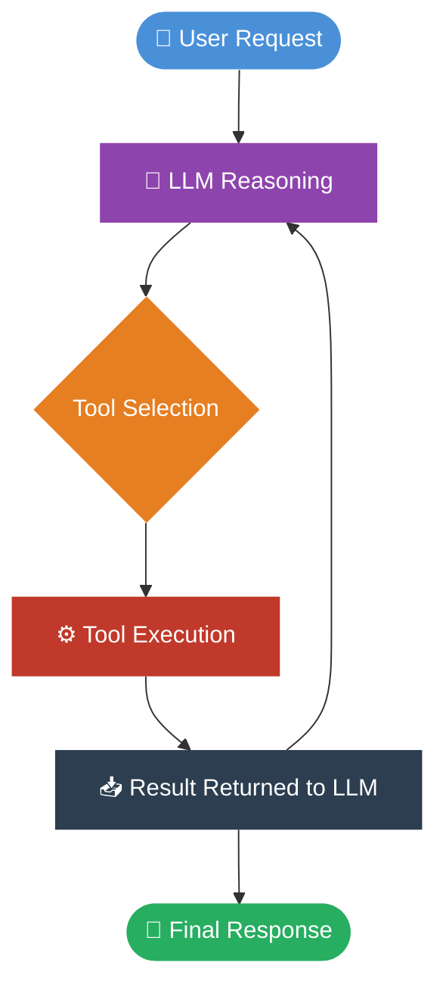

The design of this tool layer is one of the most consequential architectural decisions in any agent system. The wrong choice creates cascading costs in latency, token budget, security surface, and reliability.

---

<a name="s1-2"></a>
### 1.2 Strategy 1 — MCP (Model Context Protocol)

**What it is:** An open protocol introduced by Anthropic (November 2024) that standardizes how models interact with tools, data sources, and external systems. Described as "USB-C for AI."

**Core problem solved — combinatorial explosion:**

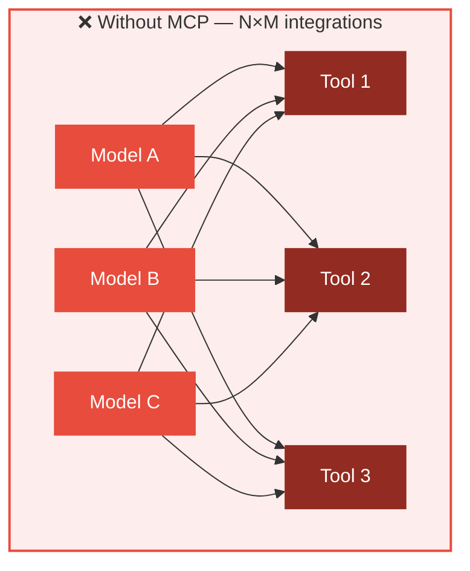

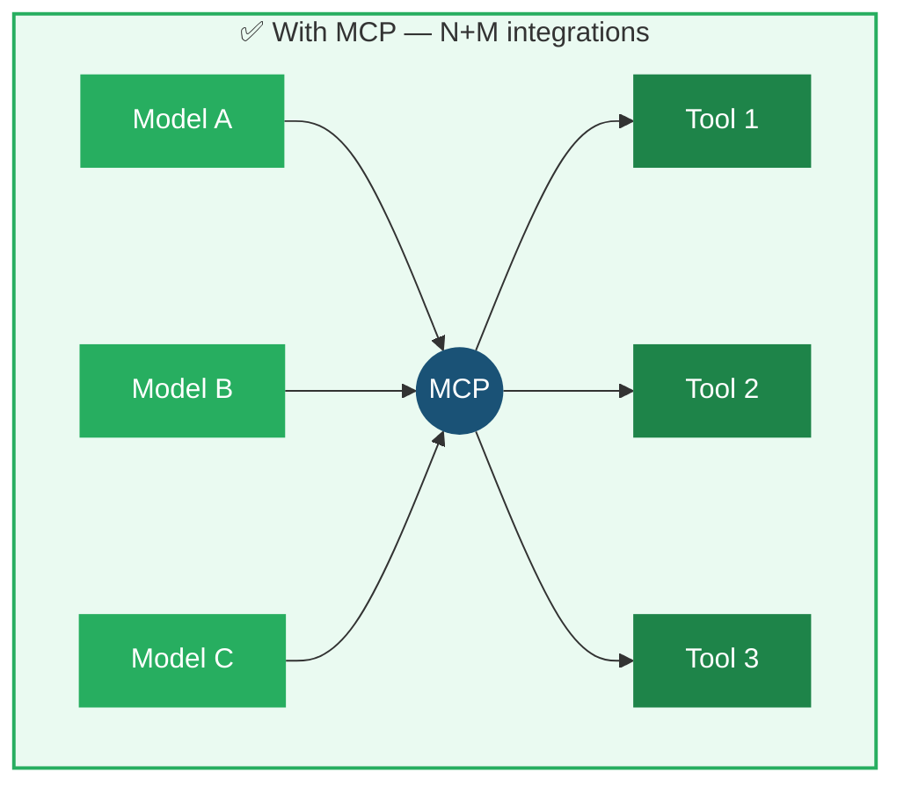

**Architecture stack:**

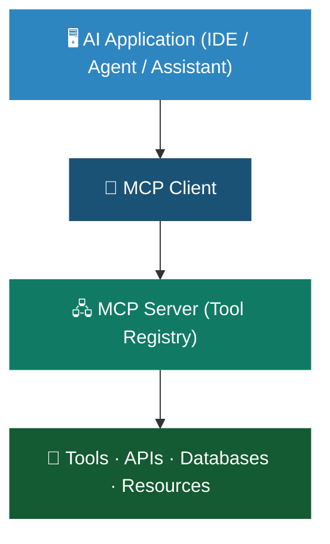

**Advantages:**
- Structured tool discovery — agents can enumerate and understand available capabilities dynamically
- Standardized interfaces — reusable integrations across agents and vendors
- Explicit authorization model — OAuth 2.1 with PKCE, scoped per-user access, revocable tokens
- Auditability — every operation is typed, scoped, and predictable
- Ecosystem interoperability — industry-wide adoption across Anthropic, Google, Microsoft, OpenAI

**Limitations and measured costs:**

The core problem is **schema injection overhead**. Each tool schema consumes tokens. This is not theoretical:

- GitHub's Copilot MCP server exposes 43 tools. Every call carries schemas for all 43 — even for a simple "get repo info" query.
- Perplexity's CTO (Ask 2026) reported that tool schemas consume **up to 72% of available context window** before any user intent is processed. ⚠️ *Self-reported figure from a conference presentation by a party moving away from MCP — treat as directional, not independently verified.*
- Cloudflare found replacing MCP tool calls with code generation against a pre-authorized client reduced description tokens from ~244,000 to ~1,000: a **244× reduction**. ⚠️ *From Cloudflare's own engineering blog for their specific use case (2,500-endpoint API). Your numbers will differ.*
- Scalekit (March 2026) found MCP carried a **17× cost multiplier** over CLI for equivalent GitHub tasks with a 28% failure rate. ⚠️ *Industry blog, not peer-reviewed. Methodology details are limited.*

**Context window budget breakdown (production MCP-heavy deployment):**


**Where MCP genuinely wins:**
- Dynamic tool discovery in local environments and IDE integrations
- Multi-tenant systems requiring per-user authorization and audit trails
- Enterprise deployments with governance and compliance requirements
- Developer tooling (Claude Desktop, Cursor, VS Code) where discoverability adds real value
- Multi-agent environments with complex permission boundaries

---

<a name="s1-3"></a>
### 1.3 Strategy 2 — CLI Execution

**What it is:** The agent generates and executes shell commands directly, using existing developer tools (git, docker, python, grep, curl, ffmpeg, etc.).

**Architecture:**

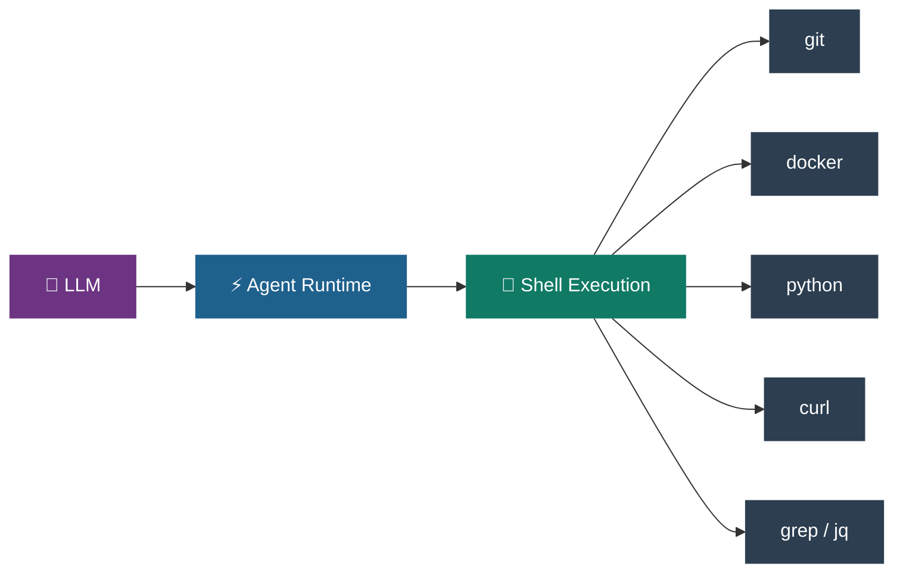

The model leverages knowledge from training data and constructs commands directly — no pre-loaded schemas needed.

**The 800-token trick (empirical):** Adding a skill document of ~800 tokens with CLI tips (e.g., common `gh` command patterns) reduces tool calls by one-third and latency by one-third compared to naive CLI. Described as the best ROI in direct benchmarking — applicable immediately by any team.

**Benchmark results:**

Two real conflicting benchmarks — both valid, measuring different things:

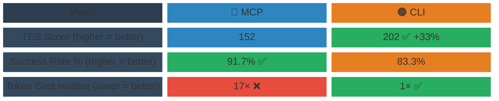

> Sources: Scalekit (TES, Token Cost) · Smithery (Success Rate) · Both March 2026.

**Reading the conflict correctly:**
- Scalekit tested broad GitHub automation → schema overhead dominated → **CLI wins on efficiency**
- Smithery tested multi-step dependent API chains with typed schemas → structured format reduced inter-step friction → **MCP wins on reliability**
- Both findings are simultaneously true. The right choice is task-dependent.

> ⚠️ **Benchmark caveat:** Both studies are engineering blog posts published by companies with products in this space. Neither has been replicated or peer-reviewed. The directional conclusions are reasonable; the specific multipliers (17×, 33%, 91.7%) should not be treated as stable constants. Run your own measurements on your own task distribution before making architectural commitments.

**Limitations:**
- Unstructured outputs — harder to parse reliably across diverse tools
- Complex error handling — shell exit codes and stderr require explicit logic
- Security risks without sandboxing — ambient credentials + arbitrary execution = incident risk in customer-facing deployments
- No authorization boundaries — unsuitable for multi-tenant scenarios

**Where CLI genuinely wins:**
- Developer tools where the user is the developer
- Local automation and system operations
- Code manipulation and DevOps agents
- Single-tenant tools without compliance requirements

---

<a name="s1-4"></a>
### 1.4 Strategy 3 — Hybrid (Industry Direction)

Most production systems combine both approaches:

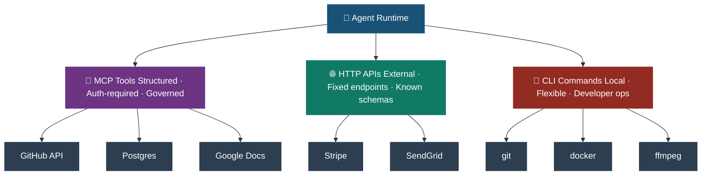

**Industry convergence (March 2026):**

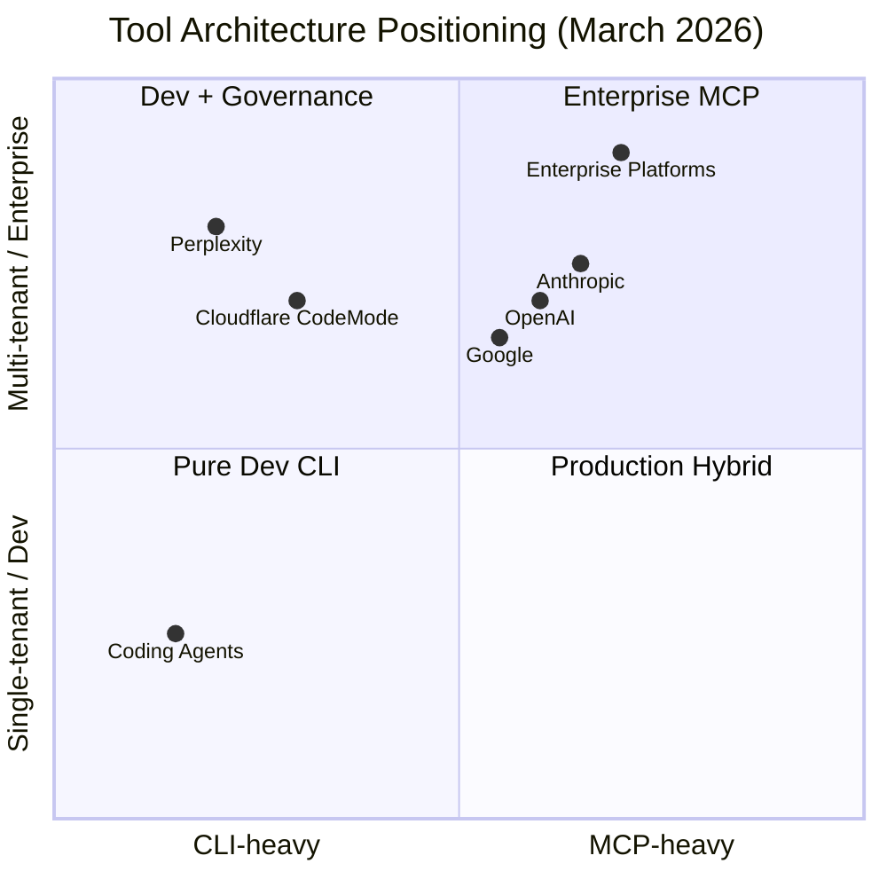

**The practical recommendation:**

> Building a developer tool for your own use? → **CLI + Skills**. Best measured efficiency.  
> Building a product where agents act on behalf of customers? → **MCP's authorization model is required**.  
> Building multi-tenant enterprise infrastructure? → **Both**: MCP for governance + an MCP gateway that filters schemas to only relevant tools per task (cuts token overhead by ~90%).

---

<a name="s1-5"></a>
### 1.5 Gemini CLI Plan Mode — Deep Dive (March 2026)

Plan Mode is Google's concrete implementation of the **"separate reasoning from execution"** principle at the CLI level. Announced March 11, 2026, enabled by default for all Gemini CLI users immediately.

**The two-phase workflow:**

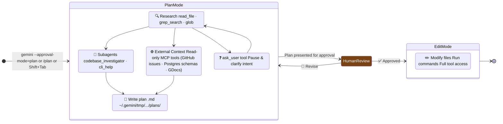

**What Plan Mode can and cannot do:**

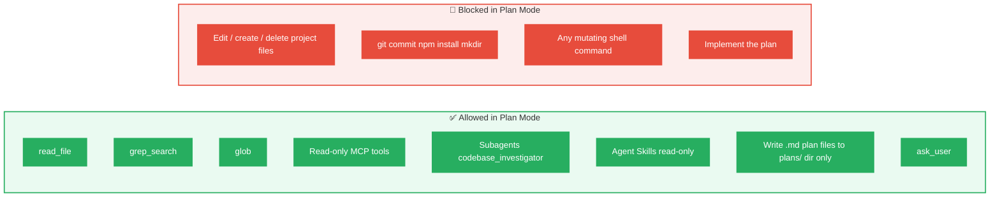

**Model routing within Plan Mode:**

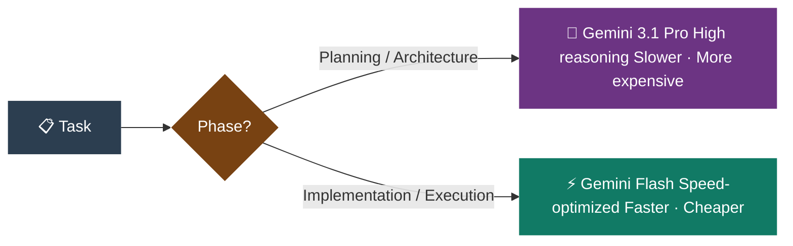

> This is MoE routing applied at the orchestration layer — route harder problems to more capable (and more expensive) components.

**Policy engine and customization:**

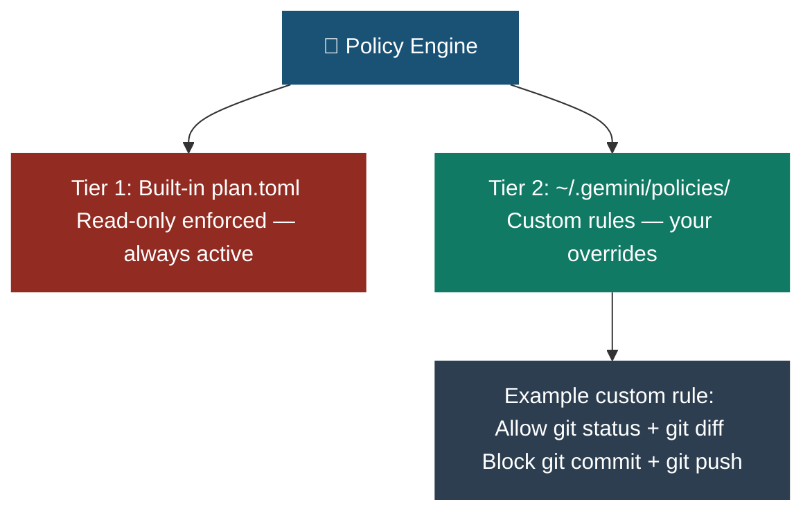

**Why this matters architecturally:** Plan Mode is not just a UX feature. It is a governance mechanism. Enterprise buyers require explicit control checkpoints before granting agents operational autonomy. Plan Mode provides a verifiable, auditable separation between reasoning and execution — with mandatory human approval as the gate between them.

> ⚠️ **Maturity caveat:** Plan Mode shipped as default on March 11, 2026 — it is one week old at the time of writing. The Conductor integration is described as "coming soon." The policy engine customization is documented but not yet battle-tested in production at scale. The architectural principle is sound and stable; the specific implementation details may evolve rapidly in the coming months.

---

<a name="s1-6"></a>
### 1.6 Benchmarked Efficiency: MCP vs CLI

A comprehensive summary of empirical findings as of March 2026:

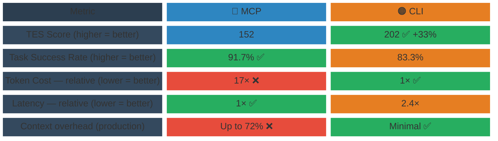

> ✅ = winner for that metric · ❌ = significant penalty · Sources: Scalekit + Smithery, March 2026.

| Metric | MCP | CLI | Source |
|---|---|---|---|
| Token Efficiency Score (GitHub tasks) | 152 | 202 (+33%) | Scalekit, Mar 2026 |
| Cost multiplier | 17× | 1× | Scalekit, Mar 2026 |
| Task success rate (multi-step chains) | **91.7%** | 83.3% | Smithery, Mar 2026 |
| Billed tokens on successful runs | 1× | 2.9× | Smithery, Mar 2026 |
| Latency on successful runs | **1×** | 2.4× | Smithery, Mar 2026 |
| Context overhead (MCP-heavy production) | Up to 72% | Minimal | Perplexity/Ask 2026 |
| Token reduction via code gen vs MCP tools | 244,000 tokens | ~1,000 tokens | Cloudflare Code Mode |
| Skill-augmented CLI improvement | — | −33% calls, −33% latency | Scalekit, Mar 2026 |

> ⚠️ **Reading this table correctly:** MCP wins on success rate and latency (Smithery, multi-step chains). CLI wins on token efficiency and cost (Scalekit, broad automation). These are not contradictory — they measure different things. The table intentionally shows both sides. Do not cherry-pick one row to justify a decision.

**Emerging mitigation — MCP Gateway pattern:**

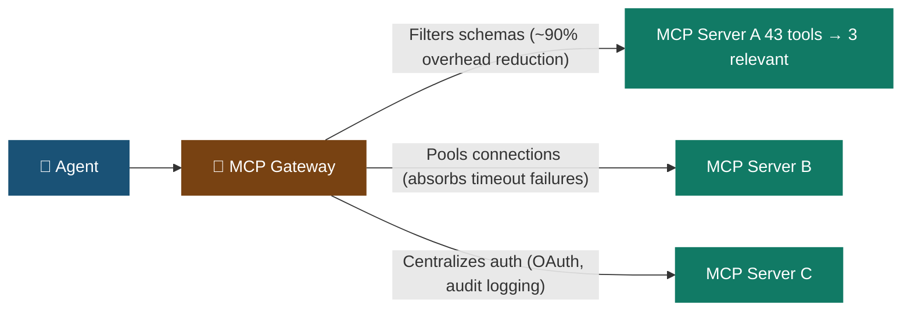

---

<a name="s1-7"></a>
### 1.7 Emerging Challenger: UTCP (Universal Tool Calling Protocol)

Introduced late 2025 as a lightweight alternative to MCP.

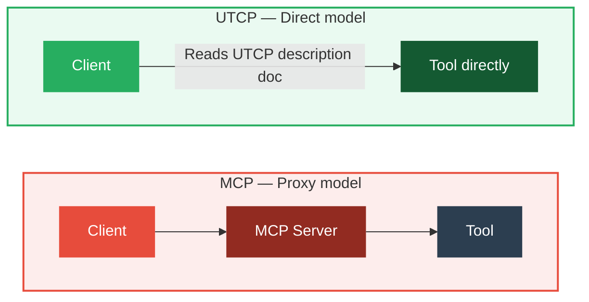

UTCP standardizes how tools *describe themselves*, not how calls are *proxied*. After reading the UTCP description, the AI communicates directly with the tool using its native protocol (REST, gRPC, WebSocket, CLI, database driver, message queue).

UTCP can describe MCP servers as one transport among many — making it a superset of MCP rather than a strict replacement. Both protocols are likely to coexist.

> ⚠️ **UTCP maturity caveat:** As of March 2026, UTCP is very early-stage. It lacks the ecosystem, tooling, and operational track record that MCP has accumulated. The architectural argument is sound; the production readiness is not yet demonstrated. Monitor, do not adopt yet.

---

<a name="s1-8"></a>
### 1.8 Key Engineering Principle

> **Separate reasoning from execution.**

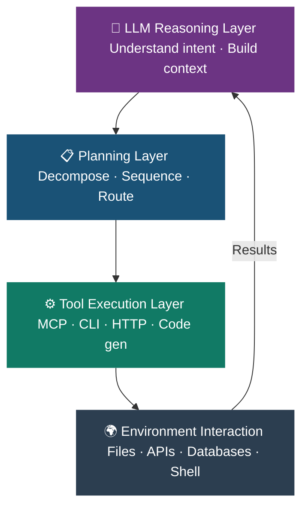

This structure improves reliability, safety, traceability, and efficiency regardless of which specific protocol fills each layer. Tools change. This separation does not.

---

<a name="s1-9"></a>
### 1.9 Security Requirements for Any Tool Layer

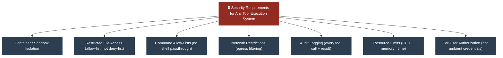

> The properties that make CLI fast — ambient auth, arbitrary execution, zero protocol overhead — are exactly the properties that create security incidents when agents move to customer-facing products. The properties that make MCP expensive — explicit schemas, OAuth handshakes — are what make it governable.

---

<a name="part-2"></a>
## Part 2 — Mixture of Experts (MoE)

<a name="s2-1"></a>
### 2.1 Core Idea

Mixture of Experts is a neural network architecture where:
- The model is composed of many **sub-networks ("experts")**, typically MLP feed-forward blocks
- Only a **small subset** of experts is activated per input token

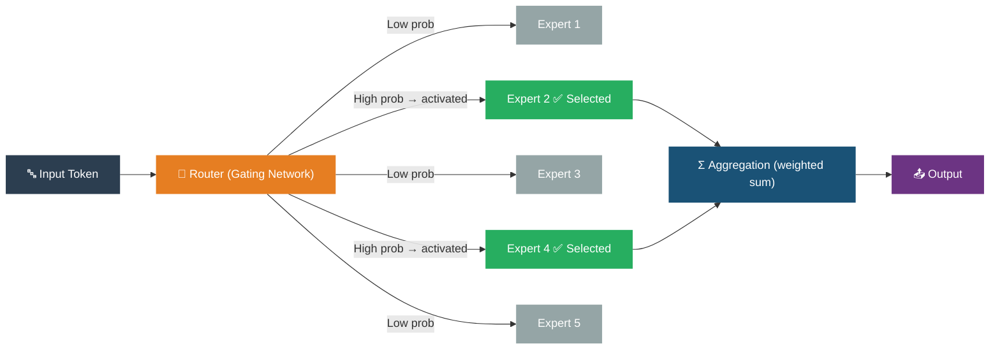

Versus dense models, where **all parameters** are active on every forward pass:

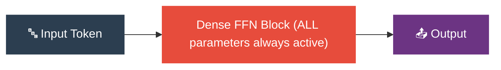

The fundamental insight: **decouple model capacity from inference compute**.

---

<a name="s2-2"></a>
### 2.2 Why MoE Exists

```mermaid
block-beta
  columns 5
  H0[" "]:1 H1["1B params"]:1 H2["10B params"]:1 H3["100B params"]:1 H4["671B params"]:1
  L1["Dense — all params"]:1 D1["~2 units"]:1 D2["~20 units"]:1 D3["~100 units"]:1 D4["~671 units ❌"]:1
  L2["MoE — active only"]:1 M1["~2 units"]:1 M2["~5 units"]:1 M3["~12 units"]:1 M4["~37 units ✅"]:1

  style H0 fill:#2C3E50,color:#fff,stroke:none
  style H1 fill:#2C3E50,color:#fff,stroke:none
  style H2 fill:#2C3E50,color:#fff,stroke:none
  style H3 fill:#2C3E50,color:#fff,stroke:none
  style H4 fill:#2C3E50,color:#fff,stroke:none
  style L1 fill:#E74C3C,color:#fff,stroke:none
  style D1 fill:#E74C3C,color:#fff,stroke:none
  style D2 fill:#C0392B,color:#fff,stroke:none
  style D3 fill:#922B21,color:#fff,stroke:none
  style D4 fill:#641E16,color:#fff,stroke:none
  style L2 fill:#27AE60,color:#fff,stroke:none
  style M1 fill:#27AE60,color:#fff,stroke:none
  style M2 fill:#1E8449,color:#fff,stroke:none
  style M3 fill:#196F3D,color:#fff,stroke:none
  style M4 fill:#145A32,color:#fff,stroke:none
```

> Each cell shows relative inference compute cost per token. Dense cost scales linearly with total parameter count (darkening red = rapidly increasing cost). MoE cost scales with active experts only — nearly flat (dark green = still contained). At 671B scale, dense would cost ~18× more per token than MoE. Values are illustrative.

The Switch Transformer (Fedus et al., 2022) demonstrated this empirically: **up to 7× pre-training speed improvement** over T5-equivalents with the same computational resources, and **4× speedup** over T5-XXL at trillion-parameter scale.

---

<a name="s2-3"></a>
### 2.3 Architecture Components

**Dense Layer — all parameters active on every token:**

```mermaid
flowchart LR
    D_in["Token"] --> D_MHA["Multi-Head Attention"] --> D_FFN["Single FFN Block (ALL params active — always)"] --> D_out["Output"]
    style D_in fill:#2C3E50,color:#fff,stroke:none
    style D_MHA fill:#1A5276,color:#fff,stroke:none
    style D_FFN fill:#E74C3C,color:#fff,stroke:none
    style D_out fill:#6C3483,color:#fff,stroke:none
```

**MoE Layer — sparse activation, only top-k experts fire:**

```mermaid
flowchart LR
    M_in["Token"] --> M_MHA["Multi-Head Attention"]
    M_MHA --> M_Router["Router Gating Network"]
    M_Router --> M_E1["Expert 1"]
    M_Router --> M_E2["Expert 2"]
    M_Router --> M_E3["Expert 3 ✅"]
    M_Router --> M_E4["Expert 4 ✅"]
    M_Router --> M_E5["Expert 5"]
    M_Router --> M_EN["... N"]
    M_E3 --> M_Agg["Weighted Aggregation"]
    M_E4 --> M_Agg
    M_Agg --> M_out["Output"]

    style M_in fill:#2C3E50,color:#fff,stroke:none
    style M_MHA fill:#1A5276,color:#fff,stroke:none
    style M_Router fill:#E67E22,color:#fff,stroke:none
    style M_E1 fill:#95A5A6,color:#fff,stroke:none
    style M_E2 fill:#95A5A6,color:#fff,stroke:none
    style M_E3 fill:#27AE60,color:#fff,stroke:none
    style M_E4 fill:#27AE60,color:#fff,stroke:none
    style M_E5 fill:#95A5A6,color:#fff,stroke:none
    style M_EN fill:#95A5A6,color:#fff,stroke:none
    style M_Agg fill:#1A5276,color:#fff,stroke:none
    style M_out fill:#6C3483,color:#fff,stroke:none
```

**Top-k selection (typically k=1 or k=2):**

```mermaid
flowchart LR
    X["Token x"] --> R["Router"]
    R --> P["Probabilities: [0.05, 0.70, 0.03, 0.18, 0.04]"]
    P -->|"top-1: Expert 2"| Selected["✅ Expert 2 activated"]
    P -->|"top-2: Expert 2 + 4"| Selected2["✅ Expert 2 + 4 activated"]

    style X fill:#2C3E50,color:#fff,stroke:none
    style R fill:#E67E22,color:#fff,stroke:none
    style P fill:#1A5276,color:#fff,stroke:none
    style Selected fill:#27AE60,color:#fff,stroke:none
    style Selected2 fill:#117A65,color:#fff,stroke:none
```

**Load Balancing Loss** — a critical training auxiliary loss that penalizes routing collapse. Without it, the router sends all tokens to a small subset of experts, leaving most idle.

> ⚠️ **Routing instability in practice:** Load balancing loss helps but does not fully solve routing collapse. In production, MoE models can exhibit unexpected performance cliffs on out-of-distribution inputs — the router may confidently send edge-case tokens to poorly-suited experts with no visible signal. This is harder to detect than dense model failures. Build routing utilization monitoring into any MoE deployment from day one.

---

<a name="s2-4"></a>
### 2.4 Key Properties

**Sparse activation — DeepSeek-V3 example:**

```mermaid
block-beta
  columns 1
  block:params["DeepSeek-V3 — Parameters per Token (671B total)"]:1
    A["🟢 ACTIVE — 37B parameters fired per token (5.5%)  "]
    B["⬜ INACTIVE — 634B parameters idle per token (94.5%)"]
  end
  style A fill:#27AE60,color:#fff,stroke:none
  style B fill:#BDC3C7,color:#2C3E50,stroke:none
  style params fill:#2C3E50,color:#fff,stroke:#fff
```

**Conditional computation — different inputs, different paths:**

```mermaid
flowchart LR
    Router["🔀 Router"]
    Code["💻 Code input"] --> Router
    Math["🔢 Math input"] --> Router
    Lang["🌐 Language X input"] --> Router
    Router --> EA["Expert Cluster A (code / syntax)"]
    Router --> EB["Expert Cluster B (reasoning / math)"]
    Router --> EC["Expert Cluster C (language / translation)"]

    style Router fill:#E67E22,color:#fff,stroke:none
    style Code fill:#2C3E50,color:#fff,stroke:none
    style Math fill:#2C3E50,color:#fff,stroke:none
    style Lang fill:#2C3E50,color:#fff,stroke:none
    style EA fill:#27AE60,color:#fff,stroke:none
    style EB fill:#6C3483,color:#fff,stroke:none
    style EC fill:#1A5276,color:#fff,stroke:none
```

**Automatic specialization:** Experts self-organize around domains — syntax, reasoning, code, math, vision — during training, without explicit labeling. Specialization is emergent.

---

<a name="s2-5"></a>
### 2.5 Engineering Implications

**System design impact on your ML pipeline:**

```mermaid
flowchart TD
    MoE["⚙️ MoE Model in Production"]

    MoE --> GPU["GPU Memory Allocation All experts must reside in memory (even if inactive per token)"]
    MoE --> Batch["Batching Strategy Different tokens → different experts Must account for routing in batch design"]
    MoE --> Pipeline["Inference Pipeline Expert parallelism adds cross-GPU routing communication"]
    MoE --> Latency["Latency Variability Routing decisions introduce non-determinism per request"]
    MoE --> Behavior["Model Behavior Prompt stability matters more than with dense models"]

    style MoE fill:#E67E22,color:#fff,stroke:none
    style GPU fill:#1A5276,color:#fff,stroke:none
    style Batch fill:#1A5276,color:#fff,stroke:none
    style Pipeline fill:#922B21,color:#fff,stroke:none
    style Latency fill:#922B21,color:#fff,stroke:none
    style Behavior fill:#117A65,color:#fff,stroke:none
```

---

<a name="s2-6"></a>
### 2.6 Production Efficiency Numbers

```mermaid
block-beta
  columns 2
  H1["Optimization"]:1 H2["Result vs unoptimized naive MoE"]:1
  R1["Naive MoE vs FLOP-equivalent Dense"]:1 R2["15× SLOWER ❌ (baseline problem)"]:1
  R3["Dynamic Gating — Language Model"]:1 R4["6–11× throughput improvement ✅"]:1
  R5["Dynamic Gating — MT Encoder"]:1 R6["5.75–10× throughput improvement ✅"]:1
  R7["Expert Buffering (hot/cold cache)"]:1 R8["1.47× memory reduction ✅"]:1

  style H1 fill:#2C3E50,color:#fff,stroke:none
  style H2 fill:#2C3E50,color:#fff,stroke:none
  style R1 fill:#34495E,color:#fff,stroke:none
  style R2 fill:#E74C3C,color:#fff,stroke:none
  style R3 fill:#34495E,color:#fff,stroke:none
  style R4 fill:#27AE60,color:#fff,stroke:none
  style R5 fill:#34495E,color:#fff,stroke:none
  style R6 fill:#27AE60,color:#fff,stroke:none
  style R7 fill:#34495E,color:#fff,stroke:none
  style R8 fill:#27AE60,color:#fff,stroke:none
```

> Source: Huang et al. NeurIPS 2024. The red row is the problem; the green rows are the proposed mitigations.

> ⚠️ **MoE efficiency caveat:** These numbers are real but **do not stack and do not generalize naively.** The 15× inference slowdown is for naive unoptimized MoE vs FLOP-equivalent dense on specific hardware. The 7× pre-training speedup is for Switch Transformer vs T5 on TPUs. The 85% memory reduction is for Qwen3-235B-A22B with RL-guided caching. Each figure is valid in its specific context. Quoting them as general MoE properties without the caveats is a common and misleading error.

| Optimization | Result | Paper |
|---|---|---|
| Switch Transformer pre-training vs T5-equivalent | **7× faster** | Fedus et al. 2022 |
| Naive MoE inference vs FLOP-equivalent dense | **15× slower** (LM) · **3× slower** (MT) | Huang et al. NeurIPS 2024 |
| Dynamic gating throughput improvement | **6.21–11.55×** (LM) · **5.75–10.98×** (MT) | Huang et al. NeurIPS 2024 |
| Expert Buffering memory reduction | **1.47×** | Huang et al. NeurIPS 2024 |
| H100 FP8 vs FP16 throughput | **+20–30%** | MoE-Inference-Bench, SC '25 |
| k=1 vs k=2 throughput | **+50–80%** | MoE-Inference-Bench, SC '25 |
| Capacity-Aware Token Drop (OLMoE) | **30% speedup** at 0.9% degradation | OpenReview 2025 |
| Expanded Drop on Mixtral-8×7B-Instruct | **1.85× inference speedup** | OpenReview 2025 |
| ExpertCache GPU memory reduction (Qwen3-235B-A22B) | **85%** reduction | ICSME 2025 |

---

<a name="s2-7"></a>
### 2.7 Trade-offs

```mermaid
flowchart LR
    subgraph problems ["⚠️ Known Problems"]
        P1["Routing Instability Router collapses to few experts"]
        P2["Training Complexity Harder than dense · Needs regularization"]
        P3["Communication Overhead All-to-all across GPUs in distributed setup"]
        P4["Straggler Effect Overloaded experts dictate global latency"]
        P5["GPU Memory All experts in memory even if inactive"]
        P6["Debugging Difficulty Which expert failed? Why was it routed there?"]
    end

    subgraph mitigations ["✅ Known Mitigations"]
        M1["Load balancing auxiliary loss Router regularization"]
        M2["Simplified routing (k=1) Selective float32 precision"]
        M3["Expert locality constraints Tensor partitioning · Expert buffering"]
        M4["Capacity-Aware Token Drop Expanded Drop (1.85× speedup)"]
        M5["Expert Caching (CPU offload) Quantization (FP8 −20–30%)"]
        M6["Expert utilization monitoring Routing visualization tools"]
    end

    P1 --- M1
    P2 --- M2
    P3 --- M3
    P4 --- M4
    P5 --- M5
    P6 --- M6

    style problems fill:#FDEDEC,stroke:#E74C3C,stroke-width:2px
    style mitigations fill:#EAFAF1,stroke:#27AE60,stroke-width:2px
    style P1 fill:#E74C3C,color:#fff,stroke:none
    style P2 fill:#E74C3C,color:#fff,stroke:none
    style P3 fill:#E74C3C,color:#fff,stroke:none
    style P4 fill:#E74C3C,color:#fff,stroke:none
    style P5 fill:#E74C3C,color:#fff,stroke:none
    style P6 fill:#E74C3C,color:#fff,stroke:none
    style M1 fill:#27AE60,color:#fff,stroke:none
    style M2 fill:#27AE60,color:#fff,stroke:none
    style M3 fill:#27AE60,color:#fff,stroke:none
    style M4 fill:#27AE60,color:#fff,stroke:none
    style M5 fill:#27AE60,color:#fff,stroke:none
    style M6 fill:#27AE60,color:#fff,stroke:none
```

---

<a name="s2-8"></a>
### 2.8 Industry Adoption Map (2021–2026)

```mermaid
timeline
    title MoE Adoption in Frontier Models
    section Google
        2021 : GLaM (1.2T params, 64 experts — internal proof of concept)
        2022 : Switch Transformer (JMLR — 7× pre-training speedup, k=1 routing)
        2024-2026 : Gemini family (MoE widely believed, not fully disclosed)
    section Mistral
        2024 : Mixtral-8×7B (8 experts, k=2, fully open)
             : Mixtral-8×22B
        2025-12 : Mistral Large 3 (675B total / 41B active, Apache 2.0)
    section DeepSeek
        2024-05 : DeepSeek-V2 (fine-grained experts, MLA attention)
        2024-12 : DeepSeek-V3 (671B total / 37B active, 256 experts — 2.788M H800 GPU hours)
        2025-01 : DeepSeek-R1 (V3 + RL reasoning — matched OpenAI on benchmarks)
    section Meta
        2025-04 : Llama 4 Scout (16 experts · 109B total / 17B active · fits 1× H100)
                : Llama 4 Maverick (128 experts · 400B total / 17B active)
    section Alibaba
        2024-2025 : Qwen-MoE series
        2025 : Qwen3-VL (30B-A3B · 235B-A22B — multimodal MoE)
    section AI21 Labs
        2024 : Jamba (Transformer + Mamba + MoE hybrid · 2.5× faster on long context)
        2025 : Jamba 1.5 (398B total / 94B active)
    section AllenAI
        2024 : OLMoE (7B total / 1B active · 64 experts · fully open · outperforms dense at 6-7× compute)
    section Microsoft
        2024 : Phi-3.5-MoE (compact MoE)
```

> ⚠️ **Disclosure caveat:** Google has never officially confirmed Gemini uses MoE. The claim is based on strong circumstantial evidence (million-token context, multimodal efficiency, Pathways infrastructure) and is widely accepted in the research community — but it remains inference, not official disclosure. Treat "widely believed" entries as educated inference. Meta only confirmed MoE with Llama 4 in April 2025 — the first time they publicly acknowledged it. Prior to that, it was also inferred.

---

<a name="s2-9"></a>
### 2.9 Recent Research Directions

```mermaid
mindmap
    Adaptive Computation
      Elastic MoE (EMoE 2025)
        Stochastic co-activation training
        Tolerates more experts at inference than seen in training
      MoSE (2026)
        Slimmable expert widths
        Implicit draft model for self-speculation
        Adaptive capacity per task difficulty
    Expert Caching
      ExpertCache (ICSME 2025)
        RL-guided pre-loading
        85% GPU memory reduction
        Consumer hardware deployment of 235B models
    Routing Optimization
      MaxScore (2025)
        Routing as constrained optimization
        Addresses token dropping from hard capacity constraints
      Capacity-Aware Inference (2025)
        Straggler Effect formalization
        Token Drop + Expand strategies
        1.85x speedup on Mixtral
    Multimodal MoE
      Qwen3-VL (2025)
        MoE as compute allocation across modalities
        Not just a scaling mechanism
      DeepSeek-VL2 (2024)
        MoE for multimodal understanding
    Surveys
      Zhang et al. mid-2025
        Gating strategies
        Sparse and hierarchical variants
        Deployment considerations
      Song et al. 2025-2026 (arXiv 2507.11181)
        Comprehensive LLM MoE taxonomy
```

---

<a name="s2-10"></a>
### 2.10 The Deeper Structural Parallel

```mermaid
flowchart TD
    subgraph model_level ["Inside the Model — MoE"]
        direction LR
        Token2["Token"] --> ModelRouter["Router"]
        ModelRouter --> ExpertA["Expert A"]
        ModelRouter --> ExpertB["Expert B ✅"]
        ModelRouter --> ExpertC["Expert C"]
        ExpertB --> ModelOut["Output"]
    end

    subgraph agent_level ["Outside the Model — Agent Tool Routing"]
        direction LR
        Task2["Task"] --> AgentPlanner["Planner"]
        AgentPlanner --> ToolA["MCP Tool"]
        AgentPlanner --> ToolB["CLI Command ✅"]
        AgentPlanner --> ToolC["HTTP API"]
        ToolB --> AgentOut["Result"]
    end

    subgraph phase_level ["Phase Routing — Gemini CLI Plan Mode"]
        direction LR
        Request["Request"] --> PhaseRouter["Phase Router"]
        PhaseRouter --> PlanPhase["Plan Mode (Gemini 3.1 Pro) ✅"]
        PhaseRouter --> ExecPhase["Edit Mode (Gemini Flash)"]
        PlanPhase --> PhaseOut["Plan .md → Approval"]
    end

    Same["Same principle: Conditional, modular computation at different abstraction layers"]

    model_level --> Same
    agent_level --> Same
    phase_level --> Same

    style model_level fill:#EAFAF1,stroke:#27AE60,stroke-width:2px
    style agent_level fill:#EBF5FB,stroke:#2E86C1,stroke-width:2px
    style phase_level fill:#F5EEF8,stroke:#6C3483,stroke-width:2px
    style Same fill:#2C3E50,color:#fff,stroke:none
```

The future is not bigger monolithic systems. It is **modular, routed, conditional systems at every layer of the stack**.

---

<a name="part-3"></a>
## Part 3 — ML Data Ingestion Infrastructure

> ⚠️ **Scope caveat:** This part covers one specific tool (Cloudflare's managed crawl API) as a concrete example of how managed infrastructure is simplifying one layer of ML data pipelines. ML data engineering as a full discipline is far broader and is **not comprehensively covered here**. What this section intentionally omits: dataset versioning (DVC, LakeFS, Delta Lake), streaming ingestion pipelines (Kafka, Flink, Spark Streaming), feature stores (Feast, Tecton, Vertex Feature Store), data quality frameworks (Great Expectations, Soda, Monte Carlo), annotation and labeling pipelines (Label Studio, Scale AI, Labelbox), data lineage and provenance tracking, and the full MLOps lifecycle around data. Each of those topics deserves its own dedicated reference document. This section is intentionally a narrow entry point — not a complete picture.

<a name="s3-1"></a>
### 3.1 Context: The Real Bottleneck

Model performance is rarely the actual bottleneck in production ML systems:

```mermaid
block-beta
  columns 1
  block:time["Where Engineering Time Actually Goes — Production ML Systems"]:1
    A["📦 Data acquisition & ingestion — 35%"]
    B["🧹 Data cleaning & quality — 25%"]
    C["🔧 Pipeline maintenance — 20%"]
    D["🧠 Model training & tuning — 12%"]
    E["🚀 Inference & serving — 8%"]
  end
  style A fill:#2E86C1,color:#fff,stroke:none
  style B fill:#1A5276,color:#fff,stroke:none
  style C fill:#117A65,color:#fff,stroke:none
  style D fill:#6C3483,color:#fff,stroke:none
  style E fill:#E67E22,color:#fff,stroke:none
  style time fill:#2C3E50,color:#fff,stroke:#fff
```

<a name="s3-2"></a>
### 3.2 Traditional vs Managed Crawling

**❌ Traditional stack — requires a dedicated engineering team:**

```mermaid
flowchart LR
    T1["URL Scheduler"] --> T2["Link Discovery"] --> T3["robots.txt Compliance"] --> T4["Rate Limiting + Proxy Mgmt"] --> T5["HTML Parsing + Extraction"] --> T6["Storage Pipeline"] --> T7["Dedup + Retry + Monitoring"]

    style T1 fill:#E74C3C,color:#fff,stroke:none
    style T2 fill:#E74C3C,color:#fff,stroke:none
    style T3 fill:#E74C3C,color:#fff,stroke:none
    style T4 fill:#E74C3C,color:#fff,stroke:none
    style T5 fill:#E74C3C,color:#fff,stroke:none
    style T6 fill:#E74C3C,color:#fff,stroke:none
    style T7 fill:#E74C3C,color:#fff,stroke:none
```

**✅ Cloudflare /crawl API — one call replaces the entire stack:**

```mermaid
flowchart LR
    C1["POST /crawl"] --> C2["Site Discovery + Page Crawling + Content Retrieval"] --> C3["Structured Results"]

    style C1 fill:#27AE60,color:#fff,stroke:none
    style C2 fill:#117A65,color:#fff,stroke:none
    style C3 fill:#145A32,color:#fff,stroke:none
```

<a name="s3-3"></a>
### 3.3 Where It Fits in ML Pipelines

```mermaid
flowchart TD
    DS["📦 Data Sources (websites, docs, APIs)"]
    Crawl["🌐 Web Crawling ← Cloudflare /crawl replaces this entire layer"]
    Extract["🔍 Content Extraction"]
    Clean["🧹 Cleaning & Filtering"]
    Build["🏗️ Dataset Building"]
    Use["🚀 Training · Indexing · Inference"]

    DS --> Crawl --> Extract --> Clean --> Build --> Use

    subgraph applications ["Primary ML Applications"]
        RAG["RAG Corpus"]
        DocAI["Document AI"]
        KG["Knowledge Graphs"]
        Drift["Data Drift Monitoring"]
    end

    Build --> RAG
    Build --> DocAI
    Build --> KG
    Use --> Drift

    style DS fill:#1A5276,color:#fff,stroke:none
    style Crawl fill:#117A65,color:#fff,stroke:none
    style Extract fill:#2C3E50,color:#fff,stroke:none
    style Clean fill:#2C3E50,color:#fff,stroke:none
    style Build fill:#2C3E50,color:#fff,stroke:none
    style Use fill:#6C3483,color:#fff,stroke:none
    style RAG fill:#E67E22,color:#fff,stroke:none
    style DocAI fill:#E67E22,color:#fff,stroke:none
    style KG fill:#E67E22,color:#fff,stroke:none
    style Drift fill:#E67E22,color:#fff,stroke:none
```

<a name="s3-4"></a>
### 3.4 Strategic Trend

Cloudflare is expanding into AI infrastructure: web crawling, content ingestion, AI gateways, inference routing, edge AI — positioning alongside AWS, GCP, Vercel, Hugging Face, and Databricks, but focused on **edge and web-scale data ingestion**.

---

<a name="s3-5"></a>
### 3.5 What This Section Omits — The Broader ML Data Engineering Stack

The crawling layer is one early stage of a much larger pipeline. For completeness, here is what a full production ML data engineering stack looks like and where each component lives:

```mermaid
flowchart TD
    A["🌐 Data Sources Web · APIs · Databases · Sensors · User logs"]
    B["📥 Ingestion Layer Managed crawl APIs · Kafka · Flink · Spark Streaming Batch ETL · CDC (Change Data Capture)"]
    C["🗄️ Raw Storage Data Lake (S3, GCS, ADLS) Delta Lake · Apache Iceberg · Hudi"]
    D["🔖 Dataset Versioning DVC · LakeFS · Pachyderm"]
    E["🧹 Quality & Validation Great Expectations · Soda · Monte Carlo Data contracts · Schema enforcement"]
    F["🏷️ Annotation & Labeling Label Studio · Scale AI · Labelbox Active learning loops"]
    G["🏗️ Feature Engineering Feature Store (Feast · Tecton · Vertex) Offline + Online serving"]
    H["🧠 Training / Fine-tuning Experiment tracking (MLflow, W&B) Dataset registries"]
    I["📊 Monitoring & Drift Evident AI · Fiddler · Arize Data drift · Label drift · Concept drift"]

    A --> B --> C --> D --> E --> F --> G --> H --> I
    I -->|"Feedback loop — retrigger ingestion"| A

    style A fill:#1A5276,color:#fff,stroke:none
    style B fill:#117A65,color:#fff,stroke:none
    style C fill:#2C3E50,color:#fff,stroke:none
    style D fill:#6C3483,color:#fff,stroke:none
    style E fill:#922B21,color:#fff,stroke:none
    style F fill:#784212,color:#fff,stroke:none
    style G fill:#1F618D,color:#fff,stroke:none
    style H fill:#1E8449,color:#fff,stroke:none
    style I fill:#E67E22,color:#fff,stroke:none
```

**What this document covers:** Only the top of this pipeline — the managed crawling API as a replacement for the first step of the Ingestion Layer.

**What each omitted layer contains:**

| Layer | Key tools | Why it matters |
|---|---|---|
| Dataset versioning | DVC, LakeFS, Delta Lake, Iceberg | Reproducibility — knowing exactly which data produced which model |
| Streaming ingestion | Kafka, Flink, Spark Streaming | Real-time feature freshness for online inference |
| Data quality | Great Expectations, Soda, Monte Carlo | Catching silent data corruption before it reaches training |
| Annotation | Label Studio, Scale AI, Labelbox | Ground truth production — often the real bottleneck for supervised tasks |
| Feature store | Feast, Tecton, Vertex Feature Store | Consistent feature definitions between training and serving (training-serving skew) |
| Drift monitoring | Evident AI, Fiddler, Arize | Detecting when production data diverges from training distribution |

> **For CV/ML engineers specifically:** The annotation and drift monitoring layers are the most directly relevant. Annotation pipelines determine label quality and therefore model ceiling. Drift monitoring determines when a deployed model silently degrades. Both deserve dedicated study.

---

<a name="synthesis"></a>
## Part 4 — Cross-Cutting Synthesis

### The Unifying Architectural Shift

```mermaid
block-beta
  columns 3
  H1["Domain"]:1 H2["Monolithic — Old"]:1 H3["Modular / Routed — New"]:1
  R1["Model Architecture"]:1 R2["Dense: all params always active"]:1 R3["MoE: sparse routing to specialists ✅"]:1
  R4["Agent Tool Layer"]:1 R5["Custom N×M integrations per pair"]:1 R6["MCP · CLI · Hybrid protocols ✅"]:1
  R7["Planning vs Execution"]:1 R8["Undifferentiated — no separation"]:1 R9["Plan Mode: explicit read-only phase ✅"]:1
  R10["Data Ingestion"]:1 R11["Custom crawler team required"]:1 R12["Managed APIs: Cloudflare /crawl ✅"]:1

  style H1 fill:#2C3E50,color:#fff,stroke:none
  style H2 fill:#922B21,color:#fff,stroke:none
  style H3 fill:#1E8449,color:#fff,stroke:none
  style R1 fill:#34495E,color:#fff,stroke:none
  style R2 fill:#E74C3C,color:#fff,stroke:none
  style R3 fill:#27AE60,color:#fff,stroke:none
  style R4 fill:#34495E,color:#fff,stroke:none
  style R5 fill:#E74C3C,color:#fff,stroke:none
  style R6 fill:#27AE60,color:#fff,stroke:none
  style R7 fill:#34495E,color:#fff,stroke:none
  style R8 fill:#E74C3C,color:#fff,stroke:none
  style R9 fill:#27AE60,color:#fff,stroke:none
  style R10 fill:#34495E,color:#fff,stroke:none
  style R11 fill:#E74C3C,color:#fff,stroke:none
  style R12 fill:#27AE60,color:#fff,stroke:none
```

### Decision Framework for Tool Architecture

**Quick lookup — pick the row that matches your situation:**

| Your situation | Recommended approach | Why |
|---|---|---|
| 🧑‍💻 Solo dev, building for yourself | **CLI + Skill doc (~800 tokens)** | Best measured efficiency: −33% calls, −33% latency. No auth overhead needed. |
| 👤 Agents act on behalf of customers | **MCP with OAuth 2.1 / PKCE** | Per-user scoped access, revocable tokens, audit trail. Required for multi-user trust. |
| 🏢 Multi-tenant enterprise | **Hybrid: MCP + Gateway** | MCP for governance. Gateway filters schemas (~90% token overhead reduction). |
| 📉 Context window already a problem in prod | **Code generation against pre-authorized client** | Up to 244× token reduction vs full MCP schema injection (Cloudflare Code Mode pattern). |
| 🔒 Customer-facing security & compliance required | **OpenClaw / NemoClaw pattern** | Sandboxed agent execution with explicit permission boundaries, audit trails, deny-by-default tool access. Built for enterprise trust requirements MCP alone does not address. |
| 🌀 Not sure yet / ecosystem still shifting | **Observe, don't commit** | Standardize on the **principle**: separate reasoning from execution. Specific tools will change. |

> ⚠️ **OpenClaw / NemoClaw caveat:** OpenClaw demonstrated the exact failure mode CLI-heavy agents produce in customer-facing products — ambient credentials + arbitrary shell execution = unauthorized cross-account access in production. NemoClaw refers to similar sandboxed agent execution patterns from NVIDIA's NeMo framework. The lesson is not "avoid CLI" but "CLI without authorization boundaries is unsafe at the customer-facing boundary." Neither is a finished product recommendation; both illustrate why security architecture must be a first-class design constraint, not an afterthought.

**Decision flowchart (visual version):**

```mermaid
flowchart TD
    Start([What are you building?])
    Start --> Q1{Solo dev, for own use?}
    Q1 -->|Yes| CLI["✅ CLI + Skill doc\n800 tokens · best efficiency"]
    Q1 -->|No| Q2{Customer-facing product?}
    Q2 -->|No| Q4{Context window overage?}
    Q2 -->|Yes| Q3{Compliance / audit required?}
    Q3 -->|Yes| SEC["✅ OpenClaw pattern\nSandbox · deny-by-default\nExplicit permission boundaries"]
    Q3 -->|No| Q5{Multi-tenant enterprise?}
    Q5 -->|Yes| HYB["✅ Hybrid: MCP + Gateway\n90% schema overhead reduction"]
    Q5 -->|No| MCP2["✅ MCP with OAuth 2.1\nPer-user scoped access"]
    Q4 -->|Yes| CG["✅ Code Gen\nvs pre-auth client\n244× token reduction"]
    Q4 -->|No| OBS["⏳ Observe\nSeparate reasoning\nfrom execution"]

    style CLI fill:#27AE60,color:#fff,stroke:none
    style MCP2 fill:#2E86C1,color:#fff,stroke:none
    style HYB fill:#6C3483,color:#fff,stroke:none
    style SEC fill:#922B21,color:#fff,stroke:none
    style CG fill:#117A65,color:#fff,stroke:none
    style OBS fill:#E67E22,color:#fff,stroke:none
    style Start fill:#2C3E50,color:#fff,stroke:none
```

### Key Numbers to Remember

| Claim | Number | Source |
|---|---|---|
| MCP schema overhead in production | Up to **72%** of context window | Perplexity / Ask 2026 |
| Code gen vs MCP tools token reduction | **244×** | Cloudflare Code Mode |
| CLI token efficiency advantage | **+33%** TES | Scalekit, Mar 2026 |
| Native MCP success rate advantage | **+8.4pp** (91.7% vs 83.3%) | Smithery, Mar 2026 |
| Switch Transformer pre-training speedup | **7×** | Fedus et al. 2022 |
| Naive MoE inference vs dense (same FLOPs) | **15× slower** | Huang et al. NeurIPS 2024 |
| Dynamic gating throughput improvement | **6–11×** | Huang et al. NeurIPS 2024 |
| FP8 vs FP16 throughput on H100 | **+20–30%** | MoE-Inference-Bench, SC '25 |
| k=1 vs k=2 throughput improvement | **+50–80%** | MoE-Inference-Bench, SC '25 |
| ExpertCache GPU memory reduction | **85%** | ICSME 2025 |

---

<a name="references"></a>
## References

### MoE — Foundational Papers

- **Shazeer et al. (2017).** *Outrageously Large Neural Networks: The Sparsely-Gated Mixture-of-Experts Layer.* arXiv:1701.06538.  
  https://arxiv.org/abs/1701.06538

- **Fedus, Zoph, Shazeer (2022).** *Switch Transformers: Scaling to Trillion Parameter Models with Simple and Efficient Sparsity.* JMLR 23. 7× pre-training speedup; simplified k=1 routing.  
  https://arxiv.org/abs/2101.03961

### MoE — Inference Efficiency

- **Huang et al. (NeurIPS 2024).** *Toward Efficient Inference for Mixture of Experts.* NeurIPS 2024 Main Conference Track. Naive MoE is 15× slower; dynamic gating 6–11× throughput improvement; expert buffering 1.47× memory reduction.  
  https://proceedings.neurips.cc/paper_files/paper/2024/hash/98bf3b8505c611ac21055dd9d355c66e-Abstract-Conference.html  
  PDF: https://www.seas.upenn.edu/~leebcc/documents/huang24-neurips.pdf

- **Liu et al. (2024).** *A Survey on Inference Optimization Techniques for Mixture of Experts Models.* arXiv:2412.14219.  
  https://arxiv.org/abs/2412.14219

- **Emani et al. (SC '25 Workshops).** *MoE-Inference-Bench: Performance Evaluation of Mixture of Expert Large Language and Vision Models.* H100 FP8 +20–30%; k=1 +50–80% throughput.  
  https://dl.acm.org/doi/10.1145/3731599.3767706  
  arXiv: https://arxiv.org/html/2508.17467v1

- **Capacity-Aware Inference (OpenReview 2025).** *Mitigating the Straggler Effect in Mixture of Experts.* 30% speedup at 0.9% degradation; 1.85× speedup on Mixtral-8×7B-Instruct.  
  https://openreview.net/forum?id=LuYFpySWA2

- **ExpertCache (ICSME 2025).** *GPU-Efficient MoE Inference through Reinforcement Learning-Guided Expert Selection.* 85% GPU memory reduction on Qwen3-235B-A22B.  
  https://conf.researchr.org/details/icsme-2025/icsme-2025-nier/17/ExpertCache-GPU-Efficient-MoE-Inference-through-Reinforcement-Learning-Guided-Expert

### MoE — Architecture Surveys and Recent Work

- **Song et al. (2025/2026).** *Mixture of Experts in Large Language Models.* arXiv:2507.11181.  
  https://arxiv.org/html/2507.11181v2

- **MoSE (2026).** *Mixture of Slimmable Experts for Efficient and Adaptive Language Models.* arXiv:2602.06154.  
  https://arxiv.org/html/2602.06154v1

- **IntuitionLabs MoE Survey (2025–2026).** Architectural history and adoption map.  
  https://intuitionlabs.ai/articles/mixture-of-experts-moe-models

### Tool Architectures — MCP

- **MCP Official Documentation.** https://modelcontextprotocol.io/docs/getting-started/intro

- **MCP Architecture and Security Analysis.** arXiv:2503.23278. https://arxiv.org/abs/2503.23278

- **MCP Wikipedia Overview.** https://en.wikipedia.org/wiki/Model_Context_Protocol

- **Anthropic Engineering: Code Execution with MCP.**  
  https://www.anthropic.com/engineering/code-execution-with-mcp

### Tool Architectures — MCP vs CLI Benchmarks

- **Scalekit Benchmark (March 2026).** *MCP vs CLI: Benchmarking AI Agent Cost & Reliability.*  
  https://www.scalekit.com/blog/mcp-vs-cli-use

- **Smithery Benchmark (March 2026).** *MCP vs CLI Is the Wrong Fight.*  
  https://smithery.ai/blog/mcp-vs-cli-is-the-wrong-fight

- **Repello AI Analysis (March 2026).** *MCP vs CLI: What Perplexity's Move Actually Means for AI Security Teams.*  
  https://repello.ai/blog/mcp-vs-cli

- **Reinhard (February 2026).** *Why CLI Tools Are Beating MCP for AI Agents.*  
  https://jannikreinhard.com/2026/02/22/why-cli-tools-are-beating-mcp-for-ai-agents/

- **Microsoft Community Hub (March 2026).** *MCP vs mcp-cli: Dynamic Tool Discovery.*  
  https://techcommunity.microsoft.com/blog/azuredevcommunityblog/mcp-vs-mcp-cli-dynamic-tool-discovery-for-token-efficient-ai-agents/4494272

- **Junia AI Analysis (March 2026).** *Perplexity MCP vs APIs.*  
  https://www.junia.ai/blog/perplexity-mcp-vs-apis-ai-agents

### Tool Architectures — Gemini CLI Plan Mode

- **Google Developers Blog (March 11, 2026).** *Plan mode is now available in Gemini CLI.*  
  https://developers.googleblog.com/plan-mode-now-available-in-gemini-cli/

- **Gemini CLI Official Documentation — Plan Mode.**  
  https://geminicli.com/docs/cli/plan-mode/

- **Gemini CLI v0.33.0 Release Discussion (GitHub).**  
  https://github.com/google-gemini/gemini-cli/discussions/22078

- **DevOps.com Analysis (March 2026).** *Gemini CLI Plan Mode Separates Thinking From Doing.*  
  https://devops.com/gemini-cli-plan-mode-separates-thinking-from-doing-and-makes-read-only-the-default/

- **ADTmag (March 2026).** *Google Adds "Plan Mode" to Gemini CLI.*  
  https://adtmag.com/articles/2026/03/12/google-adds-plan-mode-to-gemini-cli-to-support-safer-code-planning.aspx

### Tool Architectures — UTCP

- **Nordic APIs (January 2026).** *MCP vs UTCP.*  
  https://nordicapis.com/model-context-protocol-mcp-vs-universal-tool-calling-protocol-utcp/

### Data Ingestion

- **Cloudflare Crawl API Announcement.**  
  https://x.com/CloudflareDev/status/2031488099725754821
