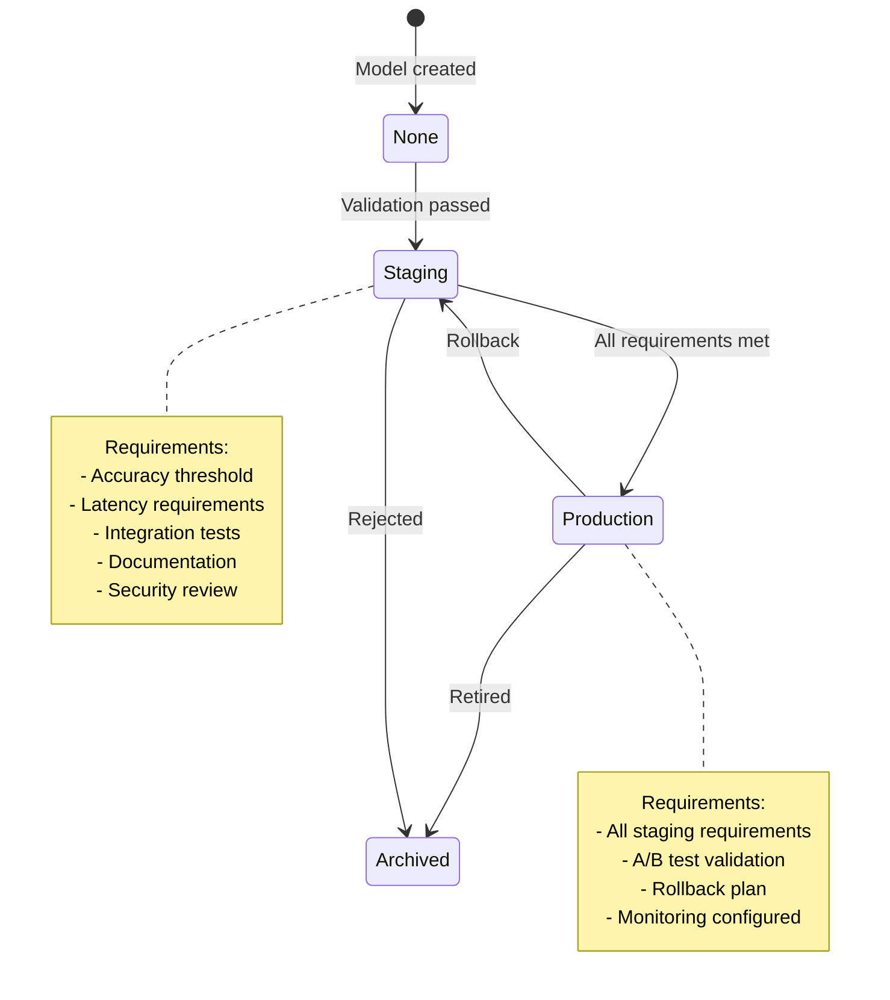
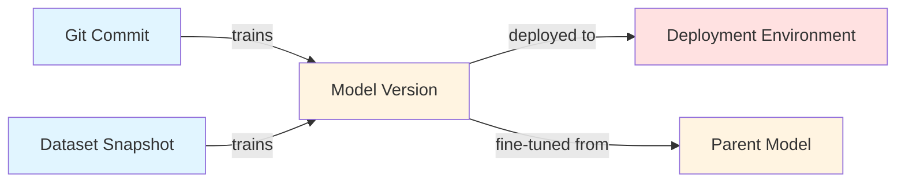
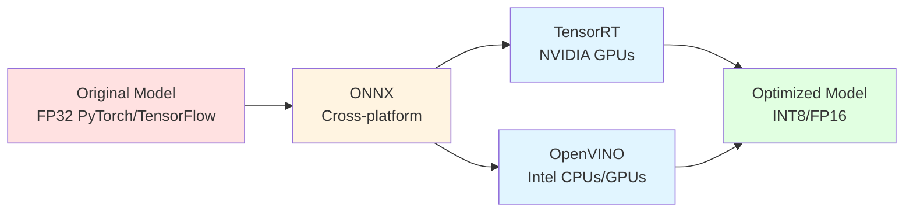
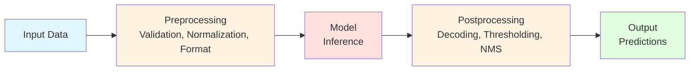
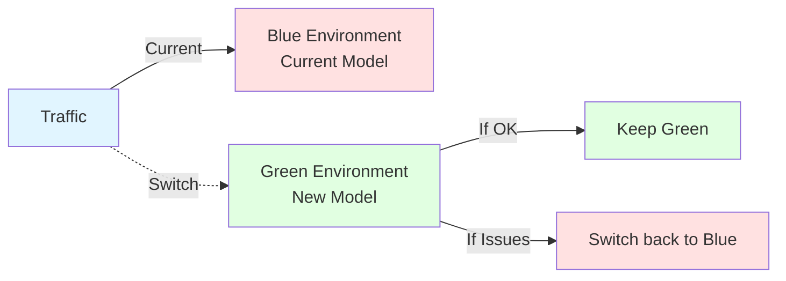
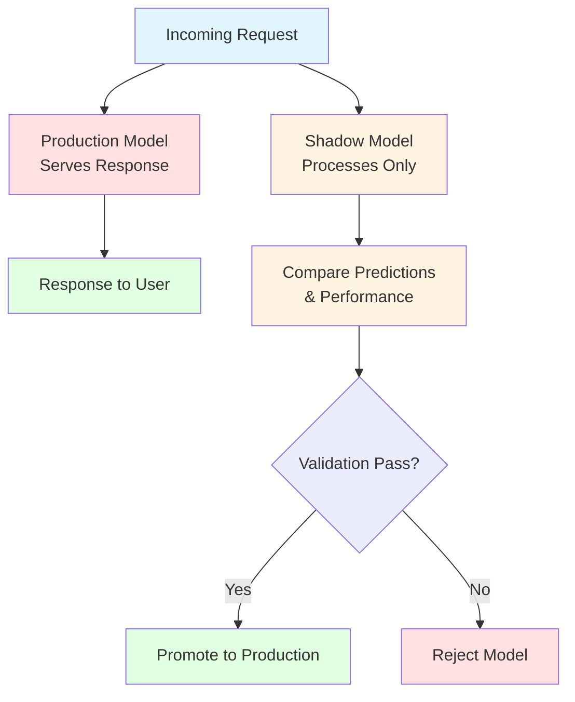
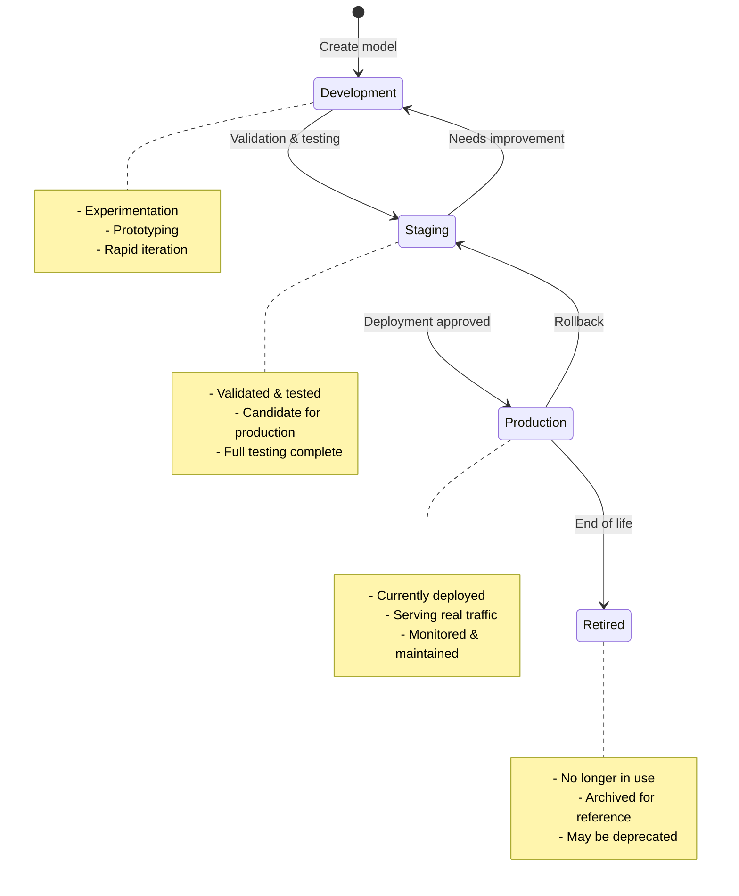
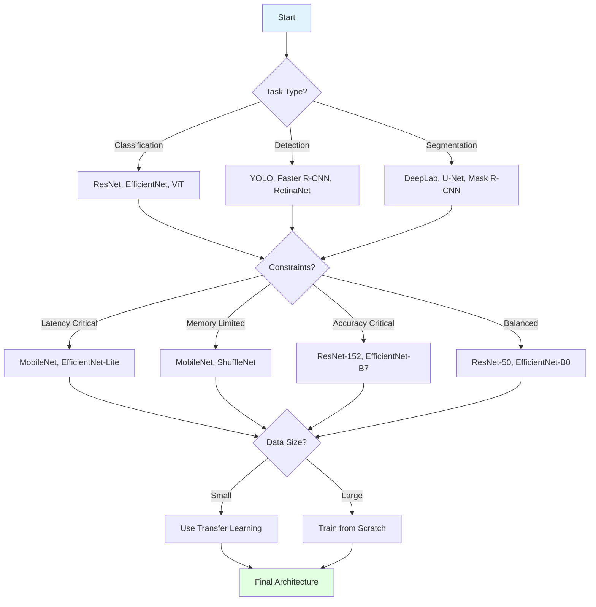

# MLOps Policy

**Status:** Authoritative
**Last updated:** 2026-03-12
**Purpose:** Comprehensive MLOps practices for experiment tracking, model lifecycle, serving, monitoring, and optimization

**See also:** [ML Experiment Tracking Policy](ml-experiment-tracking-policy.md) for learning-phase experiment tracking (EXPERIMENTS.md, git tags, minimal tracking discipline). Start there for new ML/CV projects; graduate to the tools in this policy (MLflow, W&B, DVC) when you have 10+ experiments.

---

## Table of Contents

- [Acronyms](#acronyms)
- [Core Principles](#1-core-principles)
- [Experiment Tracking & MLOps Tools](#2-experiment-tracking--mlops-tools)
- [Model Versioning & Registry](#3-model-versioning--registry)
- [Model Serving & Inference](#4-model-serving--inference)
- [Model Monitoring & Observability](#5-model-monitoring--observability)
- [Hyperparameter Tuning](#6-hyperparameter-tuning)
- [Distributed Training](#7-distributed-training)
- [Model Optimization & Compression](#8-model-optimization--compression)
- [Model Deployment Patterns](#9-model-deployment-patterns)
- [Model Lifecycle Management](#10-model-lifecycle-management)
- [ML Reproducibility](#11-ml-reproducibility)
- [Engineering Harness Requirement for AI/ML Projects](#12-engineering-harness-requirement-for-aiml-projects)
- [Cost Optimization & Resource Management](#13-cost-optimization--resource-management)
- [Research & Experimentation Methodology](#14-research--experimentation-methodology)
- [Model Architecture & Design](#15-model-architecture--design)
- [Quick Reference Cards](#quick-reference-cards)

---

## Acronyms

* **MLOps** — Machine Learning Operations
* **MLflow** — Open-source ML lifecycle platform
* **W&B** — Weights & Biases (experiment tracking)
* **DDP** — Distributed Data Parallel
* **ONNX** — Open Neural Network Exchange
* **TensorRT** — NVIDIA's inference optimization library
* **Triton** — NVIDIA Triton Inference Server
* **SHAP** — SHapley Additive exPlanations
* **LIME** — Local Interpretable Model-agnostic Explanations
* **Grad-CAM** — Gradient-weighted Class Activation Mapping
* **DVC** — Data Version Control
* **FP16** — 16-bit floating point
* **BF16** — BFloat16
* **INT8** — 8-bit integer quantization
* **CI/CD** — Continuous Integration/Continuous Deployment
* **E2E** — End-to-end (latency)
* **SLA** — Service Level Agreement
* **p50/p95/p99** — Latency percentiles (median, 95th, 99th)
* **FPS** — Frames per second
* **HIL** — Hardware-in-the-loop
* **SoC** — System-on-chip
* **DAG** — Directed Acyclic Graph (pipeline dependency graph)
* **IPC** — Inter-Process Communication
* **ROS** — Robot Operating System
* **QAT** — Quantization-Aware Training
* **AST** — Abstract Syntax Tree

---

## 1) Core Principles

1. **Reproducibility is non-negotiable.** Every experiment must be reproducible from code, data, and environment.
2. **Model lineage is mandatory.** Track code → data → model → deployment relationships.
3. **Monitoring before deployment.** No model goes to production without monitoring infrastructure.
4. **Systematic experimentation.** Use tools, not ad-hoc scripts, for experiment management.
5. **Cost awareness.** Track and optimize compute costs (training and inference).
6. **Safety first.** All model deployments must support rollback and have monitoring.
7. **Production ownership.** You own outcomes in production, not just models. Focus on "model-in-production under constraints", not just "model building".
8. **Stewardship over authorship.** Ownership shifts from authorship → stewardship. Before deploying, answer: why does it exist, what guarantees, failure modes, tests/invariants, rollback plan, who gets paged.
9. **Infrastructure services must run in containers.** All infrastructure services used for ML systems must run in containers (Docker/Podman), not as host-level installations. This includes (but is not limited to): MLflow servers, orchestration systems (Airflow/Prefect), monitoring stacks (Prometheus/Grafana), message brokers (Kafka/Redpanda), databases, and model serving infrastructure. The host OS must remain a clean execution substrate. Reproducible environments are achieved via containers (and later Kubernetes), not manual system package installation.
10. **Structured pipelines over notebooks.** ML/CV projects must be structured as modular, testable, repeatable pipelines — not notebooks, not scripts, not prompt-chaos. The mental model: **AI systems = modular, testable, repeatable pipelines**. This separates beginner ML users from ML/CV engineers.
11. **Verification is runtime infrastructure.** In probabilistic systems (LLMs, vision models), verification is not a QA phase — it is a runtime architectural layer. All model outputs must pass verification gates before affecting state. See [AI Systems Architecture](references/ai-systems-architecture.md).
12. **Evals over unit tests.** You cannot unit test a prompt or a vision model. Success is statistical (>90% accuracy on eval set), not binary. CI/CD runs evals, not just tests. Budget for eval costs ($2-10 per run) and runtime (~10-20 minutes).

---

## 1.1) Structured ML/CV Engineering: Pipeline Thinking Over Notebooks

### Core Mental Model

**Modern ML/CV engineers don't just call models — they build structured systems around models.**

This means:
- Breaking problems into **steps** (data ingestion → validation → preprocessing → inference → post-processing → evaluation → logging)
- Giving components **clear roles** (dataset_loader.py, augmentations.py, model_wrapper.py, evaluation.py, inference_pipeline.py)
- Adding **tools + validation + memory** (experiment tracking, data validation, metrics thresholds)
- Making behavior **repeatable, not prompt-chaos**

**Agent orchestration thinking = ML/CV pipeline thinking.** Same brain muscle.

### What Is Actually Valuable

#### A. Reusable Modules

Build composable units, not one giant script:

```
src/
 ├── data/
 │   ├── dataset_loader.py
 │   ├── augmentations.py
 │   └── splits.py
 ├── models/
 │   ├── model_wrapper.py
 │   └── architectures.py
 ├── inference/
 │   └── inference_pipeline.py
 ├── evaluation/
 │   └── metrics.py
 └── pipelines/
     └── training_pipeline.py
```

**Senior engineering behavior:** Modular, testable, maintainable.

#### B. Deterministic Workflows > Clever Prompts

Emphasize:
- Validation loops (dataset sanity checks, shape checks, distribution checks)
- Structured outputs (structured predictions + logs)
- Checks before moving forward (evaluation gates before deployment)

**Philosophy:** Never trust raw model output. Always verify.

#### C. Tool-Using Pipelines

CV systems call components:
- Load images
- Run OpenCV transforms
- Call PyTorch models
- Save predictions

**Architecture thinking:** Model is one step inside a larger system, not "the AI does everything".

### What You Do NOT Need To Dive Deep Into

As an ML/CV engineer, **do not sink months into:**
- ❌ Fancy agent orchestration frameworks
- ❌ Building general-purpose AI agents
- ❌ Becoming a "Claude Code power user"

That's tool specialization, not ML engineering. Use them **as helpers**, not as your career focus.

### The Correct Integration

| Agent/Skills Concept | ML/CV Equivalent You Should Practice |
| -------------------- | ------------------------------------ |
| Skill                 | Reusable pipeline module              |
| Agent workflow        | Data → Model → Evaluation pipeline   |
| Guardrails            | Data validation + metrics thresholds  |
| Tool calling          | Calling CV libraries + models         |
| Memory                | Experiment tracking (MLflow, W&B)    |
| Structured output     | Structured predictions + logs         |

**Translation that matters:**
> "How do I build **structured ML systems** instead of messy notebooks?"

### Practical Action

**Start writing your CV projects as structured pipelines, not notebooks.**

**Instead of:**
```
notebook.ipynb with everything inside
```

**Do:**
```
src/
 ├── data/
 ├── models/
 ├── inference/
 ├── evaluation/
 └── pipelines/
```

**That is the real skill** all these agent ecosystems are secretly training.

### Bottom Line

You don't need to become an "agent expert."

You need to absorb this engineering principle:

> **AI systems = modular, testable, repeatable pipelines — not prompts, not scripts, not notebooks.**

That mindset is what separates:
**Beginner ML user** → **ML/CV Engineer**

---

## 1.2) Production Ownership and Stewardship

### Stewardship Model for ML/CV Systems

**AI coding and MLOps shift ownership from authorship → stewardship.** When you deploy a model to production, you own the system's behavior, not just the model itself.

### Stewardship Questions (Mandatory Before Production Deployment)

Before deploying any model to production, you MUST be able to answer:

1. **Why does it exist?** What problem does it solve? What is the business/technical rationale?
2. **What guarantees?** What are the accuracy/performance guarantees? What invariants must hold?
3. **Failure modes?** What are the known failure modes? What edge cases can break it? What happens on distribution shift?
4. **Tests/invariants?** What tests verify correctness? What evaluation metrics are tracked? What stress slices are tested?
5. **Rollback plan?** How do we rollback if this breaks? What is the recovery procedure? Is the previous model version available?
6. **Who gets paged?** If this fails in production, who is responsible? What is the escalation path?

### Stable ML/CV Services (Long-Term Focus)

**Stable version:** "Model-in-production under constraints", not "model building".

**Stable ML/CV services:**
1. Applied ML systems engineering (production ML / MLOps)
2. Domain CV in physical world (manufacturing QA, logistics, safety, healthcare)
3. Data-centric AI (labeling strategy, dataset QA, error analysis)
4. Model evaluation/safety/compliance
5. Edge ML / real-time CV optimization

**Less stable:**
- "I will build you a model" (without operational ownership)
- Kaggle-style optimization without production constraints

**Single best long-term niche:**
**Computer Vision systems in industry + MLOps**, especially with edge constraints.

### Operational Readiness for ML/CV Systems

**Before deploying a model to production, ensure:**

- [ ] **Model registry:** Model versioned and registered in model registry (MLflow/W&B)
- [ ] **Evaluation:** Comprehensive evaluation on validation/test sets and stress slices
- [ ] **Monitoring:** Data drift detection, concept drift detection, performance monitoring configured
- [ ] **Inference infrastructure:** Model serving infrastructure tested (Triton, TorchServe, or custom)
- [ ] **Optimization:** Model optimized for deployment constraints (quantization, pruning if needed)
- [ ] **Deployment automation:** CI/CD pipeline tested for model deployment
- [ ] **Rollback capability:** Previous model version available and rollback procedure tested
- [ ] **Documentation:** Model documentation complete (architecture, training procedure, evaluation results, deployment requirements, known limitations)
- [ ] **Runbooks:** Operational procedures documented (how to monitor, how to respond to alerts, how to retrain)

### Engineering Contract for ML/CV

The engineering "contract" for ML/CV expands from "deliver model" to:

- **Spec quality:** Requirements are clear (accuracy thresholds, latency requirements, edge cases documented)
- **Verification depth:** Evaluation covers happy path, edge cases, stress slices, and failure modes
- **Operational readiness:** Monitoring, drift detection, staged rollouts, runbooks are in place
- **Production constraints:** Model optimized for deployment constraints (latency, memory, model size)

### Responsibility Does Not Move

**AI does not absolve you of responsibility:**
- Engineer deploying the model owns it
- Reviewer and service owner share accountability
- Organization owns liability

**AI expands the risk surface** (security, dependency hallucinations, model leakage, data leakage), so responsibility gets stricter, not looser.

---

## 2) Experiment Tracking & MLOps Tools

### 2.1 Tool Selection Framework

**Decision matrix:**

| Tool | Best For | When to Use |
|------|----------|-------------|
| **MLflow** | Open-source, self-hosted, full lifecycle | When you need model registry + tracking + serving in one tool |
| **Weights & Biases** | Cloud-hosted, collaboration, visualization | When you need best-in-class visualization and team collaboration |
| **TensorBoard** | TensorFlow/PyTorch native, lightweight | When you only need training visualization, minimal setup |
| **Custom SQL** | Full control, existing infrastructure | When you have existing SQL infrastructure and need tight integration |

**Default choice:** **MLflow** for production (open-source, full lifecycle, model registry).

**Alternative:** **Weights & Biases** if cloud-hosted collaboration is priority.

### 2.2 Experiment Structure & Naming

**Naming convention:**
```
<project>-<task>-<model-type>-<experiment-id>
```

Examples:
- `object-detection-yolo-v8-exp-001`
- `classification-resnet50-hyperopt-042`
- `segmentation-deeplabv3-ablation-015`

**Experiment metadata (mandatory):**
- Experiment name (descriptive)
- Tags (task, model, dataset, author)
- Description (what you're testing)
- Git commit hash
- Dataset version/snapshot
- Environment (CUDA, Python, framework versions)

### 2.3 Logging Standards

**Metrics (log every epoch/step):**
- Training loss
- Validation loss
- Primary metric (accuracy, mAP, IoU, etc.)
- Secondary metrics (precision, recall, F1, etc.)
- Learning rate
- Epoch/step number

**Parameters (log once per experiment):**
- Hyperparameters (learning rate, batch size, optimizer, etc.)
- Model architecture (config dict or reference)
- Training configuration (epochs, early stopping, etc.)
- Data configuration (augmentation, preprocessing, etc.)

**Artifacts (log at experiment end):**
- Model checkpoint (best validation)
- Model config file
- Training curves (plots)
- Evaluation results (confusion matrix, PR curves, etc.)
- Sample predictions (visualizations for CV)

**Code (log automatically):**
- Git commit hash
- Git branch
- Uncommitted changes flag
- Code diff (if uncommitted)

### 2.4 Experiment Comparison & Selection

**Comparison workflow:**
1. Filter experiments by tags/metrics
2. Compare metrics side-by-side
3. Analyze tradeoffs (accuracy vs latency vs cost)
4. Select best candidate based on criteria
5. Document selection rationale

**Selection criteria (in order):**
1. **Primary metric** (accuracy, mAP, etc.) — must meet minimum threshold
2. **Inference latency** — must meet SLA requirements
3. **Model size** — must fit deployment constraints
4. **Training cost** — consider for frequent retraining
5. **Robustness** — performance on edge cases

### 2.5 CI/CD Integration

**Automated experiment runs:**
- Trigger experiments from CI on data updates
- Run experiments on schedule (nightly, weekly)
- Run experiments on model architecture changes
- Fail CI if experiments don't meet baseline metrics

**Example CI workflow:**
```yaml
# .github/workflows/ml-experiment.yml
name: ML Experiment
on:
  push:
    paths:
      - 'models/**'
      - 'data/**'
jobs:
  experiment:
    runs-on: [self-hosted, gpu]
    steps:
      - uses: actions/checkout@v3
      - name: Run experiment
        run: |
          python scripts/train.py --experiment-name "auto-$(git rev-parse --short HEAD)"
      - name: Check metrics
        run: |
          python scripts/check_metrics.py --baseline 0.85
```

### 2.6 Cost Tracking

**Track per experiment:**
- GPU hours (training time × GPU count)
- Compute cost (if using cloud)
- Storage cost (checkpoints, artifacts)
- Data transfer cost

**Cost optimization:**
- Use spot instances for hyperparameter tuning
- Early stopping to reduce training time
- Model compression to reduce inference cost
- Batch inference to amortize costs

### 2.7 Integration with Spec-Driven Development

All ML experiments MUST be grounded in specifications:

**Required spec sections for ML systems:**

```markdown
### Requirement: Training Convergence
The training process SHALL achieve validation loss < 0.15 within 50 epochs.

#### Scenario: Baseline convergence
- **WHEN** training YOLOv8-n on COCO subset (10k images)
- **THEN** validation mAP@0.5 ≥ 0.45 by epoch 30
- **AND** loss curve shows no divergence

### Requirement: Hardware Efficiency
The training process SHALL utilize ≥ 90% GPU during batch processing.
```

**Experiment metadata MUST reference spec:**
- Spec file path and version
- Which requirements this experiment validates
- Acceptance criteria pass/fail status

**See:** `~/policies/rules/references/spec-protocols-guide.md` Section: "Best Practices for ML/CV Engineering"

---

## 3) Model Versioning & Registry

### 3.1 Model Versioning Scheme

**Semantic versioning for models:**
```
<major>.<minor>.<patch>
```

- **Major:** Breaking changes (architecture change, input/output format change)
- **Minor:** New features (improved accuracy, new capabilities)
- **Patch:** Bug fixes, minor improvements

**Examples:**
- `1.0.0` — Initial production model
- `1.1.0` — Improved accuracy (same architecture)
- `2.0.0` — Architecture change (ResNet50 → EfficientNet)

### 3.2 Model Registry Structure

**Registry stages:**
1. **None** — Experiment/model not registered
2. **Staging** — Candidate for production (validated, tested)
3. **Production** — Currently deployed
4. **Archived** — Retired, kept for reference

**Model metadata (mandatory):**
- Model version
- Model architecture (name, config)
- Training dataset (ID, version, snapshot)
- Training code (git commit, branch)
- Training hyperparameters
- Evaluation metrics (validation, test)
- Inference requirements (GPU, memory, latency)
- Model artifacts (checkpoint URI, ONNX URI, etc.)
- Author and date
- Notes (what changed, why)

### 3.3 Model Promotion Workflow

**Promotion path:** None → Staging → Production



**Staging requirements:**
- [ ] Meets minimum accuracy threshold
- [ ] Meets latency requirements
- [ ] Passes integration tests
- [ ] Documentation complete
- [ ] Security review passed (if applicable)

**Production requirements:**
- [ ] All staging requirements met
- [ ] A/B test or shadow mode validation (if replacing existing model)
- [ ] Rollback plan documented
- [ ] Monitoring configured
- [ ] Deployment automation tested

### 3.4 Model Lineage Tracking

**Track relationships:**
- **Code → Model:** Git commit → model version
- **Data → Model:** Dataset snapshot → model version
- **Model → Deployment:** Model version → deployment environment
- **Model → Model:** Parent model → fine-tuned model



**Lineage query examples:**
- "Which models were trained on dataset X?"
- "What code version produced model Y?"
- "Which deployments use model Z?"
- "What was the parent model of model W?"

### 3.5 Model Retirement & Deprecation

**Retirement criteria:**
- Model replaced by better version
- Model no longer meets accuracy requirements
- Model architecture deprecated
- Security vulnerability discovered

**Deprecation process:**
1. Mark model as deprecated in registry
2. Set deprecation date (30-90 days notice)
3. Notify all consumers
4. Provide migration guide to new model
5. Archive after deprecation period

---

## 4) Model Serving & Inference

### 4.1 Model Serving Architecture

**Architecture patterns:**

**Pattern 1: REST API (default for public APIs)**
- Simple HTTP/JSON interface
- Stateless, scalable
- Use for: Web apps, mobile apps, third-party integrations

**Pattern 2: gRPC (default for service-to-service)**
- Strong typing, high throughput
- Streaming support
- Use for: Internal services, high-throughput scenarios

**Pattern 3: Streaming (real-time)**
- WebSocket or gRPC streaming
- Low latency, continuous data
- Use for: Real-time video, live predictions

### 4.2 Model Server Selection

**Decision matrix:**

| Server | Best For | When to Use |
|--------|----------|-------------|
| **Triton** | Multi-framework, multi-model, high performance | Production inference, multiple models, GPU optimization |
| **TorchServe** | PyTorch models, simple deployment | PyTorch-only, quick deployment |
| **TensorFlow Serving** | TensorFlow models, production-grade | TensorFlow-only, Google ecosystem |
| **Custom FastAPI/Flask** | Full control, simple models | Small models, custom preprocessing, rapid prototyping |
| **ONNX Runtime** | Cross-platform, optimized | ONNX models, edge deployment |

**Default choice:** **Triton** for production (multi-framework, high performance, GPU optimization).

### 4.3 Model Optimization Formats

**Optimization pipeline:**



**ONNX (mandatory intermediate):**
- Export PyTorch/TensorFlow to ONNX
- Validate ONNX model
- Test ONNX inference matches original
- Use ONNX Runtime for CPU inference

**TensorRT (NVIDIA GPUs):**
- Convert ONNX to TensorRT
- Calibrate for INT8 quantization (if using)
- Benchmark latency/throughput
- Validate accuracy (should match ONNX)

**OpenVINO (Intel CPUs/GPUs):**
- Convert ONNX to OpenVINO IR
- Optimize for target hardware
- Benchmark and validate

### 4.4 Batch vs Real-Time Inference

**Batch inference (use when):**
- Latency requirements > 1 second
- Throughput is priority
- Cost optimization needed
- Processing large datasets

**Real-time inference (use when):**
- Latency requirements < 100ms
- User-facing applications
- Interactive systems
- Streaming data

**Hybrid approach:**
- Real-time for user requests
- Batch for background processing
- Queue system for load balancing

### 4.5 Inference Pipeline Patterns

**Standard pipeline:**



**Preprocessing:**
- Input validation (shape, type, range)
- Normalization/scaling
- Format conversion (RGB, BGR, etc.)
- Batching (for batch inference)

**Postprocessing:**
- Output decoding (class IDs, bounding boxes, etc.)
- Confidence thresholding
- Non-maximum suppression (for detection)
- Format conversion (JSON, protobuf, etc.)

**Error handling:**
- Invalid input → return error (don't crash)
- Model failure → fallback to previous model or default
- Timeout → return error or cached result

### 4.6 Edge Deployment Patterns

**Edge deployment options:**

**ONNX Runtime (cross-platform):**
- CPU inference on edge devices
- Mobile deployment (iOS, Android)
- Embedded systems

**TensorRT (NVIDIA edge devices):**
- Jetson devices
- Edge GPUs
- Optimized for NVIDIA hardware

**CoreML (Apple devices):**
- iOS/macOS deployment
- Neural Engine optimization
- Privacy (on-device inference)

**TensorFlow Lite (mobile/embedded):**
- Android deployment
- Microcontrollers
- Quantized models

### 4.7 Model Warmup & Cold Start

**Warmup strategy:**
- Load model on server startup
- Run dummy inference to initialize
- Pre-allocate GPU memory
- Keep model in memory (don't unload)

**Cold start mitigation:**
- Use model caching (keep in memory)
- Pre-warm instances (don't scale to zero)
- Use serverless with provisioned concurrency
- Batch requests during cold start

---

## 5) Model Monitoring & Observability

### 5.1 Data Drift Detection

**Statistical tests:**
- **KS test** (Kolmogorov-Smirnov) — distribution shifts
- **PSI** (Population Stability Index) — feature distribution changes
- **Chi-square test** — categorical feature changes
- **Mann-Whitney U test** — median shifts

**Monitoring frequency:**
- Real-time: Check every N requests (configurable)
- Batch: Daily/weekly analysis of inference data

**Alerting thresholds:**
- PSI > 0.25 → Warning
- PSI > 0.5 → Critical alert
- Distribution shift p-value < 0.05 → Alert

**Tools:**
- **Evidently AI** — open-source, Python-based
- **Fiddler** — enterprise, comprehensive
- **Arize** — cloud-hosted, ML-specific
- **Custom** — statistical tests in monitoring pipeline

### 5.2 Concept Drift Detection

**Detection methods:**
- **Performance degradation** — accuracy drops over time
- **Prediction distribution shifts** — output distribution changes
- **Error rate increases** — more failures over time

**Monitoring:**
- Track accuracy on labeled production data (if available)
- Monitor prediction confidence distributions
- Track error rates and failure modes
- Compare prediction distributions over time windows

**Alerting:**
- Accuracy drop > 5% → Warning
- Accuracy drop > 10% → Critical
- Error rate increase > 2x → Alert

### 5.3 Model Performance Monitoring

**Metrics to track:**
- **Latency:** p50, p95, p99 (milliseconds)
- **Throughput:** requests per second
- **Error rate:** percentage of failed requests
- **GPU utilization:** percentage (if GPU inference)
- **Memory usage:** peak and average
- **Accuracy:** if labeled data available

**Monitoring dashboards:**
- Real-time metrics (last hour)
- Historical trends (last 7 days, 30 days)
- Alerts and incidents
- Model version comparison

### 5.4 Prediction Monitoring

**Output distribution:**
- Track prediction confidence distributions
- Monitor for unexpected patterns (all high confidence, all low confidence)
- Detect anomalies in prediction values

**Anomaly detection:**
- Statistical outliers (Z-score > 3)
- Unusual prediction patterns
- Sudden changes in prediction distribution

### 5.5 Alerting & Escalation

**Alert levels:**
- **Info:** Normal operations, status updates
- **Warning:** Degradation detected, investigate
- **Critical:** Model failure, immediate action required

**Alert channels:**
- Slack/Teams for warnings
- PagerDuty/OnCall for critical alerts
- Email for daily summaries

**Escalation:**
- Warning → Investigate within 4 hours
- Critical → Immediate response, rollback if needed

### 5.6 A/B Testing Framework for Models

**A/B test setup:**
- Split traffic between model A and model B
- Track metrics for both models
- Statistical significance testing
- Gradual rollout (10% → 50% → 100%)

**Metrics to compare:**
- Primary metric (accuracy, mAP, etc.)
- Latency
- Error rate
- Business metrics (if applicable)

**Decision criteria:**
- New model must be better on primary metric (statistically significant)
- New model must not degrade latency significantly
- New model must not increase error rate

### 5.7 Shadow Mode Deployment

**Shadow mode pattern:**
- Deploy new model alongside production model
- New model processes requests but doesn't serve responses
- Compare predictions and performance
- Validate new model before promotion

**Use cases:**
- Validating new model architecture
- Testing model on real production data
- Comparing model performance without risk

### 5.8 Agent Observability & Cost Discipline

AI coding agents are operational components. When used in production or semi-production workflows, they require the same observability discipline as any other service.

**Required metrics (per agent execution):**

| Metric | Why |
|---|---|
| Wall-clock execution time | Latency budget, regression detection |
| Total tokens (input + output) | Cost accounting, budget enforcement |
| Output tokens | Generation cost, efficiency tracking |
| Number of tool calls | Complexity signal, agent behavior audit |
| Retry count | Reliability signal, context quality diagnostic |
| Failure mode | Root cause taxonomy, AGENTS.md improvement signal |

**Storage:**

```text
~/dev/devruns/<project>/agent-metrics/
├── YYYY-MM-DD-<task-hash>.json
└── summary.csv
```

Aligns with `development-environment-policy.md` artifact boundaries (`~/dev/devruns/`).

**Feedback loop:** These logs feed directly into the Agent Feedback Loop (see `versioning-and-release-policy.md`). If an agent class consistently exceeds cost or time budgets, the first corrective action is to review and improve the repository's `AGENTS.md`, not to blame the model.

> log → evaluate → monitor → improve. Agents that aren't observed can't be improved.

---

## 6) Hyperparameter Tuning

### 6.1 Search Strategies

**Grid Search:**
- Exhaustive search over parameter grid
- Use for: Small search spaces (< 10 parameters)
- Pros: Guaranteed to find best in grid
- Cons: Expensive, doesn't scale

**Random Search:**
- Random sampling of parameter space
- Use for: Medium search spaces (10-50 parameters)
- Pros: Better than grid for high-dimensional spaces
- Cons: No learning from previous trials

**Bayesian Optimization:**
- Uses prior knowledge to guide search
- Use for: Expensive evaluations, limited budget
- Tools: Optuna, Scikit-optimize, Weights & Biases Sweeps
- Pros: Efficient, learns from trials
- Cons: More complex setup

**Evolutionary Algorithms:**
- Genetic algorithms, evolutionary strategies
- Use for: Very large search spaces, multi-objective
- Tools: DEAP, PyGAD
- Pros: Good for complex spaces
- Cons: Slow convergence

**Default choice:** **Bayesian Optimization (Optuna)** for most cases.

### 6.2 Tools & Frameworks

**Optuna (recommended):**
- Python-based, easy integration
- Supports pruning, multi-objective
- Good visualization
- Integrates with MLflow, W&B

**Ray Tune:**
- Distributed hyperparameter tuning
- Good for large-scale experiments
- Integrates with Ray ecosystem

**Weights & Biases Sweeps:**
- Cloud-hosted, great visualization
- Easy collaboration
- Good for teams

**Example Optuna integration:**
```python
import optuna

def objective(trial):
    lr = trial.suggest_float('lr', 1e-5, 1e-2, log=True)
    batch_size = trial.suggest_int('batch_size', 16, 128)
    # ... train model ...
    return validation_accuracy

study = optuna.create_study(direction='maximize')
study.optimize(objective, n_trials=100)
```

### 6.3 Early Stopping Policies

**Early stopping criteria:**
- No improvement for N epochs (patience)
- Validation metric plateau
- Overfitting detected (train/val gap increases)

**Implementation:**
- Use framework callbacks (PyTorch EarlyStopping, Keras callbacks)
- Log to experiment tracker
- Save best model checkpoint

### 6.4 Resource Allocation

**Budget allocation:**
- Total GPU hours available
- Trials per experiment
- Parallel trials (if multiple GPUs)
- Time limit per trial

**Optimization:**
- Use pruning to stop bad trials early
- Prioritize promising parameter regions
- Use distributed tuning for large budgets

### 6.5 Multi-Objective Optimization

**Objectives (common tradeoffs):**
- Accuracy vs Latency
- Accuracy vs Model Size
- Accuracy vs Training Cost

**Pareto frontier:**
- Find all non-dominated solutions
- Visualize tradeoffs
- Select based on deployment constraints

**Tools:**
- Optuna (multi-objective support)
- NSGA-II (evolutionary algorithm)
- Custom Pareto analysis

### 6.6 Hyperparameter Importance Analysis

**Analyze which hyperparameters matter:**
- Use Optuna's importance analysis
- Plot hyperparameter vs metric relationships
- Identify critical vs non-critical parameters

**Use for:**
- Focusing search on important parameters
- Reducing search space
- Understanding model sensitivity

### 6.7 Algorithm Search & Discovery Framework

**Source:** Li, Schultz, Hennes & Lanctot (Google DeepMind, arXiv:2602.16928, Feb 2026). See `references/discovering-multiagent-learning-algorithms-with-llm.pdf`.

**Context:** LLM-driven code evolution (AlphaEvolve) can discover novel training algorithms that outperform hand-designed baselines. This shifts ML engineering from designing algorithms to designing search frameworks. The infrastructure below supports automated discovery of training algorithms, loss functions, scheduling rules, and optimization strategies.

#### 6.5.1 Evaluation Harness (mandatory)

Every ML project that supports algorithm search MUST include an objective fitness evaluation suite:

```text
<project>/
├── evaluation/
│   ├── benchmark.py        # Standard benchmark tasks
│   ├── metrics.py          # Fitness metrics (mAP, latency, calibration error, etc.)
│   └── run_suite.py        # Automated evaluation runner
```

The harness must:

- Accept any algorithm variant as input (no hardcoded assumptions)
- Return a scalar or ranked fitness metric
- Be deterministic given a fixed seed
- Log all results to experiment tracking (`mlops-policy.md` §2)

**Fitness metric selection:** Choose the metric that most directly measures what you're optimizing. Examples: mAP (detection), exploitability (game-theoretic), latency (serving), calibration error (probabilistic), energy consumption (edge).

#### 6.5.2 Swappable Algorithm Modules

Training logic MUST be modular — not hardcoded into a monolithic training loop.

```text
<project>/
├── training/
│   ├── optimizer.py              # Optimizer selection and configuration
│   ├── scheduler.py              # LR scheduling strategy
│   ├── loss.py                   # Loss function variants
│   └── exploration_strategy.py   # RL/search exploration policy (if applicable)
```

Each module must expose a standard interface so that a search system (LLM agent, AutoML, script) can mutate components independently. This is the "algorithm as genome" principle from the paper — the search system operates on code, not just hyperparameters.

#### 6.5.3 Automated Search Loop

For projects that perform algorithm discovery, require a search runner:

```text
<project>/
├── scripts/
│   └── search_loop.py    # Generate → Train → Evaluate → Log → Select
```

**Loop structure:**

1. **Generate candidate** — produce an algorithm variant (LLM mutation, AutoML, manual)
2. **Train** — run the variant through the training pipeline
3. **Evaluate** — measure fitness via the evaluation harness (§6.5.1)
4. **Log** — record full experiment metadata (§6.5.4)
5. **Select** — keep best, discard or archive rest

This is the same loop used in AlphaEvolve to discover VAD-CFR and SHOR-PSRO. The infrastructure must exist before the search begins.

#### 6.5.4 Algorithm Discovery Logging

Extends standard experiment logging (§2) with algorithm-discovery-specific fields:

| Field | Purpose | Required |
|---|---|---|
| Algorithm variant ID | Unique identifier for the candidate | Yes |
| Code diff | Exact code changes from parent variant | Yes |
| Hyperparameters | Full hyperparameter snapshot | Yes (already in §2) |
| Fitness metrics | Evaluation harness output | Yes |
| Dataset version | Pinned dataset used for evaluation | Yes (already in §2) |
| Parent variant | Lineage tracking — which variant was mutated | Yes |
| Generation method | How the variant was produced (LLM, AutoML, manual) | Yes |

**Storage:** Same experiment tracking infrastructure as §2 (`~/dev/devruns/<project>/`). Algorithm variants are versioned artifacts — treat them like model checkpoints.

**Career signal:** Future ML engineering shifts from designing algorithms to designing search frameworks. The valuable skills are evaluation system design, benchmark engineering, experiment infrastructure, and large-scale experiment orchestration. This section codifies that infrastructure.

---

## 7) Distributed Training

### 7.1 Multi-GPU Training

**DataParallel (single node, multiple GPUs):**
- Simple, built into PyTorch
- Use for: Single machine, 2-8 GPUs
- Limitations: GIL bottleneck, not optimal

**DistributedDataParallel (DDP) (recommended):**
- True parallelism, no GIL bottleneck
- Use for: Single or multi-node, 2+ GPUs
- Better performance than DataParallel

**PyTorch DDP example:**
```python
import torch.distributed as dist
from torch.nn.parallel import DistributedDataParallel as DDP

# Initialize process group
dist.init_process_group(backend='nccl')

# Wrap model
model = DDP(model, device_ids=[local_rank])

# Training loop (same as single GPU)
# DDP handles gradient synchronization automatically
```

### 7.2 Multi-Node Training

**Setup:**
- Multiple machines, each with GPUs
- Network communication (InfiniBand preferred)
- Process group initialization across nodes

**Frameworks:**
- **PyTorch DDP** — built-in, good for most cases
- **Horovod** — Uber's framework, good for TensorFlow/PyTorch
- **DeepSpeed** — Microsoft's framework, good for very large models

### 7.3 Gradient Synchronization

**All-reduce operation:**
- Each GPU computes gradients
- Gradients are averaged across all GPUs
- Averaged gradients applied to all models

**Communication backends:**
- **NCCL** — NVIDIA, best for GPUs
- **GLOO** — CPU, fallback option
- **MPI** — HPC environments

### 7.4 Fault Tolerance & Checkpointing

**Checkpointing strategy:**
- Save checkpoint every N steps/epochs
- Save on all ranks (or rank 0 only)
- Include optimizer state, random seeds, epoch number

**Fault recovery:**
- Resume from last checkpoint
- Restore process group
- Continue training from checkpoint

**Example:**
```python
# Save checkpoint
checkpoint = {
    'model': model.state_dict(),
    'optimizer': optimizer.state_dict(),
    'epoch': epoch,
    'rng_state': torch.get_rng_state(),
}
torch.save(checkpoint, f'checkpoint_epoch_{epoch}.pt')

# Load checkpoint
checkpoint = torch.load('checkpoint_epoch_10.pt')
model.load_state_dict(checkpoint['model'])
optimizer.load_state_dict(checkpoint['optimizer'])
epoch = checkpoint['epoch']
torch.set_rng_state(checkpoint['rng_state'])
```

### 7.5 Resource Allocation & Scheduling

**SLURM (HPC clusters):**
- Job scheduling for training jobs
- GPU allocation and queuing
- Multi-node job management

**Kubernetes (cloud):**
- Job scheduling for distributed training
- GPU node selection
- Auto-scaling (if needed)

**Resource requirements:**
- Number of GPUs
- GPU memory requirements
- Network bandwidth (for multi-node)
- Storage (for checkpoints)

### 7.6 Mixed Precision Training

**FP16 (half precision):**
- 2x memory savings
- 2x speedup (on modern GPUs)
- Use with automatic mixed precision (AMP)

**BF16 (bfloat16):**
- Better numerical stability than FP16
- Use for: Large models, training stability critical

**PyTorch AMP example:**
```python
from torch.cuda.amp import autocast, GradScaler

scaler = GradScaler()

for batch in dataloader:
    with autocast():
        output = model(batch)
        loss = criterion(output, target)

    scaler.scale(loss).backward()
    scaler.step(optimizer)
    scaler.update()
```

---

## 8) Model Optimization & Compression

### 8.1 Quantization Strategies

**INT8 Quantization:**
- 4x model size reduction
- 2-4x inference speedup
- Accuracy loss: typically < 1%

**Quantization types:**
- **Static quantization:** Calibrate on representative dataset, then quantize
- **Dynamic quantization:** Quantize on-the-fly (less accurate)
- **QAT (Quantization-Aware Training):** Train with quantization simulation

**Workflow:**
1. Train FP32 model
2. Calibrate on validation set (for static)
3. Quantize to INT8
4. Validate accuracy
5. Deploy if accuracy acceptable

**Tools:**
- PyTorch quantization (built-in)
- TensorRT (NVIDIA GPUs)
- ONNX Runtime quantization

### 8.2 Pruning Techniques

**Structured Pruning:**
- Remove entire channels/filters
- Hardware-friendly
- Use for: Significant size reduction

**Unstructured Pruning:**
- Remove individual weights
- Better compression ratio
- Use for: Maximum compression (requires sparse hardware)

**Magnitude-based Pruning:**
- Remove smallest weights
- Simple, effective
- Use for: General-purpose pruning

**Pruning workflow:**
1. Train model
2. Prune (remove N% of weights)
3. Fine-tune pruned model
4. Repeat until target sparsity

### 8.3 Knowledge Distillation

**Teacher-student pattern:**
- Large teacher model → Small student model
- Student learns from teacher's predictions
- Use for: Model compression with minimal accuracy loss

**Workflow:**
1. Train large teacher model
2. Train small student model with teacher's soft labels
3. Validate student matches teacher performance
4. Deploy student model

### 8.4 Model Compression Tools

**TensorRT (NVIDIA GPUs):**
- INT8 quantization
- Layer fusion
- Kernel auto-tuning
- Best for: NVIDIA GPU deployment

**ONNX Runtime:**
- Cross-platform optimization
- Quantization support
- Graph optimizations
- Best for: CPU inference, cross-platform

**OpenVINO (Intel):**
- Intel hardware optimization
- Quantization
- Best for: Intel CPUs/GPUs

### 8.5 Accuracy vs Speed Tradeoff

**Optimization workflow:**
1. Establish baseline (FP32 model, accuracy, latency)
2. Apply optimization (quantization, pruning, etc.)
3. Measure accuracy and latency
4. If accuracy loss acceptable → deploy
5. If not → try different optimization or accept tradeoff

**Decision criteria:**
- Accuracy loss < 1% → Accept
- Accuracy loss 1-3% → Evaluate use case
- Accuracy loss > 3% → Reject or retrain

### 8.6 Latency Engineering (Real-Time CV/ML Systems)

**Source:** Latency Policies for CV/ML Systems (Authoritative)

**Status:** Mandatory for real-time perception stacks (Mobileye/Waymo-class)

#### 8.6.1 Core Principle

**Latency is a SYSTEM property, not a model property.**

Never optimize algorithmic latency without measuring:
- System latency (scheduling, queuing, IPC, ROS middleware)
- Sensing-to-actuation latency (true E2E: camera → perception → planning → control)

#### 8.6.2 Latency Types (Must Distinguish)

**1. Algorithmic Latency**
```
Time spent in compute: preprocess → inference → postprocess
```

**2. System Latency**
```
Scheduling delays + queueing + memory copies +
serialization + IPC + ROS middleware + GPU sync
```

**3. Sensing-to-Actuation Latency (True E2E)**
```
Camera exposure → perception → planning → control → actuator
```

**Rule:** Measure all three. A 10ms model can have 80ms E2E latency due to system overhead.

#### 8.6.3 Percentiles Are the Truth (Not Mean)

**Real-time systems are dominated by TAIL LATENCY.**

**Mandatory reporting:**
- p50 (median)
- p95 (95th percentile)
- p99 (99th percentile)
- Max spikes (when relevant)

**Anti-pattern:**
```
❌ "Model runs at 20ms average"
✅ "Model: p50=15ms, p95=25ms, p99=45ms"
```

**Why:** A system with 20ms average but 120ms p99 will miss deadlines 1% of the time → unacceptable for autonomy.

#### 8.6.4 Queueing Dominates at Scale

**Key insight:** Even if inference is fast, unstable stages cause queue buildup.

**Consequence:** Latency increases super-linearly once utilization crosses threshold.

**Rule:** Design for **stable utilization** (headroom), NOT peak throughput.

**Example:**
```
Stage A: 10ms per frame, 100 FPS capacity
Load: 95 FPS → p99 latency = 50ms (queueing)
Load: 80 FPS → p99 latency = 12ms (headroom)
```

#### 8.6.5 Throughput ≠ Latency

**Critical distinction:**
- **Throughput** = frames/second capacity
- **Latency** = time per frame (including waiting)

**You can have:**
- High throughput + terrible tail latency (batching/queueing)
- Low throughput + excellent latency (strict real-time scheduling)

**Example:**
```
Batch inference:
- Throughput: 200 FPS
- p99 latency: 150ms (waits for batch to fill)

Single-frame inference:
- Throughput: 50 FPS
- p99 latency: 22ms (no waiting)
```

#### 8.6.6 Measurement Discipline (Mandatory)

**Every performance claim MUST include:**

```yaml
Hardware:
  target: NVIDIA RTX 4070
  clocks: Default
  precision: FP16

Input:
  size: 1280x720
  pipeline: Single-frame (no batching)

Measurement:
  harness: "PyTorch profiler"
  timing_start: "Tensor on GPU"
  timing_stop: "Result on CPU"
  warmup: 100 iterations
  steady_state: 1000 iterations

Results:
  p50: 15.2 ms
  p95: 18.7 ms
  p99: 24.3 ms
  max: 31.8 ms
```

**Anti-pattern:**
```
❌ "It's fast" (meaningless)
❌ "20ms on my GPU" (which GPU? what resolution? what percentile?)
```

#### 8.6.7 Define Latency Budget Up-Front

**Every real-time component MUST declare budget BEFORE design:**

```yaml
E2E Target:
  sensing_to_actuation: <80ms p99

Perception Allocation:
  perception_stack: <30ms p99

Sub-Stage Budget:
  decode: <5ms p99
  preprocess: <3ms p99
  inference: <15ms p99
  postprocess: <5ms p99
  total_slack: 2ms (buffer)
```

**Rule:** NO "optimize later". Budget first, then design.

#### 8.6.8 No Optimization Without Profiling

**Before touching code:**

1. **Identify bottleneck stage**
   ```bash
   # CPU profiling
   perf record -g python train.py
   perf report

   # GPU profiling
   nsys profile --stats=true python infer.py
   nsight-sys # GUI analysis
   ```

2. **Confirm it dominates p99**
   - Don't optimize 2ms stage when 40ms stage exists

3. **Profile, optimize, validate:**
   ```
   Baseline → Profile → Optimize → Re-profile → Validate p99
   ```

**Profilers:**
- **CPU:** perf, py-spy, cProfile
- **GPU:** Nsight Systems, Nsight Compute
- **System:** ftrace, flamegraphs, tracing

#### 8.6.9 No Regression Allowed

**Any optimization MUST include:**

```python
class LatencyOptimizationPR:
    baseline_numbers: dict  # p50/p95/p99 before
    new_numbers: dict       # p50/p95/p99 after
    acceptance_threshold: float = 0.05  # 5% regression max
    rollback_plan: str     # How to revert if fails

    def validate(self):
        improvement = (self.baseline_numbers['p99'] -
                      self.new_numbers['p99']) / self.baseline_numbers['p99']

        if improvement < -self.acceptance_threshold:
            raise RegressionError("p99 regressed by {:.1%}".format(-improvement))
```

**PR requirements:**
```markdown
## Latency Optimization

### Baseline
- p50: 25.3ms
- p95: 32.1ms
- p99: 48.7ms

### After Optimization
- p50: 18.2ms (-28%)
- p95: 22.4ms (-30%)
- p99: 29.1ms (-40%)

### Acceptance
- ✅ All percentiles improved
- ✅ No accuracy regression (mAP: 0.847 → 0.846, -0.1%)
- ✅ Rollback: `git revert abc123`

### Validation
```bash
python benchmark.py --model optimized --n 1000
```
```

#### 8.6.10 Production Trade-Offs (Autonomy Systems)

**1. Accuracy vs Latency**

Common levers:
```python
# Reduce input resolution
input_size = (1280, 720)  # instead of (1920, 1080)
speedup = 1.8x
accuracy_loss = -2.3%  # mAP

# Shrink backbone
model = 'efficientnet-b0'  # instead of 'efficientnet-b3'
speedup = 3.2x
accuracy_loss = -4.1%

# Reduce temporal window
temporal_frames = 3  # instead of 8
speedup = 1.4x
accuracy_loss = -1.8%
```

**Trade-off:** Fewer features → more fragile edge cases.

---

**2. Determinism vs Maximum Performance**

Determinism levers:
```python
# Fixed batch size (vs dynamic)
batch_size = 1  # Always
# Benefit: Predictable p99
# Cost: Lower throughput

# Fixed memory pools (vs dynamic allocation)
torch.backends.cudnn.benchmark = False
# Benefit: No allocation spikes
# Cost: Slightly slower first iteration

# Avoiding Python runtime in critical loop
use_cpp_inference = True  # TorchScript/ONNX
# Benefit: No GIL, no Python overhead
# Cost: Less flexibility
```

**Trade-off:** Less flexibility, more engineering burden.

---

**3. Batching vs Tail Latency**

```python
# Batching increases throughput but hurts p99

# No batching
batch_size = 1
throughput = 50 FPS
p99_latency = 22ms

# Batching
batch_size = 8
throughput = 200 FPS
p99_latency = 150ms  # Waits for batch to fill
```

**Rule:** Batching is usually **incompatible** with strict real-time perception unless hard deadline drop policy enforced.

---

**4. Pipeline Parallelism vs Complexity**

```python
# Sequential pipeline
decode → preprocess → infer → postprocess
latency = 5 + 3 + 15 + 5 = 28ms
throughput = 35 FPS

# Pipelined stages (overlap)
# decode(frame N) || infer(frame N-1) || postprocess(frame N-2)
latency_first_frame = 28ms
throughput = 66 FPS (limited by slowest stage: 15ms infer)
```

**Trade-off:** Race conditions, ordering bugs, harder debugging.

---

**5. Model Compression vs Robustness**

Compression techniques:
```python
# INT8 quantization
speedup = 2.5x
accuracy_loss_average = -0.8%  # Acceptable

# BUT: Long-tail degradation
rare_classes_loss = -12%  # Unacceptable
unusual_lighting_loss = -5%
```

**Typical failure modes:**
- Rare classes disappear (not captured in mAP)
- Calibration drift in unusual lighting/weather
- Long-tail degradation not visible in validation

**Mitigation:**
- Test on edge-case datasets
- Monitor per-class metrics
- QAT (Quantization-Aware Training)

---

**6. Memory Bandwidth Dominates on Edge**

On SoCs/embedded devices:
```python
# Memory movement often > compute time

# Bad: CPU↔GPU ping-pong
for layer in model:
    output = gpu_compute(layer, input)
    cpu_process(output)  # ← Expensive transfer!

# Good: Keep data on GPU
output = gpu_compute(entire_model, input)
final_result = cpu_postprocess(output)  # Single transfer
```

**Optimization focus (embedded):**
- Fuse kernels (reduce memory writes)
- Reduce tensor copies
- Use correct layouts (NHWC vs NCHW)
- Avoid unnecessary data transfers

#### 8.6.11 Standard Latency Tactics (Approved)

**Architectural:**
```python
# Simplify pipeline DAG
# Before: decode → resize → normalize → pad → to_tensor → gpu_copy
# After:  decode → combined_preprocess (fused) → gpu_copy
speedup = 1.8x

# Remove redundant transforms
# Check: Are you normalizing twice?

# Enforce bounded queues (backpressure)
queue = Queue(maxsize=2)  # Drop frames if can't keep up
# Prevents unbounded latency growth
```

**ML-Side:**
```python
# Smaller backbone
model = 'mobilenet_v3_small'  # vs resnet50

# Reduce input dimensions
input_size = (640, 480)  # vs (1280, 720)

# Early exit networks (when safe)
# Exit at layer 5 for easy cases, layer 12 for hard cases
# Only if confidence calibration works

# Reduce temporal aggregation
temporal_window = 2  # vs 8 frames
```

**Compilation/Runtime:**
```python
# TensorRT / ONNX Runtime
model = torch_tensorrt.compile(model,
    inputs=[torch_tensorrt.Input(shape=(1, 3, 224, 224))],
    enabled_precisions={torch.float16}
)

# Static shapes (avoid dynamic)
model = torch.jit.trace(model, example_input)  # vs torch.jit.script

# Pinned memory / zero-copy
input_tensor = torch.empty(size, pin_memory=True)

# Pre-allocated buffers
output_buffer = torch.empty(output_size, device='cuda')
```

#### 8.6.12 Default Acceptance Criteria (PRs)

**For any latency work, PR MUST include:**

```markdown
## Latency Validation

### Hardware
- GPU: NVIDIA RTX 4070
- CPU: AMD Ryzen 9 5950X
- CUDA: 11.8

### Input Specification
- Resolution: 1280x720
- Batch size: 1
- Pipeline: Single-frame

### Measurement Harness
```bash
python benchmark.py \
  --model models/optimized_v2.onnx \
  --input-size 1280 720 \
  --iterations 1000 \
  --warmup 100 \
  --percentiles 50 95 99
```

### Results

| Metric | Baseline | Optimized | Change |
|--------|----------|-----------|--------|
| p50    | 25.3ms   | 18.2ms    | -28%   |
| p95    | 32.1ms   | 22.4ms    | -30%   |
| p99    | 48.7ms   | 29.1ms    | -40%   |

### Quality Validation
- mAP: 0.847 → 0.846 (-0.1%, acceptable)
- Per-class metrics: No class degraded >2%
- Edge cases tested: Rain, night, fog

### Acceptance
- ✅ p99 improved by 40%
- ✅ No quality regression >1%
- ✅ Rollback plan: `git revert abc123; deploy models/baseline_v1.onnx`
```

**Rejection criteria:**
- Missing percentiles (only average reported)
- No hardware specification
- No quality validation
- p99 regression without justification
- No rollback plan

#### 8.6.13 Enforcement

**This latency policy is AUTHORITATIVE for:**
- Any repo touching CV/ML runtime paths
- Real-time perception stacks
- Production autonomy systems (Mobileye/Waymo-class)

**Exceptions:**
- Must be logged in versioning policy (exception section)
- Require technical justification
- Approved by tech lead

**Consequences of non-compliance:**
- PR blocked until latency validation added
- Post-deployment: If p99 SLA violated, immediate rollback required

---

## 9) Model Deployment Patterns

### 9.1 Canary Deployment

**Pattern:**
- Deploy new model to small percentage of traffic (5-10%)
- Monitor metrics
- Gradually increase if metrics good
- Rollback if metrics degrade

**Use for:**
- Low-risk model updates
- Validating new models on real traffic

### 9.2 Blue-Green Deployment

**Pattern:**



- Two identical production environments
- Deploy new model to "green" environment
- Switch traffic from "blue" to "green"
- Keep "blue" as rollback option

**Use for:**
- Zero-downtime deployments
- Fast rollback capability

### 9.3 Shadow Mode Deployment

**Pattern:**



- Deploy new model alongside production
- New model processes requests but doesn't serve
- Compare predictions and performance
- Promote if validation passes

**Use for:**
- High-risk model changes
- Validating on real production data

### 9.4 Gradual Rollout

**Pattern:**
- Deploy to 10% → 25% → 50% → 100%
- Monitor at each stage
- Pause or rollback if issues detected

**Use for:**
- Conservative deployments
- Large model changes

### 9.5 Rollback Procedures

**Rollback triggers:**
- Accuracy degradation > 5%
- Latency increase > 50%
- Error rate increase > 2x
- Critical bugs discovered

**Rollback process:**
1. Immediately switch to previous model version
2. Investigate root cause
3. Fix issues
4. Re-deploy after validation

**Automation:**
- Automatic rollback on critical alerts
- Manual rollback for warnings
- Rollback testing in staging

### 9.6 Model Deployment Automation (CI/CD)

**CI/CD pipeline:**
1. **Build:** Package model artifacts
2. **Test:** Run integration tests
3. **Validate:** Check metrics meet thresholds
4. **Deploy:** Deploy to staging
5. **Validate staging:** Run smoke tests
6. **Deploy production:** Gradual rollout
7. **Monitor:** Track metrics, alert on issues

**Example GitHub Actions:**
```yaml
name: Deploy Model
on:
  push:
    tags:
      - 'model-v*'
jobs:
  deploy:
    runs-on: ubuntu-latest
    steps:
      - uses: actions/checkout@v3
      - name: Validate model
        run: python scripts/validate_model.py
      - name: Deploy to staging
        run: python scripts/deploy.py --env staging
      - name: Run smoke tests
        run: python scripts/smoke_tests.py
      - name: Deploy to production
        run: python scripts/deploy.py --env production --rollout 10
```

### 9.7 Multi-Region Deployment

**Pattern:**
- Deploy model to multiple regions
- Route traffic based on latency/availability
- Sync model versions across regions
- Handle regional data differences

**Use for:**
- Global applications
- Latency requirements
- High availability

---

## 9.6 Layered Orchestration Architecture for AI/ML Systems

**Reference:** See [`langgraph-engineering-notes.md`](references/langgraph-engineering-notes.md) for LangGraph implementation details.

**Architecture pattern:** Three-layer orchestration model for production AI/ML systems:

```
Data Orchestrator (Airflow/Dagster) → Controls schedules, retries, SLAs
         ↓
Task containers / model jobs / ETL
         ↓
Inside tasks: LangGraph → coarse AI coordination & agent workflows
```

### Layer 1: Data Orchestrator (Airflow/Dagster)

**Responsibilities:**
- Schedule execution (cron-like, event-driven, or manual triggers)
- Retry logic and failure handling
- SLA monitoring and alerting
- Dependency management between tasks
- Resource allocation and queuing
- Cross-task state management

**When to use:**
- Long-running workflows (hours to days)
- Multi-step pipelines with dependencies
- Scheduled batch jobs (daily, weekly, hourly)
- ETL/data processing workflows
- Model training pipelines
- Cross-service coordination

**Tools:**
- **Airflow:** Mature, Python-based, good for complex DAGs
- **Dagster:** Data-aware, good for data pipelines, better observability
- **Prefect:** Modern, Python-native, good for ML workflows

**Default choice:** **Dagster** for data-aware pipelines, **Airflow** for complex scheduling needs.

### Layer 2: Task Containers / Model Jobs / ETL

**Responsibilities:**
- Execute individual tasks (model training, inference, data processing)
- Containerized execution (Docker/Podman)
- Resource isolation and limits
- Task-level logging and metrics
- Idempotent task execution

**Task types:**
- **Model training jobs:** Long-running GPU workloads
- **ETL jobs:** Data extraction, transformation, loading
- **Inference jobs:** Batch prediction, model evaluation
- **Data validation:** Schema checks, quality gates

**Container requirements:**
- All tasks MUST run in containers (see Core Principle #9)
- Container images must be versioned and reproducible
- Resource limits (CPU, memory, GPU) must be defined
- Task outputs must be persisted to shared storage

### Layer 3: LangGraph (Inside Tasks) — AI Coordination & Agent Workflows

**Responsibilities:**
- Coarse-grained AI coordination within a single task
- Multi-step agent workflows with state management
- Human-in-the-loop checkpoints
- Agent-to-agent communication
- Conditional routing and branching

**When to use LangGraph inside tasks:**
- Multi-step AI workflows (planning → execution → validation)
- Agent coordination (supervisor → specialized agents)
- Stateful AI processes (conversation, iterative refinement)
- Human approval gates before irreversible actions
- Complex branching logic based on AI decisions

**When NOT to use LangGraph:**
- Single-turn tasks (use simple tool use)
- Linear pipelines (use plain Python functions)
- Tasks that don't need state persistence
- Tasks without branching or cycles

**Integration pattern:**
```python
# Inside a task container (orchestrated by Airflow/Dagster)
from langgraph.graph import StateGraph
from langgraph.checkpoint.postgres import PostgresSaver

# Define LangGraph workflow
builder = StateGraph(State)
builder.add_node("plan", plan_agent)
builder.add_node("execute", execute_agent)
builder.add_node("validate", validate_agent)
builder.add_conditional_edges("plan", route_to_execute_or_retry)

# Compile with checkpointer for fault tolerance
checkpointer = PostgresSaver(connection_string=os.getenv("DB_URL"))
graph = builder.compile(checkpointer=checkpointer)

# Execute within task
result = graph.invoke(
    {"task": task_input},
    config={"configurable": {"thread_id": f"task-{task_id}"}}
)
```

**Key principles:**
- LangGraph handles **coarse-grained** AI coordination (steps, not individual API calls)
- Data orchestrator handles **fine-grained** scheduling (when tasks run, retries, SLAs)
- Each layer has clear boundaries and responsibilities
- Fault tolerance at both levels (orchestrator retries tasks, LangGraph checkpoints state)

### Architecture Benefits

**Separation of concerns:**
- Orchestrator: **When** and **how often** tasks run
- Task containers: **What** gets executed and **where** it runs
- LangGraph: **How** AI agents coordinate within a task

**Fault tolerance:**
- Orchestrator handles task-level failures (retry, alert, rollback)
- LangGraph handles agent-level failures (checkpoint, resume, human-in-the-loop)

**Observability:**
- Orchestrator: Task execution history, schedules, SLAs
- Task containers: Resource usage, logs, exit codes
- LangGraph: State transitions, agent decisions, token usage (via LangSmith)

**Scalability:**
- Orchestrator: Distribute tasks across clusters
- Task containers: Scale horizontally with Kubernetes
- LangGraph: Stateless graph execution (checkpointed state in DB)

### Anti-Patterns to Avoid

❌ **Using LangGraph as the orchestrator:** LangGraph is for AI coordination within tasks, not for scheduling or retries across tasks.

❌ **Putting orchestrator logic in LangGraph:** Don't encode scheduling, retries, or SLA logic in LangGraph nodes. That belongs in Airflow/Dagster.

❌ **Mixing layers:** Don't have LangGraph call orchestrator APIs or vice versa. Keep layers independent.

❌ **Over-engineering:** If your workflow is linear and doesn't need AI coordination, use plain Python functions, not LangGraph.

### Decision Tree

**Use Data Orchestrator (Airflow/Dagster) when:**
- You need scheduling, retries, or SLAs
- You have multi-step pipelines with dependencies
- You need to coordinate across services

**Use LangGraph inside tasks when:**
- You have multi-step AI workflows with branching
- You need stateful agent coordination
- You need human-in-the-loop checkpoints
- You have conditional routing based on AI decisions

**Use plain Python functions when:**
- Workflow is linear and deterministic
- No AI coordination needed
- Simple data processing or model inference

**See also:**
- [`langgraph-engineering-notes.md`](references/langgraph-engineering-notes.md) for LangGraph implementation details
- [`ml-cv-operations-policy.md`](ml-cv-operations-policy.md) Section 15.5 for data pipeline orchestration patterns

---

## 10) Model Lifecycle Management

### 10.1 Lifecycle Stages



**Development:**
- Experimentation and prototyping
- Not production-ready
- Rapid iteration

**Staging:**
- Validated and tested
- Candidate for production
- Full testing and validation

**Production:**
- Currently deployed
- Serving real traffic
- Monitored and maintained

**Retired:**
- No longer in use
- Archived for reference
- May be deprecated

### 10.2 Model Retirement Criteria

**Retire when:**
- Replaced by better model
- No longer meets accuracy requirements
- Architecture deprecated
- Security vulnerability discovered
- Business requirements changed

### 10.3 Model Refresh Policies

**When to retrain:**
- **Scheduled:** Monthly, quarterly (based on data refresh)
- **Triggered:** Data drift detected, performance degradation
- **On-demand:** New data available, architecture improvements

**Retraining workflow:**
1. Collect new data
2. Validate data quality
3. Retrain model
4. Compare with current production model
5. Deploy if better, keep current if not

### 10.4 Model Deprecation & Migration

**Deprecation process:**
1. Mark model as deprecated in registry
2. Set deprecation date (30-90 days)
3. Notify all consumers
4. Provide migration guide
5. Support during migration period
6. Archive after deprecation

**Migration support:**
- API compatibility layer (if possible)
- Migration scripts and tools
- Documentation and examples
- Support during transition

### 10.5 Model Documentation Standards

**Required documentation:**
- Model architecture and design
- Training procedure and hyperparameters
- Evaluation results and metrics
- Deployment requirements (GPU, memory, etc.)
- API documentation (inputs, outputs)
- Known limitations and edge cases
- Performance characteristics (latency, throughput)

---

## 11) ML Reproducibility

### 11.1 Reproducibility Checklist

**Code:**
- [ ] Git commit hash logged
- [ ] All code in version control
- [ ] No uncommitted changes in production runs

**Data:**
- [ ] Dataset version/snapshot ID logged
- [ ] Data preprocessing steps documented
- [ ] Data splits (train/val/test) fixed and logged

**Environment:**
- [ ] Python version pinned
- [ ] CUDA/cuDNN versions pinned
- [ ] All dependencies pinned (lockfile)
- [ ] System libraries documented (if relevant)

**Randomness:**
- [ ] Random seeds set and logged
- [ ] NumPy, PyTorch, Python random seeds
- [ ] CUDA deterministic mode (if needed)

**Hardware:**
- [ ] GPU model and driver version logged
- [ ] CPU model logged (if relevant)
- [ ] Memory configuration logged

### 11.2 Deterministic Training

**PyTorch deterministic mode:**
```python
import torch
torch.manual_seed(42)
torch.cuda.manual_seed_all(42)
torch.backends.cudnn.deterministic = True
torch.backends.cudnn.benchmark = False
```

**NumPy/Python random:**
```python
import numpy as np
import random

np.random.seed(42)
random.seed(42)
```

**Note:** Deterministic mode may reduce performance. Use only when reproducibility is critical.

### 11.3 Environment Pinning

**Python:**
- Pin Python version in `pyproject.toml` or `.python-version`
- Use pyenv or conda for version management

**CUDA/cuDNN:**
- Document CUDA version in README
- Pin cuDNN version
- Use Docker for consistent environments

**Dependencies:**
- Use lockfiles (poetry.lock, requirements.lock)
- Pin all dependencies (no floating versions)
- Document system dependencies

### 11.4 Reproducibility Validation

**Test reproducibility:**
- Run same experiment twice
- Compare results (should be identical or very close)
- Validate checkpoints match
- Validate metrics match

**Reproducibility tools:**
- **DVC** — Data version control, experiment tracking
- **MLflow** — Experiment tracking, reproducibility
- **Weights & Biases** — Experiment tracking, reproducibility

### 11.5 Reproducibility Workflow

**Before training:**
1. Set all random seeds
2. Log environment (Python, CUDA, dependencies)
3. Log data version
4. Log code commit

**During training:**
1. Log hyperparameters
2. Log training progress
3. Save checkpoints at fixed intervals

**After training:**
1. Log final metrics
2. Save model artifacts
3. Document any deviations from standard process

---

## 12) Cost Optimization & Resource Management

### 12.1 GPU Resource Allocation

**Training:**
- Use spot instances for long-running jobs
- Right-size GPU instances (don't over-provision)
- Use multi-GPU efficiently (avoid idle GPUs)
- Schedule training during off-peak hours (if possible)

**Inference:**
- Use smaller GPU instances for inference
- Batch requests to maximize GPU utilization
- Use CPU inference for small models
- Consider edge deployment for low-latency requirements

### 12.2 Inference Cost Optimization

**Batch size optimization:**
- Larger batches = better GPU utilization
- Balance latency vs throughput
- Dynamic batching (wait for N requests or timeout)

**Model optimization:**
- Quantization reduces compute cost
- Pruning reduces memory and compute
- Smaller models = lower serving costs

**Caching:**
- Cache predictions for repeated inputs
- Use CDN for static model artifacts
- Cache preprocessing results

### 12.3 Training Cost Tracking

**Track per experiment:**
- GPU hours (training time × GPU count)
- Compute cost (if cloud)
- Storage cost (checkpoints, datasets)
- Data transfer cost

**Optimization:**
- Early stopping to reduce training time
- Efficient hyperparameter search (pruning)
- Use spot instances for hyperparameter tuning
- Right-size training instances

### 12.4 Cloud Cost Management

**Spot instances:**
- Use for training jobs (can tolerate interruptions)
- 50-90% cost savings
- Implement checkpointing for fault tolerance

**Reserved capacity:**
- Use for production inference (predictable load)
- 30-70% cost savings
- Commit to 1-3 year terms

**Auto-scaling:**
- Scale down during low traffic
- Scale up during peak traffic
- Use predictive scaling if possible

### 12.5 Cost vs Performance Tradeoff

**Decision framework:**
- **Accuracy:** Must meet minimum threshold
- **Latency:** Must meet SLA requirements
- **Cost:** Optimize within constraints
- **Model size:** Must fit deployment constraints

**Optimization order:**
1. Meet accuracy requirements
2. Meet latency requirements
3. Optimize cost (model optimization, resource allocation)
4. Optimize model size (if needed)

---

## 13) Research & Experimentation Methodology

### 13.1 Experimental Design Principles

**Core principles:**
1. **Hypothesis-driven:** Every experiment tests a specific hypothesis
2. **Controlled variables:** Change one variable at a time (when possible)
3. **Baseline required:** Always compare against a baseline
4. **Statistical rigor:** Use appropriate statistical tests
5. **Reproducibility:** Experiments must be reproducible

**Hypothesis formulation:**
- **Format:** "If [change], then [outcome], because [rationale]"
- **Example:** "If we use data augmentation, then mAP will increase by 5%, because it reduces overfitting"
- **Must be:** Specific, measurable, testable, falsifiable

### 13.2 Statistical Significance Testing

**When to use statistical tests:**
- Comparing two models (A/B testing)
- Evaluating if improvement is real or noise
- Validating that changes have meaningful impact

**Common statistical tests:**

**T-test (paired or unpaired):**
- Use for: Comparing means of two groups
- Example: Comparing accuracy of Model A vs Model B
- Requirements: Normal distribution (approximately), independent samples

**Mann-Whitney U test (non-parametric):**
- Use for: Comparing medians when data not normally distributed
- Example: Comparing inference latency distributions
- Requirements: Independent samples, ordinal/continuous data

**Chi-square test:**
- Use for: Comparing categorical distributions
- Example: Comparing confusion matrices
- Requirements: Independent samples, categorical data

**Kolmogorov-Smirnov test:**
- Use for: Comparing distributions
- Example: Comparing prediction distributions
- Requirements: Continuous data

**Significance thresholds:**
- **p < 0.05:** Significant (5% chance of false positive)
- **p < 0.01:** Highly significant (1% chance of false positive)
- **p < 0.001:** Very highly significant (0.1% chance of false positive)

**Effect size:**
- Don't just report p-values; report effect size
- **Cohen's d:** For comparing means (small: 0.2, medium: 0.5, large: 0.8)
- **Relative improvement:** Percentage change (e.g., "5% improvement in mAP")

### 13.3 Power Analysis

**Power analysis determines:**
- Sample size needed to detect an effect
- Minimum effect size detectable with given sample size
- Statistical power (probability of detecting true effect)

**When to do power analysis:**
- Before starting experiments (to determine sample size)
- When results are not significant (to check if underpowered)
- When planning A/B tests

**Example:**
```python
from statsmodels.stats.power import TTestIndPower

# Calculate sample size needed
effect_size = 0.5  # Medium effect
alpha = 0.05  # Significance level
power = 0.80  # 80% power

analysis = TTestIndPower()
sample_size = analysis.solve_power(
    effect_size=effect_size,
    alpha=alpha,
    power=power,
    ratio=1.0  # Equal group sizes
)
print(f"Sample size needed per group: {sample_size}")
```

### 13.4 A/B Testing Framework (Detailed)

**A/B testing workflow:**

1. **Formulate hypothesis:**
   - Null hypothesis (H0): No difference between A and B
   - Alternative hypothesis (H1): B is better than A

2. **Design experiment:**
   - Determine sample size (power analysis)
   - Random assignment to groups
   - Control for confounding variables

3. **Run experiment:**
   - Collect data for both groups
   - Ensure equal conditions (except treatment)

4. **Analyze results:**
   - Statistical test (t-test, Mann-Whitney, etc.)
   - Calculate effect size
   - Check assumptions (normality, independence)

5. **Interpret results:**
   - If p < 0.05: Reject H0, accept H1
   - If p >= 0.05: Fail to reject H0
   - Consider practical significance (effect size)

**Common pitfalls:**
- **Multiple comparisons:** Adjust p-values (Bonferroni, FDR)
- **Peeking:** Don't stop early based on interim results
- **Sample size:** Too small = underpowered, too large = wasteful
- **Confounding:** Control for all variables except treatment

### 13.5 Experimental Design Patterns

**Single-factor experiments:**
- Change one variable, measure outcome
- Use for: Hyperparameter tuning, feature selection
- Example: Test learning rates [0.001, 0.01, 0.1]

**Factorial designs:**
- Test multiple factors simultaneously
- Use for: Understanding interactions
- Example: Test learning rate × batch size combinations

**Block designs:**
- Group similar experiments together
- Use for: Controlling for dataset variation
- Example: Test all models on same train/val/test splits

**Repeated measures:**
- Same subjects measured multiple times
- Use for: Comparing models on same test set
- Example: Evaluate all models on same test images

### 13.6 Hypothesis Testing Workflow

**Step-by-step workflow:**

1. **State hypothesis:**
   - H0: No effect (e.g., "Model A = Model B")
   - H1: Effect exists (e.g., "Model B > Model A")

2. **Choose significance level:**
   - α = 0.05 (standard)
   - α = 0.01 (more strict)

3. **Select statistical test:**
   - Based on data type and distribution
   - Check assumptions

4. **Calculate test statistic:**
   - Run test on data
   - Get p-value

5. **Make decision:**
   - If p < α: Reject H0, accept H1
   - If p >= α: Fail to reject H0

6. **Report results:**
   - Test statistic, p-value, effect size
   - Confidence intervals
   - Practical interpretation

### 13.7 Multiple Comparisons Correction

**Problem:** Testing multiple hypotheses increases false positive rate

**Solutions:**

**Bonferroni correction:**
- Divide α by number of tests
- Example: 10 tests, α = 0.05 → α_corrected = 0.005
- Conservative (reduces false positives, increases false negatives)

**False Discovery Rate (FDR) - Benjamini-Hochberg:**
- Less conservative than Bonferroni
- Controls expected proportion of false discoveries
- Better for exploratory analysis

**Example:**
```python
from statsmodels.stats.multitest import multipletests

p_values = [0.01, 0.02, 0.03, 0.04, 0.05]
rejected, p_corrected, _, _ = multipletests(
    p_values,
    alpha=0.05,
    method='bonferroni'  # or 'fdr_bh'
)
```

### 13.8 Confidence Intervals

**Purpose:** Quantify uncertainty in estimates

**Interpretation:**
- 95% CI: 95% chance true value is in interval
- Wider CI = more uncertainty
- Narrower CI = more precision

**Example:**
- Accuracy: 85% (95% CI: [83%, 87%])
- Mean latency: 50ms (95% CI: [45ms, 55ms])

**When to report:**
- Always report CIs with point estimates
- Use for: Accuracy, latency, throughput, any metric

### 13.9 Experimental Documentation

**Required documentation:**
- Hypothesis (H0, H1)
- Experimental design (factors, levels, sample size)
- Statistical test used
- Results (test statistic, p-value, effect size, CI)
- Interpretation (statistical and practical significance)
- Limitations and assumptions

**Example template:**
```markdown
## Experiment: Data Augmentation Impact

**Hypothesis:**
- H0: Data augmentation has no effect on mAP
- H1: Data augmentation increases mAP by at least 5%

**Design:**
- Sample size: 1000 images per group (power analysis: 80% power, α=0.05)
- Groups: Baseline (no augmentation) vs Augmented (rotation, flip, color jitter)
- Metric: mAP@0.5

**Results:**
- Baseline mAP: 0.82 (95% CI: [0.80, 0.84])
- Augmented mAP: 0.87 (95% CI: [0.85, 0.89])
- T-test: t(1998) = 4.2, p < 0.001
- Effect size (Cohen's d): 0.6 (medium-large)

**Interpretation:**
- Statistically significant (p < 0.001)
- Practically significant (6% improvement)
- Accept H1: Data augmentation improves mAP
```

---

## 14) Model Architecture & Design

### 14.1 Architecture Selection Framework

**Decision factors:**

1. **Task type:**
   - Classification: ResNet, EfficientNet, Vision Transformer
   - Detection: YOLO, Faster R-CNN, RetinaNet
   - Segmentation: DeepLab, U-Net, Mask R-CNN
   - Keypoint detection: HRNet, PoseNet

2. **Constraints:**
   - **Latency:** MobileNet, EfficientNet-Lite for edge
   - **Memory:** Smaller models (MobileNet, ShuffleNet)
   - **Accuracy:** Larger models (ResNet-152, EfficientNet-B7)
   - **Model size:** Quantized models, pruned models

3. **Data characteristics:**
   - **Small dataset:** Transfer learning, data augmentation
   - **Large dataset:** Train from scratch, larger models
   - **Domain:** Pre-trained on similar domain if available

**Selection workflow:**



### 14.2 Transfer Learning Strategies

**When to use transfer learning:**
- Small dataset (< 10K images)
- Limited compute resources
- Similar domain to pre-trained model
- Need fast iteration

**Transfer learning approaches:**

**1. Feature extraction (frozen backbone):**
- Freeze pre-trained layers
- Train only classifier head
- Use for: Very small datasets, fast prototyping
- Pros: Fast, prevents overfitting
- Cons: Limited adaptation to new domain

**2. Fine-tuning (unfrozen backbone):**
- Unfreeze some/all pre-trained layers
- Train with lower learning rate
- Use for: Medium datasets, domain adaptation
- Pros: Better adaptation, higher accuracy
- Cons: More compute, risk of overfitting

**3. Progressive unfreezing:**
- Start with frozen backbone
- Gradually unfreeze layers (bottom-up)
- Use for: Large datasets, careful fine-tuning
- Pros: Best adaptation, controlled training
- Cons: More complex, longer training

**Best practices:**
- Use pre-trained models from similar domain
- Lower learning rate for pre-trained layers (10x smaller)
- Use learning rate scheduling
- Monitor for overfitting (early stopping)

**Example workflow:**
```python
# 1. Feature extraction
model = create_model(backbone='resnet50', pretrained=True)
freeze_backbone(model)
train_classifier(model, lr=0.01)

# 2. Fine-tuning
unfreeze_backbone(model)
train_full_model(model, lr=0.001)  # 10x smaller LR

# 3. Progressive unfreezing
for epoch in range(num_epochs):
    unfreeze_layers(model, epoch)
    train(model, lr=get_lr(epoch))
```

### 14.3 Ensemble Methods

**When to use ensembles:**
- High-stakes predictions (medical, safety)
- Need maximum accuracy
- Have compute resources
- Individual models have different strengths

**Ensemble strategies:**

**1. Voting (classification):**
- Majority vote or weighted vote
- Use for: Classification tasks
- Example: 5 models, majority vote

**2. Averaging (regression):**
- Simple average or weighted average
- Use for: Regression, probability estimation
- Example: Average predictions from 3 models

**3. Stacking:**
- Train meta-learner on predictions
- Use for: Complex relationships
- Example: Train XGBoost on model predictions

**4. Blending:**
- Weighted combination of models
- Use for: Known model strengths
- Example: 0.4 × Model A + 0.6 × Model B

**Best practices:**
- Use diverse models (different architectures, data)
- Validate ensemble on held-out set
- Monitor ensemble performance vs individual models
- Consider inference cost (ensembles are slower)

**Example:**
```python
# Voting ensemble
predictions = []
for model in models:
    pred = model.predict(x)
    predictions.append(pred)

ensemble_pred = np.mean(predictions, axis=0)  # or majority vote
```

### 14.4 Architecture Patterns for CV/ML

**Backbone architectures:**

**ResNet (Residual Networks):**
- Use for: General classification, feature extraction
- Strengths: Deep networks, residual connections
- Variants: ResNet-18, ResNet-50, ResNet-101, ResNet-152
- When to use: Balanced accuracy/speed, well-established

**EfficientNet:**
- Use for: Efficient classification, mobile deployment
- Strengths: Compound scaling, high efficiency
- Variants: EfficientNet-B0 to B7
- When to use: Resource-constrained, need efficiency

**Vision Transformer (ViT):**
- Use for: Large-scale classification, attention-based
- Strengths: Attention mechanism, scalable
- Variants: ViT-Base, ViT-Large, ViT-Huge
- When to use: Large datasets, need attention

**MobileNet:**
- Use for: Mobile/edge deployment, low latency
- Strengths: Depthwise separable convolutions, small
- Variants: MobileNet-V2, MobileNet-V3
- When to use: Edge devices, real-time inference

**Detection architectures:**

**YOLO (You Only Look Once):**
- Use for: Real-time object detection
- Strengths: Fast, single-stage
- Variants: YOLOv5, YOLOv8, YOLO-NAS
- When to use: Real-time detection, speed critical

**Faster R-CNN:**
- Use for: High-accuracy detection
- Strengths: Two-stage, accurate
- Variants: Faster R-CNN, Mask R-CNN
- When to use: Accuracy critical, can tolerate slower inference

**RetinaNet:**
- Use for: Balanced accuracy/speed detection
- Strengths: Focal loss, single-stage
- When to use: Need balance between YOLO and Faster R-CNN

**Segmentation architectures:**

**U-Net:**
- Use for: Medical imaging, semantic segmentation
- Strengths: Skip connections, good for small datasets
- When to use: Medical images, need precise boundaries

**DeepLab:**
- Use for: Semantic segmentation, atrous convolutions
- Strengths: Atrous spatial pyramid pooling
- Variants: DeepLabV3, DeepLabV3+
- When to use: General segmentation, need multi-scale features

**Mask R-CNN:**
- Use for: Instance segmentation
- Strengths: Detection + segmentation
- When to use: Need instance-level segmentation

### 14.5 Architecture Design Principles

**1. Start simple:**
- Begin with baseline (simple architecture)
- Add complexity only if needed
- Measure improvement at each step

**2. Match capacity to data:**
- Small dataset → smaller model (or transfer learning)
- Large dataset → larger model (or train from scratch)
- Avoid overfitting (model too complex for data)

**3. Consider deployment constraints:**
- Latency requirements → efficient architectures
- Memory constraints → smaller models
- Accuracy requirements → larger models (if data allows)

**4. Use proven architectures:**
- Prefer well-tested architectures
- Avoid custom architectures unless necessary
- Leverage pre-trained models

**5. Iterate based on results:**
- Analyze failure cases
- Identify bottlenecks (accuracy, speed, memory)
- Adjust architecture accordingly

### 14.6 Architecture Evaluation Framework

**Evaluation criteria:**

1. **Accuracy metrics:**
   - Task-specific metrics (mAP, IoU, accuracy)
   - Compare against baseline
   - Statistical significance testing

2. **Efficiency metrics:**
   - Inference latency (p50, p95, p99)
   - Throughput (FPS, requests/second)
   - Memory usage (peak, average)
   - Model size (parameters, file size)

3. **Robustness:**
   - Performance on edge cases
   - Adversarial robustness
   - Domain shift performance

**Decision matrix:**

| Architecture | Accuracy | Latency | Memory | Model Size | Use Case |
|--------------|----------|---------|--------|------------|----------|
| ResNet-50 | High | Medium | Medium | Medium | General purpose |
| EfficientNet-B0 | High | Low | Low | Small | Mobile/edge |
| ResNet-152 | Very High | High | High | Large | Accuracy critical |
| MobileNet-V3 | Medium | Very Low | Very Low | Very Small | Real-time edge |

**Selection workflow:**
1. Define requirements (accuracy, latency, memory)
2. Filter architectures by requirements
3. Evaluate filtered architectures
4. Select best match
5. Validate on production-like data

---

## Quick Reference Cards

### QRC-ML-1: MLflow Experiment Tracking

```python
import mlflow
import mlflow.pytorch

# Start experiment
mlflow.set_experiment("object-detection-yolo")

with mlflow.start_run():
    # Log parameters
    mlflow.log_param("learning_rate", 0.001)
    mlflow.log_param("batch_size", 32)

    # Log metrics
    mlflow.log_metric("train_loss", 0.5)
    mlflow.log_metric("val_mAP", 0.85)

    # Log model
    mlflow.pytorch.log_model(model, "model")

    # Log artifacts
    mlflow.log_artifact("confusion_matrix.png")
```

### QRC-ML-2: Model Serving with Triton

```python
# config.pbtxt
name: "yolo_model"
platform: "onnxruntime_onnx"
max_batch_size: 8
input [
  {
    name: "input"
    data_type: TYPE_FP32
    dims: [ 3, 640, 640 ]
  }
]
output [
  {
    name: "output"
    data_type: TYPE_FP32
    dims: [ 8400, 85 ]
  }
]
```

### QRC-ML-3: Hyperparameter Tuning with Optuna

```python
import optuna

def objective(trial):
    lr = trial.suggest_float('lr', 1e-5, 1e-2, log=True)
    batch_size = trial.suggest_int('batch_size', 16, 128)
    epochs = trial.suggest_int('epochs', 10, 50)

    # Train model
    model = train_model(lr, batch_size, epochs)

    # Evaluate
    accuracy = evaluate(model)

    return accuracy

study = optuna.create_study(direction='maximize')
study.optimize(objective, n_trials=100)
print(f"Best params: {study.best_params}")
```

### QRC-ML-4: Distributed Training (PyTorch DDP)

```python
import torch
import torch.distributed as dist
from torch.nn.parallel import DistributedDataParallel as DDP

def main():
    # Initialize process group
    dist.init_process_group(backend='nccl')
    rank = dist.get_rank()
    local_rank = rank % torch.cuda.device_count()

    # Setup
    torch.cuda.set_device(local_rank)
    model = Model().to(local_rank)
    model = DDP(model, device_ids=[local_rank])

    # Training loop
    for epoch in range(epochs):
        train_one_epoch(model, dataloader, optimizer)
        if rank == 0:  # Only rank 0 saves
            save_checkpoint(model, epoch)

    dist.destroy_process_group()
```

### QRC-ML-5: Model Quantization (PyTorch)

```python
import torch
from torch.quantization import quantize_dynamic

# Dynamic quantization (easiest)
model_quantized = quantize_dynamic(
    model,
    {torch.nn.Linear},
    dtype=torch.qint8
)

# Static quantization (more accurate)
from torch.quantization import QuantStub, DeQuantStub

# Add quantization stubs to model
# Calibrate on representative dataset
# Quantize
model_quantized = torch.quantization.quantize(
    model,
    calibration_data,
    torch.quantization.get_default_qconfig('fbgemm')
)
```

---

## References

* [Production Policy](production-policy.md) — Data storage, SQL, Python, Docker, K8s
* [Security Policy](security-policy.md) — ML/CV security best practices
* [Versioning and Release Policy](versioning-and-release-policy.md) — Git, versioning, documentation
* [AI Systems Architecture](references/ai-systems-architecture.md) — Architecture patterns for LLM/AI systems

---

## 15) Probabilistic Systems Testing & Evals

### Core Principle: Statistical Validation Over Unit Tests

**You cannot unit test a prompt. You cannot unit test a vision model's hallucination rate.**

Success is **statistical**, not binary. This requires a fundamental shift in testing methodology.

### Mandatory Eval Requirements

**For All LLM-Powered Components:**
- [ ] Eval set with 100+ examples
- [ ] Success threshold defined (≥90% for production)
- [ ] CI/CD integration that runs evals
- [ ] Cost budget monitoring ($2-10 per eval run)
- [ ] Regression tracking against baseline

**For All Vision Models:**
- [ ] Eval dataset with ground truth annotations
- [ ] Precision/Recall thresholds defined (≥85%/≥80%)
- [ ] Hallucination rate monitoring (<5%)
- [ ] Geometric violation checks (robotics)
- [ ] Performance baselines established

**See [AI Systems Architecture](references/ai-systems-architecture.md) Section on "Evals Over Unit Tests" for detailed implementation.**

**See also:** [AI Mutation Testing & Debugging Reference](./references/ai-mutation-testing-debugging-reference.md) for mutation testing applied to AI systems, LLM debugging methods, and observability infrastructure patterns.

---

## Implementation Checklist

### Before first ML project
- [ ] Choose experiment tracking tool (MLflow recommended)
- [ ] Set up model registry
- [ ] Configure model serving infrastructure
- [ ] Set up monitoring (data drift, performance)
- [ ] Document reproducibility checklist

### Before production deployment
- [ ] Model versioned and registered
- [ ] Model optimized (quantization, pruning if needed)
- [ ] Monitoring configured (data drift, performance, alerts)
- [ ] Deployment automation tested
- [ ] Rollback procedure documented and tested
- [ ] Documentation complete

### Ongoing
- [ ] Monitor model performance daily
- [ ] Review experiment results weekly
- [ ] Retrain models on schedule or triggers
- [ ] Optimize costs monthly
- [ ] Update documentation with learnings
